学理财，上水星财富学堂。小伙伴你好，欢迎继续学习《基金会员实战营》

## 新兴市场的巨大优势

前面的课程介绍了指数增强基金，基金经理通过增强操作，最终可以跑赢指数。

既然一部分的主动发挥就已经跑赢指数，那么就有理由进一步设想：如果一只基金完全交给基金经理主动发挥，不再复制指数，收益水平会不会更高呢？

在 A 股市场，这是完全可以实现的。以“景顺长城优选混合”为例，代码 260101，基金经理为杨锐文。截止到 2022 年 1 月 4 日，该基金的近 3 年收益率为 180.27%，成立 18 年多以来的总收益率达到了 2183.34%。

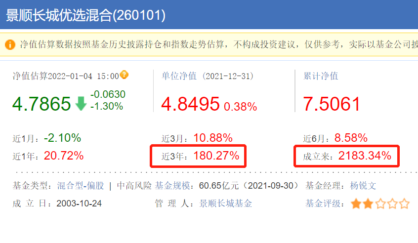

也就是说，假如你在 2003 年拿 100 万买入这只基金，一直持有不动，在 2022 年就可以变成 2100 多万。这样的财富增值速度，已经超过了一大批“炒房客”。以后再听到有人说“买基金不如买房”，请把类似的例子甩给他。

看完了个例，我们再看一下主动型基金的总体表现。

2017 年 1 月 5 日到 2021 年 1 月 4 日，5 年时间里，主动型股票基金的总体年化回报率为 15.91%，沪深 300 指数的年化收益率仅为 8.34%。

如果只看近 3 年的表现，差别更加明显。主动型股票基金近 3 年的年化收益率高达 37.05%，而沪深 300 指数的年化收益率仅为 17.95%。

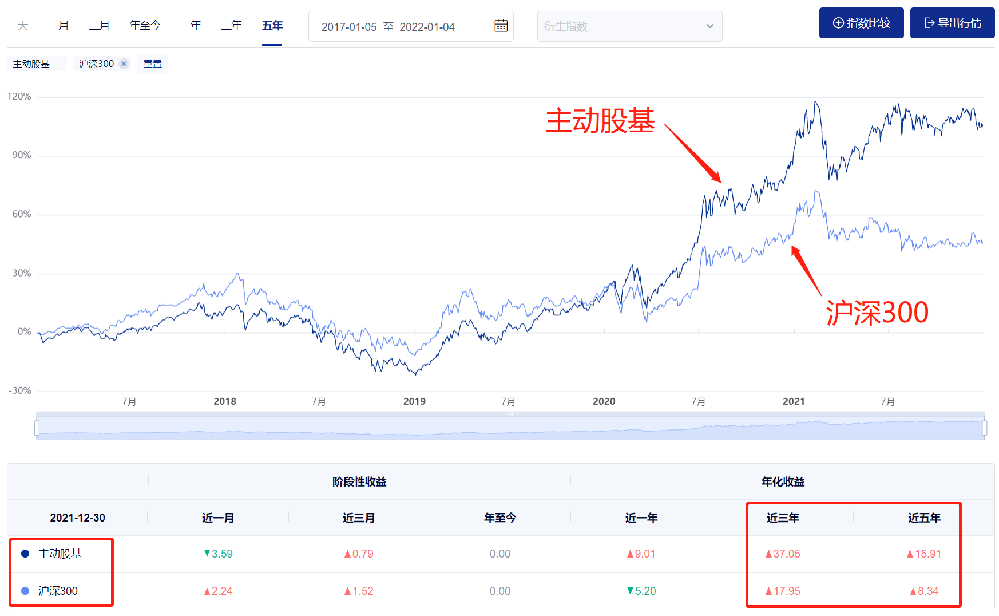

有的小伙伴可能想问，既然主动型基金有这么好的表现，为什么股神巴菲特非要推荐大家投资指数基金呢？而且，巴菲特还曾有个“十年赌约”，验证了主动型基金无法战胜指数。难道赌约是假的吗？

其实，巴菲特推荐指数基金没错，“十年赌约”也不假，关键问题在于，巴菲特主要投资于美股市场，美股属于成熟市场。除非出现金融危机、疫情、战争等重大事件，否则美股的涨势非常稳定。

以标普 500 指数为例，在过去 10 年里，除了 2020 年疫情爆发时出现了较大幅度下跌，其他大部分时间几乎可以说是“稳稳地上涨”。

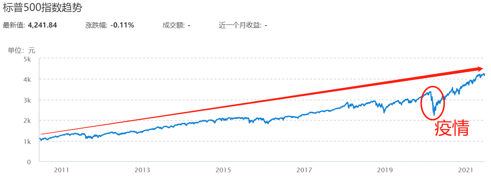

之所以这么稳，是因为美股以机构投资者为主，散户只占很小的比例。机构投资者大都是很理性的，没有太多情绪化交易，所以很难创造出暴涨暴跌的机会。

反观“大 A 股”，由于发展时间较短，还属于新兴市场，散户占比大，情绪化交易非常明显，经常制造出暴涨暴跌的机会。

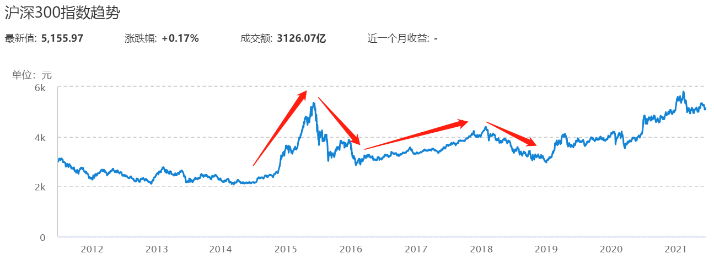

国内的基金经理，便可以抓住这些机会，大跌时捡便宜拿筹码，大涨时又能放大收益，从而跑赢指数。

所以说，成熟市场和新兴市场的投资方式不一样。在成熟市场，主动型基金很难跑赢指数，所以不值得配置;但在 A 股这样的新兴市场，主动型基金经常跑赢指数，值得投资者配置，以冲刺更高收益。

## 三大指标，做好排除法

主动型基金的分析较复杂。本小节将带大家“解锁”三大指标，提前做好排除法。

### 第一，基金的规模要在 5 亿到 500 亿之间。

基金规模太小容易面临清盘的风险，而且会导致基金经理难以灵活调仓。考虑到主动型基金的数量较多，我们可以把下限定得高一点，基金规模至少要达到 5 亿元。同时，基金规模也不能过大，规模过大会导致基金经理在按照自己的意愿投资完以后，不得不把多余的钱投资到不那么看好的股票上面。有些“爆款”基金在规模达到 500 亿左右时，会显示“暂停申购”。这是因为管理规模达到了基金承受的极限，募集更多的资金只会拉低收益率，损害“老基民”的利益。

因此，建议大家选择规模处于 5 亿到 500 亿之间的基金。

### 第二，基金经理的累计任职时间不能少于 5 年。

在考察指数增强基金时，我们要求基金经理的累计任职时间不少于 3 年。不过，主动型基金的数量远远多于指数增强基金，我们的选择面更广，可以把要求提高到不少于 5 年。

### 第三，基金的历史业绩要跑赢指数。

如果基金的历史表现不如指数，那就说明选它还不如选择指数基金。既然锁定了主动型基金，那就一定得要求它的历史业绩跑赢指数。

沪深 300 作为 A 股市场极具代表性的指数，通常用来反映股市的总体表现，而且被大量的主动型基金作为业绩参考基准。所以在进行业绩对比时，建议大家拿主动型基金和沪深 300 指数相比。

以上三大指标都可以在天天基金网查看。以“大成高新技术产业股票”为例，代码 000628，可以直接查到它的基金规模为 45.62 亿元，符合要求。具体位置大家可以参考文稿中的插图。

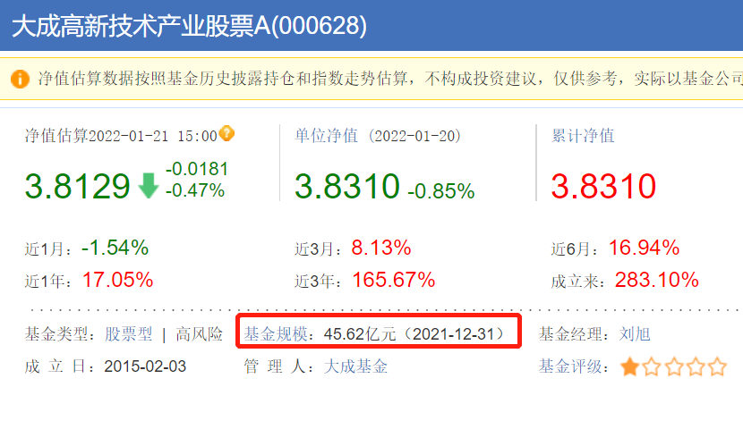

接下来点击基金经理的名字“刘旭”。

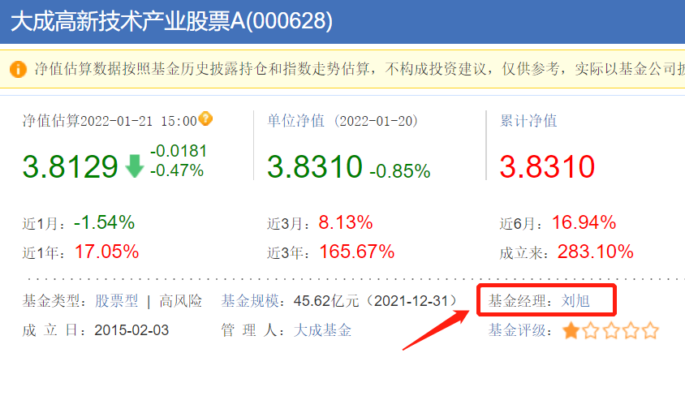

在跳转后的界面中，找到基金经理的头像照片，点击一下。

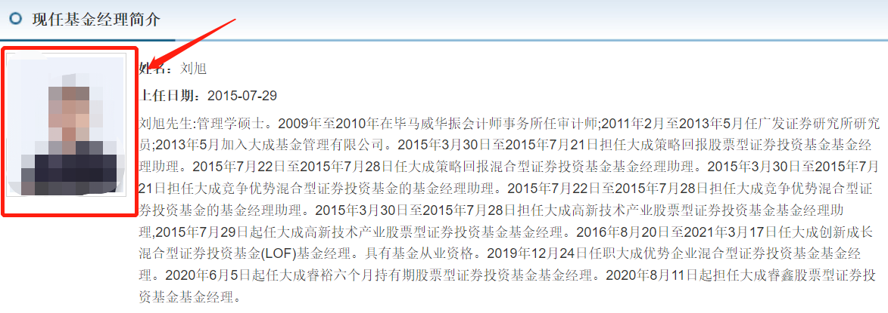

可以查到，基金经理的累计任职时间为 6 年又 178 天，符合要求。

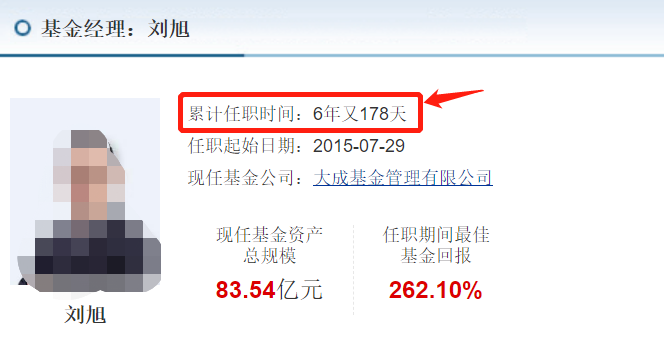

基金规模、基金经理都考察完了，接下来就剩对比收益率了。我们回到这只基金的初始页面，然后一直往下拉。具体操作大家可以对照文稿中的插图。

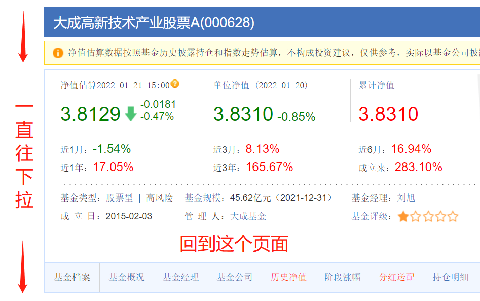

下拉过程中找到“累计收益率走势”一栏，在这里可以对比基金和指数的历史走势。对比前，请大家选择时间为“最大”，因为长期收益率更有说服力。

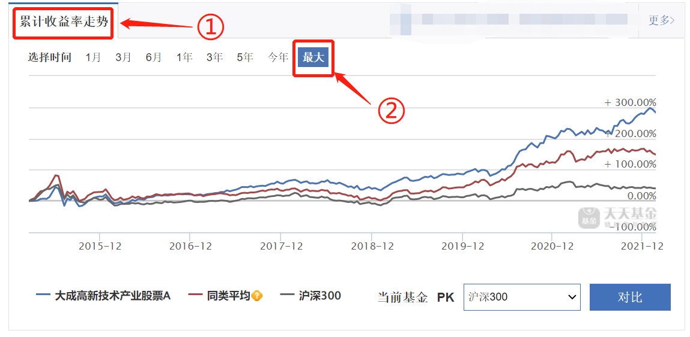

可以看到，该基金的长期收益率明显高于沪深 300，说明了历史收益率也符合要求。

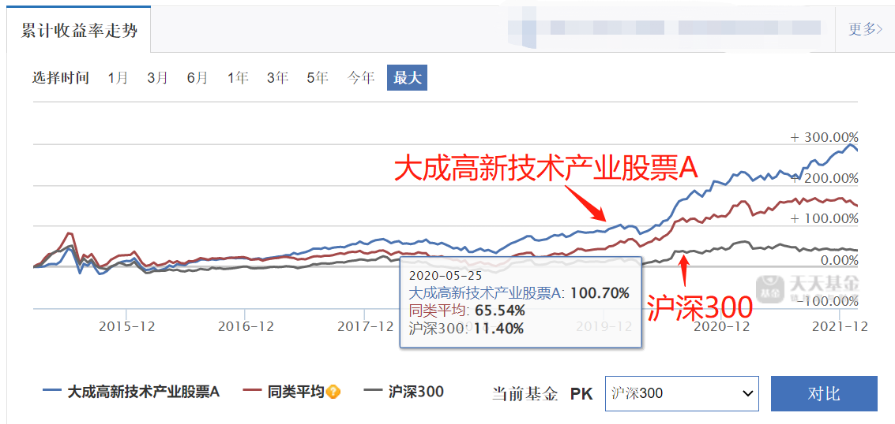

三项指标均符合要求。我们可以初步判定该基金的质量不错。

之所以说“初步判定”，是因为主动型基金的分析相对比较复杂，我们还需要深入挖掘基金公司的实力、基金经理的能力以及基金的投资风格，等等。这些问题将在《基金实战进阶营》中分 3 节课详细解答。

## 基金配置了多少股票？

主动型基金可以细分为主动型股票基金和主动型混合基金，以下简称为“股票基金”和“混合基金”

至于一只基金属于股票基金还是混合基金，我们只需要看一眼基金的名字就可以了。股票基金的名字里带有“股票”两个字，比如“大成高新技术产业股票”;混合基金的名字里带有“混合”两个字，比如“景顺长城优选混合”。

股票基金的成分里，股票占比不能少于 80%;混合基金的成分里，股票占比可以灵活调整。基金经理会根据当下的市场行情、估值高低等因素，灵活地加减股票仓位。

一般来说，股票占比越大，基金的风险就越大，但有更多的机会向高收益冲刺;股票占比越小，基金的风险就越小，越倾向于获得相对稳健的回报。

其中，混合基金的股票占比虽然可以灵活调整，但对调整范围有明确要求。以“景顺长城优选混合”为例，股票占比的上限和下限都很明确，股票最多不能超过 80%，最少不能少于 70%。

那么问题就来了：如何查询一只基金对股票占比的要求呢？

答案是借助于基金的《招募说明书》。下面就以“景顺长城优选混合”为例，查一下它对股票占比的要求。

第一步，在天天基金网搜索基金代码 260101，下拉菜单会自动显示该基金，点击基金名称。

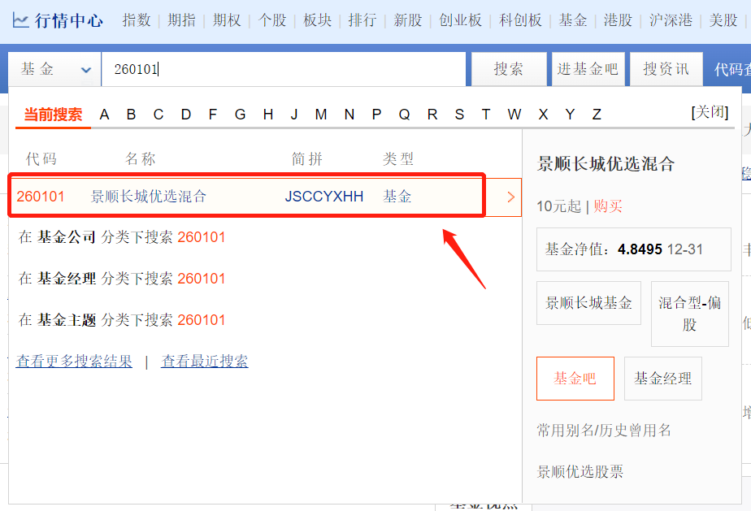

第二步，在跳转后的页面中点击“基金公告”，具体位置可以参考文稿中的插图。

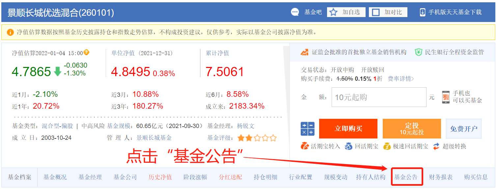

第三步，在基金公告页有很多子菜单，点击其中的“发行运作”。《招募说明书》就在这一菜单之下。找到最近发布的一份《招募说明书》，点击打开。

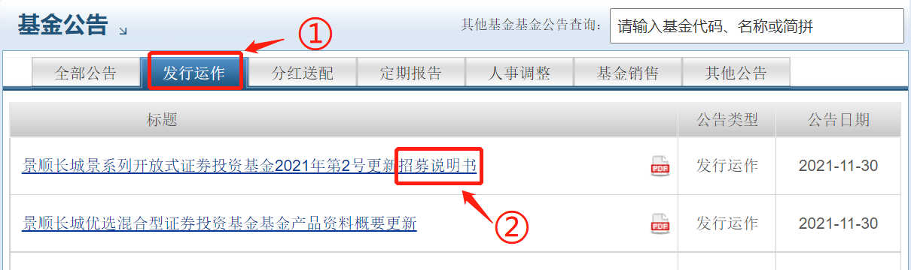

第四步，为了方便查询我们想要的信息，点击“查看 PDF 原文”。

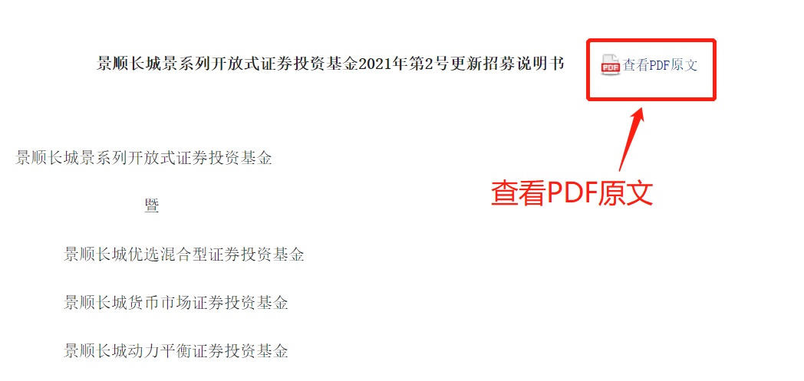

第五步，在原文的目录部分，找到“基金的投资"这一章，点击章节标题，跳转到该章节。

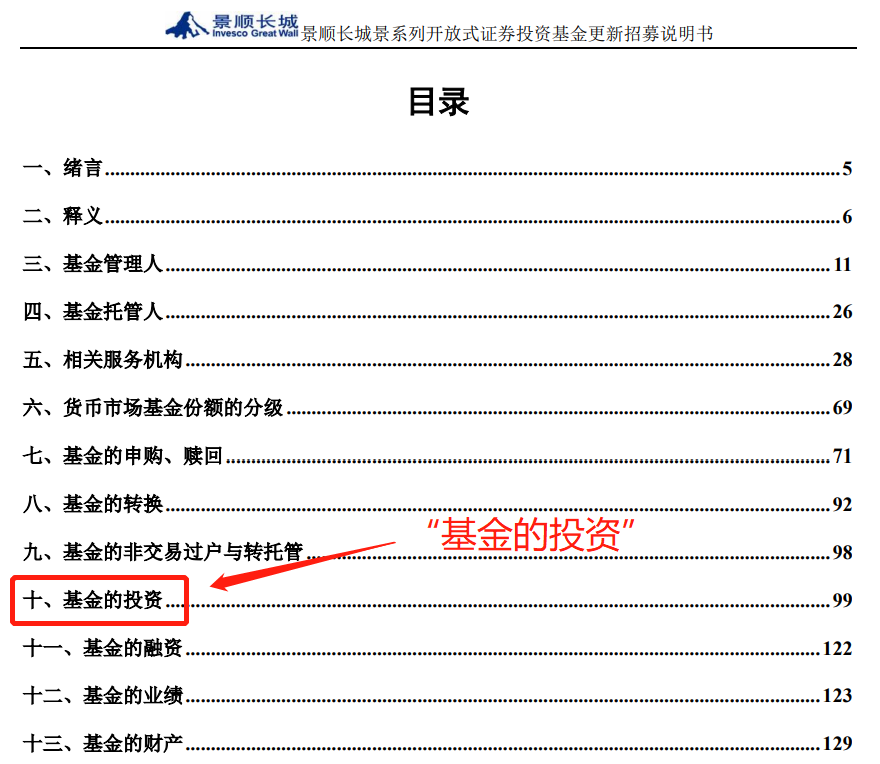

此时，我们就可以看到该基金对股票投资比例的规定了。

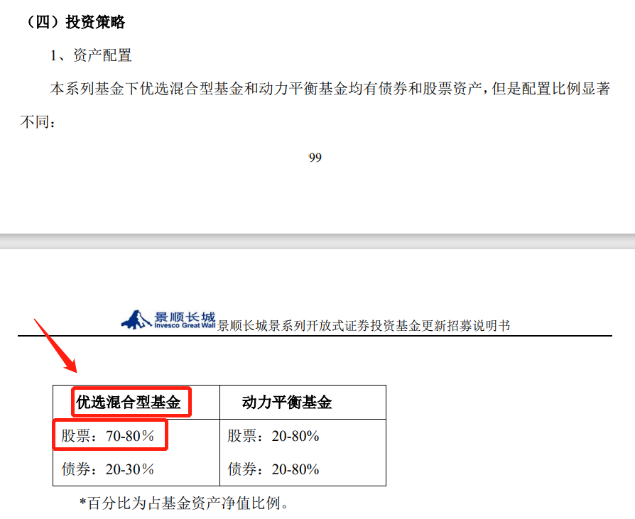

可以看到，该基金的成分中，股票占比 70%~80%。

以上就是查询基金对股票占比要求的完整方法了。有的小伙伴可能要问了：怎么看一只基金实际的股票占比是多少呢？

方法也很简单。还是利用天天基金网就能完成。仍旧以“景顺长城优选混合”为例，回到这只基金的初始页面，然后一直往下拉。具体操作大家可以对照文稿中的插图。

下拉过程中找到“资产配置”菜单，点击它，就可以看到基金的股票占比了。可以看到该基金最新的股票占比为 77.29%。

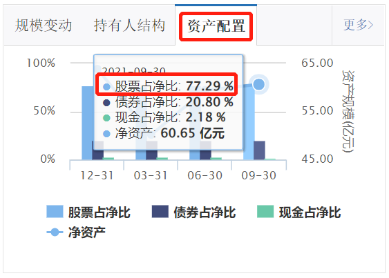

我们也可以点击右上角的“更多”两个字，查看该基金过去多年的股票占比情况。

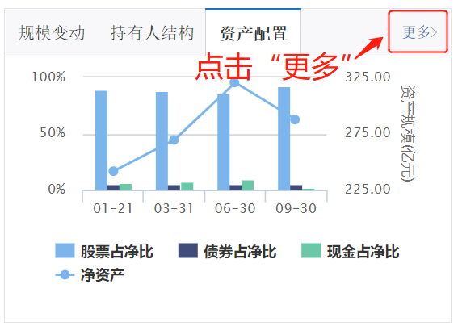

跳转之后，可以看到该基金的“资产配置明细”，其中有基金成立以来的所有股票占比数据。可以看到，该基金的股票占比常年稳定在 75% 上下。

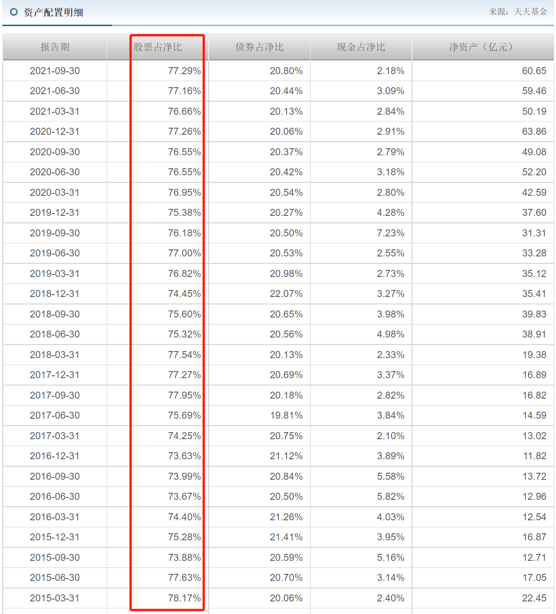

通过上述分析，可以概括出“景顺长城优选混合”这只基金所有的已知信息：

该基金的股票占比要求为 70%~80% 之间，可调整的范围比较窄。而且从实际情况来看，历史上无论牛市还是熊市，股票占比常年稳定在 75% 左右。投资风格偏激进。

当然，也有一些混合基金的投资风格偏稳健。例如“华安稳健回报混合”，代码 000072。它的《招募说明书》显示，基金投资于股票的比例为 0% 一 95%，范围非常宽。

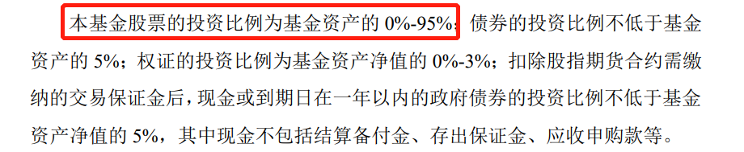

而实际上，该基金最新的股票占比仅为 16.96%，债券占比为 85.91%。

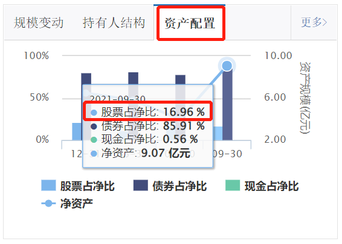

长期来看，该基金实际的股票占比一直都很少，有时甚至没有持仓任何股票，只有少数几次的股票占比高于 20%。可以说，基金经理的投资风格相对比较保守，虽然同为混合基金，可实际上的风险水平只比债券基金高一点。

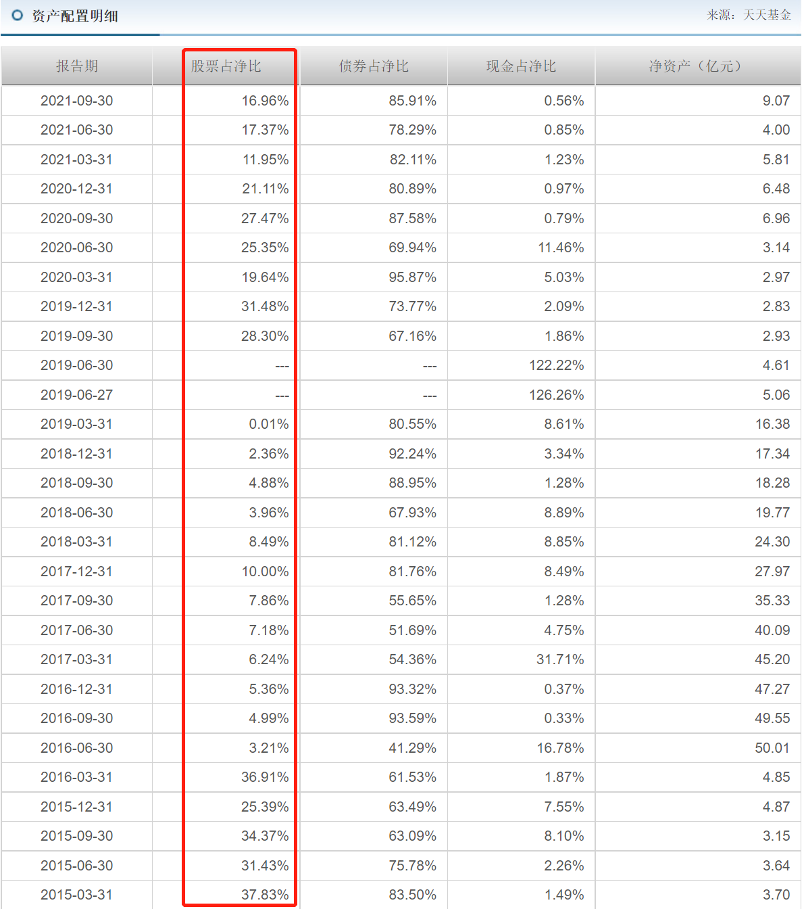

大家可以用同样的方法，查询其他混合基金对股票占比的要求，以及实际的股票占比情况，进而判断基金经理的投资风格是激进还是保守，基金的风险水平是高还是低，然后选择和自己的风险偏好相匹配的基金。

## 总结

1.A 股属于新兴市场，散户占比大，情绪化交易非常明显，经常制造出暴涨暴跌的机会。所以，主动型基金经常跑赢指数，值得投资者配置，以冲刺更高收益。

2.初步分析主动型基金的三大指标为：第一，基金的规模要在 5 亿到 500 亿之间;第二，基金经理的累计任职时间不能少于 5 年;第三，基金的历史业绩要跑赢指数。需要提醒的是，以上指标只能初步判定基金的质量，我们还需要深入挖掘基金公司的实力、基金经理的能力以及基金的投资风格，等等。这些问题将在《基金实战进阶营》中分 3 节课详细解答。

3.主动型基金可以细分为股票基金和混合基金。股票基金的成分里，股票占比不能少于 80%;混合基金的成分里，股票占比可以灵活调整。可以借助基金的《招募说明书》查询一只基金对股票占比的要求;可以借助天天基金网的“资产配置”菜单查看一只基金实际的股票占比。
