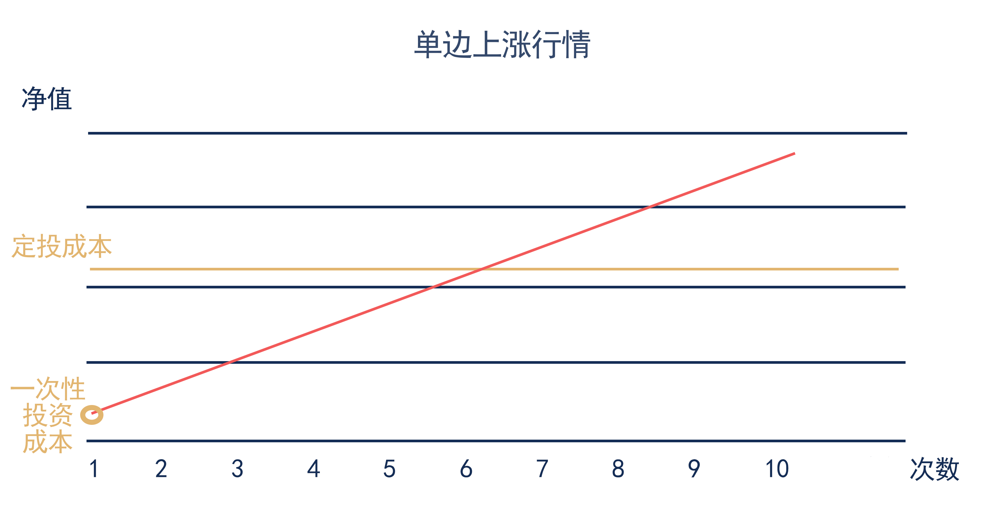

学理财，上水星财富学堂。小伙伴你好，欢迎继续学习《基金会员实战营》。

## 分批买和“一把梭”，哪个好？

在前面的课程中，我们学习了筛选各种基金。接下来要面对的问题是如何投。实战中有两种主流的投资方式，一种是定投，也就是每隔固定的时间投入固定的金额;另一种是一次性投资，江湖俗称“一把梭”。这两种方式，到底该如何取舍呢？

下面我们就把两种投资方式，放在不同的市场行情中进行一番比较，看看哪一种表现更好。

市场行情千变万化，但总的来说可以归纳为四种：单边上涨、单边下跌、先涨后跌和先跌后涨。

### 首先来看单边上涨行情。

由于基金持续上涨，不管选择定投还是一次性投资都可以赚钱。

但正因为持续上涨，导致买得越晚成本越高，每一次定投都是在抬高成本，在期初“一把梭”的成本是最低的。

所以，在单边上涨行情中，定投和一次性投资都赚钱，但一次性投资赚的更多。

### 其次来看单边下跌行情。

由于基金持续下跌，不管选择定投还是一次性投资都会亏钱。

但正因为持续下跌，导致买得越晚成本越低，每一次定投都可以摊薄成本;在期初“一把梭”的成本反而是最高的。

所以，在单边下跌行情中，定投和一次性投资都亏钱，但定投的损失更小。

### 然后来看先涨后跌行情。

先涨后跌的震荡行情，走势就像一个难过表情的嘴巴“︵”，因此被称为“哭泣曲线”。在这条曲线中，选择定投会在高点买入不少高成本的份额，导致平均成本高于期初一次性投资的成本。

至于能否赚钱，还要看期末的净值处在什么水平。期末净值高于成本就可以赚钱，期末净值低于成本就会亏钱。

总而言之，在先涨后跌行情中，一次性投资的优势更大。

### 最后来看先跌后涨行情。

先跌后涨的震荡行情，走势就像一个微笑表情的嘴巴“︶”，因此被称为“微笑曲线”。在这条曲线中，选择定投可以在底部不停地吸收“筹码”，不断摊薄成本，导致平均成本低于期初一次性投资的成本。

至于能否赚钱，同样要看期末的净值处在什么水平。期末净值高于成本就可以赚钱，期末净值低于成本就会亏钱。

总而言之，在先跌后涨行情中，定投的优势更大。

通过以上四类情形的分析，我们发现定投和一次性投资在不同行情中的表现各有优劣。有的小伙伴可能想：我只要知道接下来会出现什么行情，然后选择更有优势的投资方式就可以了。

可是，如果未来行情可以预测，早就有一批人通过精准预测发家致富了。对普通人来说，预测未来不切实际，希望大家不要陷入这样的思维误区。

更切合实际的做法是从个人的实际情况出发，梳理手头的资金，选择与实际相符的投资方式。

在制定投资方案之前，我们需要先把手头的资金分成两大类。

第一类是增量资金，也就是会定时定量增加的“小钱”，比如每个月收到的工资、房东收到的房租，等等。

第二类是存量资金，包括手中现有的一大笔资金，以及不定时不定量增加的“大钱”，比如奖金、买房赚的钱，等等。

这两类资金的用法不同，我们将分开讨论。

## 增量资金怎么投？

首先来看增量资金。它的特点就是“零散”,无法进行一次性投资，更适合按照定投的方式，分批投资，积少成多。

不过要注意，定投的前提是，你已经有一笔钱放在货币基金中，可以应对 3~6 个月的日常开销。如果这一条没有满足，建议你先用货币基金攒够 3~6 个月的生活费。

生活费储备充足以后，接下来就要开启定投计划了。大部分基金销售平台都给大家提供了自动定投的选项。以小金伴投 App 为例，点击“定投”，近入下一步。

我们需要设置三个选项：定投金额、定投周期和定投日。

### (一) 定投金额

推荐大家使用“固定结余法”计算定投金额。计算方式很简单，直接用每月的增量资金减去生活开销，剩下的就是每月定投金额。

举个例子，小星学长每个月的增量资金只有 1 万元的薪水，他的每月生活开销是 3 千元，那么他在每个月拿到工资以后，需要先往货币基金中补充 3 千元，然后把剩下的 7 千元拿来定投指数基金。

每个月实际能够结余下来多少钱，就定投多少钱，实事求是做投资。而且，每一个人收入不同，日常开支也不同，所以没有一个绝对客观的定投金额比例，刚参加工作的年轻人比例会低一些，工作年限多的中年人可能比例更高。大家根据自己的实际情况确定金额即可。

### (二) 定投周期

定投周期可以选择每月、每周、每两周。到底选哪个更好呢？

课程回测了月定投和周定投的历史回报。从 2017 年到 2021 年的 5 年时间里，无论选择 5 个指数中的哪一个，月定投的回报稍好于周定投的回报，但总收益率的差距只有 0.5% 左右。

可见，定投周期对收益率的影响并不大。建议大家怎么方便怎么选。现实中，大多数人都是每月发一次工资，选择月定投更符合个人现金流的实际情况。

### (三) 定投日

如果选择月定投，那么定投日就是在每月 1 号~28 号之间任选一天。如果选择周定投或双周定投，那么定投日就是在周一到周五之间任选一天。

假如定投日设为工资发放当天，系统在为你执行定投的时候，可能薪资还没有发放到位，银行卡余额不足，无法完成扣款。所以，建议大家把定投日设为每月发工资的后一天。一来可以保证余额充足，二来可以做到强制储蓄。

定投金额、定投周期和定投日全部设定完成后，系统就会按照设定自动定投，不需要自己经常操心了。

## 存量资金怎么投？

对于存量资金而言，定投和一次性投资哪个更好呢？我们不妨来看一个例子。

张三和李四定投同一只基金，张三总共只有 3 千元，所以选择了“一把梭”;李四手里有 30 万元，但是他选择了分期定投，每月定投 3 千元。

一个月过后，两个人都赚到了 300 元收益，单笔投资的收益率都是 10%。

对于张三而言，他的总资产增值幅度就是 10%;但是，对于李四而言，由于他手中绝大多数资金都没有投出去，总资产增值幅度只有 300 除以 30 万，也就是 0.1%。

大家注意，做投资要让手里的全部资金都在高效赚钱，而不是让一小笔投资的收益率很高。如果我们把一大笔存量资金切成很多小份额，每个月投一份，会导致资金利用效率极低。

所以，对于有一定财富积累的人来说，存量资金做定投不是最好的方式。选出好基金以后，可以直接做一次性投资。

一次性投资完成后，短期内可能会出现波动和浮亏，但是大家不用担心。投资大师巴菲特曾说过，买指数就是买国运。只要国家经济在增长，指数基金长期来看就会保持上涨态势。建议大家做完一次性投资之后，忽略短期波动，关注长期收益。

有的小伙伴可能说：我的风险承受能力有限，看到浮亏就很担心，怎么办？这种情况下，建议你在一次性投资和定投之间采取折中的方案，也就是进行大额定投。

举个例子：李四手里有 30 万元，但是他担心“一把梭”之后出现短期浮亏。于是选择了先投入 5 万，然后每过两个月就再投入 5 万，一年之内刚好把 30 万元全部投完。

大家也可以遵循类似的方案，把手中的存量资金分成 3~6 份，在一年之内分批投完。既可以平滑短期内的波动，又不会错过长期收益。

本节课的内容到此结束。最后做一下总结

## 总结

1.定投和一次性投资在不同行情中的表现各有优劣，但未来行情不可预测。更切合实际的做法是从个人的实际情况出发，梳理手头的资金，选择与实际相符的投资方式。

2.手头的资金分成增量资金和存量资金。增量资金是平时定时定量增加的“小钱”，比如每个月收到的工资、房东收到的房租，等等;存量资金是手中现有的一大笔资金，以及不定时不定量增加的“大钱”，比如奖金、买房赚的钱，等等。

3.增量资金适合进行长期定投。采用固定结余法，直接用每月的增量资金减去生活开销，剩下的就是每月定投金额;定投周期对收益率的影响并不大。建议大家怎么方便怎么选。现实中，大多数人都是每月发一次工资，选择月定投更符合个人现金流的实际情况;定投日可以设为每月发工资的后一天。

4.对于有一定财富积累的人来说，存量资金做定投不是最好的方式。选出好基金以后，可以直接做一次性投资。如果担心短期浮亏，可以采取大额定投，把手中的存量资金分成 3~6 份，在一年之内分批投完。

最后提醒大家，只知道增量资金定投、存量资金一次性投资还不够，因为赚钱“配方”中还缺少一味良药：长期主义。下一节课将为你揭晓长期投资的奥秘。
