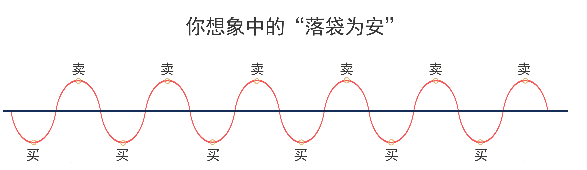
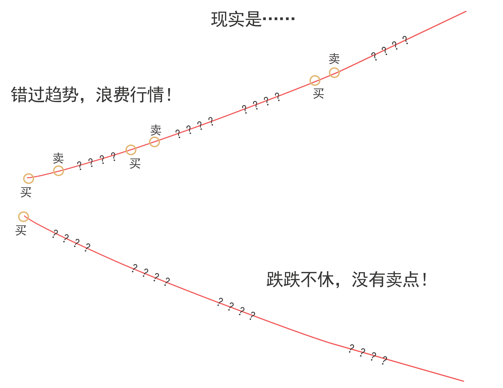
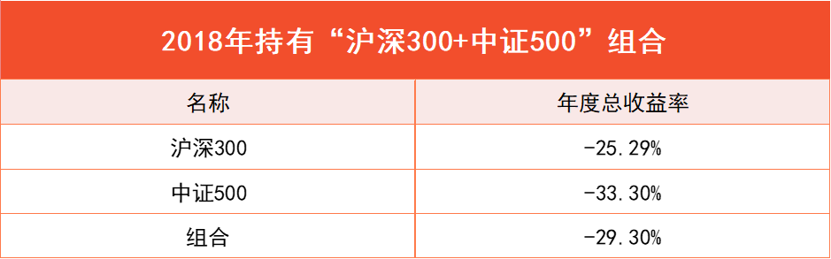
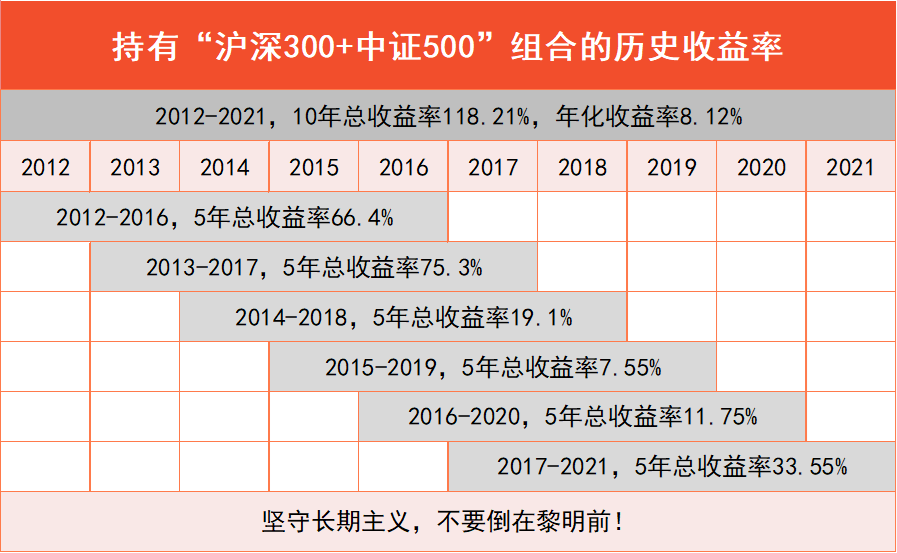
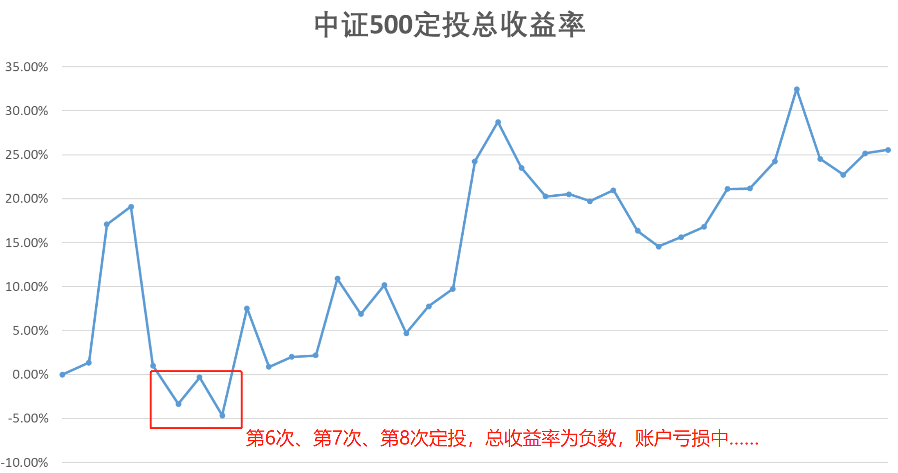
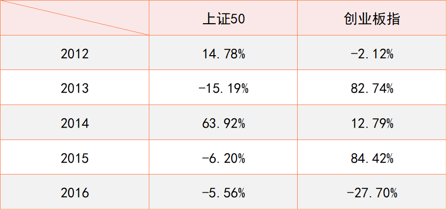

学理财，上水星财富学堂。小伙伴你好，欢迎继续学习《基金会员实战营》

上节课，我们学习了两种投资方式：定投和一次性投资。其中，增量资金适合定投，存量资金适合一次性投资或大额定投。不过这样做就一定能赚钱吗？答案是未必。

如果你读过金庸的武侠小说，就会发现，各路武功都包括了外在的招式和内在的心法。越是重要的武功秘籍，越注重修炼心法。其实投资基金也一样，任何策略都必须搭配心法使用。

在投资过程中，你会遇到三个“心魔”，干扰你的投资决策，最后可能让你“竹篮打水一场空”。它们分别是：怕涨心理、怕跌心理和攀比心理。

## 第一个“心魔”:怕涨心理。

看到基金涨了，大家都会很开心。可是开心中还有一丝顾虑，害怕刚赚到手的钱还没捂热就“吐回去”。这种稍微涨一点就害怕的情况，就是怕涨心理。

很多人在怕涨心理的作用下，会选择及时落袋为安。每次赚到一点就赶紧卖掉，然后从头再来一次，企图靠这种方式反复赚“小钱”。

如果真的能反复赚“小钱”，积少成多也是一笔不错的收益。但问题就在于，这种模式真的能持续下去吗？

当基金净值在一个范围内持续震荡时，这种方法是可行的。就像上图一样，你可以反复地“低吸高抛”，反复赚“小钱”。

可是一旦基金不再震荡，开始持续上涨或持续下跌，这种方法就失效了。

大家可以参考文稿中的插图。在持续上涨的情况下，如果你赚到一笔小钱后落袋为安，那就没有再一次 “低吸”的机会了。即使你重复买入，也不可能拿到原来那么低的成本。结果就是，基金实现了大涨，而你只能从中赚几次塞牙缝的“小钱”，浪费了大行情。

在持续下跌的情况下，基金根本不会提供“高抛”的机会，反复落袋、积少成多的策略再一次失效。

总的来说，频繁交易在大涨时会浪费行情，在大跌时还要和别人承受同样的损失，明显弊大于利。

而且，市场行情无法预测。没有人知道基金接下来的走势是上涨、下跌还是震荡。一个时而有效、时而无效的方法，只能让你时而赚钱、时而亏钱，根本不可持续。

希望大家摆脱怕涨心理，看淡短期行情，杜绝频繁交易，不要总想着赚点小钱就落袋为安，而是要买入之后拿得住，做一个长期主义者。任何短期行情放在长期来看，都只是大海中的一朵小水花。

## 第二个心魔：怕跌心理。

看到基金跌了，很多人的心里会犯嘀咕：如果我现在不卖，会不会跌更多呢？这种稍微跌一点就害怕的情况，就是怕跌心理。

以 2018 年为例。这一年是典型的熊市行情。整个股市处于持续下跌的状态，沪深 300 跌幅为 -25.29%，中证 500 跌幅为-33.30%。即使把两者做成组合，也需要承担 -29.79% 的下跌。

试问一下，如果你面对如此大的下跌，还能够安然不动、耐心持有吗？不少新手会“割肉”止损，甚至由此判断投资策略不靠谱。

其实这并非投资策略的问题。我们不能用短期的效果去验证长期策略是否可行，长期策略只能长期坚持才能看到效果。

还是以“沪深 300+ 中证 500”组合为例，从 2012 年到 2021 年这 10 年间，如果你进行一次性投资，不管在哪一年买入组合，只要持有满 5 年，最终都是赚钱的状态。

当你坚定持有满 10 年，组合会为你带来 118.21% 的总收益率，换算成年化收益率为 8.12%。

对于长期投资而言，道路是曲折的，前途是光明的。短期内的下跌可能让你体验不好，但不应该“割肉”止损。只要把持有时间拉长，赚钱的确定性会明显提高。

以上讨论的是一次性投资的情况。如果是定投，是否还要坚守长期主义呢？接下来以中证 500 指数为例，我们来进行一次“定投小测验”

大家看文稿中的插图，从 2019 年 1 月 7 日， 到 2022 年 1 月 6 日，整整 3 年时间，定投中证 500 的总收益率是如下变化的：

可以看到收益率总体向上，但中间过程十分曲折。当你定投到第 6 个月，原本赚钱的基金反倒变成了亏损。此时你已经坚持定投满半年，好不容易赚了点钱，结果又亏回去。请问你还会相信定投吗？很多新手在这一关就会“割肉”离场，淘汰出局。

姑且假设你意志坚定，没有倒在第 6 个月，而是坚持定投，然后你会发现，定投第 7 个月、第 8 个月还是亏损的状态。已经定投大半年，居然连亏三个月。这时候，更多人的意志会出现动摇，市场又会淘汰一批投资者。

如果你熬过了这个阶段就会发现，收益涨起来了，你赚到钱了，而那些早早“割肉”的人却彻底错过了。

可见，不管是一次性投资还是定投，都需要坚守长期主义。

很多不成熟的投资者，在基金回撤的时候，在账户暂时亏损的时候，总是抱怨基金很烂，或者投资策略无效，但从来认识不到自己太“短视”。

如果你“短视”，看不到长期的利益，只纠结于眼前暂时的下跌，那么即使基金再好也很难赚钱，因为你会倒在黎明前。

## 第三个心魔：攀比心理。

攀比心理指的是，虽然买入之后赚到钱了，但是发现别人的基金赚钱更多，想换成和别人一样的。

大家要知道，基金短期赚钱多，很可能是因为蹭到了热点。当你发现基金收益突飞猛进的时候，说明热点已经升温，再去购买反倒会高位“接盘”，然后跟着热点降温的过程一路亏损。

此外，基金短期赚钱多，还可能是因为轮动。包括行业轮动、大小盘轮动等等。

举个例子，下图是 2012 年到 2016 年期间，上证 50 和创业板指的涨跌情况，可以看出两者有明显的大小盘轮动。

张三在 2012 年投资了创业板指数基金，结果亏损了-2.12%。但他发现，李四投资上证 50 指数基金赚到了 14.78%。

张三很羡慕李四，在 2013 年切换成了上证 50。结果，这一年上证 50 下跌-15.19%，创业板指反倒大涨 82.74%。

张三后悔不已，在 2014 年 又换回了创业板指。结果，这一年创业板指仅仅涨了 12.79%，上证 50 反倒大涨 63.92%。

2015 年，张三顺势改回上证 50。结果上证 50 跌了-6.20%，创业板指大涨 84.42%。

2016 年，张三又顺势改回创业板指。结果创业板指大跌 -27.70%，上证 50 只跌了-5.56%。

在这个过程中，张三总是跟随最近一年表现最好的指数，可是，他买什么，什么就表现差;他不买什么，什么就表现好。

其实并非市场在专门针对张三，而是他在攀比心理的作用下，无法做到长期持有手中的基金。

这个情形就像排队购物一样。当你排好队以后，发现旁边的队伍走得更快，这时候你是继续留在原来的队伍里呢，还是一直选择走得快的队伍，在队伍之间换来换去呢？

大多数人都知道，保持在一个队伍一直排下去是比较合理的做法，那种跳来跳去的选择是非常糟糕的。

希望大家在投资中，忽略短期内的热点和轮动，摆脱和他人攀比短期收益的心态，不要总是“这山望着那山高”。只要选择基金的逻辑没问题，请允许它短期的落后。

有句话说得好:“如果我不能在你失败的时候支持你，又如何在你成功的时候说爱你。”其实我们和基金就是这样的关系。

不管是怕涨心理、怕跌心理还是攀比心理，背后的病根都在于忽视了“长期”两个字的威力。很多投资者把长期主义比作“时间的玫瑰”，只要时间充足，玫瑰就会为你绽放。愿大家都能成为长期主义者。

本节课的内容到此结束。最后做一下总结。

## 总结

1.希望大家摆脱怕涨心理，看淡短期行情，杜绝频繁交易，不要总想着赚点小钱就落袋为安，而是要买入之后拿得住，做一个长期主义者。任何短期行情放在长期来看，都只是大海中的一朵小水花。

2.在基金回撤的时候，在账户暂时亏损的时候，如果你“短视”，看不到长期的利益，只纠结于眼前暂时的下跌，那么即使基金再好也很难赚钱，因为你会倒在黎明前。

3.希望大家在投资中，忽略短期内的热点和轮动，摆脱和他人攀比短期收益的心态，不要总是“这山望着那山高”。只要选择基金的逻辑没问题，请允许它短期的落后。
