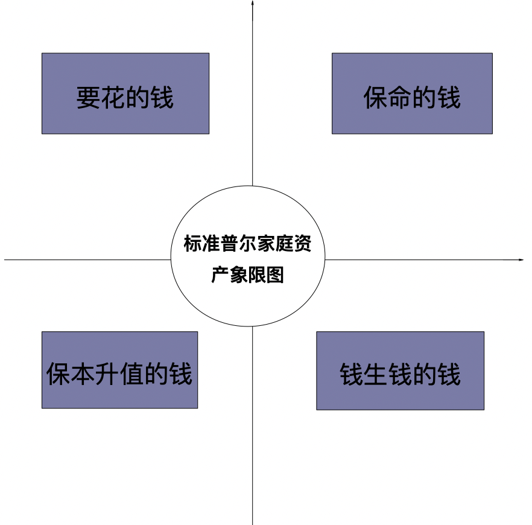

大家好, 欢迎来到《资产配置实战课》. 很高兴在此和大家相见

看到这门课程的名字, 大家可能会有一些疑问, 比如: 什么是资产配置, 为什么要做家庭资产配置, 如何做家庭资产配置, 以及这 88 节课程可以学到什么.

在课程正式开始之前, 我们将一一解答这些问题, 希望大家在听了解答后, 对课程有更深层的认识.

## 1. 什么是资产配置?

投资时我们经常听到这样一句话: 不要把鸡蛋放在同一个篮子里, 它的意思是, 资产需要分散, 不能集中在一个地方.

但其实, 只把资产分散远远不够, 还需要考虑用什么篮子放鸡蛋、每个篮子放多少鸡蛋、鸡蛋存放多长时间等等问题.

资产配置, 就是考虑不同用途的资金, 应该放在什么理财产品中, 每种理财产品投入比例是多少, 持有多长时间, 从而达到既能获得预期收益、满足预期目标, 又能降低风险的目的.

## 2. 为什么要做家庭资产配置

目前, 我们大多数人面前都有三座大山: 住房、子女教育、养老. 即, 年轻人成家立业需要有房; 结婚生子后, 要负担子女读大学或者出国留学的费用; 退休后需要面对人口老龄化严重, 国家养老金入不敷出的现实, 自行准备养老金维持生活.

面对这三座大山, 我们要有一个财务目标, 那就是尽可能的利用有限的资金, 提高生活品质, 满足人生每个阶段的需求. 要达成这一目标, 我们需要找到让资产升值的方法.

过去几十年, 大多数人会通过买房来实现资产增值. 但随着国家对房地产行业的限购令和企业去杠杆化等政策的实施, 房地产行业受到了沉重的打击, 难以继续过去的辉煌. 多数家庭需要重新对资产进行更加合理、更加长远的配置, 保证钱不贬值, 并能实现财务目标.

## 3. 如何做家庭资产配置

明确了为什么要做, 那么应该如何来做家庭资产配置呢? 我们可以借助标准普尔家庭资产象限图.

标准普尔公司曾经做过一个研究, 他们调研了全球 10 万个家庭, 这些家庭有一个共同的特点: 在过去 30 年里, 资产一直稳步上升. 标准普尔公司分析并总结这些家庭的理财方式, 最终得出了标准普尔家庭资产象限图.

象限图将家庭资产分为了四个部分, 分别是: 要花的钱、保命的钱、保本升值的钱、钱生钱的钱.

要花的钱, 用来储存一部分生活费, 应对开支突然增大或者收入突然变少的情况. 建议选择流动性好, 本金波动不大的理财产品.

保命的钱, 用于应对意外、风险、疾病等事故发生时的经济损失.

保本升值的钱, 为家庭的刚性支出储备现金流, 比如子女教育、养老金等. 这类资产未来有重要用途不能亏损, 短期不需要使用需要保本增值, 可选择长期稳健增值的理财产品.

钱生钱的钱, 短期内不用, 未来也没有明确用途, 可投资一些高风险的理财产品, 赚取更多收益.

为了让这四部分的钱充分发挥作用, 我们需要借助一些理财工具. 比如, 较为常见的储蓄、保险、债券、基金、股票等

## 4. 课程会为你带来什么

88 节《资产配置实战课》, 根据标准普尔家庭资产象限图, 为大家详细分析家庭资产如何做配置. 在课程中, 你将学习到:

(1)系统解决家庭资产配置问题. 明确四部分不同用途的资产, 可匹配的理财工具以及匹配逻辑, 每部分资产的投入比例以及持有时间. 课程会图文并茂进行讲解, 让家庭资产配置一目了然.

(2)深入了解保险、基金、股票、可转债等匹配到的理财工具, 明确它们的本质, 学习每种工具的投资逻辑, 让资金保值增值有保障.

(3)升级投资思维. 带你读懂富人的投资世界, 从根本上转变投资时的错误观念.

(4)学习风险管理. 一网打尽所有投资风险, 轻松管理潜在风险, 让投资更省心省力.

(5)剖析投资心理. 深度分析"韭菜"们的投资心态, 避免踩到相同错误; 教你正向面对市场, 助力投资更上一层楼.

(6)掌握投资策略. 五大投资策略, 助你形成投资体系, 养成正确投资习惯, 做可持续投资.

(7)研究热门行业. 解读消费、白酒、医药、互联网、新能源、半导体等行业的潜在机会, 寻找未来十年的黄金赛道, 让投资事半功倍.

(8)读懂宏观经济. 通过学习关键指标, 明确宏观经济和投资之间的潜在联系, 站在更高角度提前布局投资机会

好了, 以上就是对于课程相关问题的解答. 相信通过这些回答, 大家对家庭资产配置有了最基本的认识, 期待与大家共同学习本门课程. 我们课程中见.
