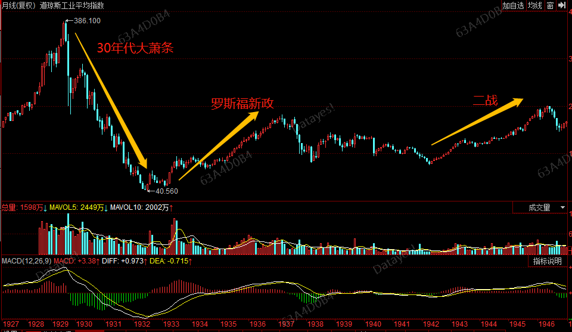
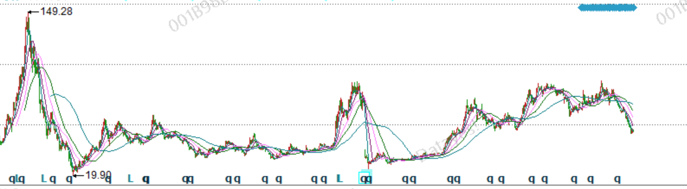
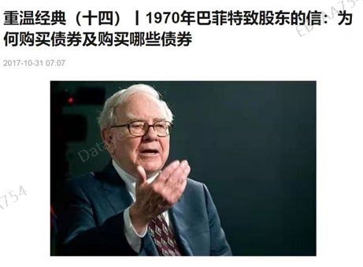
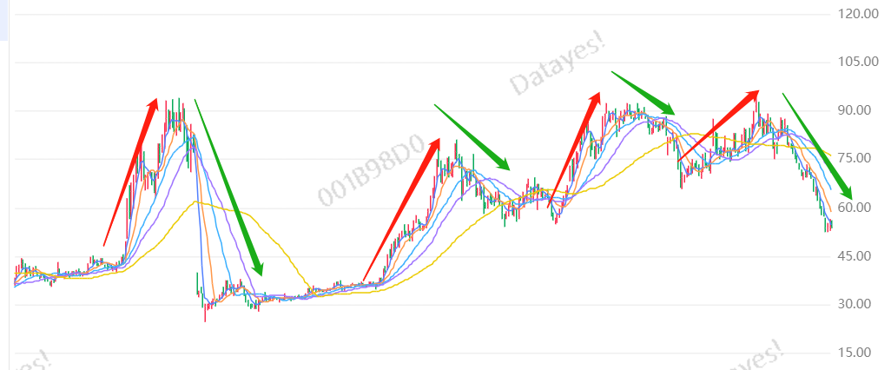

以人为镜, 可以知得失.

以史为镜, 可以知兴替.

价值投资这个理念在 A 股市场是比较受到追捧的, 但是大家在实际操作过程中一旦被套就称自己是"价投", 这一点往往引来群嘲.

为什么会这样, 价值投资在 A 股市场是否存在水土不服的情况?

## 以史为镜

目前公认的价值投资起源来自投资大师本杰明格雷厄姆.

美国在上世纪 30 年代经历了经济大萧条, 之后又经历了罗斯福新政和二战, 这段特殊的历史时期, 成就了格雷厄姆流芳后世的价值投资理念, 价投的本质就是要关注公司的内在价值、要有一定的安全边际、要做时间的朋友, 发挥复利的威力.

这在当时极度悲观的市场中, 无疑是最正确的选择, 因为熊市中遍地是黄金, 等到市场情绪好转, 这些优质的资产价格就开始起飞了.

我记得芒格说过这样一句话"在大萧条时期, 捡烟蒂这个策略就好比拿着金属探测器在空地上找", 这句话的言外之意就是, 在那个时期, 找到内在价值低于价格的好公司是很容易的.

但, 放在今天的美股市场, 好像也没那么容易了. 因此巴菲特的投资理念都从"买绝对便宜的"到"买相对便宜的"到"买成长速度跟得上估值的". 这种思想上的转变, 是因为大环境的改变.

可是, 我们 A 股市场里的散户们, 因为接触价值投资不久, 往往还处于"价值投资就是买到便宜的好公司, 然后一直拿着"这个阶段.

传统价投的理念在咱们 A 股市场, 可能有点水土不服.

长期思维、复利思维, 我觉得是十分正确的, 但是不是意味着持有不动呢? 择时带来的收益也是很重要的.

大家想想, 10 前年 A 股大盘指数是 3000 多点, 现在还是 3000 多点. 中国平安 2009 年股价 60 多, 2021 年, 股价不到 60. 如果一直持有, 未必可以赚到钱. 如果你不幸买在 2015 年牛市高点, 需要 4 年才能回本.

但是, 你能说买中国平安就赚不到钱吗? 当然不是.

如果我们能懂一些宏观经济, 明白周期理论, 就可以更好地踏准节奏, 提高自己的长期复合收益率水平.

比如, 如果你能在 2008 年年底、2014 年年底、2019 年年初把握住节奏, 这三个节点上买入中国平安, 每一次你都可以赚到至少 80%的收益率. 比长期持有不动是不是香很多?

## 以人为镜

实际上, 被大家熟知的价值投资大师巴菲特, 也是一位宏观研究, 也就是择时高手.

如果你读过巴菲特的《致股东的信》, 就会知道巴老在 1969 年把自己的基金清盘了. 在接下来的 1970 年年中, 道琼斯指数跌掉了近 1/3, 可以说是精准逃顶.

在精准地逃顶之后, 巴老在 1969 年年底又开始考虑投资债券了.

由此可见, 巴老对宏观的分析和把握能力, 绝对是妥妥的顶级水平, 只不过他老人家不怎么提这个事情.

而且巴老还说过, 他的成功主要搭上了美国经济的顺风车.

所以他不但买过克利夫兰钢铁、美国铝业、北伯林顿铁路这样的强周股, 收获颇丰, 也在美国强大的经济势能下, 听取芒格的建议买了沃尔玛、麦当劳这些风光无限的成长股, 大赚特赚.

## 价投很好, 但择时收益更好

价值投资的理念, 我认为适合每一个市场. 长期思维和复利思维才是我们可以长期战胜市场的法宝.

但是, 在 A 股市场有两个难点:

1、内在价值低于外在价格的好公司可能不多

2、股价长期波动, 一直持有不如踏准周期

就像中国平安, 如果我们 2014 至 2021 年这 7 年间, 选择四次波段交易, 那么这几年的复合收益率是 914%.

如果我们选择一直持有至今, 算上分红再投资, 复合收益率是 191%.

在 A 股市场, 经常给我们一个感受, 有今天没有明天. 好像涨多了必然跌, 跌多了必然涨. 如果一直持有好公司, 长期看当然也是赚钱的, 不过持有体验会比较差.

像中国平安, 如果不小心买在 2015 年牛市顶点, 4 年才能回本, 我相信大部分人是做不到的, 更别说赚钱了, 基本上就是割肉走了.

从持股体验和长期复合收益率角度来看, 买入好公司然后一直捂在手里, 并不是一个明智的选择. 如果可以选, 我们为什么不选择持有体验更好、收益率更高的方式呢?

这种感觉就好比牛肉本身是很好吃, 但牛肉和土豆炖在一起相辅相成, 味道更棒. 只想吃牛肉行不行? 当然可以.

## 继往开来

从历史上看, 不但市场在不断变化, 投资者和投资体系也在不断改进和完善; 从个人来看, 这个市场上的投资体系千千万, 没有好坏之分, 单看哪个更适合自己, 适合现在的市场.

通过巴老的投资经历就能看出来, 要想投资获得成功不但要有价值投资的思维, 还得有宏观投资的思维、成长投资的思维才行.

要么, 你会择时, 通过择时提高收益率; 要么你能找到长期一直往上涨的好公司, 通过发现成长股来提高收益.

宏观思维和成长股思维也是建立在价值投资基础之上的, 我认为一切脱离基本面的投资方法都是耍流氓.

最后预祝大家都能找到适合自己的投资体系, 成为聪明的投资者!
