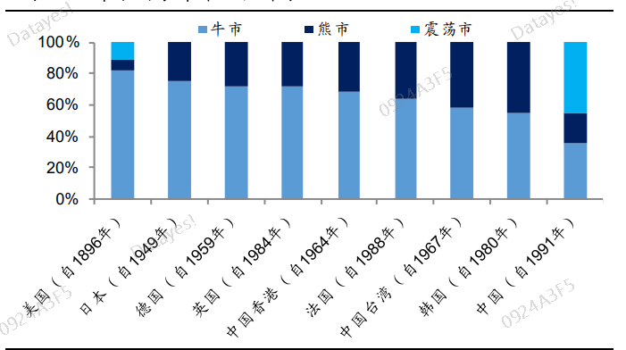

在投资这条路上, 我们永远都是个学生, 甚至是菜鸡. 因为有太多的内容和领域需要我们去学习、去实践、去改变.

## 股市难以预测

我相信大部分接触过股市的人都有一个感觉, 那就是股市很难预测. 谁能预测得准确谁就是大神.

股市为什么这么难以预测呢? 影响市场的变量太多了.

20 世纪最伟大的经济学家之一哈耶克在 1974 年获得诺贝尔经济学奖时, 就发言指出"市场是十分复杂的, 取决于众多个体行为, 每一种结果都可能有许多种情况组成的, 我们几乎不可能全部充分了解和计算."

也就是说, 影响市场的变量太多了, 市场不是完全可知的. 我们只能尽力接近真实, 但不可能完全达到真实.

即便市场是完全可知的, 这里边还夹杂了人的情绪. 因为不同的人在处理同一信息的时候反应是不同的.

你可以看看下面这张图, 两条黄色的线, 你觉得哪一条更长一些?

我相信大家第一感观是, 离我们近的这条黄线更短, 实际上两条黄线一样长, 错觉源于背景图的干扰.

对于股市来说, 我们不但要研究企业、研究未来可能的方向, 还要研究人的情绪. 有时候一家企业明明业绩很好, 财务清白, 但股价就是不涨. 大家是不是经常有这种困惑?

那是因为人的情绪在短时间内没有产生共鸣. 股价在一个时间段内有较大的改变, 这需要投资者的行为同步. 比如一起买, 那股价就会涨, 一起卖, 那股价就会跌.

研究基本面就很难了还要研究人的情绪, 炒股真不是一件容易的事. 基本面研究我们还有方法可循, 那情绪面怎么去研究呢?

正因为大师姐知道大家的痛点, 所以特地开发了这门精品直播课, 在这门课程里, 我会从周期股、成长股和基金三个维度帮大家解决投资上的一些疑惑.

## 顺势而为------周期股

假如你觉得择时很重要, 炒股的收益主要来源于择时, 那么你应该研究周期股.

周期股的研究框架需要投资者对"大势"能精准把握, 也就是踩点. 知道什么时候周期要往上走了, 我们就进场; 知道什么时候周期要往下走了, 我们就离场.

对大势的研究, 主要依据与国家经济数据和宏观政策, 这些信息都是公开、透明的, 不存在时间偏差, 我们个人投资者和机构投资者是同一时间拿到这些数据的.

如果你的风险偏好比较高, 那么周期股绝对是不二选择. 虽然在周期底部, 券商、银行、地产等周期股通常因为股价低被大家视为"三傻", 但在周期顶部时, 又犹如盛开的花朵, 能量一下子绽放出来, 会让你收获颇丰, 前提是你得踩点正确.

萝卜投研的直播课就会教大学怎么判断周期拐点, 从而学会择时的本领.

## 高屋建瓴------成长股

假如你觉得选股很重要, 炒股的收益主要来源于选股, 那么你应该研究成长股.

一般来说, 能挖到一只成长股, 你最近几年的投资收益都不会差. 彼得林奇说过, 每个投资者一辈子只需要发现一只十倍股就足矣.

投资成长股的难点在于你怎么挖掘到它. 一开始, 个人投资者很难挖掘到潜藏的成长股, 等大家发现的时候可能有又涨很多了, 能不能买, 敢不敢买, 都是问题.

投资成长股的人, 风险偏好一般也很高. 因为成长股通常伴随着估值溢价, 你需要胆大也需要你心细, 能够在快速上涨过程中不被甩下车, 也能在回调途中坚持自己的选择.

成长股, 对选股能力要求很高, 在这门直播课中, 我们也会教大家如何去甄别成长股, 以及如何发现它.

## 懒人法宝------基金理财

假如你是个比较懒惰的投资者, 理财的目的就是为了让资产平稳增值, 那么你应该研究基金.

相比股票投资来说, 基金投资对个人的选股和择时能力要求没那么高. 适合投研能力较弱、对收益追求没那么高的小伙伴们.

尤其是主动型基金, 我们要做的就是选对基金经理, 通过基金经理的能力去帮我们实现资产增值的目的.

大家可以看到, A 股市场牛短熊长, 很多时候外国的投资理念在 A 股市场可能有些水土不服, 所以, 我们在学习了别人的理念之后, 要"取其精华, 去其糟粕".

我们不但要研究基本面还得研究情绪面, 我认为情绪就是"势", 找到这个"势"的方向, 你就成功了一半.

在大 A 这个市场里, 我们必须找到一条最适合自己的路.

当然, 无论你选择哪一种风格, 哪一种方式, 都需要你有足够的认知去匹配你的投资决策. 萝卜投研的直播课就会从以上三个方面出发, 带领大家领略各种投资风格的魅力.

这些风格会不会打架呢? 哪种最适合你呢?

说实话, 在没有尝试过之前, 谁也不能下结论.

正所谓"阅尽千帆皆不是, 此心安处是吾乡", 学习的目的不是为了模仿, 而是在了解众多不同投资方法和风格之后摸索出一条适合自己的道路, 风格没有好坏, 只有适不适合. 而适不适合, 答案只能存在于你的心里.

祝大家成为聪明的投资者!
