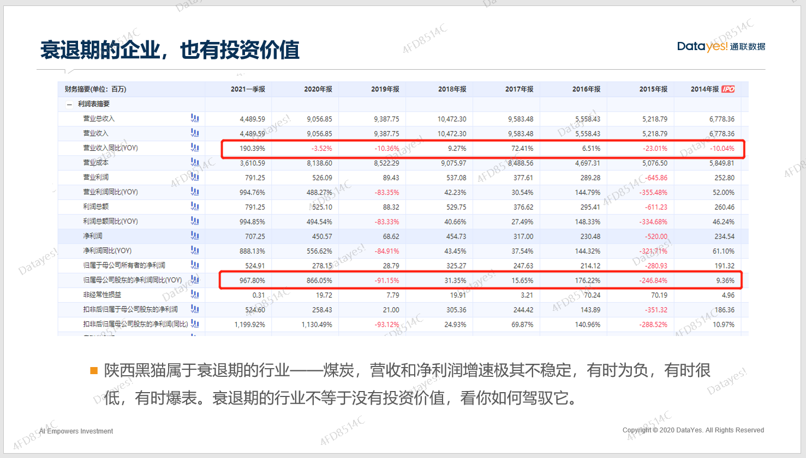

大家好, 欢迎参加萝卜投研直播课.

相信很多人都对成长股比较感兴趣, 为什么?

因为成长股给人的感觉就是"大牛股"、"翻倍股", 可以一直涨.

实际上, 大家真的明白什么是成长股吗? 成长股又该怎么去投资、怎么锁定呢. 前三节课, 我们会围绕成长股投资的核心内容, 带大家了解一个不一样的成长股.

## 什么是成长股?

首先, 我相信很多人脑海里对成长股的定义还有些模糊.

成长股究竟是什么?

成长股是一种主观的判断, 一般来说, 我们把那些处于成长期的企业所对应的股票称为成长股.

那, 什么是处于成长期的企业呢?

**主要是指那些营收增速迅速扩大, 且增长幅度大于所在行业均值的那些公司.**

比如说, 汽车行业整体营收增速是 20%, 但是比亚迪达到了 50%, 这样的企业就是明显的成长股了.

这里有两个概念, 需要大家注意区分: 成长行业和成长企业是不同的.

我们把处于成长期的行业称为成长行业; 把处于成长期的企业称为成长股.

我们要研究的成长股是成长型企业, 落脚点是公司. 当我们想找到成长股的时候, 从成长行业里抓, 肯定相对容易一些.

比如新能源汽车行业, 近五年复合增速较高, 处于高速发展阶段, 无论是从政策扶持层面还是从行业产生的社会价值来看, 都有巨大的潜力, 完全符合成长行业的定义. 行业里的代表企业比亚迪就是当之无愧的成长股啦.

我们再来看看煤炭采掘行业, 近十年复合增速几乎为零, 有几年甚至是负增长状态. 这种处于衰退期的行业, 很少能走出成长股, 但也不是完全不可能(第二课会讲到一些个例).

煤炭行业里的代表企业陕西黑猫、兖州煤业也会有业绩暴增的时候, 但我们不会把它们划分为成长股, 为什么呢?

主要是因为业绩的可持续性比较差, 不具备长期增长的空间. 所以, 对成长股来说, 业绩的可持续性是比较重要的一个点, 一段时间内的增速不能代表什么.

通过这样简单的划分, 相信你对成长股的定义有了清晰地了解.

## 企业的生命周期

既然投资成长股就是投资企业的成长期, 那我们首先得了解企业的生命周期有什么特征.

生命周期大体分为导入期、成长期、成熟期和衰退期这四个阶段.

下面, 我们一一给大家介绍一下, 四个阶段的不同特征, 以及投资上需要注意的事项.

### 第一点、导入期的企业谨慎投资

先从导入期讲起.

导入期的企业几乎没有什么收入, 产品和业务模式还处于一个概念阶段, 所以这类企业绝大部分都是未上市的公司, 目前这一类企业如果寻求上市主要也是在科创板和创业板上市, 要么就是在港美股上市, 因为科创板、创业板、纳斯达克和港股对盈利没有刚性要求, 上市难度比较低.

所以, 我们在投资创业板、科创板和港美股的时候, 需要注意这种风险, 导入期的企业估值没法看, 波动极大, 有可能赚很多钱, 也有可能亏很多钱. 这个阶段一般属于"炒概念", 很多散户或游资也比较偏爱, 因为有"故事"可讲. 一般只要讲得好, 可以把股价拉到天上去.

比如 2020 年在美股上市的小鹏汽车, 去年因为新能源汽车的火爆, 受到投资者追捧, 短短一个月时间暴涨四五倍, 随后又大幅回落. 而小鹏汽车就是导入期的企业, 还没有开始盈利, 亏损比较严重, 2020 年亏了将近 50 亿.

面对这类企业, 建议新手不要跟风, 因为波动性太大, 风险也高, 极有可能遭遇巨大亏损.

还记得当年的网约车、共享单车、线上外卖服务吗? 这些概念刚刚火起来的时候, 市场有多少家企业? 最终, 经过一段时间的角逐, 大鱼吃小虾, 熬到最后的一般就只有一两家了.

一开始这些平台为了抢夺客户, 扩大市场占有率都采取高额补贴的方法, 一直烧钱. 这个阶段, 同行业的竞争对手之间的经营管理状况究竟是好是坏, 往往很难区分, 谁也不知道哪些企业最后能活下来.

比如共享单车, 第一个尝鲜的是摩拜单车, 车子做得又好看又实用, 我觉得是当之无愧的王者, 但是很快 ofo 小黄车就来抢占市场了, 从那以后, 几乎各种颜色的共享单车都纷纷抢占市场, 而小黄车通过烧钱营销的方式迅速抢占下了市场, 最辉煌的时候, 满大街都是小黄车, 这个时候我又觉得小黄车是人生赢家. 没过多久, 小黄车倒了, 其他颜色的车也看不见了, 摩拜单车也被美团收购了, 一些单车新势力又崛起了, 比如美团单车、哈啰单车、青柠单车.

这个故事告诉我们, 行业格局风云变幻, 最终能存活下来、并且能赚钱的才是王者.

如果我们在共享单车刚起步的时候就投资那些企业, 应该是血本无归的. 在行业格局改变之后, 市场里冒出了比较稳定的几家好的企业, 这个时候, 我们再去仔细比对哪一家更有优势, 从而进行投资, 是比较好的选择.

### 第二点、成长期的企业可以掩盖很多问题

跨过导入期, 迈入成长期之后, 企业一般会迎来高速增长, 处于这个发展阶段的企业会掩盖很多经营上的问题, 对我们挑选企业的要求相当于降低了.

怎么理解呢?

在高速发展期, 因为效率最重要, 所以企业的管理上会忽视很多小问题, 这些小问题在这个阶段往往不会成为暴雷因素, 就显得不是那么重要了.

简单举个例子, 假如有一个校外培训机构 A, 他们的招生吸引力源于 90%的重点高中录取率, 在市场需求巨大的时候, 可以招到很多学生. 这时候企业为了跑马圈地就会忽视一些管理上的问题.

假如随着时代的发展, 市场需求逐渐稳定, 行业格局也稳定了, A 企业的营收增速就会趋于平稳. 原本管理上的一些漏洞、问题, 往往会在这个阶段暴露出来.

比如, 很多培训班的老师并没有资质, 甚至素质比较差, 有些售后服务做得不好, 导致退课率比较高等等. 一旦这些问题暴露出来, 企业的根本就会被动摇, 千万不可小觑.

所以, **投资成长期的股票, 最好是投资成长中期.** 为什么这么说呢?

成长初期和导入期我们很难严格区分, 所以当一个行业里有大量企业在竞争的时候, 我们可以选择等一等. 就像我们提到的共享单车, 如果当初投资了摩拜或者 ofo, 应该都是一笔失败的投资.

那, 为什么也不要考虑成长后期呢?

成长后期走向成熟期的阶段, 也很难区分. 而且在成长后期, 往往很多企业已经开始暴雷了, 走过了行业发展最好的时代.

我们更偏向参与成长中期这个阶段, 因为这个阶段里, 产业规模持续高增长, 而技术落后的企业产品同质化严重, 毛利率会下降, 只有行业里的佼佼者才能维持高毛利并不断扩大市场占有率.

### 第三点、成熟期的企业更看重价值

在成长后期, 企业的数量会逐渐减少, 其中有一些企业凭借自身的一些优势(比如商业模式、产品竞争力、成本费用管控或是渠道控制能力等)会逐渐脱颖而出, 在企业的利润率和增速上跑赢同行.

如果我们把成长期称为"群星璀璨", 那么成熟期就是"月朗星稀". 这个时候有一些星星逐渐变成了月亮, 也有很多繁星逐渐暗淡甚至消失.

在"群星璀璨"的阶段, 很多人可能错过了风口, 或者找不到好的企业, 在"月朗星稀"的阶段, 谁是行业老大一目了然.

成熟期的企业往往会走出很多白马股, 这个阶段也是不错的投资时机哦, 不过成熟期的企业和成长期的企业投资策略是完全不同的, 这一点第二课也会讲到.

### 第四点、衰退期的企业也有投资价值

衰退期的企业, 光听名字就觉得不行, 相信大家也有这种感觉吧?

其实也不是, 衰退期的企业很多都是周期股, 因为已经过了行业发展巅峰, 增速比较慢, 要么就是某些年净利润负增长, 又突然一下暴增.

业绩时好时坏的行业, 本身发展动能很弱, 业绩的好坏基本都依靠经济周期来的. 比如煤炭、钢铁、有色金属都有这样的特征.

像陕西黑猫就是一只煤炭股, 而煤炭行业是妥妥的夕阳行业, 平时都遭人鄙视. 陕西黑猫的营收增速也不稳定, 有时候是负数, 有时候是个位数, 有时候爆表. 但是, 每一次经济周期上行的时候, 陕西海猫还是能有相当亮眼的表现.

比如 2020 年 9 月到 2021 年 3 月这一波, 短短半年时间, 陕西黑猫涨幅高达 192%.

所以, 衰退期的行业并不等于没有投资价值, 只要你能驾驭它, 就是好的行业. 我们不需要对每个阶段的行业有偏见, 能给我们带来超额收益的行业就是好行业.

## 总结

本节课主要讲了什么是成长股, 以及投资成长股最好是投资哪个阶段. 相信大家对于成长股和企业的生命周期都有了一个大致的概念.

大师姐为你做总结:

1、成长股主要对应处于成长期的企业, 最好的投资阶段是成长中期.

2、导入期和成长初级风险极高, 容易看走眼; 成长后期有暴雷风险.

3、成熟期和衰退期的企业也有好的投资机会, 我们不要戴有色眼镜.

