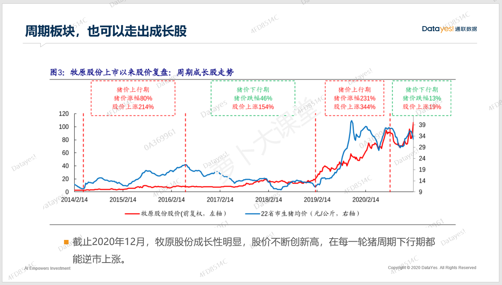
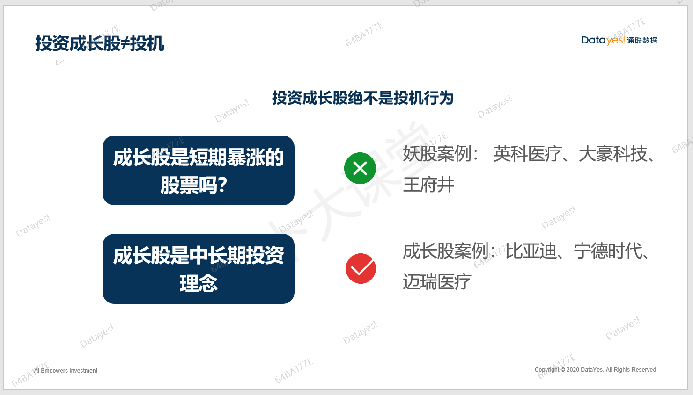
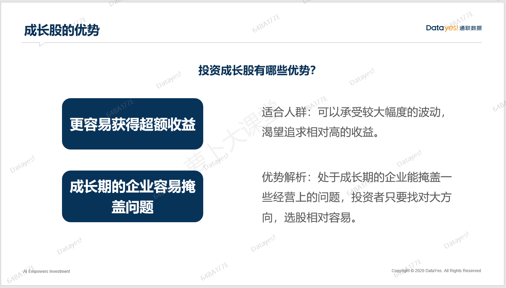
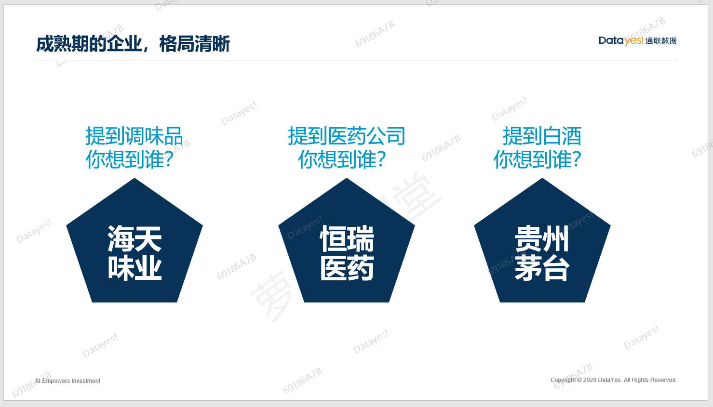
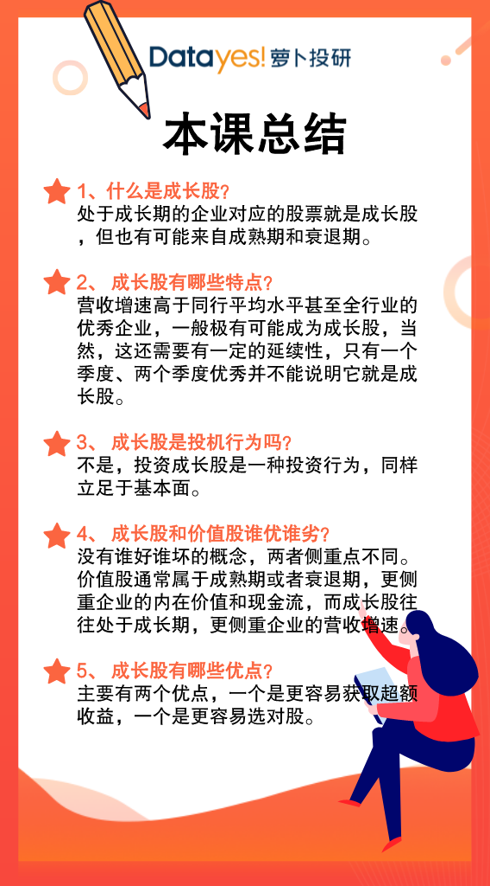

大家好, 欢迎参加萝卜投研精品课.

上节课我们讲了成长股的定义以及最佳投资阶段, 这节课我们深入分析一下, 成长股的其他可能性和投资要点.

## 成长股一定来自成长行业吗?

成长股是不是一定来自于成长行业. 答案当然是否定的.

大部分成长股都来自于成长期的行业, 但也有一些成长股来自于处于成熟期或者衰退期的行业.

首先, 我们来看一下成长行业的定义: **成长行业主要是指新兴行业或发展潜力很大的行业**. 这些行业往往呈现出蓬勃发展、欣欣向荣的状态, 行业里的公司都处于高速发展时期.

所以, 锁定成长行业相对是比较容易的, 如果大家拿不准一家企业是不是成长股, 或者有没有可能成为成长股, 最最简单的做法就是看看所处的行业是不是成长行业, 是不是来自新兴赛道, 有没有一些创新元素或者国产替代元素在里面.

但是, 处于成熟期或者衰退期的行业, 也有可能出现成长股哦, 如果你忽视它, 那么就会错过很多大牛股.

像牧原股份属于生猪养殖行业, 生猪养殖是一个发展已经很成熟的行业, 且周期性很强, 属于周期板块. 但是牧原股份自上市以来就走出了大牛股的姿态.

毫无疑问, 牧原股份这家公司自身的成长性得到了市场认可, 以至于克服了行业本身的周期性. 同理, 招商银行也是如此, 银行指数呈周期性波动, 但招商银行的股价长期向上, 不断创新高.

所以, 成长股不全来自于成长行业, 也会来自于成熟期甚至衰退期的行业, 而成熟期和衰退期的行业主要分布在周期板块和防御板块之中.

不过呢, 对于从周期股变成长股的企业, 一般来说难度更大一些, 因为这需要投资者改变原本的观点, 摒弃偏见, 除了企业自身特别优秀之外, 还需要多给一些时间.

## 成长股的核心优势

那么, 投资成长股有什么核心优势呢?

这里必须强调一点: 投资成长股不等于炒作, 很多投资者觉得成长股=大牛股=短期暴力上涨的股票, 其实并不是.

投机的特点是什么呢? 就是讲故事, 画大饼, 太阳底下没有新鲜事, 妖股年年有、月月有, 但有多少人能够靠买妖股长期赚到钱呢? 极少极少.

投资成长股绝对不是追涨杀跌, 也不是一波涨完就偃旗息鼓. 成长股投资是一个中长期的投资理念, 企业发展也是一个长期的行为, 中间可能也有一些股价上的震荡, 但长期来看, 一定是向上的. 这就需要我们精心挑选出具有成长性、有真材实料的优质企业.

不是妖股, 不是投机, 那成长股自身有什么优势呢?

有两点优势.

### 第一点、更容易获取超额收益

成长股最大优势就是基于基本面去发现当前被低估的处于成长期的企业, 相比其它投资品种, 成长股更容易带来超额收益. 但, 盈亏同源, 成长股的波动性也比较大, 比较适合风险偏好较高的投资者, 也就是能承受较大的亏损并追求较高收益的这部分人群.

### 第二点、企业高速成长期容易掩盖很多瑕疵

我们都知道, 投资一家企业就是当它的股东, 看好它的未来. 在研究企业基本面和经营管理策略时, 往往不是一件简单的事, 一个看不准, 就会遭到绝大损失.

而处于成长期的企业, 有很多瑕疵、问题在高速成长期是处于"水下"的, 是看不见的. 或者说, 为了先发展、为了扩大市场占有率, 可以把这些问题先放一放.

既然如此, 这对我们研究公司基本面的难度就降低了, 我们只要找准大方向, 选择里面的龙头企业就可以了. 等问题暴露出来的时候, 企业往往已经不在高速成长期了, 这就是投资成长股的巨大优势.

## 成长股和价值股的区别

价值股一般来自于成熟期或者衰退期, 主要是成熟期. 通常优质的价值股都是行业龙头, 有着非一般的地位.

比如提到酱油就想到海天, 提到医药就想到恒瑞, 提到白酒就想到茅台.

这些优质企业, 往往在各自的行业里占据了不可磨灭的地位和影响力, 同时也有较深的护城河, 生意模式简单, 现金流充裕, 我们一般称之为"大白马"或者"大蓝筹".

成熟期的企业和成长期的企业各有优缺点, 两者风格不同, 研究模式也不同, 成长期的企业更重视营收增速, 而成熟期的企业更重视现金流. 没有谁优谁劣, 只有合不合适. 适合自己的就是最好的, 祝大家都找到适合自己的投资风格.

## 总结

这节课, 我们主要讲了成长股的定义和成长股的优势, 再来帮大家划一下重点.

1、什么是成长股?

处于成长期的企业对应的股票就是成长股, 但也有可能来自成熟期和衰退期.

2、成长股有哪些特点?

营收增速高于同行平均水平甚至全行业的优秀企业, 一般极有可能成为成长股, 当然, 这还需要有一定的延续性, 只有一个季度、两个季度优秀并不能说明它就是成长股.

3、成长股是投机行为吗?

不是, 投资成长股是一种投资行为, 同样立足于基本面.

4、成长股和价值股谁优谁劣?

没有谁好谁坏的概念, 两者侧重点不同. 价值股通常属于成熟期或者衰退期, 更侧重企业的内在价值和现金流, 而成长股往往处于成长期, 更侧重企业的营收增速.

5、成长股有哪些优点?

主要有两个优点, 一个是更容易获取超额收益, 一个是更容易选对股.

以上就是这节课的全部内容, 祝大家学有所成, 下节课我们会给大家讲一个指标, 通过这个指标锁定成长股, 十分重要哦.

