大家好，欢迎参加萝卜投研直播课。

关于成长股，我们讲了定义，讲了投资要点和优势。那怎么找到它呢？相信大家都很关心这个问题。今天这节课我们就用一个简单的指标帮大家锁定成长股。

## 一个指标锁定成长股

当我们发现某个公司，突然连续两个季度以上的营收增速大于25%时，我们就要关注起来了，找到成长股的可能性大大增加。因为这说明公司的业绩正在迅速扩张，企业的基本面在悄悄变化。但这种变化能否持续是比较重要的，千万别只根据连续两个季度营收增速大于25%就轻易下判断。

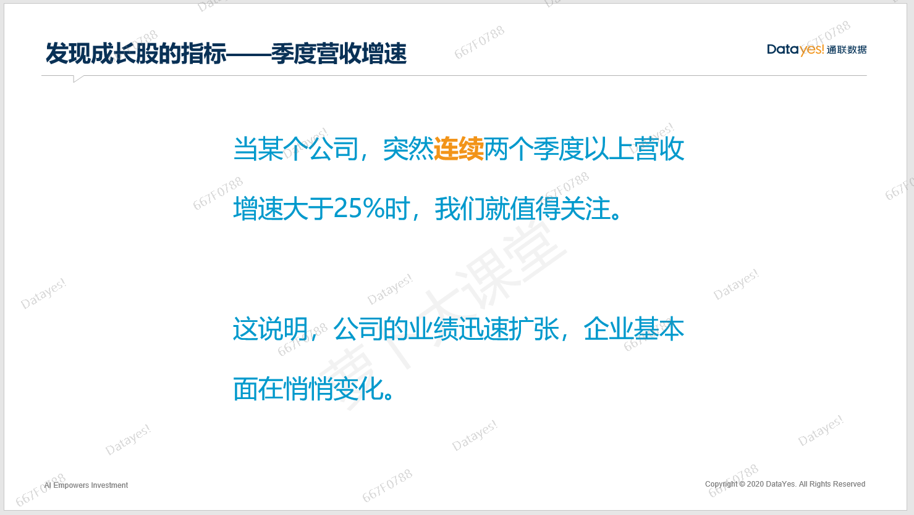

从下面这张图上，我们可以看到某个企业，在2020年二季度开始，连续四个季度，营收增速都大于25%，而且是跳跃式上涨。从2020年一季度的-35.06%直接跳跃到二季度的28.06%。此后，每个季度的增速越来越猛，可见有多么强势。

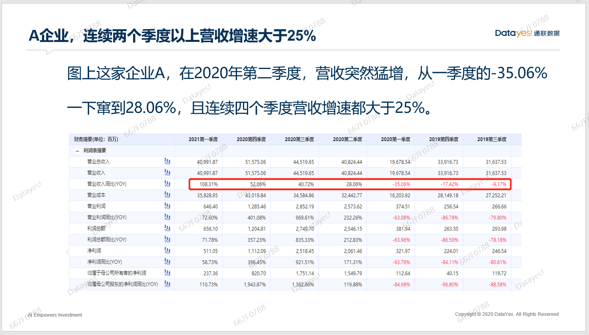

这家企业是谁呢？

它就是大牛股——比亚迪。

我们再来看看比亚迪的巨大涨幅是从什么时候开始的。是从2020年4月开始的，也就是2020年的二季度，从此一发不可收拾。

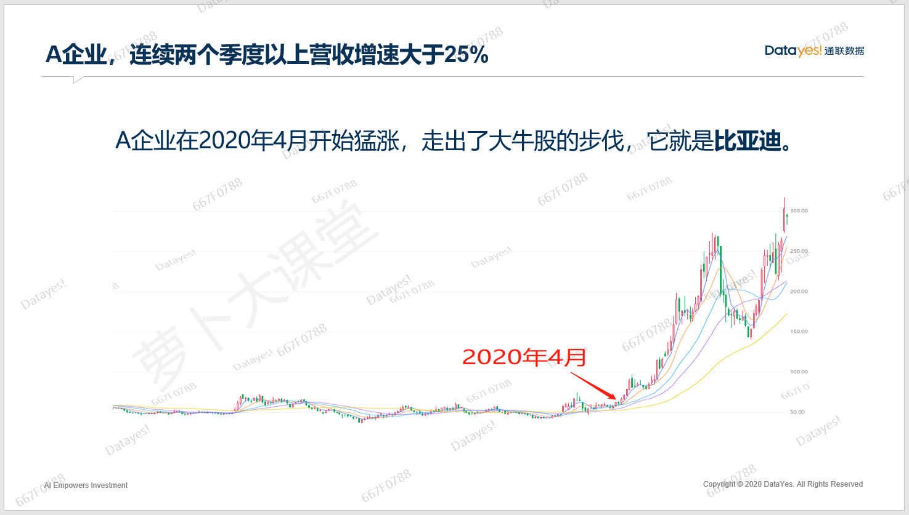

可能有的同学会说，2020年4月份我们根本不知道财报数据啊，怎么知道二季度营收数据会这么好呢？

二季度的数据一般在7月初就有业绩快报了，即使有的企业没有披露，最迟7月底或者8月初也会公布半年报。即便是8月份，比亚迪也才80多块，依旧来得及上车。而且，对企业进行深入研究就会知道，每个月比亚迪都会公布相关销售数据，所以我们完全可以从每个月的销售数据中找到业绩改善的线索。

判断一家企业是否是成长股肯定不能依靠单一的指标，否则投资也太容易了。

我们来看另一家企业B，也从2020年二季度开始营收增速迅速起飞，而且增速十分夸张是5倍到20多倍的增长率。一季度还是-70.85%呢，一下子腾飞是不是说明企业业绩改善了？这就是传说中的大牛股呢？

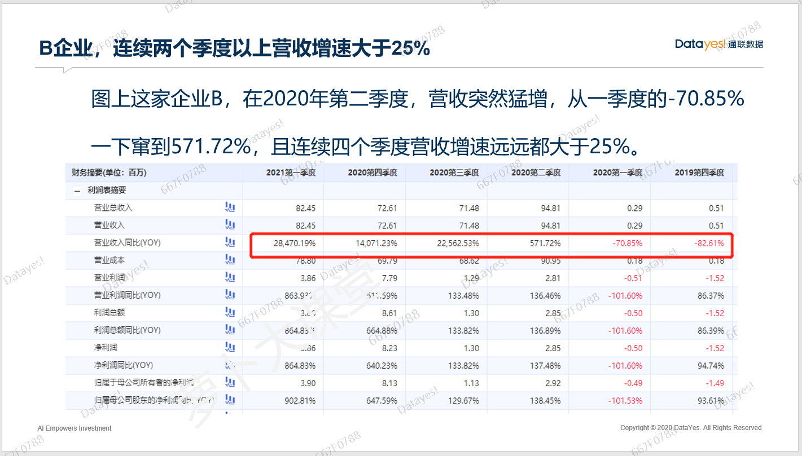

非也。

B企业只在2020年4月到8月上涨了一段时间，随即就开启了漫长的下跌行情。为什么同样是在2020年二季度营收增速反转，并且同样是维持了四个季度的高景气度，B企业和A企业差距这么大呢？

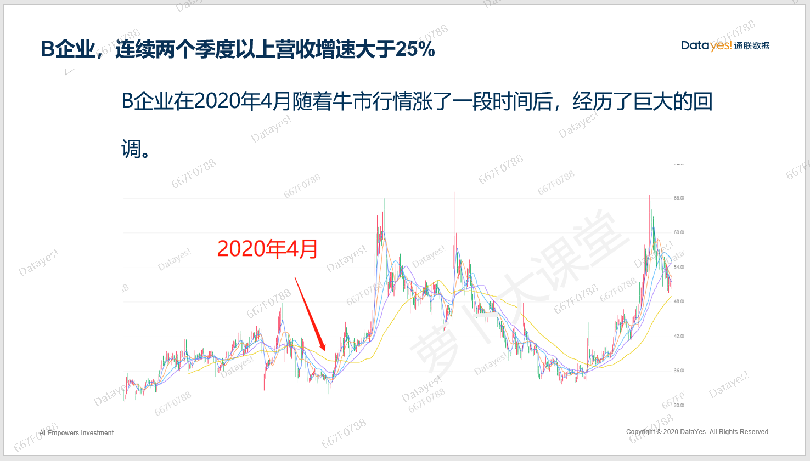

主要是因为A企业比亚迪所处行业是新能源汽车，B企业光库科技属于光纤器件和光通讯行业，前者是成长行业，整体势能较大，后者是周期行业，和5G的建设周期关联度较大。

所以，我们不能看见成长股的指标就立马判断企业属于成长股。还需要对所处行业以及公司基本面做深入研究，而这些深度研究在后面的成长股系列课程中都有详细解析。

## 锁定成长股的案例回顾

投资成长股的重点其实并不是择时，也不是短期内的估值，而是看清大趋势和商业模式，从而判断出当年的企业净利润会达到多少，再根据这个来判断股价还有多少上升空间。

有时候，我们根据上面的指标锁定了未来的成长股，但可能股价上还没有反映出来，并没有跟着涨，又或者已经涨很多了，这个时候怎么办呢？

千万不要急于否定某个企业或者某个行业，又或者急于追涨。真正的成长股不会只有一次买入机会，而是会一直有。

下面我们用一个案例来说明。

通过财务数据，我们可以看出，利亚德这家公司从2012年上市之后开始高速增长，其中有四年净利润增长几乎翻倍。五年时间净利润从5000多万增长到12亿，妥妥的大牛股。

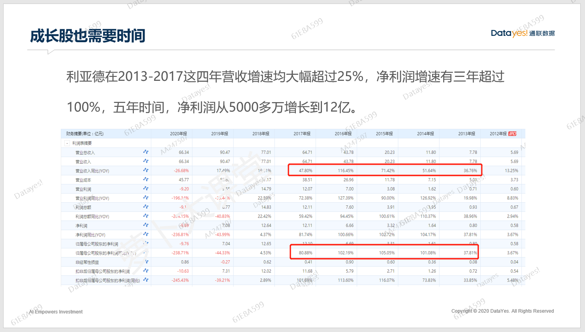

我们再看看股价涨幅，从2013年开始到2017年，涨幅接近25倍。而且，上市第一年的股价一整年都是横盘状态，可以看到2012年的营收和净利润增速都不大理想，那个时候它还没有得到市场的认可，从2013年开始，大牛股的特征逐渐明朗。

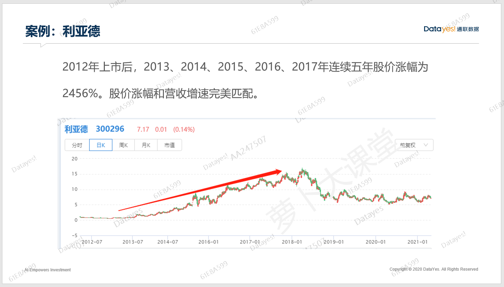

我们通过复盘，用年度数据来看发现利亚德的大牛股趋势不是短短几个季度而是维持很长时间的。但是如果我们在2012年上市后就注意到了利亚德，那么，什么时候能发现它有成长股的趋势呢？

其实，从利亚德2013年二季度就可以看见大牛股的影子了。但，真正可以确定的还是2013年四季度数据出炉之后。

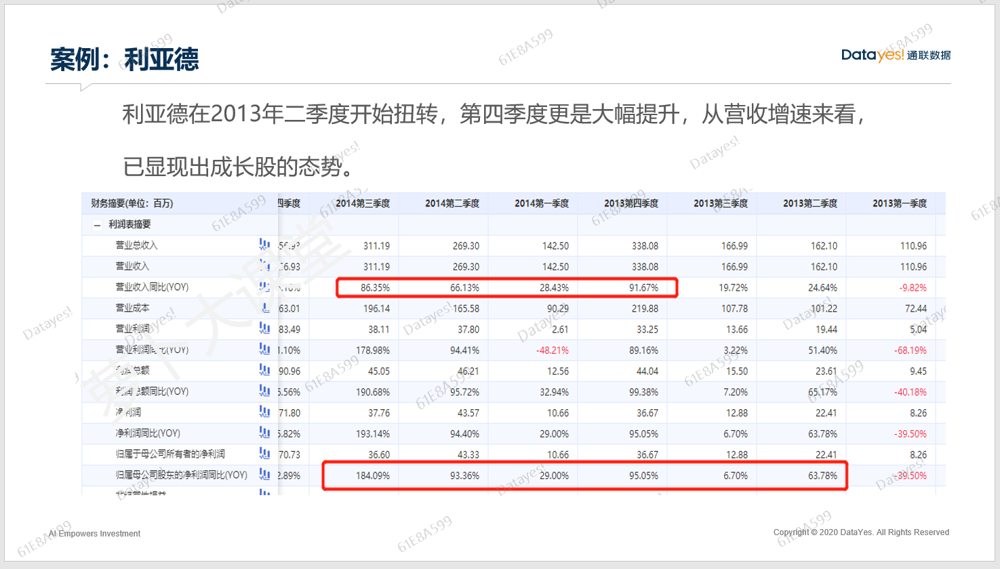

我们可以看到，2013年二季度，利亚德的营收增速从一季度的-9.82%迅速提升为24.64%，这个转变还是比较明显的，接着我们继续观察，三季度的营收增速是19.72%，有一点点放缓，但相较于2012年的数据表现还是不错的，这种时候我们依然可以持续观察。

到了四季度，营收增速突飞猛进变成了91.67%，一定是发生了什么才会使得业绩有如此大的改善，这个时候我们就基本可以确立它的成长股趋势了。一般四季度的数据和下一年的一季度是同时出来的，所以，再观察一下2014年一季度的情况，发现营收增速还是维持在25%以上，到这里基本就可以确立成长股的属性了，当然前提是你对这个行业和公司的基本面已经有了深入研究。

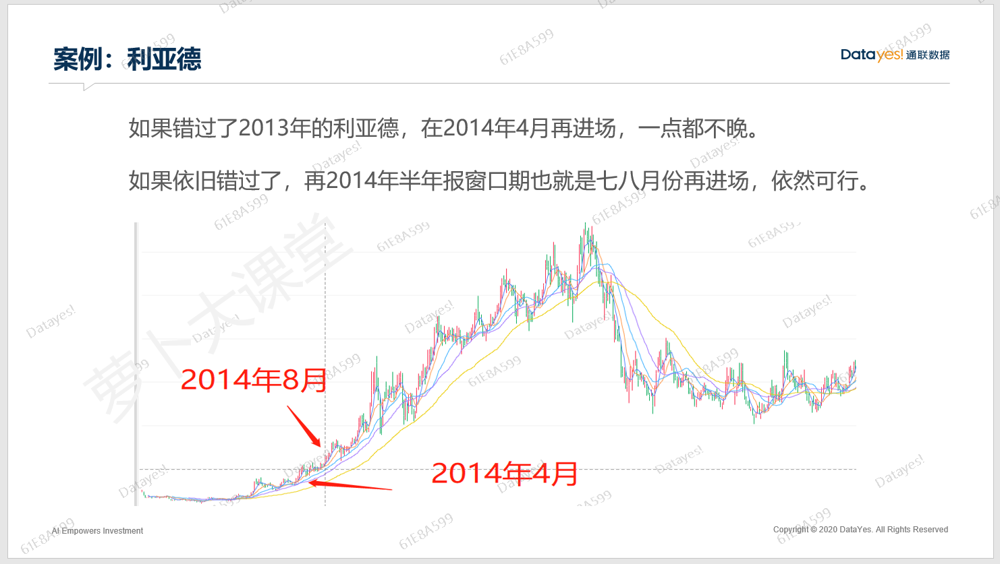

哪怕错过了2014年4月份的绝佳进场点，等到半年报出炉，也就是2014年8月份，我们发现，好的买入时机依然在，成长股就是这样的，不要怕贵，一旦假设成立，就大胆买入。否则永远赶不上。当然，也不要盲目追涨，成长股也需要看合理的估值区间，具体方法我们在成长股高级营中会教给大家。

## 指标如何查找？

接下来，把步骤给大家说一下，说完之后呢，再实操一遍，直播就是有这么个好处，可以看的很直观。

1、打开[爱问财](http://www.iwencai.com)的网站，并登陆。

2、在搜索框里输入“2021年一季度营业收入增速大于等于25%，2021年二季度营业收入增速大于等于25%，非st，行业“

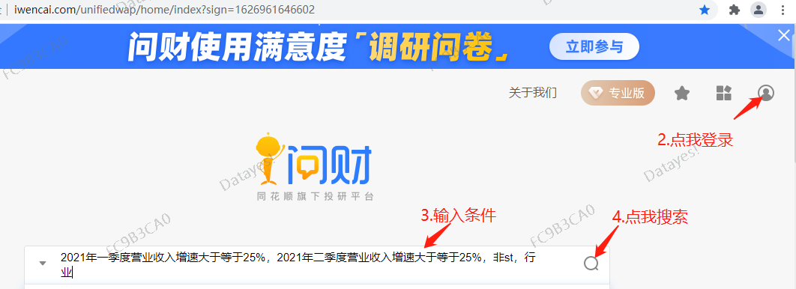

3、在打开的界面里就能看到我们锁定的成长股了。

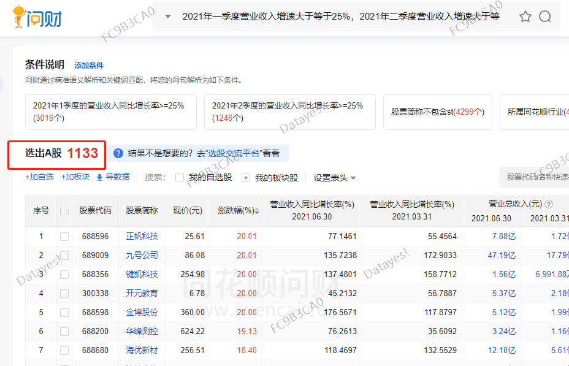

4、我们可以通过更改网站的设置查看想看的数据。

比如，我只想看营收增速、行业，可以：点击【设置表头】，只勾选【营业收入同比增长率】和【所属同花顺行业】就可以了。

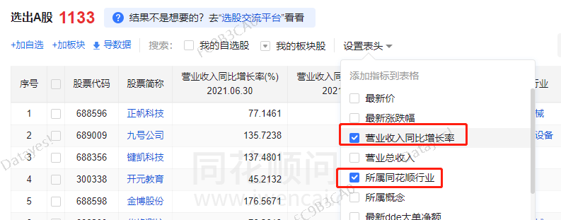

5、大家如果想把这些数据导出来的话，要么花点时间，或者是花点钱都能办到。

接下来在电脑上给大家演示下上述的步骤。

不过呢，要提醒大家注意，这个神奇指标能帮我们找到成长股，但并不是一劳永逸的，我们还需要从这些备胎里去筛选一下。

毕竟我们也不可能把这1133只股都买回来吧，对吧？雨露均沾下来，得花不少银子呢。

为了能合理的使用我们的资金，我们要把那些徒有其表的渣男踢掉，找到那些货真价实的成长股，比如比亚迪。

## 总结

这节课我们主要讲了锁定成长股的一个重要指标，再帮大家复习一遍，初步判定一家企业是不是成长股，当然是先看它是不是属于成长赛道，其次看看最近两个季度营收增速是否大于25%，历史业绩如何等等。

如果一时之间无法做判断，也不要着急，可以慢慢等，继续观察，投资不是一朝一夕的事。

最后，想提醒大家，投资成长股绝非只看营收增速这么简单，需要仔细研究企业的基本面，明白成长的势能可以维持多久，企业的核心竞争力在哪里等等。依靠简单粗暴一刀切的指标走遍天下是不可能的。（企业的核心竞争力以及我们还可以从哪些角度找到成长股，这些内容都会在成长股进阶课里面讲到）

以上就是如何通过一个指标简单锁定成长股的核心内容啦，祝大家投资进步~

