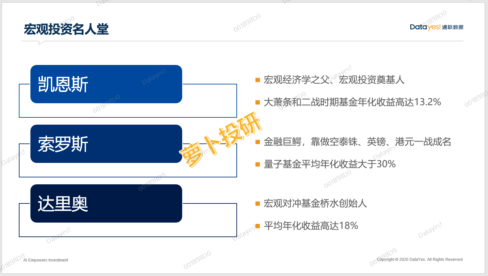
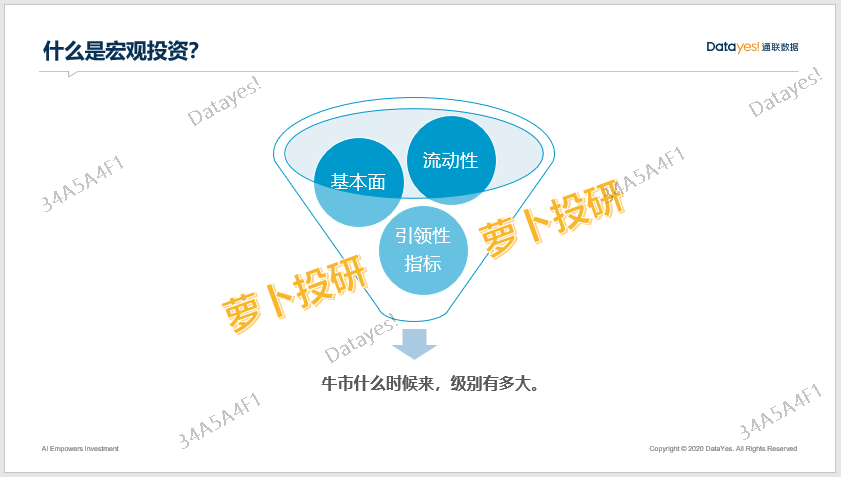
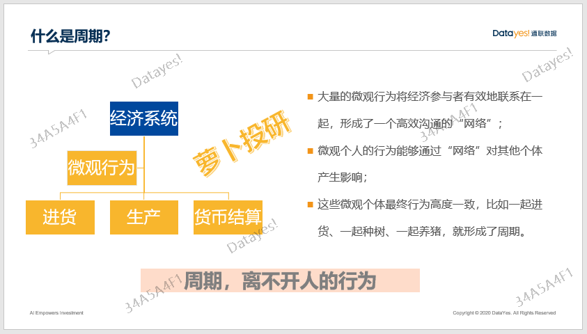
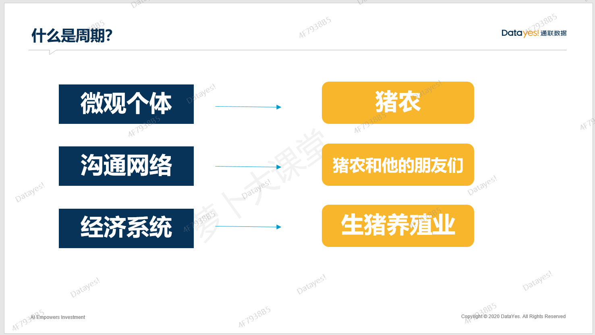
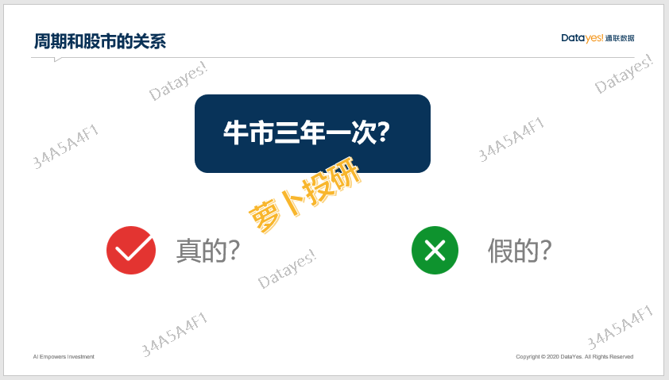
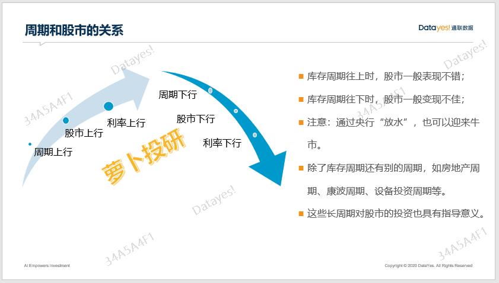
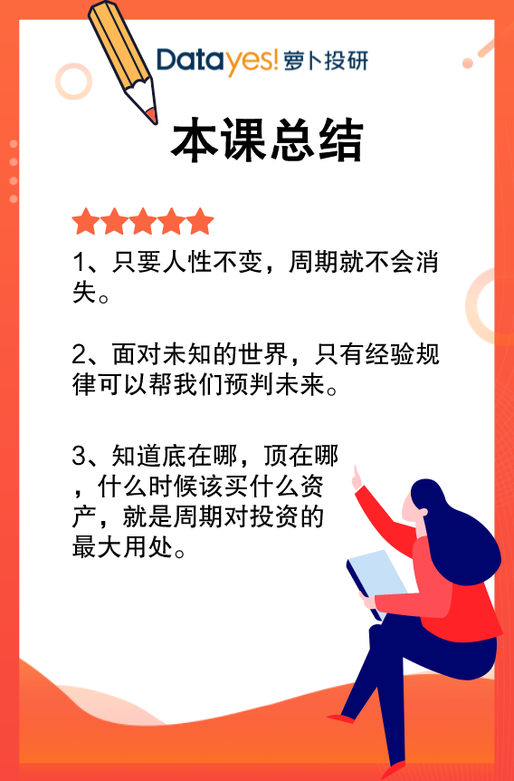

大家好, 欢迎参加萝卜投研大师直播课.

对大部分个人投资者来说, 对宏观投资(研究周期)可能是比较陌生的. 本节课主要带大家了解宏观投资的来龙去脉, 以及为什么要研究它.

## 什么是周期?

宏观投资有很多大佬, 比如宏观经济学之父凯恩斯、资本大鳄索罗斯、宏观对冲基金桥水创始人达里奥, 他们都是宏观投资流派里的杰出代表.

他们的战绩也都非常出色. 像凯恩斯在经济大萧条和二战期间, 基金年化收益率都能达到 13.2%, 而索罗斯就更厉害了, 他的量子基金年化收益率达到了 30%, 达里奥的桥水基金也不甘示弱, 年化高达 18%, 哪怕在 2008 年金融危机的时候, 那一年收益率都能达到 14%.

这些大佬们之所以这么厉害, 就是因为他们特别会通过宏观经济数据判断未来的走势. 从而提前锁定买入什么资产, 收益率才会更高.

这些大佬们是怎么研究的呢? 这就是这门课的核心了.

宏观投资主要是通过对经济基本面的分析, 判断出牛市什么时候来, 来的话, 级别有多大. 我们应该在牛市和熊市种持有哪些资产, 才能提高收益率.

那么, 宏观研究是怎么指导股市投资的呢?

经济周期的波动对股市投资至关重要. 因为经济基本面的表现最终都会反映在股价上.

首先, 我们得知道周期是什么. 周期就是微观个体在宏观环境中行为共振引起的一种现象.

我们所处的复杂的经济系统都是由微观行为所构成的, 大量的微观行为都具有周期性.

以交易为代表的微观行为将参与者有效地联系在一起, 组成了一个高效的"沟通" 网络, 微观个体的行为能够通过这个网络对其他个体产生影响.

最终这些微观个体行为高度一致, 就形成了周期.

以上这段话是不是很难理解? 我们用一个通俗易懂的案例来帮大家消化一下.

假设你是一位养猪的猪农, 你和你的猪农朋友们去年同时决定加大养猪的数量, 从原本的每人养 100 头变为 200 头. 然后, 又在今年同时决定减少养猪的数量, 从 200 头变为 100 头, 这种行为就形成了猪肉的周期.

怎么理解呢?

去年大家养得多, 导致市面上的猪肉泛滥, 价格下跌; 今年, 大家都不想养那么多了, 纷纷减产, 又导致市面上猪肉紧俏, 价格上涨.

所以, 我们通过猪肉价格来观察的话, 就会发现, 猪肉是有周期的.

在这个周期里, 猪农对应的就是微观个体, 猪农和他的猪农朋友们就形成了一个沟通网络, 生猪养殖这个行业其实就是经济系统.

微观个体(每一位猪农)在经济系统(养猪行业)中, 行为高度一致时(猪农和猪农的朋友们一起做一件事), 就产生了周期.

那你可能会问"为什么猪农们要同时加大或减少养殖数量呢? 不会错开时间吗?"

还记得咱们对周期的定义吗? 微观个体会自动形成一个高效的"沟通网络".

以猪农为例, 如果今年猪肉一直涨价, 他们看见了甜头, 肯定会加大养猪量, 你看见隔壁老王和老李都各自养了 10 头猪, 你只养 5 头, 这可能吗?

在这种高效"沟通网络"中, 你会被群体的信息所左右, 逆势而为, 对很多普通民众来说是一件十分困难的事情.

通过这件事, 相信你们也明白了另一个道理, 那就是为什么几百年来, 周期可以一直持续, 因为人性在历史的进程中不太会轻易被改变.

看见养猪赚钱, 自然就想多养; 看见养猪不赚钱, 就选择少养甚至不养. 人性, 就这么简单.

总而言之, 周期的形成, 离不开人的行为. 人性不变, 周期就会永恒.

## 周期和股市的关系

那, 经济周期和股市的关联又在哪里呢? 经济周期上行的时候, 股市往往会有不错的表现, 而经济周期下行的时候, 股市的表现往往不佳.

很多自媒体或者财经博主会告诉你"牛市三年一次"或者"牛市五年一次", 大师姐甚至还听到过有人说"牛市十年一次"的.

这些说法有道理吗? 真的是这样吗?

实际上, 牛市什么时候来并不是靠时间长度来决定的, 这是没有道理的.

一般来说, 牛市和库存周期高度相关, 而库存周期的时间大概就是 3-4 年一次, 所以有时候有些传言看起来好像是正确的, 但实际上他们并不知道本质是什么.

本质上, 随着库存周期的上行, 经济基本面变好, 市场里的钱多了, 消费者信心也增加了, 对投资的预期也提高了. 这是一个正向循环的机制, 最终结果就是, 库存周期上行, 股市一般也上行.

至于什么是库存周期、库存周期的拐点怎么去判断, 也就是牛市什么时候来, 来得话级别有多大, 以及选股指标, 这些问题都会在后面的周期高级营中为大家一一解答.

作为初学者, 大师姐希望大家记住, 牛市什么时候来我们主要看它——库存周期. 这家伙好了, 经济就好, 股市也好. 这家伙不好, 经济不好, 股市一般也好不了.

## 总结

有人说, 周期是一种历史表现, 我们通过历史来判断未来, 真的有效吗?

答案是肯定的.

因为千百年来, 经济发生了巨变、社会环境发生了巨变、生活方式也发生了巨变, 唯一不变的就是人性. 只要人性不变, A 股市场里的故事就会不断重复.

我们所能做的, 就是尽可能以史为鉴, 用过去的经验规律帮助我们做好投资决策.

研究周期, 就是依靠过去的经验规律帮我们预判股市行情.

比如, 在判断出牛市拐点时满仓, 在预判出熊市拐点时减仓甚至空仓, 或者买入别的资产, 比如债券、黄金等等来使资产保值, 这些, 就是周期对投资的实际指导意义.

