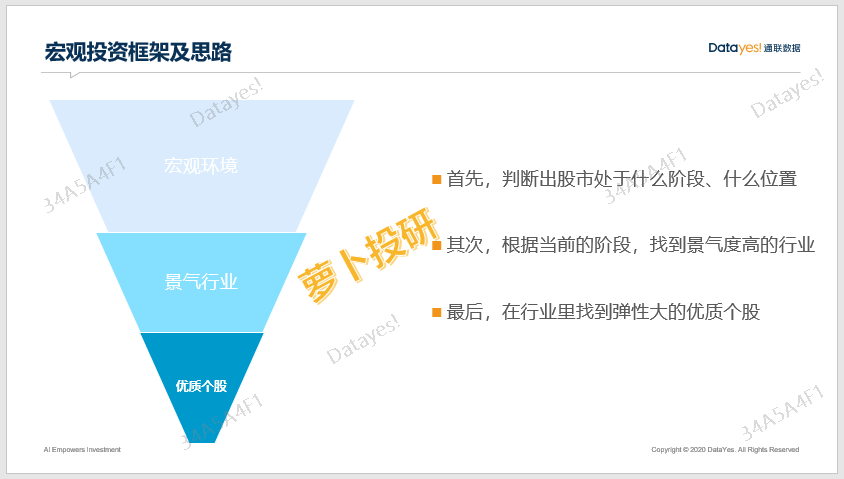
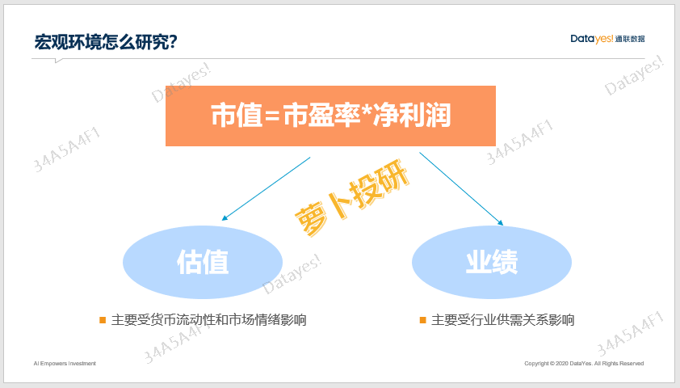
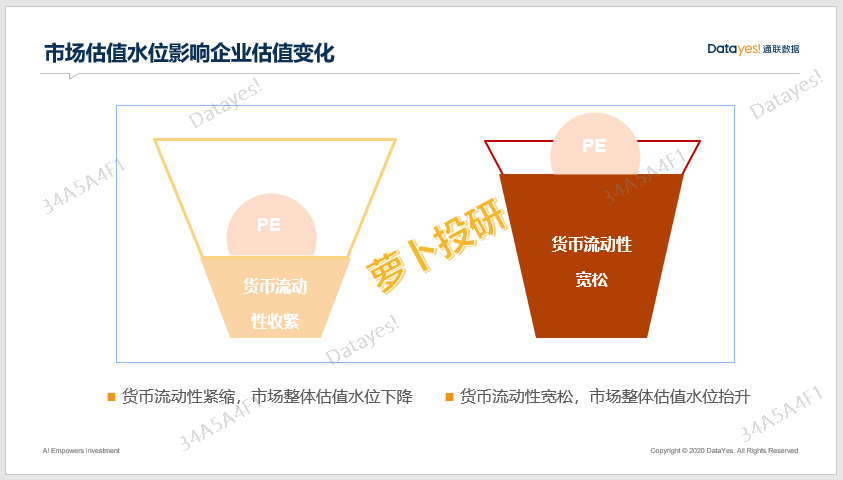
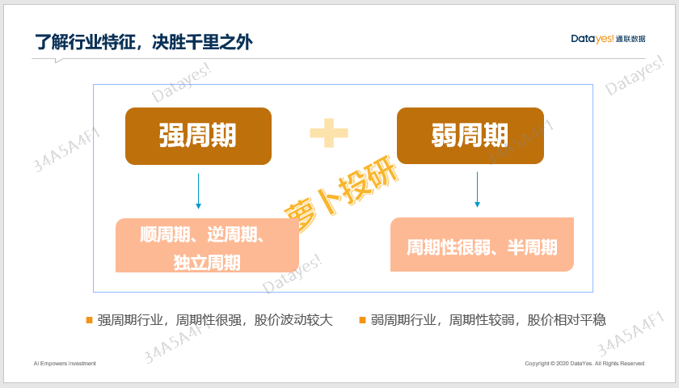
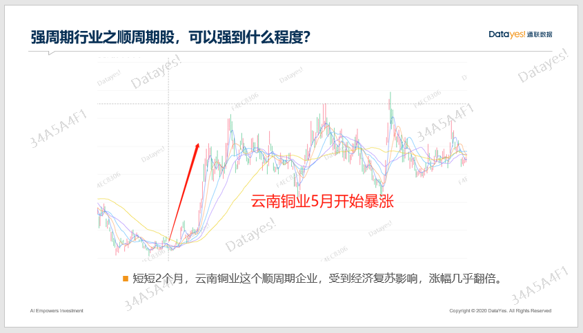
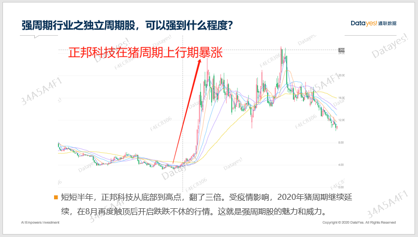
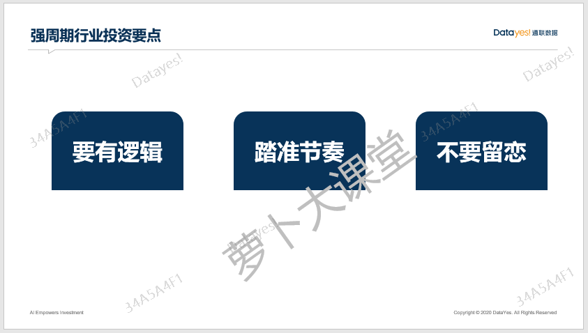
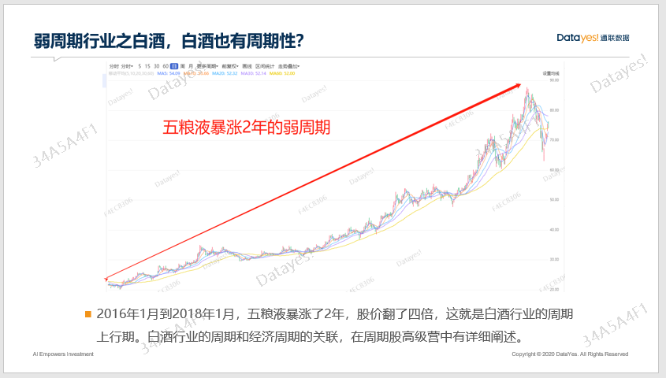
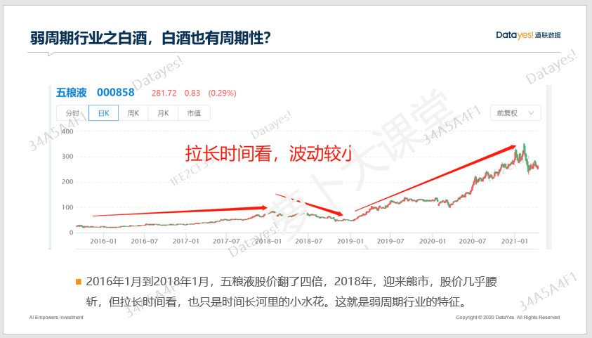

大家好, 欢迎参加萝卜投研精品课.

价值投资之父格雷厄姆的巨著《证券分析》扉页上就引用了罗马诗人贺拉斯的话:"现在已然衰朽者, 未来将重放异彩; 现在备受青睐者, 未来将日渐衰朽."

智者引用诗人的话, 把投资中的基本常识——周期, 给鲜活地呈现了出来, 周期对投资的重要性可见一斑.

上节课我们讲了宏观投资这个派系的来龙去脉, 也大致讲了宏观投资主要是研究周期.

那具体怎么研究呢, 周期包含了哪些内容呢? 今天这节课, 咱们就讲一下具体的分析框架.

## 宏观研究第一步

宏观投资的分析框架讲究"自上而下", 什么是"自上而下"呢?

就是通过研究宏观环境的变化找到景气度高的行业, 再挖掘出基本面比较好的个股. 有时候是找弹性大的, 有时候是找龙头企业, 但都有个共同点——企业财务必须安全.

宏观环境具体指什么? 主要是指供需关系和市场中的货币流动性.

大家知道一家公司的总市值=市盈率\*净利润, 根据这个公式可以看出: 股价涨跌可以拆分为业绩和估值这两个因素, 股价上涨要么是因为业绩增长, 要么是因为估值提升. 其中业绩主要受到行业供需关系的影响, 而市盈率主要受到货币流动性和市场情绪的影响.

对于市场里的绝大部分投资者而言, 我们都是在赚估值变化的钱, 因为正常情况下一个公司就算优秀如茅台、格力, 长期业绩复合增长率也不过就百分之二三十, 所以如果想取得更高的收益率那么就得赚估值变化的钱.

研究周期, 分为两部分, 第一部分是研究估值水位的变化规律; 第二部分是研究哪些行业的估值水位会提升地更多.

具体来讲, 研究宏观周期是为了研究市场整体估值水位的变化规律, 研究行业周期是为了研究行业估值溢价的变化规律, 研究公司基本面是为了了解行业内部的结构性差异以获取个股的估值溢价, 这就是宏观投资的研究核心.

大家都知道, 货币宽松就是往市场里"放水", 市场里的钱比较充裕的时候我们称之为流动性宽松. 股票市场里的水位就像河里的水, 而股票市场里的公司就是一艘艘船. 河里的水位升高了, 船自然也升高了, 这就是水涨船高的道理; 河里的水位下降了, 船的位置就也随之下降.

因此, 当我们往市场里放水, 也就是流动性充足的时候, 公司的股价就水涨船高, 这个阶段, 不管好公司还是烂公司, 多多少少都会涨.

当我们从市场里抽水, 也就是流动性紧缩的时候, 公司的股价也会随之下跌, 这个阶段, 一般来说基本面差的公司往往跌得更多.

研究宏观周期第一步就是研究市场里的整体水位. 至于怎么去判断市场里的水位, 水位什么时候会上升, 什么时候会下降, 我们会通过很多指标来综合判断, 这种判断的本领需要仔细学习并且在实战中不断磨练, 才能越来越精准.

## 宏观研究第二步

第一步是研究估值水位, 第二步就是研究行业景气度了. 行业景气了, 行业里的各家企业基本面就得到改善, 那就会有更多的投资者愿意买入这些公司的股票, 不但业绩提升, 估值也会提升.

那, 如何判断行业的景气度呢? 首先你得对行业的划分有一个大致了解.

比如生猪养猪算什么行业, 强周期还是弱周期? 强周期有强周期的投资框架, 弱周期有弱周期的投资框架, 了解好行业特性, 我们才能有针对性地做好攻略.

有一些行业, 它们的周期性特别强, 表现出的样子就是某一段时间里, 行业里几乎所有企业都会暴涨, 到了一个时间节点, 又都开始暴跌, 这样的行业就是强周期行业.

其中有一些强周期行业跟经济周期的步调基本一致, 我们就将这些行业称为顺周期行业, 比较典型的就是有色金属、煤炭、钢铁等上游资源品行业.

举个例子, 2020 年 5 月, 我们预判经济开始复苏(具体逻辑在周期股高级营有详细阐述), 一般在刚开始复苏的时候, 上游大宗商品尤其是"工业的粮食"有色金属铜一般都会迎来普涨行情.

云南铜业、江西铜业、紫金矿业等知名铜企都在 2020 年 5 月迎来暴涨行情, 而且几乎都是短短两个月就翻倍. 这就是顺周期股的魅力.

还有一些强周期行业, 虽然周期性很强, 但是跟经济周期的波动关联不大, 它们有自己的周期特征, 这一类强周期行业, 我们又称为独立周期, 比较典型的有 5G、生猪养殖、风电、光伏发电、半导体等等.

举个例子, 生猪养猪行业在 2018 年年底迎来行业上行期(具体的投资逻辑在周期股实战营中有详细阐述), 短短半年, 正邦科技股价翻了三倍.6 个月三倍的收益率, 想想就可怕, 这就是强周期股的巨大能量.

不过 2020 年疫情爆发, 叠加非洲猪瘟的影响, 使得这一轮超级猪周期得以延长时间, 但最终在 2020 年 8 月触顶, 从此开始跌跌不休的下行期行情.

这里强调一点: 投资强周期股, 一定要学会逻辑, 一定要踏准节奏, 一定不要留恋.

除了强周期行业, 还有一些行业周期性比较弱, 我们称之为弱周期行业.

这一类行业一般都是必须消费品, 比如医药、白酒、保险、食品等等, 从股价走势来看, 相对比较温和, 长期来看可能是持续向上的. 也就是说, 腰斩和暴涨的时候不多, 总体比较平稳. 但是, 弱周期行业也有一些内部的分化.

有一些行业是几乎完全不受任何周期干扰的, 比如医药, 而有一些行业比如白酒、保险, 它们有自己的周期性, 但是呢, 可能并没有完整的上行期和下行期.

像保险, 经济复苏的时候, 也会跟着涨, 但经济萧条的时候, 它未必跟着跌. 白酒也有一些行业特征, 在某个时间段, 行业普涨, 之后可能会随着大行情回调, 但不一定会暴跌.

举个例子, 白酒行业在 2016 年到 2018 年, 整个行业都处于上行期, 像五粮液就涨了 4 倍(白酒行业的具体投资逻辑也在周期实战营中有阐述).

之后, 迎来了 2018 年一整年的熊市行情, 好公司也有点扛不住啊, 股价几乎腰斩, 但是 2018 年年底又开始新一轮上涨行情了.

而且, 拉长时间周期看, 之前的涨跌都只是小水花. 不过, 我们了解周期的特征之后, 就可以抓住短期内的一段暴涨行情, 比长期不动更能提高复合收益率.

试想一下, 如果你抓住了 2016 年到 2018 年这两年的白酒周期, 然后精准在 2018 年 1 月卖出, 躲过熊市行情, 又在 2020 年这一轮经济复苏中再次买入, 那就大大提高了资金的利率效率和节省了时间成本.

## 总结

这节课我们主要讲了研究宏观的步骤和大的框架.

首先, 研究宏观, 采用的是从宏观环境到受益行业到优质个股这样一套"自上而下"的逻辑框架, 这个框架的好处就是, 确定性比较高, 更容易把握, 数据相对透明, 不存在偏差. 这就相当于让你站在更高、更远的山岗上, 往下看, 来寻找绝佳的投资机会, 站得高也看得远.

其次, 周期又分为强周期和弱周期. 强周期里面又分为顺周期和独立周期; 弱周期里面也分为毫无周期性和半有效的周期. 我们研究一个行业之前, 首先得搞懂, 这个行业属于什么分类, 然后才能有针对性地, 用合适的研究方法去一击即中.

这套投资方法要求我们不但能把握大的趋势, 还能掌握市场水位的变化, 这样我们既能赚估值变化的钱又能赚企业盈利的钱, 结合起来好像容易很多, 也没那么磨人. 既有业绩作为安全边际支撑投资逻辑, 又有对估值变化的趋势判断来赚取估值变化的收益.

好处就是, 我们经常可以在较短的时间内获取较高的收益, 相比传统价值投资框架, 更能提升资金的效率, 投资体验也更好, 毕竟持有一个公司超过 1 年, 绝大部分投资者都难以忍受.

这就是我们认为宏观投资更适合 A 股市场的主要原因, 祝大家投资顺利~

