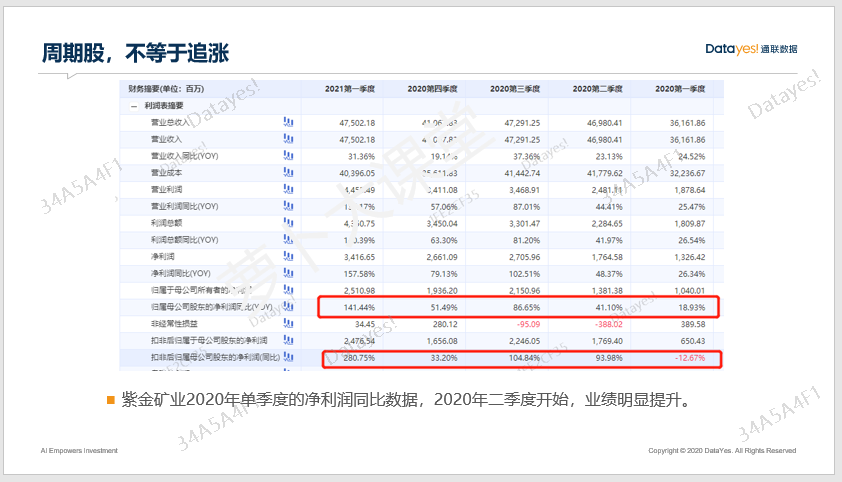

大家好, 欢迎参加萝卜投研精品课.

经过前面两节周期课程的学习, 相信大家对研究宏观, 研究周期都有了一些概念.

为什么, 我们觉得宏观分析很重要? 优势在哪里? 可能很多人还有些糊涂, 今天这节课, 我们教大家用一个指标来判断牛熊市, 再通过另一个指标判断经济周期是否上行, 最后用实际案例给大家演绎一下, 周期股的优势在哪里.

## 通过前瞻性指标, 判断股市拐点

大部分投资者都比较关心, 牛市什么时候来. 研究宏观, 就可以通过各项前瞻性指标帮我们判断出牛市的拐点和熊市的拐点, 整个周期高级营都围绕这部分核心内容展开.

今天就跟大家讲一个指标, 这个指标很重要, 名字叫上证 erp, 中文全称叫上证股权风险溢价率. 先给大家展示一下这个指标和上证指数的走势图.

从 2002 年开始到 2021 年, 我们可以看到, 上证 erp 和上证指数基本上是反着走的. 所以, 这个指标就能作为我们判断牛熊市的一个重要指标.

下面我先给大家拆解一下这个指标的含义.

什么是股权风险溢价率? 听起来又拗口又难懂. 其实是一个对比指标, 通过这个指标告诉你, 当前的股市有没有吸引力.

先简单举例告诉大家, 这个对比是什么意思.

假如你有 100 万元, 你想用来投资. 那你心里肯定要做个选择, 根据你的目标收益率来选择买哪种资产更好. 比如买货币基金呢还是买债券基金? 买主动权益类基金还是买私募基金, 或者自己炒股, 还是买房?

如果当下股市很热, 赚钱效应很好, 你可能就选择炒股或者买主动型基金.

如果当下楼市很热, 一再涨价, 你可能就会选择买房.

如果当下市场萎靡, 为了保值增值, 你可能会选择货币基金或者债券基金.

这其实就是对比, 你做选择的时候在拿预期收益率跟当前的宏观环境做对比. 宏观环境的不同造成了不同的资产面对的风险不同.

那, 当前的宏观环境好不好我们怎么知道呢?

分为两点: 第一点: 股市是不是处于底部拐点; 第二点, 经济环境是不是也处于底部拐点.

在评估股市有没有吸引力的时候, 我们要拿股市的预期收益率跟基准收益率进行比较.

这个基准收益率用什么来定呢? 一般来说, 一个国家的无风险收益率就可以看成是一个基准.

而十年期国债收益率这个指标就常常被大家当作无风险利率, 因为国债大家都知道, 有国家背书, 如果国债违约了, 那基本上是非常罕见的事.

上证股权风险溢价率, 就是用来把上证指数的预期收益率和无风险资产的吸引力进行比较, 差值越大, 就表示越有吸引力, 通常股市这个阶段处于底部.

我们来验证一下是否如此.

2018 年年底, 上证 erp 达到了 6%, 2019 年开年之后股市果然迎来一波牛市.

随后, 上证 erp 又开始下行, 这表示股市的吸引力减弱了, 果不其然, 随后股市就开始滑坡. 这表示 2019 年的春季躁动行情正式结束.

我们再来看 2020 年 7 月, 上证 erp 再度突破 6%大关, 而上证指数也迎来暴涨行情.

为了让大家有一个更直观的分辨能力, 我们给大家进行了划分.

大部分时间里, 上证 erp 都在 2%-6%这个区间里面, 当然也有低于 2%和大于 6%的时候, 但相对比较少.

下面给大家看一张表格.

当上证 erp 处于 2%和 2%以下的时候, 表示股市一般处于牛市顶部了, 这个时候再进场买股票, 性价比很低, 极有可能被套牢.

当上证 erp 处于 3%这个阶段时, 股市也处于牛市高峰期, 这个阶段进场也是十分危险的, 有可能能赚到一些尾部行情, 但心存侥幸的人往往最后会吃亏.

当上证 erp 处于 4%这个阶段势, 是一个中间水平, 股市怎么说呢? 不温不火, 大概率是震荡市, 这个阶段如果你不是对某些行业或者某些企业有十足把握, 最好也不要买股票, 不如投资债券或者买货币基金来得好.

当上证 erp 处于 5%这个区间时, 股市相对于其他资产还是比较有吸引力的, 哪怕买入后没有赚到钱, 只要静静等待, 风肯定会刮过来的.

当上证 erp 处于 6%和以上, 那基本是就是股市处于底部的时候, 是最好的买入时机.

再给大家总结一下: 当上证 erp 大于 5%时, 股市是比较有吸引力的, 证明牛市要来了. 当上证 erp 小于 4%时, 如果你不是投资高手, 建议不要随便买入股票.

PS: 对于高手来说, 任何时候都可以投资股票, 因为不管任何行情, 总有股票是涨的. 但对于大部分人来说, 还是得跟着行情走比较好.

现在你知道了这个指标的含义和使用规律, 最后我们教大家怎么来计算.

公式是:1/上证指数的市盈率\*100%-十年期国债收益率

在萝卜投研上搜索【上证综指: 滚动市盈率】就可以知道上证指数的市盈率是多少啦.

我们以 2020 年 5 月 22 日为例, 上证综指 PE 是 11.59, 当天是年期国债收益率是 2.61%.

根据公式我们可以得知上证 ERP=1/11.59\*100%-2.61%=6.01%

大于 6%, 来到了击球区, 也就是说, 2020 年 5 月底, 是一个大好时机, 股市即将上行.

除了这个指标, 我们还得结合经济周期, 看看经济有没有复苏的迹象, 否则这样的股市上行机会可能不能持久.

通过阅读研报和相关前瞻性指标我们可以得知, 2020 年 5 月, 经济也来到了底部拐点区域, 也即将面临复苏.(涉及到的指标过多, 相关内容周期高级营会为大家展开)

经济复苏指标结合上证 erp 指标都显示出股市在底部的话, 我们基本可以判断, 牛市真的要来了!

## 可以在短期内, 迎来戴维斯双击

假设, 你已经搞懂了判断牛市拐点的逻辑和规律, 那么牛市来了, 我们买什么比较好呢? 既有确定性, 又可以在短期内提高收益率, 想想就美滋滋.

还是用案例和指标来给大家展示.

既然经济复苏了, 工业品的价格肯定会涨, 而现货铜的价格也涨了, 站在 2020 年 5 月这个时间节点上, 我们如果买入 A 股市场里生产铜的企业, 股价必然也会迎来大涨.

逻辑有两个:

经济复苏, 工业制造业需求大增, 对上游原材料铜的需求也随之上升, 那么, 铜企的业绩肉眼可见会得到提升, 也就是我们说的"确定性".
牛市里, 市场整体估值水位上升, 涌入的资金变多了, 而且短期内的确定性被所有人看见了, 情绪会上头, 大量的投资者买入这些股票, 估值得到大幅提升.
两个逻辑合在一起就形成了短期内的戴维斯双击, 也就是业绩和估值双提升的大行情.

我们来看看, 2020 年 5 月, 相关的生产铜的企业是不是有一段这样的大行情.

云南铜业、紫金矿业和江西铜业这几个生产和加工金属铜的代表性企业, 在 2020 年 5 月底到 2020 年 8 月初这短短两个多月的时间里, 都迎来了短期的一波大行情. 其中, 涨幅最少的江西铜业也有 30%, 多么惊人, 多么有魅力的周期股.

可能有人会说, 这三家企业, 后面还涨了很多. 是的, 我们只讲了最简单的, 牛市刚来适合买什么, 实际上, 这一类大宗商品股票在股市的繁荣期, 涨幅往往更大. 这些理念, 也会在周期股的进阶训练营中给大家剖析.

通过观察, 你可以得知, 这三家生产铜的企业, 都在 2020 年 10 月迎来了第二次大涨行情. 这是有共通性的, 这些共通性就来源于底层的周期股投资逻辑.

而且, 周期股是依附于基本面投资这个大框架的, 是由业绩作为支撑的. 以紫金矿业为例, 2020 年二季度开始, 净利润增速明显得到提升, 一季度才不到 19%, 二季度已经提高到 41%, 三季度更是突飞猛进提升到 86%.

所以, 周期股, 确定性高、短期估值溢价也高, 是真正的戴维斯双击的大机会!

## 总结

以上就是宏观投资的一个大致逻辑, 我们需要做的就是找到周期的底部拐点, 搞清楚哪些行业会受益, 哪些行业弹性更大, 行情会维持到什么时候, 应该在什么阶段进场和离场. 知道了这些, 相信你就比别人多了一份胜算.

大师姐为你做总结:

1、上证 erp 这个指标和宏观经济指标都处于底部的时候, 表明牛市即将到来.

2、投资周期股, 会提高资金利率用, 往往可以在较短的周期内获得戴维斯双击的机会.

