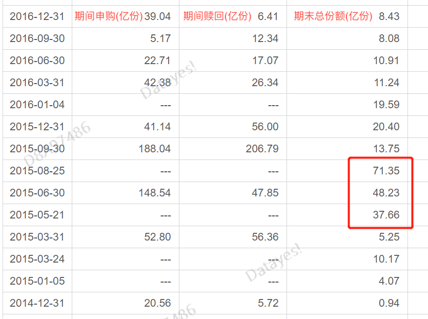

近年来, 指数投资蔚然成风, 在各类财商教育的课程里以及很多新奇的行业指数进行路演推广时, 我们听到的几乎都是指数型基金多么多么好. 但每当有黑马基金经理或者明星基金经理进行新基金的募集时, 优秀的基金经理总是吊打指数基金.

实际上, 究竟是指数型基金更好还是主动型基金更好呢?

从投资性价比角度来看的话, 当然是主动型基金更好.

## 从长期回报率来看, 主动跑赢被动

目前支持指数型基金的人有一个广为流传的说法, 就是"巴菲特也推荐指数型基金". 这句话是真的吗? 是的. 但他有一个重要的前提条件. 只适用于成熟的、股市不断往上走的股票市场.

我们来看一组数据, 我给大家统计了一下, 从 2003 年 1 月 1 日开始截止到 2020 年 12 月 31 日, 股票型基金和偏股型基金的平均累计收益率为 1024%, 也就是说, 17 年的时间涨了 10 倍.

而上证指数如何呢?17 年的时间上证指数总共涨了 2.62 倍. 对比结果还是很明显的, 主动型基金的收益率几乎是指数型的四倍.

所以, A 股市场中的指数型基金可能没有境外成熟资本市场那么好, 反之, 我们的主动管理型基金也不像境外成熟市场那么差.

为什么在美国指数型基金能跑赢主动型基金? 主要有三个原因:

1. 美股十年长牛，指数一直往上走，所以过去十年任何时间节点买入指数基金都是赚钱的；
2. 美股市场里 75%以上是机构投资者，相对于 A 股来说，市场有效性更高，主动型基金想取得阿尔法（超额收益）比较难；
3. 指数型基金的申购赎回费率更便宜，相当于提高了收益率。

对于我们大 A 散户来说, 情况就不一样了.

首先, A 股牛短熊长, 适合买入指数型基金的机会并不多, 而且很长时间里可能是亏钱的.

其次, A 股市场里散户居多, 相对于美股来说, 有效性不高, 这就给了主动型基金经理提高超额收益的机会, 通过基金经理的人为选择更容易战胜市场.

最后, 因为在 A 股市场, 主动型基金是大幅跑赢被动基金的, 所以赚取的收益率早已抵消了超出指数基金的那一丢丢申购赎回费用.

一句话概括: 在美股市场, 是基金经理和指数之间的斗争, 所以基金经理容易输; 在 A 股市场, 是基金经理和散户之间的斗争, 所以基金经理容易赢.

总而言之, 指数基金在 A 股市场有些水土不服, 水土不服的底层原因是什么呢?

主要原因是美股长牛, 指数长期往上走, 所以任何时点买入指数, 都能赚钱, 持有体验也特别好. 这种钱也是比较好赚的, 指数涨, 我们赚钱; 指数跌, 我们亏钱. 我们跟指数是同涨同跌的.

交给基金经理来管理, 也就是买入主动型基金的时候, 我们是为了赚取超额收益. 超额收益是什么意思呢? 就是基金经理的个人能力. 通过他的能力赚取超越大盘波动的钱.

不买指数, 买主动型, 肯定是觉得基金经理能力更优秀, 所以一个优秀的基金经理应该赚大盘波动+超额收益的钱.

但是, 在美股市场, 因为指数涨得太好了, 几乎不怎么跌, 那对基金经理的能力要求就太高了, 你哪怕跟指数打个平手, 也不能说明你的能力强, 你得跑赢指数才行, 否则要你何用?

我们选人, 不就是选则相信一个人的专业能力能给我们带来更多的收益嘛. 对不对?

但是在 A 股, 那就完全不是这样了. 道理很简单啊, A 股指数常年波动, 跟着指数走, 长期下来你可能是亏损的. 所以买指数基金择时特别重要, 一个不慎就是常年亏损, 这个时候我们就需要借助别人的能力, 也就是基金经理给我们带来超额收益.

## 从选基难度来看, 主动易于被动

A 股市场除了环境更适合主动基金之外, 主动基金还有别的优势哦. 大部分人买指数基金的理由就是好挑选, 简单, 不需要动脑筋. 其实并不是.

指数基金对择时和选择板块的能力要求很高, 可以说难于主动型基金.

### 第一点、指数型基金数量也不少

指数型基金是一个很笼统的概念, 我们可以根据不同指数包含的股票的广泛性将其分为宽基和窄基这两种.

宽基指的是覆盖股票种类广泛包含各行各业的指数型基金, 其中具有代表性的有上证 50 指数、中证 500 指数、沪深 300 指数、中小板指数、创业板指数、科创板指数等等.

窄基主要指的是行业、主题基金. 相比宽基, 窄基的行业选择更为集中. 其中有代表性的有中证医药指数、中证消费指数、中证白酒指数等.

这些指数型基金加在一起的数量并不比主动偏股型基金少哦, 据统计, 指数股票型基金大约有 2800 多只, 而主动偏股型基金是 3200 多只, 所以并不存在选择指数就简单一些的道理.

### 第二点、指数型基金对择时要求很高

如果有人说, 指数基金是很多, 但是宽基指数不多啊, 也就几百只难道不比主动偏股型基金数量少很多吗?

是的, 宽基数量确实不多, 但是投资宽基有一个最大的问题, 就是投资者需要具备很强的择时能力. 因为 A 股市场不能做空, 所以买哪个指数意味着你得从宏观趋势中判断出大方向, 你得确定这个指数后面是上涨的, 这种判断能力丝毫不亚于挑选出一个靠谱的基金经理.

像 2021 年上半年就属于上蹿下跳的震荡市, 1-3 月份沪深 300 明显跑赢其它指数, 而 4-6 月, 创业板又明显跑赢其他指数. 如果你能精准判断出前面三个月沪深 300 比较厉害, 后面 3 个月创业板比较厉害, 你已经战胜这个市场里的绝大多数人了.

我们来看一组数据, 2015 年到 2020 年这五年, 主动型股票和混合型基金的平均收益率是远远高于上证指数收益率的, 而回撤呢也小于上证指数.

这说明什么, 说明基金经理的能力被放大了. 涨得时候超过指数, 跌的时候小于指数, 这就是超额收益, 这就是能力啊.

所以, 在 A 股市场里, 主动肯定是好于被动的. 最本质的原因在于 A 股的指数上蹿下跳, 极不稳定, 择时对普通投资者来说不容易.

有的学员可能会说, 择时容易啊, 熊市买就行了. 这里有两个问题, 熊市里你还敢不敢买, 熊市里买哪个指数更好? 这些心理问题和决策问题可不简单哦.

下面, 请看一组案例.

这只成立于 2007 年的沪深 300 指数基金, 14 来累计收益率是不到 20%, 主要收益还基本都来自 2020 年. 也就是说, 前面十几年都是负收益, 年化收益率只有 1.34%, 定存银行都比这个靠谱.

为什么会这样呢? 因为它是在牛市顶峰发行的. 也就是说, 投资指数基金, 一个不慎买在高点需要十几年才能回本.

所以, 投资指数基金, 需要我们对后市行情有比较强的判断能力. 这其实比你选择主动型基金还要难.

### 第三点、行业、主题指数波动较高

除了宽基, 还有很多窄基, 主要是一些行业或者主题型的基金. 对新手来说, 这也很难选择. 因为这要求你对某个行业的未来走势有精准的判断.

同样的, 给大家看一组案例.

像这只中证上游资源产业指数基金, 最大回撤是 53.13%, 只要行业跌, 它就跟跌, 而且跌幅很大. 时间拉长看, 十一年来的累计收益才 27.8%, 年化收益率仅为 2.54, 存银行都比这个强.

也许会有人说, 那是你没选对行业, 你选医药白酒新能源一定没事.

好的, 我们来看看中证白酒指数, 2012 年到 2014 年这两年多的时间, 因为白酒受到"三公消费"政策影响, 指数从 3900 多点跌到 1700 多点, 直接腰斩.

我们再以汇添富中证新能源汽车产业指数(LOF)这只基金为例, 看看新能源是不是就一定强. 这只基金成立于 2018 年, 可以看到 2018 年 7 月到 2020 年 7 月这两年时间里, 收益率基本都是负的. 真正开始起来是在 2020 年 7 月之后(这一轮牛市的起点), 即便是这样, 在行业遭遇回调时, 依然有接近 30%的巨大回撤.

回撤大, 代表基金的波动率很大, 波动率大意味着持有体验很差. 每一个投资者, 理想中的投资体验都是买入之后一直涨, 而不是买入之后经历很大的亏损或者很长时间的亏损.

拿上面的白酒指数和新能源汽车指数为例, 买入时机不对, 就会遭遇巨大的波动, 这个时候就得问问自己了, "如果是我持有这只基金, 我能拿得住吗?"

我相信答案绝大部分时候都是否定的, 毕竟这是对人性的考验.

如果能做到预测市场风格、预测即将爆发的行业, 预测指数涨跌, 那 A 股投资就会变成一台印钞机, 投资就不存在牛熊周期的影响了, 怎么投都是很赚钱的.

事实就是, 即便从三年、五年的公募基金收益冠军来看, 也做不到这样的预测.

我们再来看看投资者的交易心里. 这只基金是创业板 ETF, 大家可以看到, 在 2015 年那一轮牛市顶峰, 大家疯狂申购. 牛市破灭之后, 又疯狂赎回.

这样的情形在反复上演.2019 年有一波春季躁动行情, 于是大家又开始积极申购了. 没想到春季躁动行情维持到 4 月就结束了, 于是大家又纷纷赎回. 到了 2020 年 6 月, 感觉牛市又来了, 再度热情申购.

结果如何相信大家都看见了. 所谓的低估时买入, 高估时卖出, 根本做不都啊.

为什么呢? 因为反人性的操作会让持有体验比较差, 大部分人是没办法忍受亏损的, 尤其是比较长时间的亏损, 只要亏了就难受, 最后都选择割肉.

申明: 没有说指数基金不好的意思, 也不是 diss 指数基金, 主要是作为新手, 在决策层面上我们肯定是弱者, 这种对市场风格和行业景气度的预测是很难的, 再加上指数长期长窜下跳, 带给我们的持有体验可能不太好, 所以, 不建议没有投研基础的人买指数基金, 并不是说指数基金就不值得买.

## 总结

对于小白基民或者认知不够深的基民来说, 选对行业, 择好时机, 绝不是一件简单的事. 有点风吹草动, 或者水下的时间比较长, 可能早教割肉走人了, 追涨杀跌也是基民最重要的风格之一, 这也是为什么基金赚钱基民却不赚钱的原因.

指数基金必然有自己的优势, 但对于小白基民们来说, 如果只是觉得指数基金简单、不用操心、可以轻松赚钱, 抱着这样的想法就粗暴地买入, 就是进入了误区.

你可能想说, 行业基金我把握不准, 我只在低估时买入宽基指数就行.

问题来了, 如果指数持续向上, 那么你永远等不到低估的时候, 如果指数上蹿下跳, 大部分时候都在水下, 你又耐不住寂寞, 还没吃上肉肯定就割了.

所以, 在选择基金时, 千万不要图省事, 觉得不动脑就可以把钱赚了, 天底下肯定没有这样的好事.

那, 指数基金就没有一点优势吗? 当然不是. 指数基金绝对有它的优势, 前提在于你已经拥有了比较完善的基金投资的思维, 建立了整体框架, 知道目前买入什么样的指数基金是比较好的. 有了这些知识之后, 再选择构建适合的基金组合才能长期战胜市场.

下节课, 会给大家讲解新手应该买什么样的基金比较好, 以及我们用一个指标帮大家锁定主动型基金, 简单实用哦~~~

