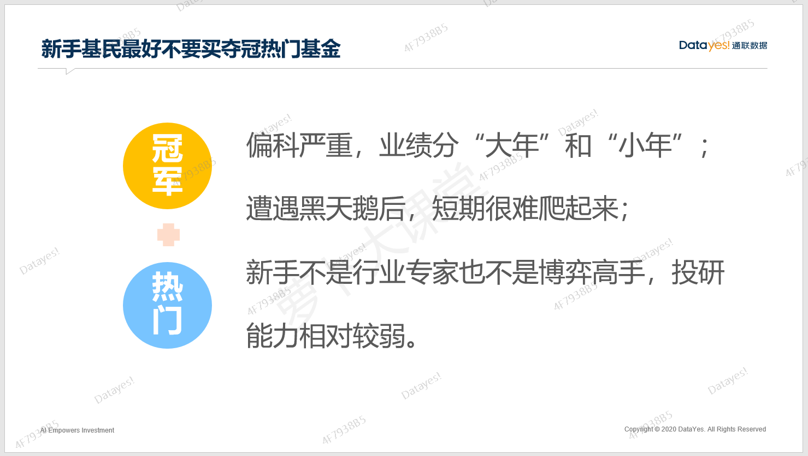
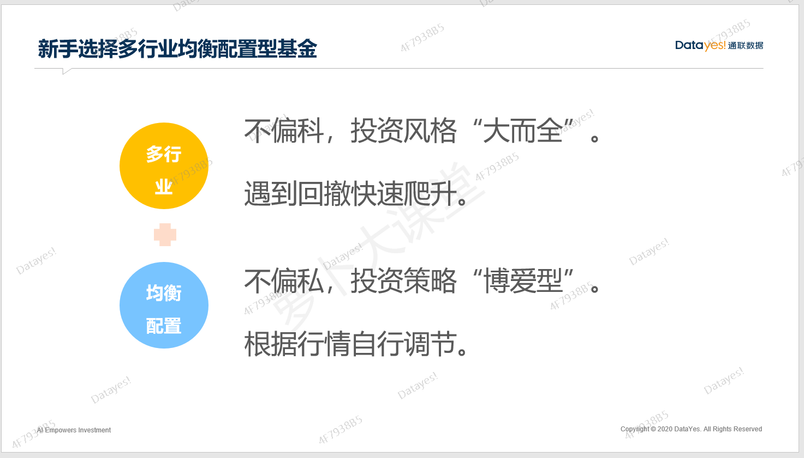
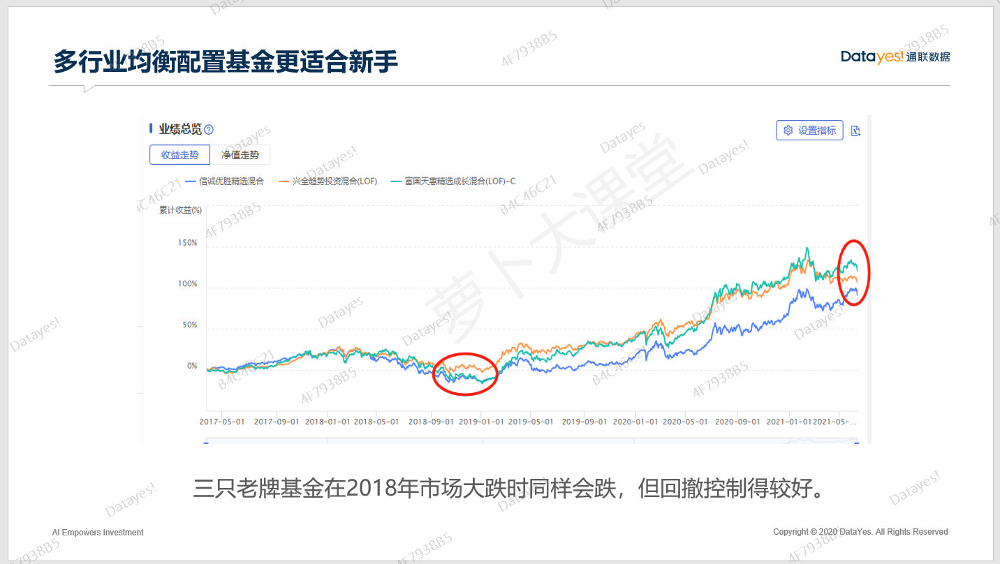
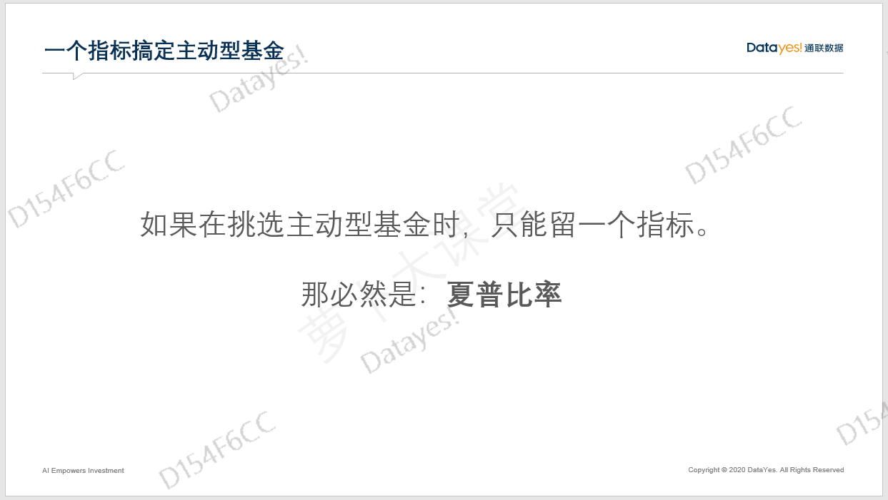
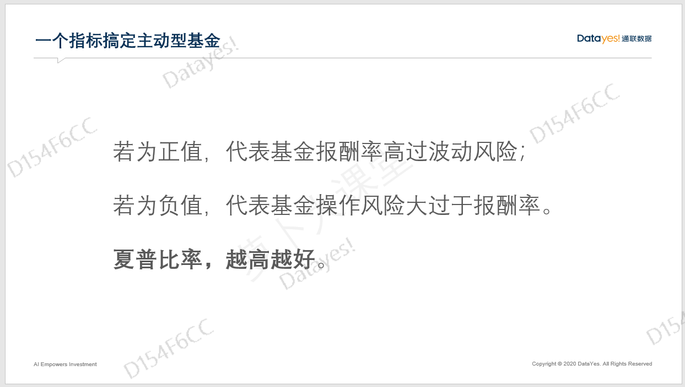
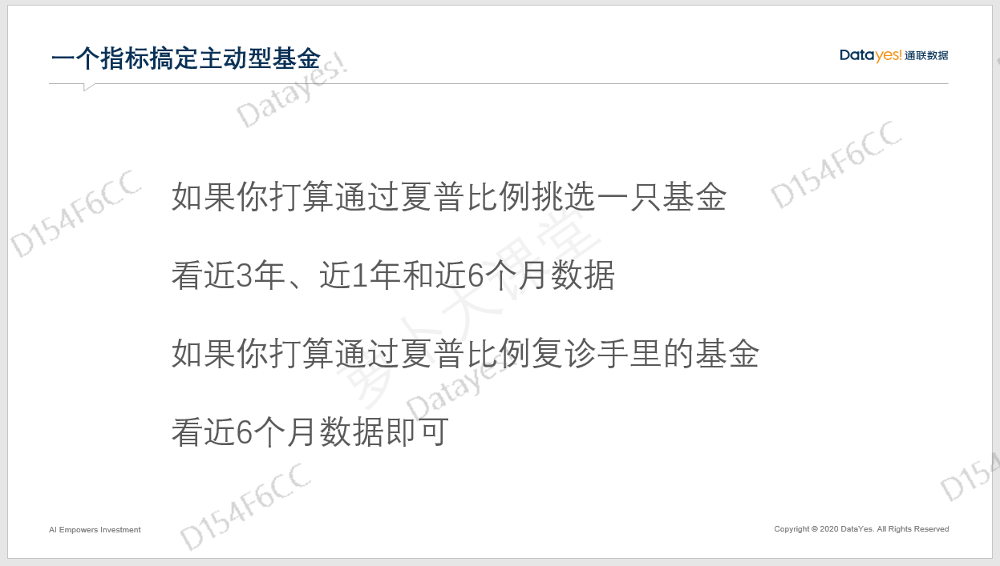
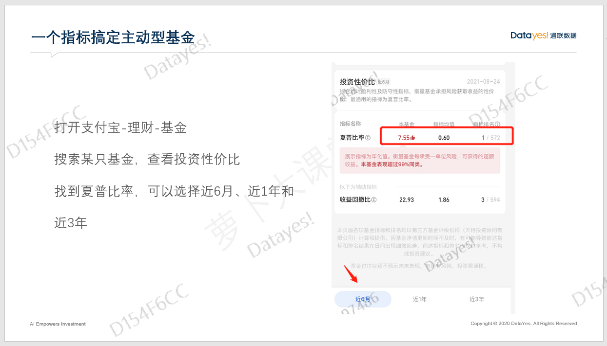
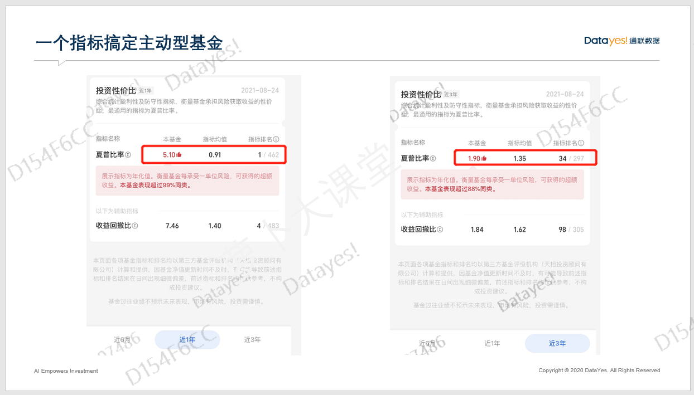
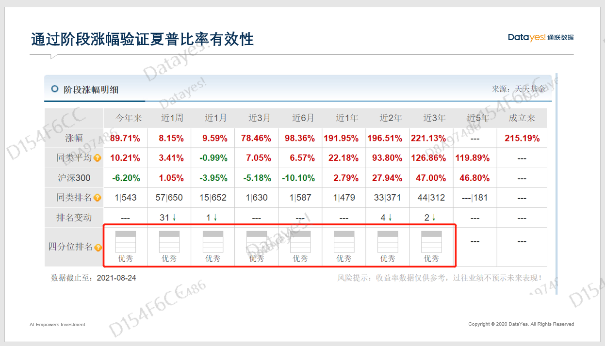
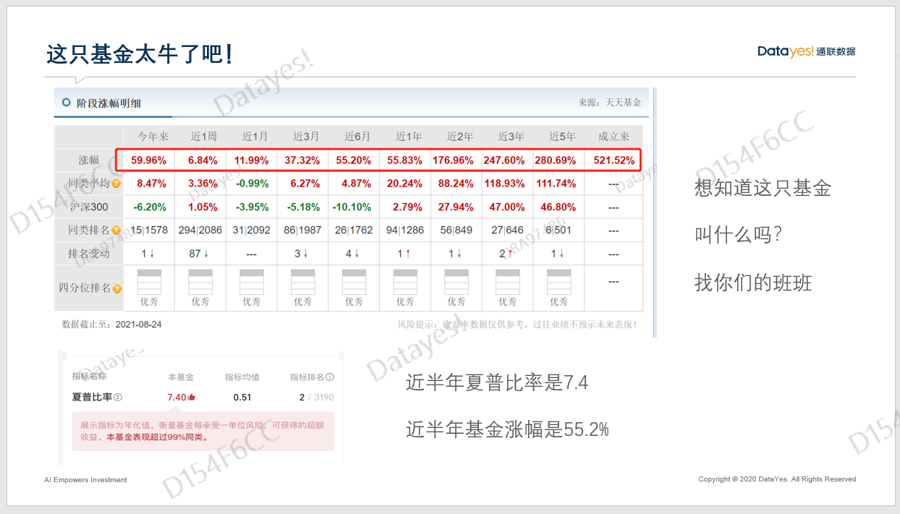

大家好, 欢迎来到萝卜投研精品课.

上节课, 我们讲了指数型基金的一些优缺点, 这节课我们来讲讲作为新手基民或者常年不赚钱的基民, 我们应该买什么样的基金比较好.

## 新手该选择多行业均衡配置基金

首先, 我们再重申一下我们的观点: 指数基金不是不能买, 是不可以简单粗暴不具备专业知识就瞎买. 而且, 投资指数也不见得比选择主动偏股型基金简单.

其次, 新手应该选择什么样的基金呢? 大师姐建议大家根据自己的风险承受能力和预期的收益率构建属于自己的基金组合, 当然, 构建基金组合不是一件容易的事, 具体方法我们在基金进阶营里有讲述.

作为新手, 如果你只能买一只基金, 那么我会推荐大家买多行业均衡配置的偏股型基金.

相信大家或多或少都听过一两位比较有名的基金经理, 比如易方达的张坤、广发的刘格崧、景顺长城的刘彦春, 都是这两年的大热门.

一般来说, 热门的基金经理, 尤其是年度冠军或者黑马一般都是"偏科"的人, 像张坤和刘彦春风格偏向大消费, 尤其是白酒和医药, 而刘格崧偏向科技股. 所以, 业绩也分"大年"和"小年".

这一类基金经理管理的基金, 大师姐不建议新手买入. 原因很简单, 这和判断指数基金一样难. 普通基民的投研能力较弱, 无法知道白酒什么时候会涨、医药什么时候会涨.

大多数的基民注定不是行业专家, 注定不是博弈高手, 所以, 选择指数基金, 尤其是行业主题基金, 对我们来说是很难的, 而选择主动型基金就是来借力的, 借助的就是基金经理慧眼识别价值与获取价值的能力.

作为新手或者小白, 在不要错误估计自己能力的前提下, 选择多行业均衡配置基金比较好.

像很多老牌基金经理, 担任基金经理都在 10 年以上, 比如富国的朱少醒、兴全的董承非、易方达的冯波、中欧的周蔚文、睿远的傅鹏博, 他们的投资组合里一般不局限于某一个或某两个行业, 长期以来坚持多行业均衡配置.

## 为什么要选择多行业均衡配置基金?

均衡配置的好处是什么? 打个比方, 我们上学的时候应该都有经验, 往往班级里的前几名都是各科均衡发展的同学, 而偏科严重的同学, 哪怕某一科每次都是第一名, 往往也跟总成绩前几名无缘.

所以, 对我们普通基民来说, 我们要找的就是不偏科、不瘸腿的优秀基金经理, 也就是选择多行业均衡配置的主动型基金. 这一类基金一旦遇到系统性风险, 基金经理会快速调整策略, 来应对市场, 不会因为单押某个赛道而遭遇黑天鹅.

一个行业突然遭遇黑天鹅事件, 跌去 10%甚至更多是常有的事. 面对利空消息, 之后是走是留, 普通投资者很难做决策. 选择多行业均衡配置的基金就基本上没有这些顾虑了, 因为优秀的基金经理会帮我们做好决策.

下面给大家看一组案例, 看看优秀的多行业均衡配置基金是如何在大跌后快速调整的.

像这几只老牌优秀的多行业均衡配置的基金(信诚优胜精选混合、兴全趋势投资混合、富国天惠精选成长混合)虽然在市场大跌时, 净值也会下滑, 但是长期来看, 回撤控制得很好, 基金经理会随时调整策略, 无需我们担心.

选择多行业均衡配置的基金, 我们不用当行业专家, 根据 A 股市场整体的估值情况、赚钱的概率和赔率去制定投资决策就可以了.

而且, 这种多行业均衡配置的基金一般在配置行业里的个股时, 会优中选优, 选出最好的来. 比如选择白酒的时候, 可能就挑茅台和五粮液, 选择地产的时候就挑万科和保利, 选择工程机械的时候就挑三一重工、中联重科. 会把一些潜在的可能会暴雷的, 或者业绩不稳定的小公司和差的公司排除掉. 这么做, 保证了基金长远的价值最大化.

不过, 多行业均衡配置的基金一般很难出爆款或者拿冠军, 拿冠军的一般都是行业主题基金, 因为盈亏同源, 风险高收益相对也高. 但多行业均衡配置的基金一般是长跑健将, 很多优秀的基金经理都拿到了金牛奖、晨星奖等重磅大奖.

不少坚持多行业均衡投资的老将、名将已经成为了共识性的基金投资选择, 基金投资新人选择了解他们、学习他们、信任他们是难度较低的投资方式, 但为了谋求短期的暴涨, 很多基金投资新人都去选择挖掘行业主题, 当前什么最热就投什么, 最后的结果往往是基金赚钱, 基民不赚钱.

## 一个指标搞定主动基金

当我们挑选出了多行业均衡配置基金以后, 又该选谁呢? 相信大家都有这个疑问.

如果你问我, 挑选基金只能看一个指标我选谁, 那一定是夏普比率.

夏普比率(Sharpe Ratio)是衡量基金风险调整后收益的指标之一, 由诺贝尔经济学奖得住威廉·夏普提出, 夏普比率反映了基金承担单位风险所获得的超额回报率, 即基金总回报率高于同期无风险收益率的部分.

有点难懂吧? 简单理解就是用收益除以风险, 在风险一样的前提下, 肯定是收益越大越好. 所以这个比率也是越大越好.

夏普比率越高, 基金承担单位风险得到的超额回报率就越高. 夏普比率代表投资人每多承担一分风险, 可以拿到几分报酬.

若为正值, 代表基金报酬率高过波动风险; 若为负值, 代表基金操作风险大过于报酬率.

虽然夏普比率越高越好, 但是没有一个阈值来确定说, 大于多少是好, 小于多少是不好. 主要是用来对比的. 这个对比是跟同类型的基金对比哈.

比如偏股型的基金和偏债的基金就不能直接用夏普比率来对比, 因为不同的基金所对应的业绩基准不同.

除了基金类型不同不能对比以外, 基金风格不同也不能对比, 我们不能拿主要投资大蓝筹股的基金来跟投资中小盘股的基金比较.

关于夏普比率, 如果你是打算买入一只基金, 那我建议看一下近 3 年、近 1 年和近半年的夏普排名情况. 如果你是持有一只基金, 定期【复诊】, 那看近半年的数据就可以了.

夏普比率这个数据在哪里查看比较好呢? 支付宝上是比较全面的.

打开支付宝里面的理财按钮, 找到基金, 就可以搜索你想要查看的基金啦. 下面我们来教大家实操一遍.

像这只基金近 6 个月夏普比率高达 7.55, 同类排名第一, 而这个指标的平均值才 0.6, 优秀太多了.

我们再看看近 1 年和近 3 年的情况. 近一年夏普比率是 5.1, 近三年是 1.9, 都远远高于均值.

我们再看一下阶段涨幅的情况. 来看看这只基金是不是像我们想的那样优秀.

打开天天基金网, 找到这只基金, 查看【阶段涨幅】

从阶段涨幅可以看到, 这只基金近三年、近两年, 近 1 年, 近半年都属于优秀.

通过夏普比率找到好基金就这么简单.

在这里呢, 我为大家挑选了一只比较好的多行业均衡配置基金. 近半年夏普达到了 7.4. 验证一下, 近半年的收益是不是很棒.

近半年涨幅是 55.2%, 无话可说是不是?

以上就是今晚的直播内容, 想知道这只基金是什么吗?

答案: 交银趋势混合

