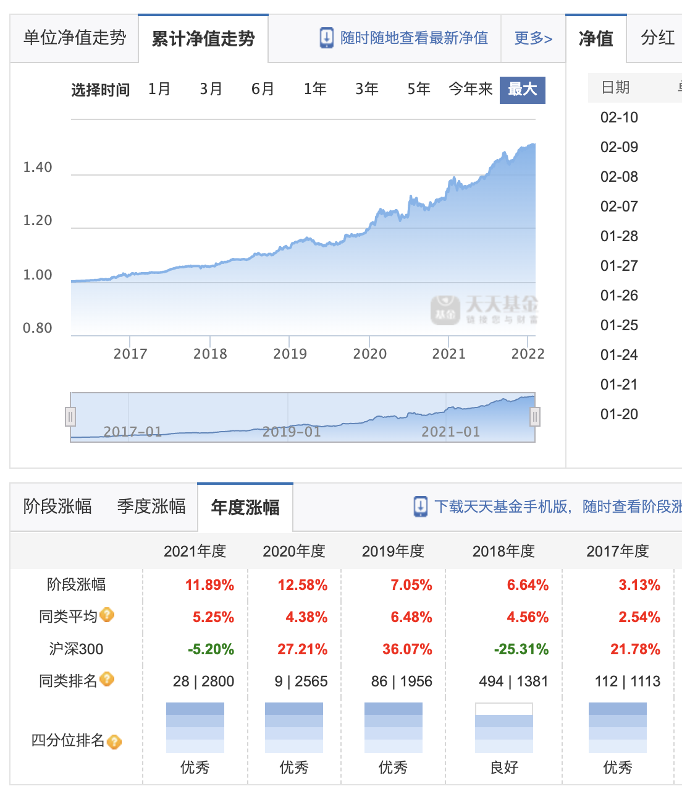

详情可以查看课程中的筛选条件: [长期纯债基金](https://golden-axe.vercel.app/pages/ab3bd8/)

1. 近 3 年的总收益率为 20% 以上
2. 基金规模是 5 亿~50 亿
3. 基金经理任职天数不得少于 3 年

以下是对筛选条件增加的优化

首先在天天基金的基金排行中设置如下筛选条件:

债券型-长期纯债-近 3 年收益倒序

筛选出如下结果:

先看第一个泰达宏利溢利债券A(003793), 可以看到近 3 年收益为 156.58%, 但近 1 年和近 2 年只有 4% 和 5%, 这种明显就是由于巨额赎回的原因, 导致基金净值和阶段涨幅出现异常波动

我们点进去可以看到确实有这个公告:

看累计净值走势也可以看到有一个很明显的陡然上升

看阶段涨幅发现也是 "一般" 居多

而且基金规模是 2.78亿元（2021-12-31）, 经理任期也不够 3 年

所以这种我们直接 pass 掉

看第二个华润元大润鑫债券C(006471), 也可以看到和第一个相同的问题: 巨额赎回, 而且阶段涨幅还有 "不佳", 规模符合, 但经理任期不符, pass

再看第三个金信民兴债券A(004400), 基金规模：27.93亿元（2021-12-31）, 经理任期3年又284天, 按课程筛选方法这个基金就符合了, 但这个也是巨额赎回的问题, 而且还是两次

可以看到这两次巨额赎回所在的年度涨幅都是 "优秀", 但其余年份却 "一般", 所以 pass

再往下看几个都有巨额赎回, 一律 pass

直到金鹰元祺信用债(002490), 终于没有巨额赎回了, 而且规模和经理任期也都符合, 基金评级还是五星

看累计净值走势和年度涨幅也很不错

虽然累计净值走势波动有点大, 但很快就会创新高, 年度涨幅也是 "优秀" 居多

故买入

沿次方法依次筛选即可
