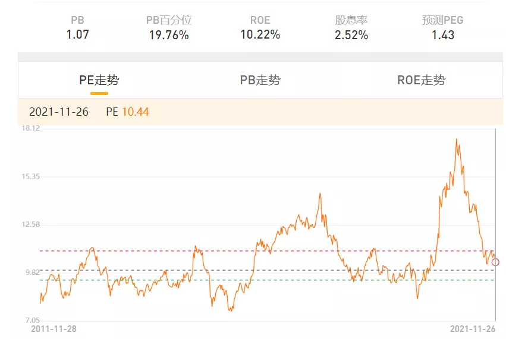

最近看到有人在推广 [中欧港股通精选一年持有混合 A(013991)](http://fund.eastmoney.com/013991.html), 感觉最近港股跌了很多了, 现在买入是不是算是相对底部的位置, 可以享受买入后估值修复的上涨价值

初始准备买入 1w, 后考虑初次尝试, 也没有做太多功课研究, 故降低为 5k 试水

## 买入理由

1. 与 A 股相关性低一些, 可以构建一个波动更低的组合.
2. AH 股溢价指数 145 点, 高于近 10 年 90%以上水平(指数越高, 代表 A 股相对 H 股越贵)
3. 9 月回购公司数量十年来第三高, 9 月回购金额十年来第三高, 被视为港股已来到底部区间信号
4. 该基金经理目前管理的港股基金跑赢基准, 并且在今年行情不好的情况下还是正收益
5. 在天天基金网上对比过别的基金, 目前管理的基金阶段涨幅略好于对比基金

## 卖出条件

暂无, 以后补全

以下为看到的信息:

[发现一个港股老司机, 要不要上车?](https://mp.weixin.qq.com/s/akegG5CIFKasZ2FIetgbOQ)

陆股通开通那么多年, 其实公募基金中真正擅长和专注港股的基金经理并不多, 做的好的更少.

中欧基金的罗佳明是港股投资中非常亮眼的一位, 这两年港股表现不佳的情况下, 依然创造了明显的超额收益.

## 能不能投港股

不过, 在面对一只港股基金的时候, 首先要搞清楚——能不能投港股?

投资港股, 是 hard 模式:

(1)机构多、散户少. 机构持股占比约 50%, 交易额占比达到 80％(数据来源: 海通证券). 机构投研水平更高, 还有各种对冲基金、做空资金以及股东高位减持. 聪明人太多, 没什么割韭菜的机会, 反而容易被割.

(2)供给多, 需求少. 港股上市数量和市值都超过 A 股的一半, 然而日均成交额大概只有 A 股的五分之一. 也就是说, 股票的供给>资金的供给.

然后, 港交所还在大力 IPO, 过去 12 年港交所融资额有 11 年是全球前三名, 7 年是第一名, 今年也是前三.

(数据来源:wind)

好处是可投资的股票变多了, 但也导致供过于求, 股价上不去. 所以港股的现状是股多钱少、流动性差, 一是造成个股长期的分化, 二是增加了犯错成本(买错了很难卖出).

那么, 港股是不是就完全没机会了呢? 也不是.

我们知道, 价格最终还是取决于价值而非供给. 我们看到港股过去十年涨幅前十大公司, 这些公司最低都有 30%以上的年化涨幅, 10 年至少 14 倍.

近 10 年, 港股涨幅超过 10 倍的公司有 386 家, 而同期 A 股仅有 163 家!(数据来源:wind, 统计区间 2011/11/22-2021/11/22)

也就是说, 港股其实还是有很多投资机会, 如果做的好, 一样可以取得优秀的回报. 钱少股票多的另一面, 也会有更多便宜价格买入好资产的机会.

此外, 港股的投资价值在于:

① 有许多 A 股没有的新兴行业, 比如互联网、生物医药、物业、教育、电子烟、奶茶、博彩等.

② 估值更低, 波动更小.

③ 与 A 股相关性低一些, 可以构建一个波动更低的组合.

④ 内资比外资更了解中国, 有机会创造更多超额收益.

这么说来, 港股还是可以投的, 只是选股和选基都更难, 要尽可能找到一个比较强的基金经理.

接下来, 给大家说说, 被称为"港股老司机"的基金经理——中欧基金的罗佳明.

## 基金经理基本情况

罗佳明是深圳人, 高考考入香港大学, 大学期间就喜欢炒股, 本科硕士以及毕业后的几份工作都在香港, 在香港生活了 18 年.

他曾在香港毕马威会计事务所及香港德勤财务, 从事审计及并购交易咨询业务, 之后在工银国际控股、野村国际和汇丰银行担任过卖方研究员.

对比大陆的基金经理, 他对香港市场更加熟悉和擅长. 对比香港本地投资者或外资, 投资中国企业时, 罗佳明更熟悉大陆的水土风情.

虽然在中欧基金管理公募基金才 2 年多, 不过他之前就在银河国际资产管理担任过 3 年投资经理(2015.02-2018.04), 主要投向港股, 其实投资经验也比较丰富了.

说罗佳明是"港股老司机", 并不为过.

## 业绩情况

我们都知道, 港股近几年一直跌跌不休. 打开港股近 10 年的走势, 可以看到, 恒生指数已经跌到了 2014 年 8 月的位置.....

回顾近几年, 主要有这么几轮下跌:

2018 年: A 股去杠杆熊市, 香港市民逛街、中美猫咪战

2019 年: 电信、华为、中芯国际等科技公司被美国打压

2020 年: 国内疫情, 海外疫情, 银行让利

2021 年: 春节后核心资产下跌, 政策影响互联网、创新药和教育等行业, 恒大爆雷, 疫情变异

2019 年 7 月 2 日罗佳明开始管理中欧丰泓沪港深, 截止 2021-11-26, 收益率为 80.6%%, 同期恒生指数涨幅为-14.32%, 沪深 300 涨幅为 23.44%(来源 wind, 截至 2021/11/26).

从业绩来看, 罗佳明确实是位"港股老司机".

下图罗佳明管理中欧丰泓沪港深以来的净值曲线(红线), 相对恒生指数的累计超额收益(黑线).(数据来源: 韭圈儿 APP)

中欧丰泓沪港深尤其在下跌市场表现优秀, 今年港股市场整体表现不佳, 但中欧丰泓沪港深逆势上涨, 截止 2021-11-26, 收益为 11.82%.(数据来源:choice)

## 定量分析

罗佳明从 2019-7-2 开始接任中欧丰泓沪港深, 目前只管理这一只基金, 2021Q3 规模 49.82 亿元.

### 1、当前持仓情况

2021Q3 持仓, 行业比较均衡, 市值偏大盘, 前十持仓平均市值 10858 亿. 平均 PE 为 27.5, 平均 PB 为 5.5, ROE 为 20%, 呈现出低估值+高质量的特点.(数据来源: 基金定期报告)

### 2、历史持仓情况

历史持仓整体上是行业分散, 个股较为集中.2021Q3 集中度为 60.4%, 平均为 56.6%.

历史持仓数一般在 30 只左右.

港股比例常年维持在 70%-80%, 同时配置部分 A 股.(数据来源:choice、基金定期报告)

### 3、换手情况

任职以来平均换手率为 133%, 低于市场平均水平, 属于买入+持有型.

(数据来源: 天天基金网, 换手率仅供参考)

持有时间较长的重仓股腾讯控股、立讯精密、舜宇光学科技、海底捞、中升控股、招商银行.

### 4、仓位变动

一直保持了高仓位运作, 不怎么择时. 其中, 港股仓位保持在 60%-80%之间.2021 三季报为 72.6%.

(来源: 天天基金网)

### 5、持有人结构

罗佳明接手以来, 逐渐得到了机构的认可, 机构占比持续提升, 2021 年中报显示, 机构占比高达 74%.

(来源:wind, 截至 2021/9/30)

## 投资理念

港股投资者以机构为主, 如果没有一套过硬的投资框架, 很难站得住脚.

罗佳明的投资理念是价值投资, 自下而上选股, 长期持有优秀公司, 分享企业的价值创造.

### 1、自下而上选股:"集邮式"投资, 重视管理层

罗佳明形容自己的投资理念是"集邮式投资, 收集长期好生意". 寻找那些自身内涵价值随时间以复利增长、最好能持续时间长的好生意、好公司.

他眼中的好公司主要有以下特点:

(1)有出色能力、诚实、勤奋的管理层, 优秀的企业文化;

(2)容易赚钱的商业模式, 简单易懂, 持续的获利能力, 稳定的现金流;

(3)独特的核心竞争力, 拥有较高的进入门槛(护城河), 护城河随着时间推移越来越厚.

其中, 他尤为注重对公司管理层的研究, 认为企业家精神与组织活力是投资逻辑核心, 喜欢那些"智者"管理层. 在研究中, 罗佳明会通过调研、访谈、搜索等各种形式, 正面和侧面了解管理层.

他比较重视 ROE, ROIC 等指标, 最好一是长期 ROIC>WACC, 不会毁灭价值; 二是再投资回报率>WACC, 现金回笼后还有广阔再投资空间.

### 2、投资策略: 等待好价格, 追求安全边际, 珍惜流动性危"机"

罗佳明属于中欧基金的价值策略组, 同组的还有曹名长、袁维德、蓝小康等人, 他们的共同点是都比较重视估值和安全边际. 罗佳明的特点是会同时关注质量, 成长和估值, 从中找寻平衡.

港股由于是边缘市场, 经常会出现流动性危机, 但对于"港股老司机"来说, "危"中往往孕育着"机", 市场大跌往往是买入机会.

在投资中罗佳明会尝试给公司的价值做定价. 他认为估值是一种安全边际, 可以留出容错率, 一般买在左侧, 把风控的工作做在前面.

### 3、风险控制: 关注真正的"风险", 理性面对波动

罗佳明认为短期困难或流动性危机并不是风险, "对于卓越的企业家精神和好生意, 我们有足够的耐心, 也有很高的短期回撤的容忍度". 他认为公司能否长期维持较好的基本面, 才是真正需要关注的风险点.

尤其是港股整体流动性不如 A 股, 更加注要重风险防范. 越是持得久, 越要思考公司"失败的可能", 充分考虑行业供需变化, 管理层变化, 核心技术突变等一切可能影响企业的行为.

在组合构建上, 他采用个股集中, 行业分散的配置, 不会主动择时.

## 当下, 港股见底了吗?

港股最近几年真是惨, A 股和美股的下跌都有份, 反弹却一概不参与. 下图为恒生指数对比沪深 300, 明明都是中国企业, 走势表现却判若两人.

(数据来源 wind, 截至 2021/11/29)

然而, 树不可能涨到天上, 港股也不可能一直跌. 那么, 回到开头的问题, 即: 已知罗佳明港股投资水平还不错, 现在能不能买? 港股见底了吗?

我整理了一些数据, 供大家参考:

·AH 溢价指数, 代表了在 AH 两地同时上市的公司股价差异, 平时不用太关注, 但是峰值要注意一下. 下图为近 10 年 AH 溢价指数走势

(来源:wind)

150 应该是一个峰值, 2020 年 10 月和 2021 年 9 月, AH 溢价指数两次达到 150 之后, 很快就掉下来了. 目前(2021-11-29)为 144.59, 相比之前已经有所收敛.

·估值方面, 代表大盘股的恒生指数, 目前 PE 为 10.44, 处于近 10 年的中线位置.(数据来源: 雪球)

如果考虑到曾经恒生指数权重以金融和周期股为主, 现在纳入了很多新经济公司. 因此恒指当前的估值应该是偏低的.

代表作中小盘的香港中小指数, 估值也是偏低的.(数据来源: 雪球)

横向对比, 在全球市场也是估值偏低的

·管理层会比较了解自己的公司价值, 港股 9 月回购金额和回购公司均为 2010 年以来第三高, 也呈现了一定的底部特征.

·交易层面, 市场的顶部和底部往往伴随较高的换手率. 其中互联网龙头在底部已经充分换手.

从结构来看, 今年年初内资有一波大幅流入之后, 三季度主要是内资在卖出港股. 外资反而在加仓(见下图), 这一点和大家以为的情况不一样. 看来内资资金南下, 许多也是被割韭菜的.

·政策方面, 教育行业、地产行业、创新药行业应该都出清了. 教育企业普遍转型; 房产税政策出台后, 地产行业不再下跌; 11 月 9 日创新药集采政策落地, 好于预期. 只有互联网政策似乎还没有完全出清.

·宏观方面, 之前的缺电缺煤的处境在慢慢好转. 困扰于通货膨胀, 美国也在力求修复中美关系. 疫情还有反复, 但是中国这边风险可控.

综上, 虽然市场底部无法预判, 但是目前基本上可以说, 港股处于底部区域.

罗佳明的确是一位少见的港股投资"老司机", 他的新基金"中欧港股通精选一年持有"目前正在发行中, 可以关注一下

[重磅新基！紧跟聪明钱，南下看港股](https://mp.weixin.qq.com/s/K725fxRF8FLtcFmczlIOTg)
