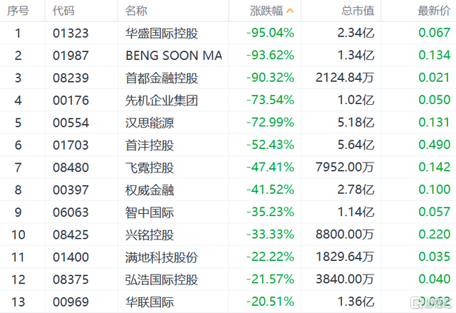

1 月 6 日, 多只港股小市值股票上演"闪崩"行情.

华盛国际控股跌 95%, BENG SOON MACH 跌 97%, 现跌幅收窄至约 93%; 首都金融控股跌近 93%; GBA 集团跌 90%, 先机企业集团跌近 77%, 汉思能源跌 79%.

当晚就想明天买个一百块钱的玩玩

7 号的时候华盛仍停牌, 而汉思好像大涨 90%, 发现好像确实在涨

10 号开市后, 华盛大涨 150%, 看着还在上涨, 就在附近买了 300 块钱的

看着首都金融涨的不太多(好像是 20% 吧), 就也买了 300 块钱

当天华盛收盘为涨 200%, 华盛和首都差不多都赚百分之二三十

虽然赚了百分之二三十, 但由于本金太少, 并没有赚多少钱

晚上和同事说了以后, 同事说假如原来 100 块钱, 跌了 98%, 再涨 200% 也才 4 块钱, 距离 100 还有 25 倍

我想也是, 而且当天尝到了甜头, 以为还会继续涨, 就想着再多买点, 买个几千块钱的

其实是有预兆的, 7 号汉思大涨, 10 号就开始跌了, 只不过跌的不太多, 就忽略这个风险了, 想着跌几个点也能接受, 总会回到大跌之前吧

今天早上华盛和首都又是高开(虽然没几个点), 故我就又追高买入了, 各买了六七百块钱的, 还买了先机和 BENG SOON MACH 各差不多一千

想着就差不多 5000 块钱搏一把

这四个买入的时候都是涨的, 故挂的价钱都比较高一点才买入的

没想到买入后没一会就开始跌了, 而且一直在跌

截止今天的情况:

| 股票 | 成本  | 现价  | 数量  | 盈亏百分比 | 盈亏    |
| ---- | ----- | ----- | ----- | ---------- | ------- |
| 先机 | 0.074 | 0.063 | 14000 | -15.19     | -158.07 |
| 华盛 | 0.18  | 0.159 | 6000  | -11.91     | -129.09 |
| BSM  | 0.225 | 0.191 | 4000  | -15.11     | -136.06 |
| 首都 | 0.044 | 0.046 | 30000 | 3.2        | 42.9    |

其实这是庄家在割韭菜, 这就是港股的特色"老千股"

顾名思义, "老千股"就是骗取普通投资者钱财的股票, 按照香港交易所前总裁李小加的定义:

> "主要是指大股东不以做好上市公司业务来盈利、而主要通过玩弄财技和配股、供股与合股等融资方式损害小股东利益." 我们大 A 的大股东和庄家, 喜欢炒高股价割韭菜, 但香港的老千股一般不这么干. 因为他们一旦这么干, 投资者都趁机减持跑掉了. 老千股最最典型的手法, 就是利用投资者只看价格、或相信上市公司的财报的思维, "向下炒", 不断进行大幅度的合股和供股(A 股对合股和配股有严格限制).

哪些股票可能是老千股呢? 这里说几个判断标准:

1、日均交易量少于 100 万港元的股票.

2、每隔几年就换名字的公司.

3、带有中国、环球、世界、亚洲之类名字非常高大上的公司, 但业绩又非常差的不知名公司.

4、历史上有过两次以上配股/供股/合股记录前科的股票.

5、市值小于 20 亿, 经历过大雪崩的股票.

由于自己不知道这些事情, 也没有去查直接就冲进去了, 犯了不知道不碰的原则, 就想着高收益了, 以为和 A 股一样可以修复, 忽视了风险的存在

其实当时随便搜搜就可以查询到这些信息, 却因为自己过度自信和被高收益冲昏头脑了

对于这次暴跌, 背后的原因迄今不详.

主流的解释大概是两种.

第一种是说港交所可能对于股价低于 1 元并且长期成交低迷的股票予以除牌并限制借壳. 从上表可以看到, 绝大多数的股票都是港股中的仙股(仙谐音 cent, 指的是以分为单位的超级低价股).

第二种解释则是说这些股票的股东是个小圈子, 只要其中一位出现了资金问题, 就会出现连环引爆.

对于我等 A 股投资者, 其实真实的理由是什么并不是太重要.

对我们而言, 真正重要的是能引以为鉴.

## 壹、港股不是乐土

在之前陆港通推出的时候, 许多的股民深表遗憾, 觉得可以购买的港股实在是太少了, 不带劲.

不过, 看了港股这个跌法, 你才应该明白, 证监会在这个问题上还是用心良苦, 允许大陆股民购买的都是港股中的翘楚和主力, 剩下的那些市值不够大交投不够活跃的港股, 证监会都给你设立了防火墙.

在许多人的心中, 港股算是一个发达的股票市场了. 如果从顶上那些精华的股票来看, 港股的确是, 在各位的指数分类中, 港股也是被归类在发达市场的.

但是, 从证券监管的角度来说, 其实港股实在算不上楷模, 更不要说和美股相比了.

在这个问题上, 有兴趣的朋友可以找一下 2000 年前后, 当郎咸平还是那个认真做学问的郎教授, 还是那个被称为 "郎监管" 的良心学者的时候, 他对于美国和香港证券监管的一些普及和比较, 你就会知道其实香港的投资者保护实在是不怎样.

甚至某种程度上, 可能香港的投资者保护, 还不如 A 股来得靠谱------毕竟后者还兼具 "维稳" 这样的要求.

所以, 对于港股, 尤其是那些不为人知的低价股, 可千万留神, 不能将港股视为乐土.

在这个问题上, 我依然会建议你要看一遍《大时代》, 其中有太多值得借鉴的地方.

就像港股的乱象, 其实在《大时代》中就以陈万贤这个人物进行了集中的体现, 有兴趣的不妨看看他做庄大战刘青云饰演的方展博的那一段.

## 贰、地雷股是能识别的

周二港股的这轮暴跌, 还让另一个人再次出名.

那就是有香港股坛长毛之称的 David Webb.

关于他, 网上有这么一段简介:

> 于 1986 年, 大卫 - 韦伯在英国牛津大学 Exeter 书院数学系毕业, 曾写过 Spectrum 及 Commodore 64 计算机游戏. 其后转往金融界发展, 在投资银行任职, 1991 年开始定居香港, 1998 年退休. 他因经常批评香港部份上市公司管理层的不当行为而成名, 被部份投资者视为代表小股东权益的声音, 但被大股东或上市公司视为 "麻烦制造者", 故有"股坛长毛" 之称.

此君长期在香港经营一个以自己名字命名的[网站](HTTPS://WEBB-SITE.COM), 这个网站中时不时会对香港一些侵害小股东利益的股票进行批评, 当然普通股民最熟悉的还是

当然, David Webb 这次再次出名, 是因为在 5 月 15 日, 他在网站发布了一篇名为[《"谜之网络"("Enigma Network"):50 只不能买的港股》](HTTPS://WEBB-SITE.COM/ARTICLES/ENIGMA.ASP) 的文章, 指出部分港股要么是泡沫甚至被交易所点名了, 要么是有大量投资, 但投资权益披露低于正常披露门槛

而周二暴跌的 24 个港股中, 有 20 个出现在了 David Webb 的 50 家名单中.

可见, 垃圾股其实还是有迹象的, 只不过看你是否愿意学习了.

如果你志向是做一个价值投资者, 那么 David Webb 的很多分析, 不妨仔细研究, 他对于港股很多的分析, 从企业管制和财务报表入手, 那是相当到位------唯一的缺点就是全部是英文的.

当然, 如果你持有港股的小盘股, 还是先看看 David Webb 的 50 家名单, 确保自己的持股不在名单上吧.

## 叁、低价冷门股是高危的

这次港股暴跌, 一个版本的传闻是港交所要强制低于 1 元长期成交稀疏的港股退市.

虽然这个消息随后港交所辟谣了, 但是未来是不是会真的推出, 不好说.

毕竟, 从纳斯达克的监管经验来看, 这本来就是确保市场优胜劣汰的重要一个规则. 如今如日中天的新浪、网易这些中概股, 在本世纪初的时候, 可都是有跌到 1 美元附近甚至是 1 美元以下, 差点被除牌的危险的.

在 A 股, 其实许多股民也是有着强烈的低价股爱好的, 尤其是那些 2 元 3 元的股票.

但是, 眼下的 A 股已经是有 3000 多只股票的大市场了, 伴随 IPO 的扩容, 数量还是会继续增加.

未来, 伴随者基本面的变化, 不排除会出现更多的低价股, 同时其中也会出现成交稀疏的股票.

其实看看创业板, 今天成交最少的股票全日不过成交 70 万元, 剔除新股的, 最小的大概是五百多万, 这样的成交恐怕也是高危了.

所以未来如果 A 股也出现有低价冷门股被退市, 我也不会觉得奇怪.

所以, 投资者的思维定势还是要修改, 不能觉得在过去十多年一直行得通的低价股投资, 就一定会持续的有效------尤其是在创业板这样有突然死亡法则的市场上.

以下为查到的信息:

- [那些跌掉 90% 的股票教你的事 - 知乎](https://zhuanlan.zhihu.com/p/27591210)
- [港股崩了, 4 只股暴跌 90%!](https://www.touchacha.cn/c48368.html)
- [港股多只小市值股票上演"闪崩"行情, 4 只个股跌幅超 90%, 这家公司紧急停牌!](https://baijiahao.baidu.com/s?id=1721187715172746837&wfr=spider&for=pc)
