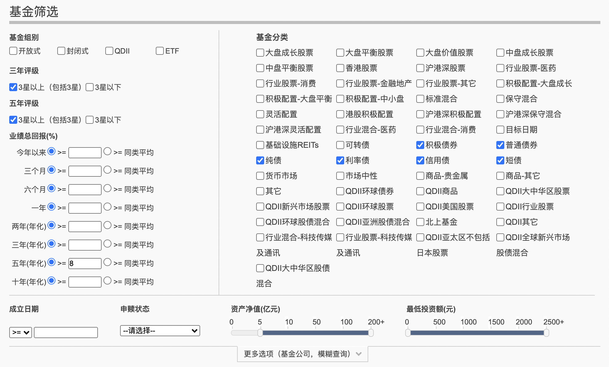
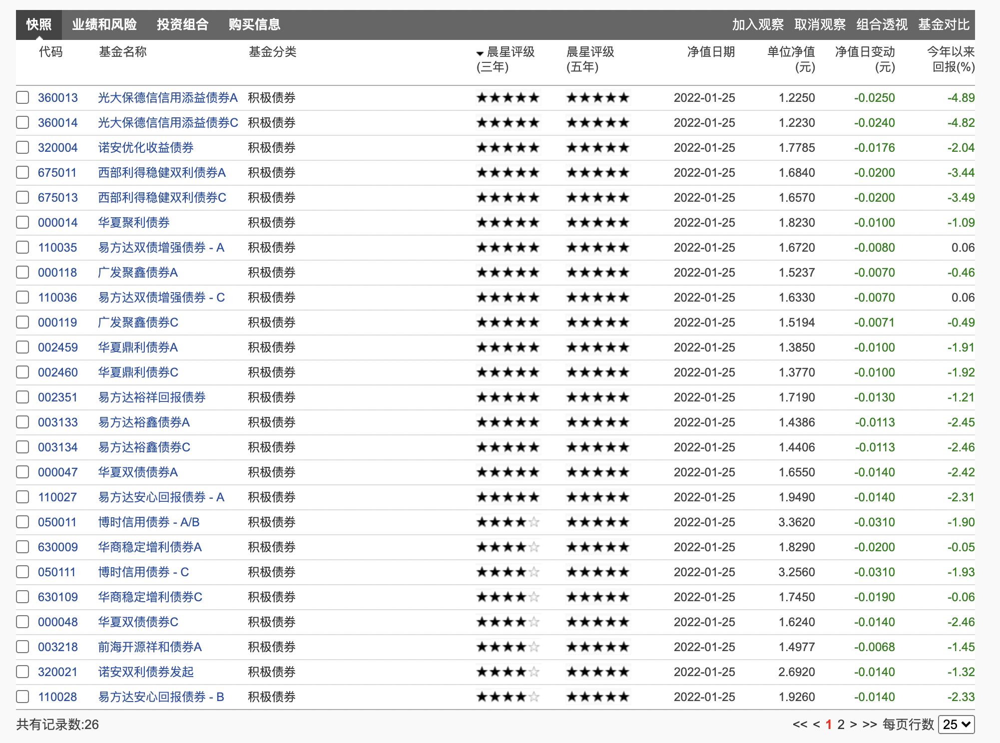
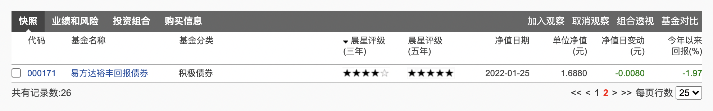

今天根据[固收+买入之道](/pages/38bea3/)筛选并买入三只, 各 1w

- 002351 易方达裕祥回报债券

- 000047 华夏双债债券A

- 002794 天弘永利债券 - E

其实前段时间看[这位固收大佬, 有着"权益的灵魂" | Golden-axe](https://golden-axe.vercel.app/pages/da2fa5/#%E4%B8%9A%E7%BB%A9%E6%83%85%E5%86%B5)想买入 [博时信用债券A/B(050011)](http://fund.eastmoney.com/050011.html), 想着虽然可转债占比很高, 但看介绍基金经理应该能把握住吧, 但发现最差三/六个月回报都在 10% 以上, 波动还是有点大(收益和上面三只差不多), 还想着连这只再选出 5 只, 每只 5k 买入呢, 最后想想还是算了吧, 现在主要还是以稳为主(和国家保持一致), 就不打算买入了; 所以博时新收益这个偏股的就更不能买入了

其实买这三个债券也纠结了半天, 看这个指标看那个指标, 选了半天, 有的是各方面都挺好, 就是 18 年是负的, 就想着也没啥大问题, 18 年大家都不行, 也没负多少

最后却还是严格按照指标去选择了, 还是这样比较快, 一小时就搞定了(其实可以更快, 还是犹豫半天), 也没有纠结的烦心了

可能还是对这个指标不太信任吧, 想着自己验证一下, 结果却搞了几天也没搞好

这里说一下筛选过程, 淘汰和选择的理由

筛选条件如下:

共筛选出 26 只:

首先看排名第一的 360013 光大保德信信用添益债券A, 2021 年以前每年都是正收益, 但基金经理更换太频繁, 而且可转债占比高达 77%, pass

再看 320004 诺安优化收益债券, 2018 年是负收益, 而且刚换经理, 可转债占比也很高, pass

依次筛选就选出以上 3 只.

哦, 对了, 前段时间为了免费加入雪球课程, 买了 500 [鹏华可转债债券A(000297)](http://fund.eastmoney.com/000297.html), 这个是在天天基金网上选出来的, 选择标准和课程中提到的长期纯债类似: 债券型-混合债基-近 3 年排序

这个是排第一个, 而且感觉各项指标都符合, 就想买入, 不过 21 年可转债确实涨的挺高的了, 想追又不敢追, 正好趁着这个时机找个借口买入了, 不过也不敢买太多, 小试一把, 专业术语叫建个观察仓看看, 哈哈
