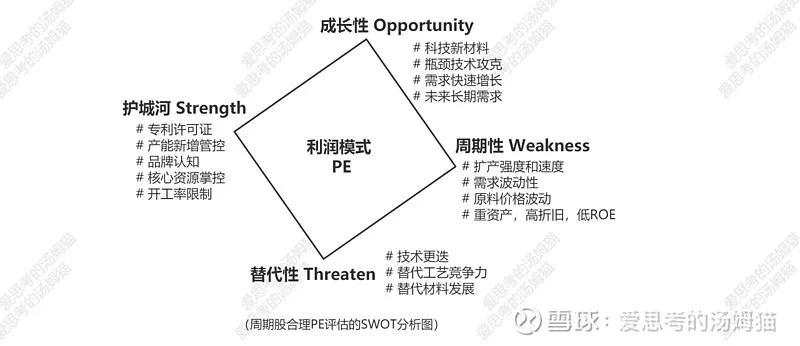
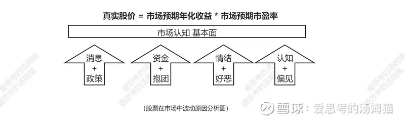

## 周期股的估值和股价讨论

(以中远海控为例)

本节对周期股的估值和股价的逻辑进行一般性探讨, 试图寻找其内在规律. 只有明白了周期股的估值和股价模式, 才能更合理地给碳化工股票去定价, 这些理论也适用于其他周期股.

股票长期投资而言, 决定其股价的是归属净利润、净现金流折现、年度红利折现等; 短期而言, 更重要的是市场情绪、热点和炒作资金的偏好. 中期来看, 基于特定市场和偏好的预期市盈率(PE)是更有效的标尺, 它平衡了长期的高瞻远瞩和短期的情绪化.

周期对周期股也很重要, 毕竟, 周期股要结合周期去看待和操作的. 由于近期中远海控被称为"周期之王", 放在一起探讨这个内容.

## 周期股估值的去周期性

但周期谈多了, 有时候也容易被误入歧途. 最容易被误导的就是去猜测周期的底部、上行、顶部和下行. 预判周期的兴衰, 用后视镜看永远很容易和简单, 这是教科书喜欢讲它们的原因. 但身在局中, 却很难精准看出周期的目标或走势, 因为市场在每时每刻进行着动态的调整.

放到更大的范畴, 所谓周期股、价值股、成长股和科技股的区分同样会误导人. 所有行业都有周期, 任何行业都有成长和核心科技的一面. 任何行业中只要企业足够强大, 都可以弱周期化. 只要成长弱化, 都会价值化. 周期、价值、成长和科技这四个方面更多的是看待企业经营能力的视角, 他们合起来决定着企业的估值, 估值进而决定股票的合理价格.

周期股只是老掉牙的理论, 套在思想上的枷锁, 走出来才能看得透! 我们下面从更深的层次去探讨周期股的估值方式.

就当前市场而言, 市场对股票, 尤其是周期股, 评价的角度大概是许可证(护城河)、周期性(周期波动)、成长性(增速和雪坡长度)和替代性这四个. 这四个本质上是围绕企业的 SWOT 分析的具体化, 在测量企业真实的经营竞争力, 在综合竞争力的基础上确定其估值.

我们基于当前 A 股市场的估值偏好进一步来讨论.

### 1)护城河(Strength)

市场通常会给予护城河属性的企业 20~30 倍的估值, 他们握有的许可证就是他们最大的护城河. 当今市场上巴菲特的门徒甚多, 这个需要优先考虑.

企业的许可证传统上是技术专利、品牌认知和投资门槛等. 在缺电背景下, 环保管控使得新增矿山或排污能力受限, 核心资源拥有了护城河; 能耗双控条件下, 新增产能(尤其是高耗能产品)拥有了护城河; 缺电情况下的限电, 对特定区域和行业的企业产能利用率集体进行压制, 限制供给优化了行业竞争, 变相挖深了既有企业的经营护城河.

就以往周期股的探讨中, 电石和黄磷的产能、磷矿的开发权、氯碱企业或硫酸的有效生产能力、天然碱盐湖等都是典型和护城河或许可证.

对中远海控而言, 投资的高门槛(巨型集装箱船造价很高)、航运联盟的封闭性、扩产的长周期(订船周期在 2~3 年)、海运经营的高风险性(国际集运已连亏 10 多年)等都对国际集运形成了非常深的护城河. 基本听不到什么大型集团、大型资金或者风险资金想往这个领域去发展或投资!

在这种寡头型集运联盟的封闭体系下, 集运联盟对于两端的货主甚至主权国家都是超级无敌的存在, 航运联盟本质上掌控着着国际集运的定价权. 不同于开会确定或直接发布, 是某种寡头格局的默契定价而已.

并且, 其护城河也体现在其自由现金流上. 无论面对长协客户还是货代, 收取的都是现金. 除了订购新船更换旧船, 支付燃料和人员工资, 没有什么其它大额支出. 体现了高护城河企业优越的自有现金流水平.

而中远海控, 作为国际贸易中的中国海权的代表, 还会得到政府的格外庇佑, 拥有主权背书的许可证, 随着中国崛起, 只会越来越壮大.

### 2)周期性(Weakness)

由于周期性企业在营收和利润方面的高度波动性, 市场往往仅给予处于景气时期的周期性企业 10~15 的估值, 对周期下行的预期甚至会使这个估值更低. 而在周期下行时期, 在盈利迅速收缩的作用下, 其估值会迅速上行甚至变为负数. 由于其业绩的波动性, 周期股难以作为长期的投资标的, 也基本不会被主动型长期基金长期配置.

但周期性也不是一成不变的, 这个时代唯一的不变就是变化本身.

周期性来源于几个方面. 特定行业内景气时期基于前景的乐观, 进行大规模扩产, 增加的产能后续造成产品滞销, 景气不在. 终端需求随着经济变化而波动, 上游原料价格随着各种原因而波动. 重资产、高折旧和低 ROE, 使得景气时期赚的钱不得不进一步投入新的固定资产购置. 等.

但实际上, 周期性行业内正在发生着巨变. 随着周期性行业越来越意识到行业周期性的特点, 龙头企业扩产越来越谨慎; 领先企业为了避免上下游波动进行大规模的纵向一体化; 领导企业规模变得越来越大, 技术上越来越领先, 从而获得了更低的成本, 更高的毛利率和更高的 ROE. 缺电背景下, 政府对周期性行业进行严格新增产能限制, 对新进企业设立了越来越高的投资和能耗标准, 基于环保和能耗双控等因素持续在清理中低端产能. 等等.

这些因素都会直接或间接导致原有的周期性行业的周期不再.

相反, 消费性和科技性行业, 由于市场默认把他们视为成长性行业, 对未来需求乐观等因素, 都在做大规模积极扩产等一系列原来周期性企业做的事情. 周期股周期不再的原因, 反过来也是这些传统的成长企业成为新的周期股的原因.

周期股丧失周期性, 成长股反倒越来越有周期性, 这个其实是当前国内市场最大的预期差. 像前面提到的磷化工和硅化工上游的龙头企业, 哪有一点周期性企业的影子. 反过来, 像国内白酒消费的品牌和销量大跃进, 医疗方面 CXO 井喷式的产能扩张, 光伏和锂电池的无限上产能, 在缺乏需求高速成长和技术护城河的保护下, 这些传统的成长股或科技股, 俨然一副周期股的样子.

对中远海控而言, 海运多年恶性竞争形成了三大航运联盟, 行业已呈现稳定的寡头格局. 想不到哪家会希望重新回归曾经十余年巨亏的噩梦.

在寡头状况下, 各获利方极易达成价格默契, 对扩产谨慎. 目前报出来的新增船只数据就是例证, 当前订购的新船即使生产出来, 也仅仅能够做到替换旧船和更换碳排放大的船而已. 从行业格局和新增产能两方面来看, 海洋集运的周期性已很弱.

### 3)成长性(Opportunity)

市场通常会给予成长性属性的企业 30~90 倍的估值, 这个估值的高低依赖于成长的预期增速. 按照 PEG 理论, 成长性企业的估值最终会和中长期年化净利润增速相一致.

30~40%的成长速度和估值一般会授予那些管理能力出众, 处在优化行业结构中的企业, 通常会被成为成长股. 而 50~90%会授予那些处在高速发展行业中, 掌握了关键材料, 突破了瓶颈技术, 能受益于超高需求增速的企业, 通常会被成为科技(成长)股.15~20%的成长速度和估值的公司, 如果体量比较大, 会被称为蓝筹股或价值股, 增速慢但稳定.

就以往的探讨中, 新材料企业, 如 PVDF、磷酸铁锂、多晶硅、PBAT(BDO)等都是市场认可的需求快速提升的新材料, 这些新材料被认为是拥有未来的原料, 拥有这些材料产能的企业则被视同为高成长性公司. 化工股里面有许多精细化工都有这种属性.

对中远海控而言, 其成长性可以对等理解为海洋集装箱运输和中国杂货进出口二者的成长性.

集装箱运输是运输业中先进生产力的代表, 海洋集运更是皇冠上的明珠, 自从被发明以来, 行业处在持续成长中, 属于典型的成长性行业. 看具体的海运数字, 全球集运约占海运总量的 50%偏上, 自 2003 年以来, 全球集装箱总运输量每年都在 8~10%以上的增幅在增长.

中国杂货进出口的成长性更是显而易见. 随着中国制造能力的显著提升, 中国的杂货出口的数量、质量和广泛性都在不断地提高, 中国的出口量持续成长是毋庸置疑的. 而随着中国的越发富裕, 进口杂货的数量和种类也在持续增多, 进口量也处于持续成长中. 估计阻止这个成长的, 只有中国出现持续衰退, 但这个显然看不到一丝影子.

我们用中国的进出口总量作为参考, 不考虑 2020 年的疫情, 自 2000 年到 2019 年的 20 年间, 中国的进出口总量的年复合增长率约为 12%.

中远海控作为中国最大的海洋集运企业和最大的中国为目的地的航运公司, 享受着上述二者的双重成长. 在目测的未来, 需求的持续成长性是毋庸置疑的. 其长期年化成长性大约在 8~15%之间. 结合护城河和周期性, 在供给受限的情况下, 净利润的增速肯定会远大于此.

### 4)替代性(Threaten)

替代性对于周期性企业来说, 是比周期性更大的风险所在, 这也是这些行业被称为传统行业或落后行业的原因! 如果一个固定资产比重大的企业未来的产品不再被市场需要, 那这个企业只能按格雷厄姆的方法计算它的残余价值了. 这个命题太大, 我们在这里仅讨论周期股会涉及的部分.

化工行业的多路线工艺竞争是替代性必须要考虑的角度, 基于未来去判断各条路线的竞争力和能走多远. 对优势企业乐观进行未来评估时, 需要对正在实验室的研发技术保持关注. 对周期性企业, 要像关注科技性企业一样, 关注其研发投入比, 以及以往对新技术开拓和跟进的成功率. 只有这样, 才能有效的回避替代性 对周期性企业带来的估值损伤.

对于周期股而言, 替代性的能力要作为估值的加分项或减分项, 根据其可能性进行相应加减其目标估值.

就前面锂电池来举例子, 钴的高价让三元高镍路线短时间兴起, 镍路线工艺风光无限, 被替代的高钴路线估值则被压制; 随后, 镍价的高涨让磷酸铁锂短时间爆红, 又拉升了该工艺一众企业, 甚至拉升了磷化工的整体估值. 这些都是工艺竞争的直接后果. 从研发能力上评估, 以往研发能力超强的兴发集团、龙佰集团和天原股份, 在后续的新工艺研发竞争中更容易获得领先.

回到中远海控, 替代性基本可以无视, 属于极弱程度的替代性.

从运输方式上, 目前还没有什么其他运输形式能够替代海洋集运. 空运和洲际铁路联运的运能和价格都远远无法和海洋集运相媲美, 即使是大幅涨价后的海洋集运.

从国内竞争上, 中远海控作为国家站台的垄断地位国际集运公司, 国内的政策方向都是让国企进一步做大做强, 合并是方向, 国家绝不会扶持另外一个国内集运企业出来. 在国内竞争格局上, 无可替代.

从国际竞争上, 三大联盟的稳定格局已形成, 再加上中远海控大量控制国内集装箱港口的资源. 其他新起航运公司或其他联盟成员, 在中国为端点的集运市场上, 很难对中远海控形成有效替代.

总之, 我们基于上述四个更本质的方面, 去确定特定周期股的预期合理估值, 更为恰当. 而不是对其泛泛而谈.

中远海控作为例子, 高护城河+需求年化 8~15%的成长能力+极弱周期性+无替代性, 按照当前 A 股的估值习惯, 中远海控中长期的合理估值, 放到 15~20 较为恰当.

## 商品走势对周期股价走势的影响

尽管周期股有去周期性的一面, 但其周期性也不可忽视.

其周期性在于, 其一, 周期性企业生产的产品都是无差异的商品, 比如化工企业的化工原料, 只有型号的区别. 而不像消费性企业的产品能够用品牌建立认知的护城河.

其二, 周期性企业的产能都基本是固定的, 扩产需要比较大额的固定资产投资, 周期性企业赚的其实是生产制造的钱. 不像消费性企业, 赚的是品牌的钱, 只要有人愿意买, 大可以找外包工厂去生产, 不会有产能的限制. 不像技术或许可证企业, 赚的是授权的钱, 只要有人愿意买, 可以是无本万利的生意.

由于无差异商品的市场价格至关重要, 商品价格基本等同于其收入或利润水平, 进而, 周期性企业的盈利能力体现出和其商品极其相关的特征. 甚至连公司股价也可以被其商品涨跌所左右, 在当前的 A 股上, 跟着期货走势炒周期股, 是众多周期股爱好者的操作习惯.

对大猫也一样. 我曾经深入分析过电解铝和铜矿股票和期货的关系, 在中长期下, 电解铝和铜矿的周线走势和商品期货高度拟合, 跟着期货炒股票有着现实基础.

但是, 如果把这种逻辑扩散开来, 用来指导普遍性的周期股操作, 用来判断缺电和限电对周期性企业股票的影响, 用来判断化工股, 尤其是碳化工股票错综复杂的关系, 商品走势还是太小儿科, 不信可以随便找几个周期股进行对照, 拟合性就显得很差. 我们需要从商品价格优势去挖掘是更深层次和本质的意义.

回到本节开头, 一个企业长期的价值, 在于其创造利润的能力. 对于周期股而言, 其企业价值, 也就是股票价格, 与其景气度高度相关. 在其景气上升期间, 其利润会越来越好, 股价也会节节升高; 相反, 在其景气下行期间, 其利润水平会和股价同时下降, 深不见底的下降.

这个走势实际是周期股被称之为周期股的本意.

在这个上上下下的过程中, 伴随着各种牛鬼蛇神的指标, 被许多名人包装为各种周期股的理论. 这些指标有, pe、pb、roe、roic、商品价格、毛利率、净利率、扣非净利润、主营业务收入、归母净利润年化增速, 等等. 反正这些互相矛盾的指标绝对可以把大部分人从周期股吓走, 它们实践的无效性足可以让剩下的一小部分人在操作周期股过程中亏钱.

那这些指标之下, 真正其决定意义的指标是什么? 似乎景气度和股价直接相关, 那景气度到底是什么东西?

这个东西搞不清楚, 对于极其复杂的碳化工而言, 即使搞明白行业现状, 也理解不了股价走势. 在研究碳化工的复杂利益关系时, 通过不停的测算和排除, 终于似乎明白其本质. 大猫理解的本质如下:

公式 1:

当期净利润(景气度) = 实际利用产能数量 \* 单位产能利润额

公式 2:

企业市值(股票股价) = 预期年化净利润(预期年化每股收益) \* 预期市盈率

正是这两个公式, 对周期股的商品价格和股价水平建立了联系. 由于短时间内股市对特定企业的估值水平通常不会变化太多, 大部分企业产能使用率大部分情况下也保持不变, 在原料价格稳定时, 商品价格就是唯一决定股票价格的因素了.

这也是一直流行的跟着期货炒股票的理论基础! 但在今年混乱的大环境下, 公式的各个变量都在短期内变化.

我们把这两个公式放到更复杂的化工股来辩证的看.

对于前面讨论的钛白粉企业来说, 虽然其产品价格一直在上涨, 但由于原料涨幅更大, 其吨毛利实际一直在降低, 对于大部分无矿石配套的钛白粉企业而言, 实质就是行业景气下行, 股价大概率有下行趋势. 在真实的交易场景中, 钛白粉矿石端和下游表现出大量的观望情绪.

对于后面要讨论的氨纶企业来说, 其原材料上涨速度远大于其产品上涨速度, 表现为产品的毛利率在下降(扣除原材料上涨带来的一次性利润), 看似和钛白粉一样无法有效传导涨价. 但换算得知, 由于售价绝对涨幅则很大, 虽然其毛利率在降低, 但其氨纶的吨毛利却在持续上涨, 对于企业的当期净利润而言, 环比大幅上涨, roe 也同步在大涨, 显示出氨纶行业的高度景气性上行趋势. 对这样的推算, 氨纶股票肯定会随景气而上涨. 在真实的商品交易场景中, 氨纶体现出有价无市, 到处缺货的紧俏场面.

通过这两个公式也能理解为什么九月份国内大面积停电和限产造成的股价大跌了.

除掉上一节谈到的下游限产引发的上游需求减少外, 大幅限产会导致行业性产能实际利用率大幅降低. 虽然限产仍然带来商品价格的上涨, 但其上涨无法弥补产能大幅下降造成的缺口. 反映到公式就是景气下行. 最终, 传导到股价和企业市值, 造成大量周期性板块的暴跌.

行业性减产带来行业板块的暴跌, 减产的龙头就是领跌的龙头. 这就解释了云铝股份和神火股份公布限电影响后的连续暴跌了. 全国性无差异的减产最终带来整合周期股大板块的连续暴跌.

不得不说, 大盘走势还是有其大智慧的, 群体智慧有其极其聪慧的一面. 至少, 我是股票跌了一周, 昏天黑地到写作这一刻才意识过来怎么回事.

如果逻辑果真如此, 也就释然了.

虽然手上有中铝和太钢不锈还需要进一步测算限产的影响, 但对云天化、兴发集团和云图股份几个磷化工, 明显是错杀. 磷化工这几个企业由于磷肥保供的关系, 产能都没啥影响. 合盛硅业和新安股份都是碳中和的排头兵硅化工, 也没见到限产的情况; 华泰股份、滨化股份、鄂尔多斯、淮北矿业、山西焦煤和兰花科创也没听到啥限产的消息, 甚至都在加班生产呢.

大盘和板块下跌有理, 个股错杀也是随处可见.

回到我们前面讨论的"中远海控". 它的产品也是典型的无差异产品, 拉箱子服务.

海控下跌的空方理由是国庆节前美西线货代价格大幅下跌. 这个价格在许多人眼中类似期货价格指标, 指标下跌了, 预测周期下行开始, 按着根据期货炒周期股的逻辑, 许多人深以为然. 但如果他们深入推导过期货价格(尤其乙烯产业链)和股价的关系, 就不会这么笃定了.

他们的逻辑大概率是彻底错的, 就像用化工产品价格涨跌预测化工股涨跌一样不靠谱!

回到我们上面的公式 1, 决定海控当期利润的两个指标, 一个是实际产能利用数量(实际船舶运力), 一个是每航次利润额.

对于第二个产量, 海控每航次利润额是与长协价格和给货代的价格完全正相关的. 随着三四季度新的长协签订, 根据网上透露出来长协价的具体数字, 大 V 估算会有 50~100%的增幅, 我们保守点按照整体约 30-50%以上的增幅来估计, 这个价格会指导到明年底甚至后年底. 而货代价是参照长协制定的. 根据这个可预测的指标, 每航次利润额将会在预计周期内至少有 30%的增幅.

同时, 货代报价也不代表海控的实际成交价格, 每年国庆节放假前, 货代运费都会有一轮短暂下跌, 今年又叠加沿海省份限电, 运价处在高位, 形成了短暂恐慌性下跌. 每年国庆节后到圣诞节前, 都是旺季中的最旺季, 从来还没听说过这个阶段大跌, 更何况今年这种特殊情况下.

对于第一个变量, 众所周知, 美西海岸存在着罕见的大拥堵, 核心港口需要排队 20-30 天. 对于航运公司而言, 由于本年度把大量船投入这个最赚钱的航线, 大约对于产能利用率有约 5%的影响. 随着美国疫情的恢复, 美国人民的努力, 如果这个拥堵最终能下降, 最多能带来 5%的产能提升. 其他产能提升, 要等着两三年后新船造出来, 不在我们探讨范围.

对于另外一个可能的考虑, 疫情恢复后我国的出口会下降. 这种说法显然是没有好好阅读本帖《哪儿都缺电》的正文. 原来是疫情导致出口量大量向我国转移; 现在哪儿都缺电, 外国更缺电, 我国是全球最大的煤炭和火电大国尚且如此缺电, 对于天然气上涨了十倍的欧洲, 对于煤炭全靠进口的东南亚各国和印度, 那儿只会更缺电, 在缺电背景下, 他们的出口能力会更受压制, 出口量会更进一步向我国转移. 后疫情时代, 新缺电时代, 集装箱船上的货只会更多, 而不是更少.

君不见, 美国的钢材、铝合金和 PVC 价格已经涨成天价, 美国政府天天催着中国一起降关税. 欧洲天然气涨价尿素厂大量破产和停业, 全世界指望着中国化肥出口. 要不是中国政府压着, 还不知道要出口量会井喷到什么水平.

总而言之, 对于海控的利润水平和产能利用率测算, 预期至少会有 35%的年度预期净利润提升幅度.

## 市场情绪对股价的影响

上面讨论的是周期股面对的合理估值和预期年化净利润. 对于当前 A 股市场这个非常活跃的市场而言, 资金充足、风险偏好高、流动性好、估值波动大是其另外的特征. 周期股的市场股价还要加上较大比例的情绪性定价, 情绪是难以捉摸的, 大众情绪更是神秘莫测!
虽然我们花了很多精力去探讨预期合理估值和预期年化净利润, 但市场作为整体人格, 定期也有自身的看法. 其看法最终表现为市场预期的年化收益和市场预期的市盈率, 二者共同定义出当期股价.

如果计算器按的精准, 市场预期年化收益最终会向预期年化净利润(预期年化每股收益)无限逼近, 毕竟实际业绩只有一个. 另外, 如果中长期市场的偏好不变, 估值预估正确的话, 中长期市场预期市盈率 也会 向 预期合理估值 无限靠近, 最终企业的营业能力的真相会在时间流逝中水落石出!

但对于测算出来的预期合理估值和市场实际估值出现的预期差, 需要谨慎评估其巨大风险性, "买入分歧"是种不负责任的言论, 市场会有情绪化的偏差, 但个人估算同样难以避免会带有主观的认识局限, 进而造成估算错误.

因而, 在测算完的周期股预期合理估值和预期年化净利润后, 具体的买卖点还要结合大盘的情绪化因素去确定, 避免被盘面、板块和个股的情绪化和或涨或跌而误伤. 在审慎评估风险后, 再依据自身投资周期的长短, 倾向左侧还是右侧等因素, 最终做出买卖的决策.

以上三个方面, 共同构成对周期股(包括化工股)的估值和股价评估标准, 借助它们我们后续去拨开碳化工的层层迷雾.

回到本节举例的中远海控, 综合来看, 其预期合理市盈率是 15-20, 预期年化净利润将是当前的约 1.35 倍以上, 考虑到其市值超过 3000 亿, 对于特大央企给予 80%的厌恶定价折扣, 根据国庆节前海控的实际股价和估值(动态 PE=3.73), 其保守涨幅空间有:15\*1.35/3.73\*80%=4.3 倍.

也就是说, 在本节对周期股的估值和股价的理论的推导下, 中远海控还会有 4 倍以上的涨幅.

当然, 这个结论也显著说明了, 大猫远不止是从哪个精神病院逃出来的, 必然是精神病院长级的特大病号, 其病入膏肓程度, 远比雪球海控吧里红总、枪哥、蛋总、花生哥等更为严重! 哈哈, 鉴定完毕!

(风险提示: 本文所提到的观点仅代表个人的意见, 所涉及标的不作推荐, 据此买卖, 风险自负.)

## 原文

- [以中远海控为例，聊聊周期股的估值和股价逻辑](https://mp.weixin.qq.com/s/Tykag4iELXrihd-Wp7R65Q)
