## 01

股市(包括基金)跌了有一阵子了.

很多小伙伴很难受, 本来打算来市场赚点小钱.

结果跌得快要窒息了.

进而担心:

是不是要跌没了, 市场还能涨回来吗?

都说股市不可预测, 但我还是要自信地告诉大家:

可以!

股市现在已经不贵(甚至可以说比较便宜), 出现了不少机会.

好日子或许就在前方不远了.

到时候, 它不仅不勒你, 还会抱你.

那有人要问了:

师兄, 你确定不是在逗我?

师兄不是神棍, 是靠数据和逻辑的.

有个【神秘指标】, 现在显示吸引力很高.

真假? 这个什么神秘指标靠不靠谱呢?

当然靠谱了.

口说无凭, 我们先来看下历史情况.

## 02

以 2018 年底为例, 当时是熊市底部.

该神秘指数出现了黄金机会, 数值高达 2.84.

(数值越高机会越大)

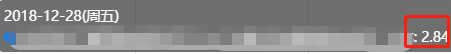

妥妥的黄金坑.

果不其然, 很快 19 年初就走出了一波行情.

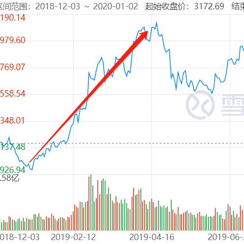

20 年 3 月底, 当时疫情正闹得沸沸扬扬, 股市跌得惨, 大家都很恐慌.

而神秘指标却像魔镜一样, 悄悄地显示出了黄金机会:

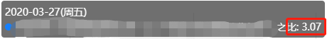

这个值, 比 18 年底还要高!

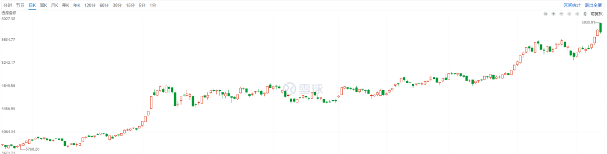

之后行情是这样, 大家也看到了.

而 2015 年牛市顶部, 当所有人都在狂欢之际, 神秘指标却非常"扫兴"地显示为废铁机会.

数值低到了令人发指的 1.22.

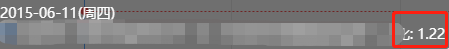

之后就进入了漫长的熊市.

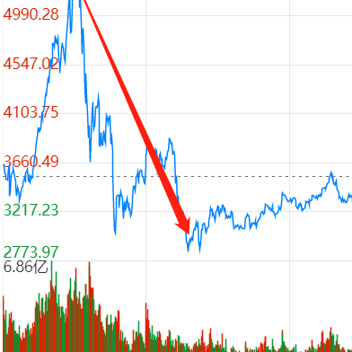

无数次历史都表明, 能逆众而行, 相信逻辑和指标的人, 会成为长期的赢家.

哇塞, 果然有点东西.

那师兄, 这个【神秘指标】到底是什么? 怎么看呢?

emmmm……

这可是一个秘密.

不过看在你诚心诚意的发问上, 我就告诉你吧.

## 03

上面提到的"神秘指标", 我们姑且命名为"股市吸引力指数".

那这个吸引力指数又是啥?

听我慢慢道来.

首先要知道: 股票是风险资产, 赚的也是风险收益.

而像国债这种, 是无风险资产.

只要国家正常运作, 绝对没问题.

人们通常会拿风险资产, 和无风险资产做对比.

看谁收益好, 买谁.

货比三家, 谁好买谁嘛.

很好理解.

举个极端例子.

假如现在买国债, 或存银行, 一年都有 20%的收益.

谁还愿意去买股票呢?

毕竟, 前者安心稳定、无风险.

后者不靠谱得多.

很理性, 没毛病.

反之, 假如买国债、存银行, 利息不到 1%.

而股票的潜在收益率高达 10%.

尽管股票是有些风险, 但收益高的多.

股票还是吸引力大的多.

所以, 无风险利率, 就像放在弹簧上的重物.

如果无风险利率很高, 弹簧上的重物是个大石头.

弹簧啥也没干, 就得被压得很低.

对应股市吸引力点位低, 估值低.

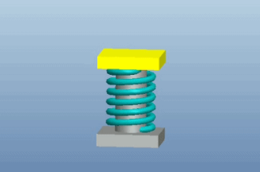

如果无风险利率很低, 弹簧上的重物就是团棉花.

弹簧受到的压力很小, 可以弹高.

对应股市吸引力就是点位高, 估值高.

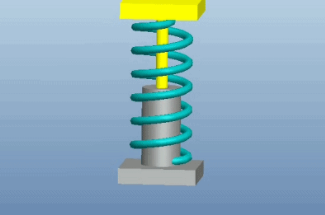

所以无风险利率就像股市的地心引力.

放水时, 利率下降, 重物是棉花, 轻飘飘, 弹簧容易上涨;

收水时, 利率上升, 重物慢慢变石头, 沉甸甸, 弹簧容易下压.

## 04

这个理论并非师兄原创.

早在几十年前, 价投的鼻祖格雷厄姆就在书中阐述:

当股市盈利收益率明显比国债利率高的时候, 股市吸引力指数就高.

上面提到的【神秘指标】, 就是这里的"股市吸引力指数".

如何看股市吸引力指数呢?

以前也说过, 用沪深 300 股息率和三年期国债收益率.

但经过这几年的实践和思考.

我把这个思路再完善, 得到了进阶版的股市吸引力指数.

股市吸引力指数:

用中证 800 的盈利收益率, 除以十年期国债收益率.

根据经验统计.

当吸引力指数 >2.5 时, 代表股市是黄金坑.

投资的好时机.

(极端的时候可以到达 3)

当吸引力指数 2-2.5 时, 是白银坑.

机会与风险并存.

当吸引力指数 1.5-2 时, 是青铜坑.

风险较高.

当吸引力指数 <1.5 时, 是废坑.

此时, 一般市场已经进入亢奋的泡沫阶段.

避开为妙, 免得被埋.

## 05

那么, 具体如何计算呢?

公式是:

中证 800 盈利收益率 / 十年期国债收益率

其中, 十年期国债收益率, 在百度就能找到.

概念也好理解.

稍微麻烦一点的, 是中证 800 盈利收益率.

计算也很简单, 就是中证 800 市盈率的倒数.

也就是 1/中证 800PE.

比如 2 月 22 日, 中证 800 的 PE 是 14.16.

(这个数值在理杏仁等各个数据平台能找到)

倒数就是 0.0706, 也就是 7.06%.

最新的国债收益率是:

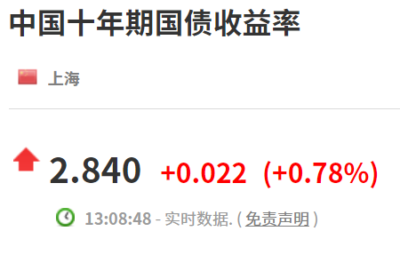

2.84%.

7.06% / 2.84% = 2.48.

就是处于四星五星的临界点.

以上的自力更生奋斗型计算方法.

对于条件充裕的"土豪"玩家, 直接在投资数据网上也能找到.

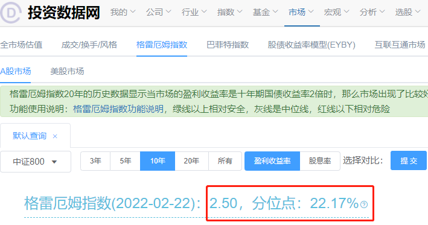

就是方便.

你看, 有钱, 很多问题都能解决.

这里的国债收益率用的 2 月 22 日, 并不是最新的.

所以和我们上面手动计算的略有误差, 2.48 和 2.5.

问题不大, 并不影响结论.

而且往下拉, 能看到计算过程的两个指标细节.

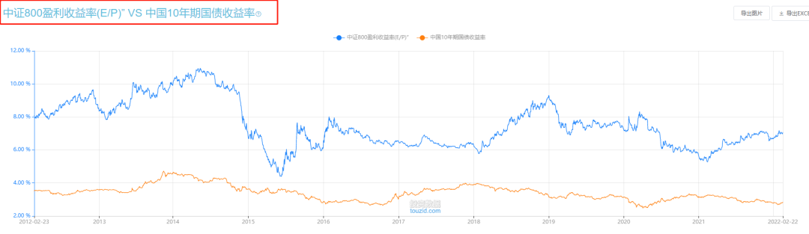

## 06

好了, 大致的原理和查找方法, 就在这里了.

其实原理很简单, 计算也容易.

(尤其是对于土豪来说, 点点鼠标的事)

这个事情麻烦的地方在于, 很多人并不相信这个指标.

尽管几十年前祖师爷就说了它的有效性.

尽管过去这些年, A 股也不断重复了这个过程.

吸引力指数高了就开始反弹, 低了就开始跌.

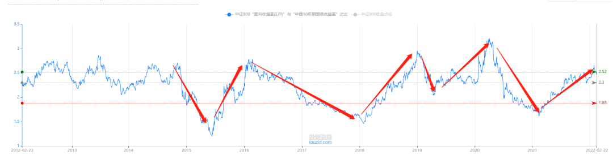

(近十年来, 吸引力指数的变化趋势)

但是, 处于其中的投资者们, 并不相信.

比如 2021 年初, 股市吸引力指数已经掉到 2 以下.

一度在 1.6, 已经处于 1 星(泡沫)的临界点.

公众号甚至"耸人听闻"用过一个这样的标题:

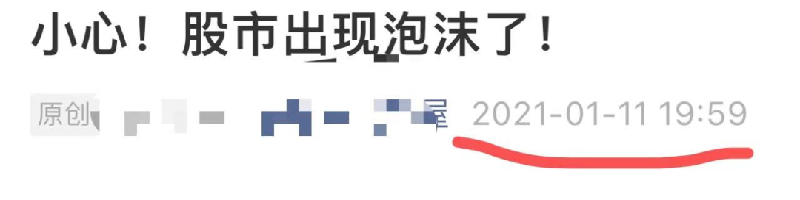

但是, 很多人(尤其是刚入市的)拦不住, 非要冲进去.

提醒风险的人, 往往会被认为是拦着他赚钱的.

(尤其是你唱空后, 并没有马上隔天就大跌, 反而继续涨的时候)

所以, 这是个非常吃力还不讨好的活计.

心累.

当时基金定投也是, 定投比例(仓位)很低.

有不少人就质疑:

这么好的行情, 投这么少, 太保守了吧.

所以, 股市吸引力指数, 最麻烦的地方, 就在于:

吸引力指数低的时候(股市涨的好), 人们不相信它会高回去(股票会跌回去);

吸引力指数高的时候(股市跌得惨), 人们不相信它会低下去(股市会涨回去).

就像现在, 2.5 附近, 也算比较高了.

很多人就开始怀疑了:

真的还会再涨回去吗?

这个想法, 和 1.6 的时候, 人们怀疑:

这么好的行情, 真的会跌吗?

## 07

世间事物, 尽为心上浮尘.

草草劳生, 终是一团烦恼.

而金融市场尤甚.

人类贪婪、短视又多疑的本性, 注定了它是一个欲望和焦虑炽盛的地方.

知识, 和智慧, 在很多地方, 还是有差别的.

希望大家都能智慧 UPUP!

## 原文

- [惊喜！股市捡钱的机会来了！](https://mp.weixin.qq.com/s/pcsq_m79nl8uejBO5Twqhw)
