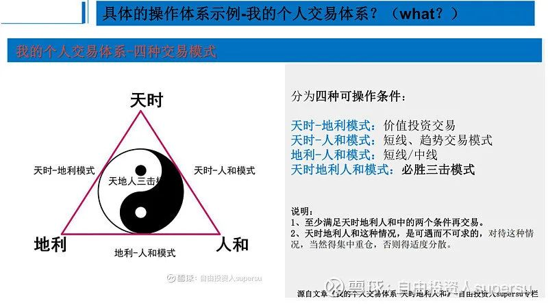

我是一名普通的散户-普通的收入, 普通的家庭, 没有专业背景, 普通的智商. 也正因为如此, 我相信, 我更加能够了解和理解大家, 了解大家在投资过程中的遇到的困惑、迷茫、面临的问题, 也非常理解大家的不容易...... 所以我今天的分享更多的是站在咱们散户的角度, 然后结合我过去 9 年的投资实践与经历, 向大家做一些交流和探讨, 不足之处, 还望多多指正.

我是 2013 年 8 月 16 日进入股市的, 至今也有 9 年的时间, 也算是经历了一轮牛熊, 并取得了 9 年近 5 倍的收益(2018 年亏损 26%, 其余年份都取得了正收益). 当然, 这个过程中, 也是蛮多的经历, 各种酸甜苦辣, 但是今天既然来分享, 我不想和大家去诉说这些不容易, 也不想去给大家喝鸡汤, 打鸡血, 我想基于我的一些认知给大家带去一些比较实用而底层的逻辑和干货(与建立交易体系相关的), 大概 1 个小时时间, 希望对大家有所帮助!

废话不多说, 直接进入今天的主题吧. 今天我想给大家分享的主题是: 散户投资者如何建立自己的交易体系.

我相信这是一个对于我们每一位散户投资者来说, 极为重要而必要的事情!

## why-how-what

我的分享分为三部分:

1、散户投资者为什么要建立自己的操作体系?(why?)

2、怎样建立自己的交易体系?(how?)及建立的过程中, 我们需要注意什么?

3、具体的操作体系示例-我的个人交易体系?(what?)

有的朋友会好奇, 为什么是这样的分享顺序, 直接讲第三部分讲你的个体交易体系不就好了吗? 其实我反倒觉得最重要的最不该忽略的是第一和第二部分. 我们做一件事情, 首先一定想清楚为什么要做, 我们出发点在哪里? 我们的理念和目标是什么? 接着才是如何做? 最后再考虑细节和具体步骤. 因为只有这样, 越是底层打的牢固, 把问题想的够清楚, 后面反而是自然而然的事情, 想的越是清楚, 执行起来会越果断, 心态就会更好, 没有那么多犹豫.

这个 why-how-what 的模型是我们思考问题非常好的一个模式, 被称之为"黄金圈法则", 源自美国作家西蒙. 斯涅克的《从为什么开始》一书. 书中主要通过苹果等公司的事例, 深刻的向我们揭示, 我们思考问题, 要透过现象看本质, 要从第一性原理出发, 从最本质的地方出发, 先问为什么, 再是怎么样, 之后才是现象和成果. 这是蛮重要的一个问题的.(演绎法)

我看到很多朋友, 看到很多大师和大 V, 就直接去抄代码看别人买什么股票, 这种姿势容易出问题, 稍微聪明一些的会去看别人的操作体系、具体方法, 但是这还是不够的, 我们一定要站在当事人的角度, 结合他的时代、性格、能力等方面, 去思考, 他为什么创造了这个体系, 他的出发点, 他创造这个体系的方法, 而不是方法本身. 这样我们能看到更本质更底层的东西, 才能把问题想得更清楚.

就比如, 同是价值投资, 不同的人的体系就有不同的差别, 格雷厄姆同一个老师教出来的学生, 在选股和持股上也相差很大, 这是为什么呢? 为什么不同的人的体系有不同呢? 这个是需要大家去思考的.

说到思考问题的方式, 平时逛雪球, 也发现两种比较常见的思维误区: 一种是简单归因, 先入为主. 一种是盲目使用归纳法.

什么是简单归因, 先入为主?

举个例子, 一个人过马路时闯红灯, 被很多人看见了. 那这个时候有的人就直接毫不犹豫的说人家没素质. 还有的人说也许人家有急事. 还有的人说, 也许是因为这个红灯时间太长. 还有的人说也许他是因为跟着别人一起闯的.……背后的原因其实可能有很多种的, 我们要从不同维度不同方面去综合考虑, 然后分析后发现其关键行为, 并作出关键行动. 而不能主观臆断, 简单归因.

关于如何避免简单归因, 之前有给大家分享过一个六相溯源法, 对于任何一件事情, 我们至少可以从 6 个不同维度进行分析. 要避免因思考的漏洞而不是错误, 影响对事情的真相的推理和判断.

什么叫盲目使用归纳法?

很多成功学著作, 就往往会存在这个问题. 这类书籍首先描述一个成功人士的经历, 然后就得出结果或结论, 如果要想成功就需要某某品质, 某某性格, 某某能力, 但如果仔细去想的话, 就会发现其实这样很容易出现幸存者偏差的. 就是我们在使用归纳法的时候一定要注意的是我们的样本量要足够大, 我们的时间要足够长, 范围足够广, 不然的话归纳法得出结果/结论就可能不太准确, 可能会出现一些问题. 要知道归纳法, 逻辑不太完备.

总结下, 我们在思考时,

第一, 要尽可能的使用第一性原理, 从最本质的出发, 使用演绎的方法推理.

第二, 切忌简单归因, 先入为主, 而要更加客观更加全面的多角度思考.

第三, 慎用归纳法, 小心幸存者偏差.

言归正传, 咱们散户投资者为什么要建立自己的交易体系呢?

## 散户投资者为什么要建立自己的操作体系

我相信大家每个人都有每个人的一些想法, 其实很简单, 我们来股市的目的是什么, 赚钱或者说获取盈利对吧, 但是这是不够的, 我相信对于绝大多数人来说, 我们不仅要盈利, 还得维持稳定、可持续性的盈利, 而不是来追求刺激的. 对吧? 当然, 这个稳定可持续的盈利, 当然多多益善(但是超过平均水平(ETF), 每增加一点, 难度就会倍增, 至少也得大于我们每个人的机会成本.)

但是, 现在很多人的交易是比较随机的, 或者仅凭运气, 方法的随机/仅凭运气, 带来的一定是结果的随机. 这个很好理解.

说到这里, 不得不得提一句话, "一年三倍者众, 三年一倍者寡". 这句话表面的意思是, 短期的盈利(甚至暴利)相对容易, 而持续稳定的盈利很难. 但实际上, 这句看似调侃的话, 有三层意思, 也揭露了 A 股的一些现状和特征:

什么情况下, 可以获得一年三倍这种暴利, 仔细思考, 发现有三种最可能的情况, 牛市/周期股/超短线. 而三种情况, 显然是无法或者很难持续的, 至少在目前阶段, 对于绝大多数人难以获得.

1、股市特征: 牛短熊长, 顶尖地圆,

2、股票类型: 周期股/非周期股

3、操作方式: 长线/短线

最近, 中国结算公布了最新 A 股股民数量超过了 2 亿人, 这个说明了什么呢? 股民结构? 市场的成熟度? 制度等? 文化?....... 国内外的情况是完全不同的, 所以不建议大家学习的时候完全盲目的照抄照搬.

另外还有个观点要跟大家去做澄清, 我相信很多人进入股市都听到过一个词: 复利. 复利被称之为第八大奇迹, 是很伟大的. 很多洗脑式的观点是这样的, 你每天挣一个点, 或者一周挣 5 个点, 再不济一个月挣 5 个点, 这样日积月累下去, 你按按计算器, 你会发现最终(或者十年二十年后)的数字大的惊人. 虽不说超越巴菲特, 至少也得混的个一方富豪是没跑的(如果无脑的相信的人, 显然是没有经过认真思考的). 于是, 幻觉便产生了, 这种幻觉起到的作用, 一方面是麻醉, 另外一方面则是"激励"或者"信仰". 实际上的结果是怎样的呢? 大家稍微看看过去十年甚至更长时间的现状, 就可以发现, 现实比较残酷, 更多的人是在股市赔了个底朝天, 侥幸活下来的, 少之又少.

为什么会出现情况? 这就是不得不跟大家去说的, 每个硬币都有正反面, 复利也是一样. 好的一面, 估计大家都知道了. 另一面呢, 是什么? 有两点, 一方面要想实现那种理想中的复利, 概率是非常的小的, 我们简单做个计算, 假设你的胜率可以达到 80%(这已经很高很高了), 两次成功胜率为 80%\*80%=64%, 三次成功胜率为 80%\*80%\*80%=51.2%, 四次:41%.......... 十次:10%. 如果复利次数更多, 概率更小. 当然这是说的理想情况. 另外一方面, 每次不小的回撤就可能会对最终的结果造成重大的影响.

举个例子, 你有 10 万块钱买了股票, 股票翻倍, 盈利 100%, 变成了 20 万, 但是如果第二年, 你在这个基础上亏死了 50%, 就又回来了原点. 看到了没有你一年盈利 100%, 一年亏损 50%(回撤 50%)就回到了原点. 这还是两次, 如果把复利次数拉长, 那么每次较小的回撤都会较大的影响最终的结果.

除此之外, 不得不提醒的一点, 要谨防复利变成负利, 只要每次亏一点, 如果次数够多, 一样可以亏损很快, 这个和设不设止损没关系.(关键在于胜率, 胜率取决于你的认识模式等)

很多朋友觉得只要设置了止损, 好像就把风险降低了, 其实并没有哦, 大家得想清楚这个问题.

所以, 时间可能是复利的朋友, 也可能是复利的敌人. 究竟是朋友还是敌人, 不取决于时间, 而取决于你. 复利可以是伟大的, 也可能是可怕的. 所以我们一定要对市场抱有敬畏之心.

刚刚说了那么多, 大家应该就能明白了, 我们如何去评价一个人的交易水平, 1、胜率(在一定的赔率下的), 2、回撤. 当然前提是较长时间, 至少一轮牛熊吧, 因为得尽可能的排除幸存者偏差.

所以当一个人如果几年时间最终呈现的收益率很高, 我们还得去看他的回撤和胜率, 因为完全可能, 比如他做了 10 次交易, 只有 1-2 次成功, 但是这 1-2 次成功盈利比那 8-9 次亏损还多很多. 这种即使是高收益, 可能也并不能代表他投资水平高.

再来唠叨的总结下, 我们投资者追求的是(长期)稳定可持续的盈利, 而不是追逐短期暴利. 我们应当不以短期的涨而过于激动, 不以短期的跌而过于悲伤.

基于这个目的, 我们需要建立稳定可持续的交易体系. 明确了这个目的, 至关重要, 他将大大的影响你后续的心态、行为、策略等. 而这些将直接影响你的结果.

好, 知道了为什么? 接下来我们说怎样建立自己的操作体系?how?

## 怎样建立自己的操作体系

什么样的体系才是自己的操作体系呢? 自己的操作体系(非巴菲特非格雷厄姆非某某大神的, 他们的未必适合自己, 未必自己能 hold 住), 我觉得分为三个方面,

### 一、适合自己

第一点, 首先肯定得适合自己, 对吧. 说到这个, 我就想到曾经看到过的一些购物买家秀和卖家秀的爆笑相片, 同样一件衣服穿在别人身上很好看, 能彰显别人的完美身材, 穿在你身上就未必了, 说不定不仅不好看, 还会暴露你的缺点. 这不是衣服的问题, 衣服还那件衣服, 一件很漂亮的衣服, 只是不太适合自己而已.(所以别轻易的抄作业, 大神大 V 的体系是基于他们自己的情况, 你的情况和他们是不一样的)

我个人觉得适合分为三个方面:

1、性格(急、稳? 敏锐, 深思?......)

2、时间(工作时间的自由度)

3、能力圈(对图形技术敏感, 对情绪人性更敏锐, 对企业/行业的经营研究更强)

性格这方面, 很简单, 每个人的性格都是很难改变的(除非遇到特别大的变故或者其他特殊情况, 有句话叫江山易改, 本性难移)所以, 我们要非常的了解自己, 这个世界上也只有自己最了解自己了. 对于比较急性子性格的人, 如果选择长线持股的投资模式, 可能是很痛苦的事情. 同理, 对于比较慢性子性格的人, 你让他去做短线/超短, 他可能总是跟不上节奏, 慢半拍或者慢一拍, 等他买入的时候, 花儿都歇了, 毕竟短线/超短更讲究的是对情绪的把握, 对于操作敏锐度和操作手法有较高的要求. 当然, 有的东西通过后天的学习技巧, 也能慢慢改善, 但是建议还是尽可能别在自己的性格的短板处去较真.

时间这方面, 很好理解. 我相信大多数散户朋友都是还在上着班的, 虽然工作时间、所在行业、工作地点有所不同. 正因为如此, 我们在交易体系的选择上还是要有所取舍. 由于股市开盘时间周一到周五 9:30-15:00, 这也是大多数工作的标准上班时间, 如果您上班还是挺忙的, 腾不出来时间, 没时间盯盘, 真的不太建议大家做短线/超短, 这样你可能错过机会, 犯下错误, 甚至带来不好的心情, 导致工作、股票两头都出现问题, 更可能带来恶性循环. 心态这个其实是很重要的, 不可忽视.

能力圈这方面, 指的是你个人比较擅长的交易方向, 比如有的人对图形或者数字更加敏锐, 有的人对情绪热点题材甚至预期的把握更有信心, 有的人则是对企业经营行业研究更有把握, 在这种不同的情况下, 最好还是选择自己最擅长的点出发. 比如, 你看巴菲特、段永平, 他们做价值投资之前, 本身已经是非常厉害的企业经营者了. 而利弗摩尔, 学历较低, 我觉得好像是小学还是中学就辍学了, 没有额外的经营管理经验, 但是对数字和消息敏感, 包括后面他的经历发现, 他的选择就完全不同.

### 二、简单可操作

越是复杂的, 执行起来越容易变形, 越不容易复制和坚持. 所以, 我们的交易体系, 不宜过于复杂, 要有所取舍, 要在理解本质的理解上, 越简单越好. 当然, 简单不意味着太过笼统, 简单的目的是为了可操作易执行, 而不是为了简单而简单.

### 三、基于底层逻辑和最核心的本质(客观规律)

无论你的交易体系是怎样的, 但是前提都是建立在对于客观规律的认知的基础上, 而客观规律一定是客观的存在, 不以人的意识为转移, 是不变的, 是最核心和本质的东西. 而方法和体系都是建立在这个基础上的, 而方法, 是可以进行一定程度的调整的, 根据每个人的个人情况, 主观能动性的不同.

举个例子, 我们修房子打地基, 那肯定得坚固牢靠, 这个就是最底层的东西, 之后再在上面建立房子, 无论什么样式、什么风格, 都可以有所改变.

技术面的本质是什么?

情绪面的本质是什么?

基本面的本质是什么?(价格回归价值)

接下来, 我说说我对于这一块的认知-对市场的认知(认知分为对市场的认知, 对自己的认知, 对规律的认知)

我之前在专栏有写过一个文章叫《从底层逻辑揭示获取超额收益的关键》, 我自认为相当有水平, 至少我想清楚这个问题花了很多时间(几年), 翻了好多本书. 我一再的转发之后发现, 还是没有那些说公司的文章的阅读量高. 并且, 我是感觉好多人没太读懂, 不然的话不会有些人那样的评论. 文章大家可以下来再读下, 我在这里就简单的说一下:

我们知道, 我们投资股市, 首先要去正确的认知市场对吧, 要知己知彼. 而关于市场认知, 目前有两种主流的又截然对立的观点, 一种说的是市场永远是对的, 一种说市场就是个间歇性神经病.

说市场永远是对的, 这一派, 有很多的世界级的大师, 也有无数的短线/趋势交易的拥趸者, 此话被他们奉为圭臬. 而另一派, 说市场就是个神经病的, 则是价值派, 此话源自格雷厄姆的《聪明的投资者》的市场先生那个章节(第八章), 被无数价值者当成金科玉律, 心中的信仰. 为此, 很多股民, 很多学派, 很多专家, 各执己见, 据理力争, 都为自己支持的观点去正名. 但是呢, 我就很好奇, 这难道不是一个市场吗, 我们是穿越了吗, 不在同一个时空吗, 怎么出现如此看似截然对立的观点.

我深入研究之后发现, 其实这两个理论的前提是不同的, 推理的过程都一样, 都没错. 一个基于理性人的假设, 是站在了现代金融学的角度, 一个是基于社会人的角度, 是站在了行为金融学的角度. 两句话不约而同的得出了同样的一个结论: 获得超额收益的关键:1、信息圈层, 2、基于别人的非理性

然后投资和投机都是基于这样一个前提下, 但是实践方法有所不同,

1、价值投资: 以公司价值为锚(价格围绕价值波动), 以价格偏离价值的程度去判断别人的非理性. 重点在于价值评判(估值).

2、投机: 人性亘古不变, 具有一定的规律性, 在特定的条件下, 会有特定的行为(趋势-羊群效应). 核心在于理解人性.

投资和投机, 同根同源, 既无高低, 也无对错! 只有适合不适合!(ps, 文中所述的投机是指严肃的投机, 并非赌博)

为什么说 ETF 才是绝大多散户的最好的选择?

(结合获取超额收益的关键的两个结果分析可得)

"在别人恐惧时贪婪, 在别人贪婪时恐惧"这句话的真正内涵.

这句话其实揭示了价值投资获取超额收益的核心本质, 所谓的股权思维、能力圈、市场先生、安全边际, 其实都可以囊括于其中. 唯一需要补充的是估值(动态估值).

具体论述在《从底层逻辑揭示获取超额收益的关键》, 这个是我建立交易体系思考蛮多的一个部分. 这里不再细述.

接下来, 讲讲我的交易体系, 给大家一个示例, 也讲讲之中的一些细节.

我的交易体系就 6 个字: 天时地利人和. 具体的论述在这篇文章, 《我的个人投资体系-天时地利人和》, 大家可以参考.

我不是绝对的投资者, 也不是绝对的投机者, 我觉得我们更重要的是建立一套方法论, 适合自己的, 兼顾有效性、准确性、稳定性和可操作性即可, 而不需要外在的标签和虚名.

这也是为什么我的系统来源的一部分, 接下来看看具体的系统如何建立和细节?

## 我的个人交易体系

### 天时篇

所谓天时, 天道、时机也

天道: 即客观规律, 应顺势而为, 顺应自然发展(技术)趋势, 顺应社会发展趋势, 顺应国家发展趋势, 顺应行业发展趋势(4 点: 技术、社会、国家、行业)

其实有一部电影也叫《天道》, 王志文主演的, 改编自豆豆的小说《遥远的救世主》, 非常推荐大家去看看.

这部电影讲了一个炒股圣手为了一个女警察去拯救/改变一个落后的小山村的故事, 不知道大家有没有看到, 丁元英其实在故事的开始就做了一些预见, 包括那几位主要人物的结局, 包括他们公司之后的发展. 而最终的结果也大致在他的预见内. 为什么丁元英这么有本事, 他又不是神仙, 其实他是掌握了一些事情发展的规律(环境/文化-性格-行为-结果), 书中讲的是文化属性, 听起来蛮玄乎的, 如果你去读了另外一本书《乌合之众》(非常好的一本书), 你就能明白他说的是什么意思了. 很多规律, 古今中外, 无论被描述成什么语言、文字或者记录符合, 其本质都是一样的, 本身就是同样的一个规律. 只是在应用的时候, 巴菲特得结合他的情况, 格雷厄姆得结合他的情况, ....... 所以大家的交易体系也要结合自身的情况, 一定是个性化的. 你去问巴菲特和问格雷厄姆, 或者不同人, 肯定给你的建议都会不太一样.

ps, 再次提示下, 《乌合之众》那本神作, 非常值得一读!

时机: 合适的时间和合适的机遇, 不宜太早也不应太晚.(天将降大任于斯人也, 必先苦其心, 劳其筋骨, 饿其体肤……然后……天降大任的行业, 也有发展的过程, 那个过程是存在诸多不确定性的, 所以还要选择好行业的时机非常重要)

行业的发展周期, 尤其在第一个阶段, 导入期的时候, 可是很折腾的, 可能会夭折, 我们做的是二级市场, 一定要小心和注意过于前期的一些项目和行业.

举个例子: 比如光伏这个产业链, 在 2000 年左右即兴起, 但是彼时, 技术靠进口也不完善, 硅料价格昂贵, 各方面成本很高, 虽有国家补贴和支持, 但太阳能发电度电成本远远高于火电水电, 实际普及困难, 那个时候更重经济发展, 国家对能源的重视和对环境并没有那么重视, 而直到近几年, 技术全自主可控, 随着不断降本提效, 开始能够平价上网, 对于能源重视, 人民币国际化, 对于环境重视(2030 碳中和目标)…此时, 时机就开始变好.

不再依赖国家, 开始能够平价时上网, 显然这就是一个好的关键时机点, 应该不难去判断, 只要对行业足够关注和了解.

天时根据时间维度可分为两个方面,

1、长期逻辑(大势)

2、短期景气度(弹性)

长期逻辑: 我定义为至少 3-5 年以上, 太远的(5-10 年)可能模模糊糊看的清有想象空间即可(3-5 年可展望, 5-10 年可想象), 刚刚讲的例子就属于长期逻辑的方面.

短期景气度: 指 1-2 年之内的业绩弹性和预期, 这个跟行业政策, 上下游需求, 行业内部竞争密切相关.(这部分是要能够大致的计算出来, 可预期)

百川东入海, 这是大势, 长期. 水也要经过蜿蜒和曲折, 这是短期. 我们得同时关注长期和短期.

就比如, 前一阵子的光伏产业链, 为什么有不小幅度不短时间的回调, 很简单啊, 你仔细看看, 说白了更多的就是业绩和预期的问题. 业绩是否出现了增速下滑迹象, 产品单价是否有边际性或较大的变化.

对于这一点, 我个人觉得, 少看预期/少猜测(预判的预判的预判… 那就是个死循环), 多用实际的数据去计算, 多看看公司/行业的各种公告和新闻, 应该不难大致计算出近一两年的业绩, 如果你计算不出来, 只能说明你对公司不够熟悉.

### 地利篇

所谓地利, 即处于有利位置, 包括两个方面:

1、行业、产业链地位 (产业链议价权, 行业竞争优势)

一些重要参考数据: 毛利率/净利率, 市场份额占比, 议价权(预收/预付/应收/应付), 提价能力, ROE 等.

其实这个也不难判断, 比如一提到硅料, 你立马能想到通威股份、大全新能源、特变电工, 一提到硅片: 隆基股份、中环股份, 一提到组件: 隆基股份, 晶科能源………

当然具体的你看去细看的, 要去较长时间的关注, 不能人云亦云, 失去自己的独立判断.

除了这些比较容易看出来的(大多数都是白马), 当然还得关注一些数据优秀新的潜力股(黑马)的出现, 比如一些有优势的新晋玩家.

2、合理价格(PE/ROE/PEG)或者技术面的时空临界位置

1)合理价格(这里指估值):

我看到很多大师, 大神, 都有不同的操作方法, 甚至自创了指标, 很多人对有 PE、ROE 等要求会特别的严格, 甚至一刀砍, 高于 30 或者 25 就不做, 那我则不是.

对于合理价格我更多是结合 PE/ROE/PEG 去看, 于我而言是一个相对比较宽泛的范围, 不同行业/不同发展阶段/不同商业模型亦有不同, 我不会太过粗暴的一刀砍. 因为我怕错过了那些短期看起来估计较高的好公司.

一般情况下, 我会先看一下 PE 和净利润增速(近几年平均), PE 和增速若大致匹配(20 倍 PE, 10-20%增长, 100PE, 90-100%增长…), 相当于就是看 PEG 这个指标, PEG 在 1-1.5, 极限情况放到 2, 我都是觉得可以接受. 接着再看 ROE 的情况, 如果低于 10%, 基本上会 PASS 掉(除非有很强的护城河和垄断性可以说服我). 前两步下来, 也可能出现高 PE 的股票, 但对于 PE 特别高的(PE>60 以上)这个肯定得具体去分析业绩的情况、来源、可持续性, 相信绝大多数人, 都会这么做吧, 没啥好说的.

对于周期股(明显的周期股), 由于业绩随着周期变化比较大, 计算的时候肯定得拉平看, 得同时兼顾业绩的高低点, 推荐一种比较好的处理方法: 席勒估值法 CAPE Ratio.

席勒采用格雷厄姆的市盈率计算方法, 把经过通胀调整的过去 10 年的平均盈利来作为计算 P/E 中的 E, 把经过通货膨胀调整之后的股价作为计算 P/E 中的 P.

这种方法, 其实也很简单, 原理就是拉出过去十年的业绩取平均值, 然后除以当前的股价.(不过需要根据通胀调整下数据)

(补充: 席勒, 全名罗伯特·J·席勒, 行为金融学家, 2013 年和尤金. 法马同时获得了诺贝尔经济学讲, 之前文章从底层逻辑揭示获取超额收益的关键有提到过的和提出了"有效市场假说"的尤金法马杠的那位, 这种估值方法出自于席勒的《非理性繁荣》一书)

2)技术面的时空临界点的判断

很简单, 只去判断大底. 就三点:

1、重要的支撑,

2、下跌明显减缓(角度减缓、速度减缓、日线底背离)且有资金介入痕迹(股价开始抬升),

3、再结合 PE 百分位.(价投考虑的比重要更大, 其他两种模式考虑比重可以降低)

(技术分析我不排斥, 但是非常反对用的太多太过频繁, 在某些关键位置比较大的周期上(大底大顶)位置用用就可以了, 就像去预测地震一样, 小的地震别去预测, 你的精力有限也不好预测(容易被右侧资金改变), 而但凡大的地震, 其实判断起来, 各种指标会更明确, 也会更准确)

为什么要去判断大底? 因为大底(那个范围)比较好判断, 判断起来准确度相对较高:

1、大多数情况, 顶尖底圆, 顶部是较难判断的, 底部是较长时间的,

2、这个时候相对于处于一个平衡状态, 接下来无非三种情况, 破坏平衡: 向上或者向下, 继续平衡. 我们要做的就是结合技术面、资金面、估值等去排除向下的可能. 剩下的就是向上或者平衡了. 对吧.

### 人和篇

所谓人和, 对于长线, 人指: 管理层/股东/消费者, 和即: 和睦团结, 家和万事兴, 以和为贵的和; 而对于短线和趋势: 人指各种主力游资散户, 和指情绪上的一致(短期走势中, 一般情况, 管理层和消费者相对恒定的, 所以得主要看股东情况, 看主力游资散户)

长线需要考虑的三个角度:

1、管理层: 管理层是否和睦, 没有争权内讧, 出现违规违纪, 积极踏实向上, 不浮躁不浮夸.

(相对好判断, 关键是较长时间的关注, 第二看具体如何做的, 说的做的是否兑现. 想象成你的一个不见面的远房亲戚)

2、股东: 良好的股东结构, 大股东无趁高大量减持, 没有出现操纵股价的情况(大股东-主力/机构恶意操纵股价), 股东如何进行增发、回购、收购, 最好的是股东良性正常稳定持股.

(一般情况下, 实控人不太舍得大量减持自己公司的股票. 这点得尤为重视)

3、消费者: 公司具有较好的声誉, 被消费者所喜爱和支持. 不能出现诚信上的事件, 这个是价值观的问题.

而对于短线/趋势, 更多的是通过量、价、速度、涨幅/速, 上涨时间等综合判断, 这个不太好有定量的标准. 时、势、力、速、量、价.

这里主要涉及到技术面和资金面的维度, 不过都是比较简单和基础的层面.

### 具体的操作模式及一些细节

天时地利人和六个字可以分为四种可操作条件:(至少满足两个条件才可以交易)

天时-地利: 价值投资交易

天时-人和: 短线、趋势交易模式

地利-人和: 短线/中线

天时地利人和: 必胜三击模式

至少满足天时地利人和中的两个条件再交易. 天时地利人和这种情况, 是可遇而不可求的, 对待这种情况, 当然得集中重仓, 否则得适度分散.

(这种操作模式比较好的地方在于, 兼顾了价值/投机模式, 能比较好的适应不同的市场阶段, 而无论比较纯粹的价值投资(无论低估/成长股模式)还是比较纯粹的投机(短线/趋势)是很容易出现大小年的情况的.)

买入条件: 刚刚说的就是买入条件, 至少满足天时地利人和中两个条件者.

卖出条件: 很简单, 即买入条件破坏或者找到更优质股票.

持仓(3-3-3 法则): 三只股票, 三种风格, 30%仓位.

当然这是最优理性搭配, 我的风格一直仓位比较重的, 很难减下来, 所以, 目前阶段(大盘位置不高)的重点放在股票的数量和模式的切换之上, 因为很多时候往往只能找到两种风格, 那么这时天时-地利风格可以增至 60%的仓位, 根据自己能找到的股票数量决定资金持仓比例, 找不到就空仓.

最后的补充: 为什么我的操作系统里面加入了太极图, 主要基于我目前对于市场的认知, 周期和轮回是目前市场的一种基本规律, 我认为很难有一种固定的风格可以长期、稳定、高盈利的战胜市场. 如果一种风格获得了高盈利, 自然会吸引到更多的人会采用, 那么这种风格就将面临失效的问题, 不然连基本常识都不符合.

盛极而衰, 否极泰来. 很多时候, 咱们的盈亏是同源的, 一种风格是让你盈利的原因, 同样也可能是让你亏损的原因. 所以, 我们一定有变和不变. 不变的是规律, 变的是你去根据规律行事的方法.

以上就是今天给大家分享的全部内部, 比较偏基础, 偏底层逻辑, 但也是非常重要的. 接下来, 我们简单总结一下:

首先, 为什么要建立自己的交易体系? 是因为我们的目标是需要长期的、稳定的可持续性盈利, 而非短期暴利(短期暴利很难很难持续). 清楚这一点, 至关重要, 将影响你的心态、策略、行动, 以至于影响你的最终结果.

接下来, 怎么做? 我们得诚实得认知自己, 找到适合自己的能力、性格、时间的, 操作体系要简单可操作(别搞得过于复杂), 最关键的是要基于牢固的底层逻辑(客观规律).

我向大家展示了我的交易体系, 给多的是想让大家清楚, 我们在建立交易体系的时候, 需要考虑到哪些维度, 哪些因素, 具体需要注意的一些细节.....

最后就是大家需要自己动手, 根据自己的情况, 建立自己个性化的交易体系.

在整个投资的过程中, 我们一直要保持正确的思考方法, 尽可能的使用第一性原理, 从最本质的原理、目标或者事实出发, 多使用演绎法; 要切忌简单归因和主观臆断, 思考问题尽可能客观和全面; 要小心使用归纳法, 小心幸存者偏差.

今天的分享就到这里了.

最后一句话送给大家, 我们每个人都有每个人的节奏, 请一定要找到和找准自己的节奏, 希望大家都能多读多实践多思考, 找到适合自己的交易体系!
