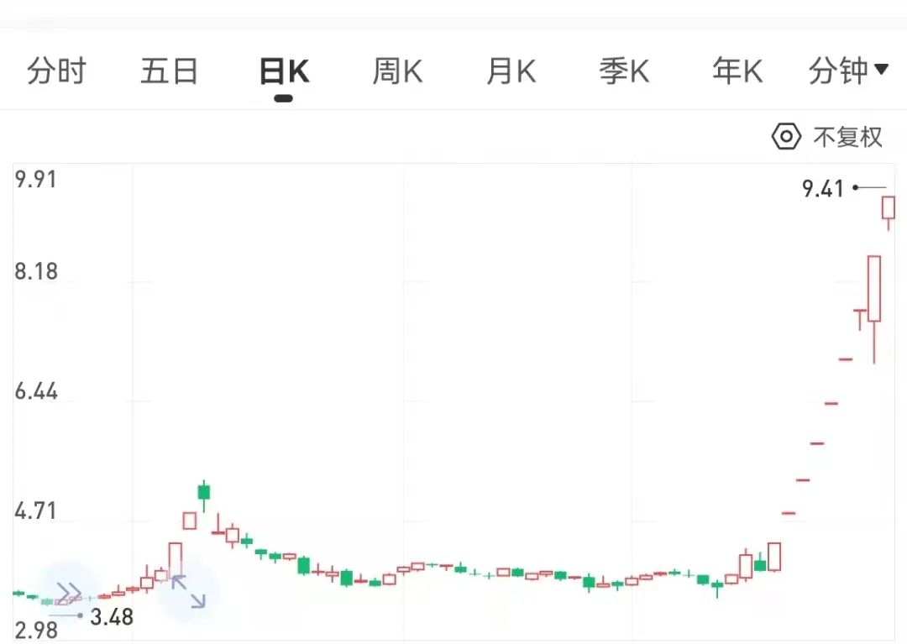
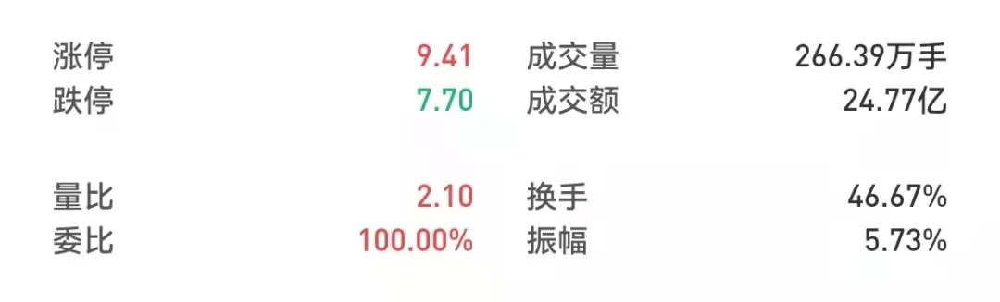
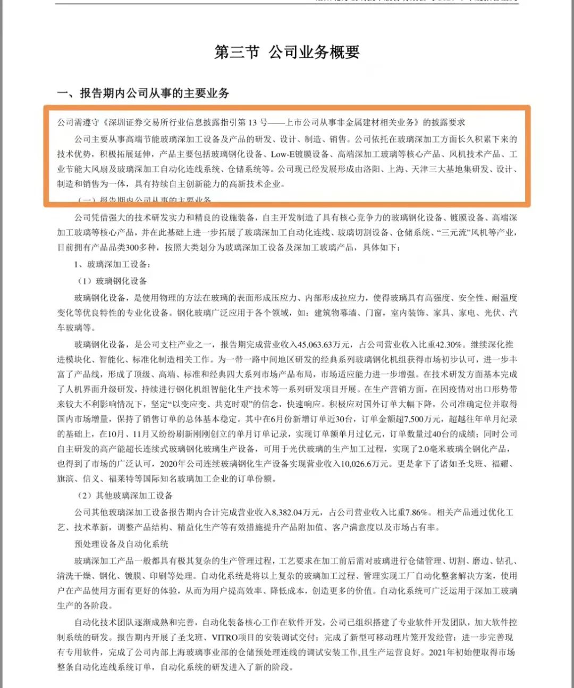
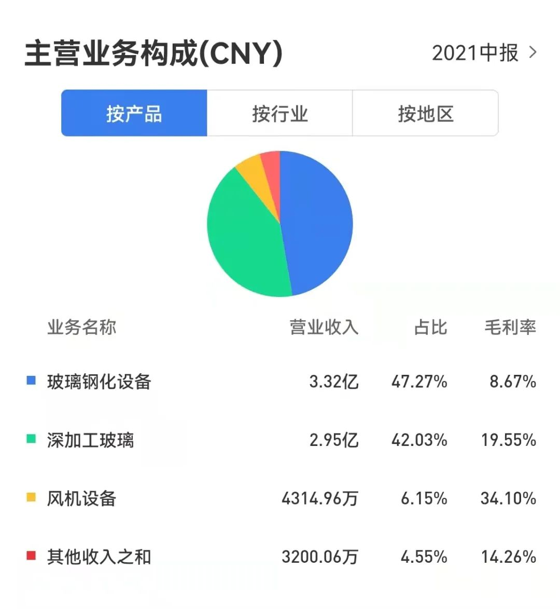
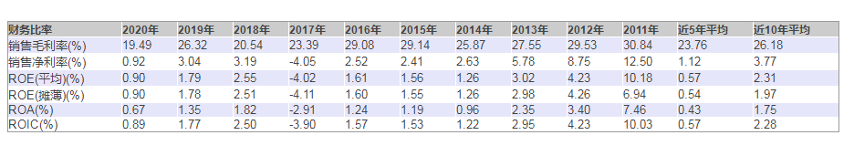
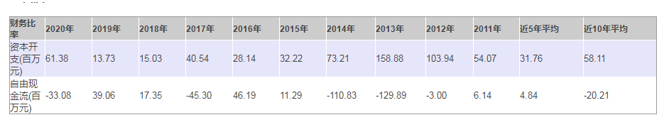
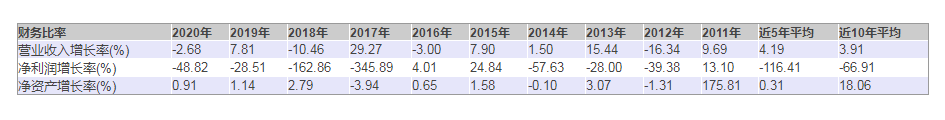
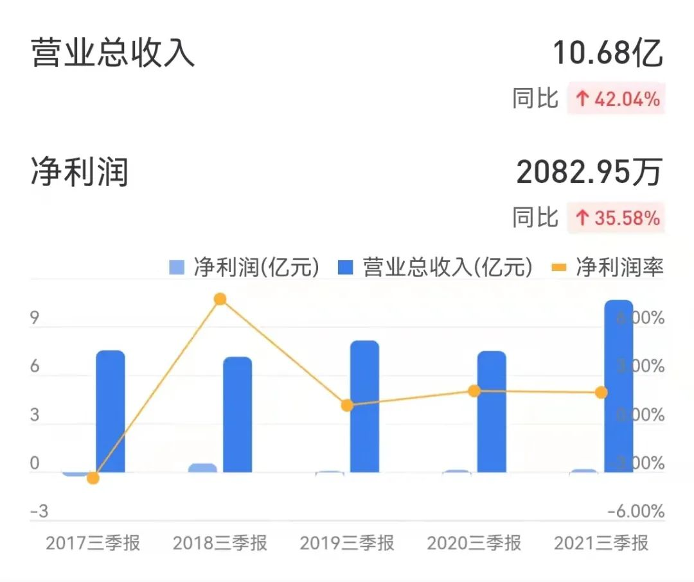
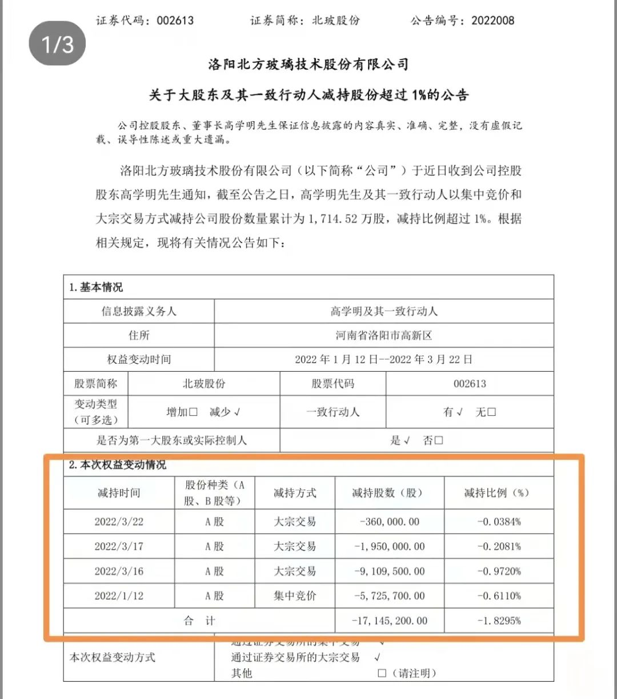

北玻股份已经 9 连板了。

在不到两个星期的时间里，向上狂拉接近 140%。

这是把中国股民全都当傻瓜吗？

（北玻股份日 K 线图）

最近两个交易日，基本都是天地板。

早上开盘后跌停，下午收盘前涨停。

一天一个 20CM 大震荡。

摇骚得不行。

（北玻股份 3 月 25 日交易数据）

3 月 25 日，一天的成交量高达 266.39 万手。

换手率竟然高达 46.67%！

什么意思？

意思是说，就这样的成交量、换手率，两天就能把大小股东们换他一个遍。

草！

这样的大数据之下，如果说没有人在其中兴风作浪，他女马的，打死我也不信。

这不是把中国股民全都当傻瓜了。

这是把管理层也全当成傻瓜了！

真不想好啦？

北玻股份何方神圣，引无数资本竞折腰？

（北玻股份年报截图）

甭管它讲的多高大上，说白了，就是做玻璃生产设备的。

非常普通的一个行业。

是什么高科技吗？

是什么新潮玩艺吗？

中国现在还缺玻璃吗？

还缺玻璃生产设备吗？

需要，但是都不缺，对吧？

（北玻股份 2021 年 H1 业务构成）

企业 90% 的营收来源于生产制造。

主营业务的毛利率连 10% 都不到。

就这样的行业，就这样的企业，何德何能，被市场恶炒呢？

（北玻股份整体盈利能力数据统计）

这是北玻股份最近 10 年的整体盈利能力数据。

果不其然。

毛利率最好的时候，也不过 30%，并且还逐年下降，现在连 20% 都不到了。

作为制造业，低于 30% 的毛利率，就是渣！

毛利率低，净利率怎么能好？

所以最近 10 年净利率平均值只有 2.31%，最近 5 年平均值则只有 0.57%。

2020 年，ROE 只有可怜的 0.90%。

这就是一家长期处在盈亏平衡线上的企业啊。

牛什么牛？

（北玻股份资本开支与自由现金流数据）

不盈利就不盈利吧。

资本开支还奇高。

自由现金流还这么差。

差到什么程度？

最近 10 年平均值是负数，最近 5 年平均值勉强转正。

完全一副不给股东创造任何价值的老衰样！

（北玻股份业绩增长率数据）

大家再看看这些年它的成长性！

过去的 10 年，几乎是一年不如一年啊。

（北玻股份 2021Q3 财报披露数据）

嗯，不错，2021 年三季报，看起来有起色。

但这也是站在 2020 年业绩腰斩基础上的反弹啊。

一个一向很难赚钱、一向经营不善、一年不如一年的企业，能突然之间大发神威、鸟枪换炮、翻天覆地、物是人非、时来运转吗？

你信，我不信。

大股东也不信。

这不，趁着连板，大股东精准减持了！

（北玻股份减持公告）

你们这样玩，不怕那啥吗？

烂股遭烂炒，然后又遇大股东精准减持。

这套路，在 A 股一再上演。

要说它正常，你信吗？

反正我不信。

我不信，又没办法，只好写出来，供大家思考和评判。

腾腾爸的想法很简单，就是希望这样的戏码以后在 A 股能少点，希望关注腾腾爸的朋友能少一点上当。

如果有坏人，希望它灾个殃倒个霉，这样我们才高兴。

小老百姓，也就这点心思了。

最后特别声明：本文所有数据，均来自于公司财报、公告及雪球、理财大视野等正规网站、正当出处。

如果财报不造假，我的数据就没有任何问题。

如果网站不造假，我的分析就没有任何问题。

## 原文

- [妖气冲天！快逃！](https://mp.weixin.qq.com/s/wb5EYmaHbplVGbj2mghxZA)
