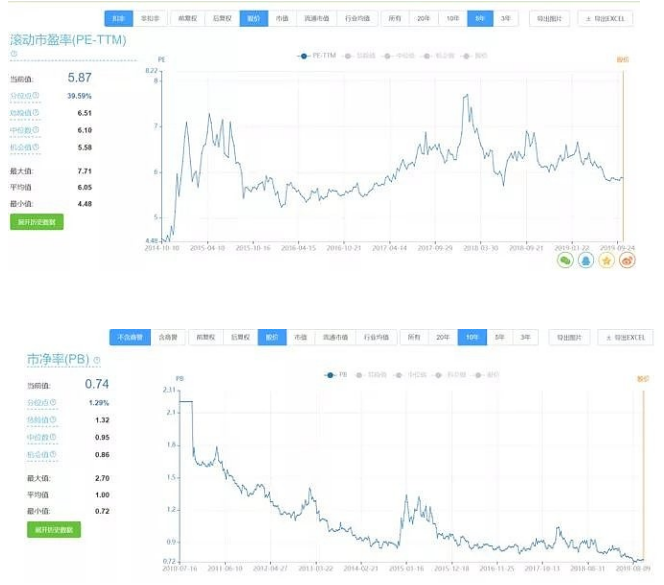

如何对于企业进行估值，市场上有很多的方法，自由现金流折现、PE、PB、PEV 等等，不同行业，大家采用的估值方法也不尽相同。

上面的几种方法我都用过，对于茅台，采用自由现金流折现及 PE 估值；对于银行股采用 PB 估值；对于保险股采用 PEV 估值。目前保险公司自己都倾向用 PEV 进行估值。但是经过在估值方面几年的研究，目前，我更倾向用基于自由现金流的 PE 估值。这个估值方法和自由现金流折现类似，因为最核心的部分就是自由现金流的确认。

为什么自由现金流折现是更靠谱的估值方法？下面我们以银行这种以货币资金为主要资产的行业举例看看其他估值方法存在的问题。

对于这个行业，大家习惯上用 PB 在估值，然后投资者发现银行一直低估，而且越来越低估。

上图是农业银行过去 5 年滚动 PE 和 PB，如果看 PB，我们发现农行目前的 PB 在历史最低值。但是如果看 PE，我们会发现农行的在机会值和中位数之间，并不是那么低估。

问题出在哪了？PE 不怎么变而 PB 越来越低其实表明银行的盈利能力在持续下降，ROE 在下降，对应同样的盈利，资产越来越重。

在 ROE 持续下降的情况下，PB 很难维持不变。而 PE 的相对稳定，表明市场看重的是银行的盈利能力，而不是资产。基本上是按照利润进行估值的。

很多人对于采用 PE 而不用 PB 给银行估值一直很纠结，他们认为银行的资产就是钱。理应采用 PB 估值。但是他们忽略了一点，由于无法破产清算，对于我们普通投资者来说，银行的盈利其实比资产更重要。

下面我们看一个例子，一个企业，如果初始资本是 1000 万，头一年的利润为 200 万，ROE 为 20%，每年都不分红，存留利润继续发展，但是后续每年都只能产生 200 万的利润。五年后，资产为 2000 万，利润还是 200 万。在第五年的时候，这个企业的 ROE 为 10%，应该说也不低。那么这个企业该如何估值呢。如果你不能对这个企业进行清算，这样企业的 PB 显然会持续下降；PE 估计也会下降，但是幅度会比 PB 下降得少。

为什么他的 PE 也会下降呢，这是因为他的利润不是自由现金流。利润是不能分配的，如果分配了，会导致来年利润下降。这样的企业像不像很多银行股。

这样的企业显然不能用 PB 估值，因为如果用 PB 估值，投资者将无法理解公司的 PB 为什么会出现下降。投资者看着 PB 下降会误认为企业低估了。

用 PE 估值也会有失真。如果一个企业存留全部利润后，来年利润都不能增长。这就意味着投资者等待一年后其实颗粒无收。这种情况下，这个企业不应该维持原有的 PE 不变。

应该用自由现金流进行估值，用自由现金流估值更能反映企业的情况。

巴菲特讲过自己现金流折现估值更多是一种估值思想，而不是真的要计算出企业的自由现金流是多少。因为很多企业的自由现金流是很难计算的。但是如果我们真要基于自由现金流去估值，那么还是要算一算的。

如果要对银行进行自由现金流估值，那么该如何计算其自由现金流呢。成熟的自由现金流计算公式（自由现金流＝净利润 + 折旧与摊销－保全型资本支出－营运资本追加）无法套用。

二马自己定义了一个银行股的自由现金流计算模型。这个模型也适合保险股，其实我认为也可以用于多数其他公司。但是使用时要注意其局限性。关于其局限性会在文末探讨。

自由现金流  = 净利润 - 为了确保第二年利润不下滑而存留的利润。

其实两种自由现金流的计算公式的核心思想是一样的。前者是基于企业运行的财务原理去计算的。其中减去保全型资本开支的理念是在净利润中减去需要维持来年利润不变的资本支出。而在我的自由现金流计算公式中同样是减去了维持第二年利润不下滑的当年利润存留部分。两种方式的区别在于，我是采用了只重结果，不看细节的方式。我只关注有一部分利润被存留用来维持企业利润不变，而不关心其具体用途。

在实际计算自由现金流时，我们还要考虑企业的分红及存留利润是用来维持企业经营，还是使得企业得到了扩张。基于这些因素，我对自由现金流计算公式做一个优化。

自由现金流 = 利润中分红部分（A）+ 未分配利润的自由值 (B)

我们认为分红全部是自由现金流。未分配利润中有多少是自由现金流要看其具体价值。

其中 B 的计算公式如下：

第二年盈利/ 首年 ROE - 第一年净资产

=（第一年盈利 + 第二年增加的盈利）/首年 ROE - 第一年净资产

= 第二年增加的盈利/首年 ROE

也就是说我是通过第二年公司 ROE 是否变化来判断存留利润的自由值。

针对这个公式，我们会有如下发现：

（1）如果第二年公司没有增加盈利，则表示存留利润都是不自由的。这部分利润只能存留来维护来年利润不变；

（2）如果第二年利润减少了，则不单存留利润是不自由的，已经分红部分也是不自由的。只不过公司把应该维持公司来年利润不变的当年利润强行分配给股东了；

（3）如果第二年的 ROE 不变，那么 B = 当年存留利润，表示存留利润全部是自由现金流。进一步表示公司如果不存留利润，第二年也能维持利润不变。这个时候的利润存留是作为扩张性存留；

（4）如果第二年 ROE 提升，那么 B> 当年存留利润，表示企业盈利能力加强，这个时候，自由现金流大于存留利润。表示即使利润全部分掉，公司都能实现增长。这种企业是自带飞轮的。例如，茅台，每隔一年其窖池资产都在增值；

（5）如果第二年 ROE 下降，那么 B< 当年存留利润，表示企业盈利能力下降，存留利润中只有部分是自由现金流。针对 ROE 下降的情况，有可能会出现

（2）描述的情况，不单存留利润都不是自由现金流，已经分红部分也不完全是自由现金流。而且还有极端情况，就是第一年的利润都不是自由现金流。

基于自由现金流 PE 估值的核心是自由现金流计算，至于 PE 给多少，要看杠杆率、资产质量、成长性及个人风险偏好。

关于我的自由现金流计算公式，这里进一步做一个说明。这个公式的好处在于简单、粗暴，好计算。特别是针对金融股这类没有办法用传统自由现金流公司计算的公司，算是引入了一个新方法。

但是这个方法也有缺点。他完全是基于当期利润，存留利润、未来利润的关系得出的。没有考虑利润本身的现金含量。例如，A 公司利润增长很好，但是利润都是应收账款，用我的公式会得出这个公司的自由现金流很好。但是用传统的计算公司会得出这个公司的现金流很差。

所以可能我的自由现金流不要叫做自由现金流，而是叫做有效利润会更好一点。因为我确实没有考虑利润中的现金流含量。

## 原文

- [基于自由现金流的 PE 估值法！](https://mp.weixin.qq.com/s/rgiLedUgKURyR5ckjosb-A)
