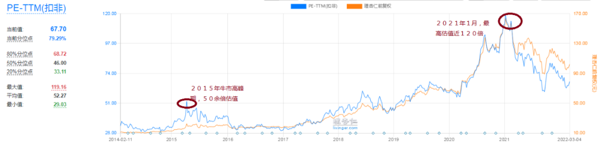
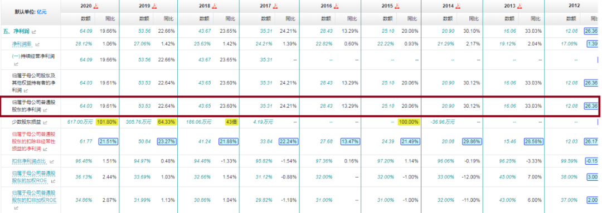
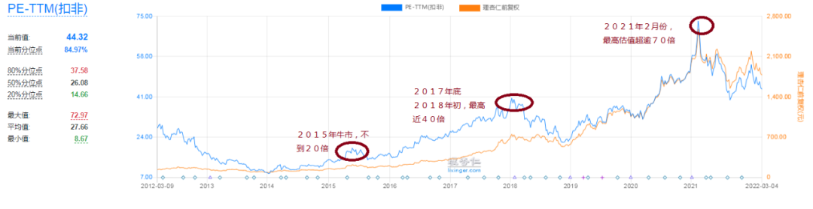
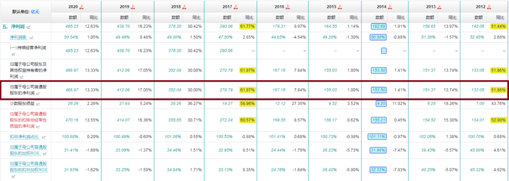
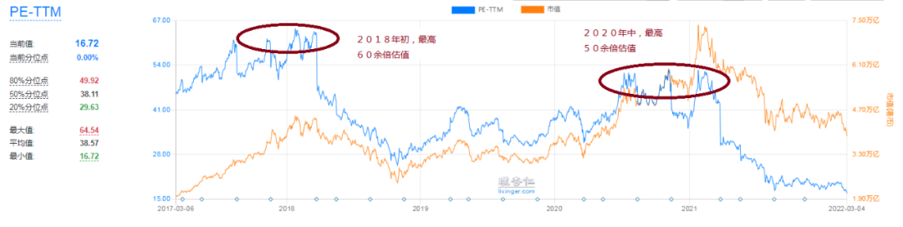
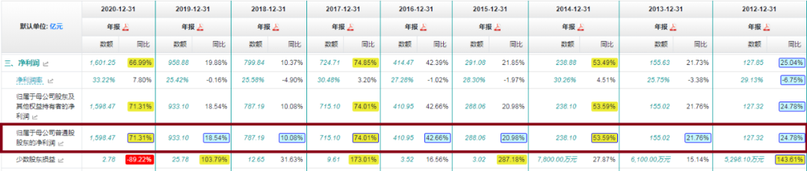

昨天的股票市场，跌出了股灾的味道。

隐形股灾已经完全显性化了。

半年前我提出隐形股灾及三段论概念时，质疑者众。

相信现在质疑者已经大幅减少了。

对目前的市场，我有两点基本的判断。

第一，隐形股灾显性化，这是股灾结束的开始；

第二，市场上存在的某些高估值股票，泡沫还没有挤干挤净。

开始结束的意思是，股灾已经趋近尾声。

泡沫未净的意思是，这些高估值股票还会反复曲折向下。

战略上不必悲观，战术上——我个人的意见，还是要尽量避免高估值泡沫股。

今天，我特意选择了三只历史上的赛道大牛股，对它们的过去、现在、未来进行一下分析。

也许可以给朋友们带来一点启示性思考。

## 第一只股票，海天味业。

调味品，消费股。

我们都知道这几年，消费股走出了一轮轰轰烈烈的大牛市行情。

这行情轰轰烈烈到了什么程度呢？

（海天味业估值走势图）

2015 年，牛市高峰期，海天味业的 PE 估值，最高 50 来倍。

2020 年到 2021 年，海天味业的 PE 估值最高被冲到了多少倍呢？

120 余倍！

什么意思？

比牛市还牛市，比高峰还高峰——此番的“赛道股”行情，就造了这么大的孽！

我从 2020 年下半年开始，连续撰文，反复提示赛道股风险。

当时海天为赛道股中最牛逼的一只，所以我就选中了它——当我写文章以海天为例警示它的泡沫风险时，趴在海天身上的那些投机者们，对我可是没少嘲讽。

当时几乎没有几个人相信，海天真有泡沫，海天真会下跌，海天真会杀估值。

侬，大家看到了，海天现在的估值，依然高近 70 倍！

跌了这么多，估值依然比 2015 年牛市高峰期高出一大截！

估值高，就一定是有泡沫吗？

这个当然不一定。

我们在谈论估值的时候，必须把成长性放在前提性的位置。

只要成长和估值相匹配，哪怕估值绝对值高一点，也不是问题。

（海天味业历年业绩数据）

这是海天味业历年归母净利润数据。

2012 年，海天归母净利润 12.08 亿；2020 年，这个数据是 64.03 亿。

9 年时间，业绩增长 4.3 倍。

年化复合增长 20.35%。

成长股，给 2 倍的 PEG 估值吧。

40 倍 PE，应该才是海天味业的合理估值。

事实上，过去 10 年，海天味业的中枢估值，就在 30-50 倍间波动，中位数基本上就 40 倍上下。

现在海天的估值还依然近 70 倍。

即便未来 10 年，它还能保持过去 10 年那样的高速增长，现在的估值也明显是偏贵的啊。

更何况，未来 10 年，它要是达不到过去那样的高增长水平呢？

这个问题，值得大家思考哦。

## 第二只股票，贵州茅台

过去几年，比海天更炙手可热的一只赛道大牛股，非贵州茅台莫属。

2015 年之后，我先后两次成功操作茅台，应该说我在茅台身上赚了不少的钱。

即便这样，当我提醒茅台的泡沫化风险时，依然备受压力与嘲笑。

可是你看它的估值走势，与海天味业何其相似！

（贵州茅台估值走势图）

2015 年，牛市高峰期，贵州茅台 PE 估值最高不到 20 倍。

但即便这样，股灾期间，它的股价也近乎腰斩。

我就是在股灾期间，第一次开始买入操作贵州茅台的。

2017 年底 2018 年初，在所谓的“白马股”行情中，茅台的估值最高冲到了 40 倍。

我就是在这段时间，开始卖出并最终沽清茅台的。

2018 年 10 月，茅台因为一个“糟糕的三季报”，估值又一度跌到 20 倍之下。

我即在 500 元上方，第二次大幅买入茅台，开始我的第二次操作。

2021 年 2 月，赛道股疯狂，茅台作为消费龙头的代表，估值最高被推升到了 70 余倍！

我即在这个期间，在 2100-2600 元股价间，分三次卖出了茅台 40% 的仓位。

这算是我第二次操作茅台的结束。

这段叙述是什么意思呢？

喷子看到的是：腾腾爸又在说他多么多么牛逼。

实际上我想表达的意思是：2015 年水牛行情中，茅台的最高估值也不过 20 倍，2018 年它却被吹到了 40 倍，2021 年它又被吹到了 70 倍。

呵呵，跟海天味业一样，这泡沫大的，可不是一点半点！

腾腾爸是一个言出行随、知行合一的人。

我在 2020 年底、2021 年初撰文提醒茅台风险后，就逢高梯次减仓茅台。

我的这番减仓操作，同样备受质疑和耻笑。

当时疯狂的茅粉们，是这样评价茅台的：茅台这样的股票，什么样的价格买都不是问题，你有钱只管买就行了，哪还用什么策略？

最疯狂的时候，一些知名的茅粉大 V 还出现了集体围攻谩骂董宝珍的“盛况”！

其实董宝珍只做了一件事情——他说：茅台贵了。

就这么一句话，差点没让人骂死。

呵呵，典型的因言获罪。

人性的疯狂啊，就是那么让人叹为观止！

现在茅台多少倍的估值呢？

40 余倍！

这个估值是高还是低呢？

（贵州茅台历年业绩数据）

2012 年，茅台归母净利润 133.08 亿；2020 年，茅台归母净利 466.97 亿。

9 年时间，业绩增长 2.51 倍。

年化复合增长 14.97%。

成长股，也给 2 倍的 PEG 估值吧。

茅台 30 倍上下的 PE 估值，应该算是合理的吧。

但它现在是 40 余倍的估值。

并且 2021 年的业绩增长率已经下滑到了 10% 上下。

未来 10 年，谁能保证它还能像过去 10 年那样，维持在 15% 以上的年化复合增长呢？

即便能达到这个水平，现在的估值水平，也不能叫低吧？

当然，按静态的估值计算，做一点线性外推，茅台现在应该比海天要便宜很多。

它的估值泡沫，远远没有海天那么高。

这就是我现在还持有一点茅台但对海天还无动于衷的根本原因。

曾经严重泡沫化的赛道股，现在都还贵、都还不能碰吗？

也不尽然。

比如下面这一只——腾讯控股——我就认为，它现在已经非常非常便宜了。

## 第三只股票，腾讯控股

（腾讯控股估值走势图）

2018 年初，腾讯控股 PE 估值最高 60 余倍。

而后持续滑落。

2018 年中，一度滑落到 25 倍上下。

我就是在此时建仓并陆续大举加仓腾讯的。

2020 年到 2021 年，腾讯控股在赛道股狂欢中，估值再一次被冲高。

最高时超逾 50 倍。

今天它是多少了呢？

滚动 PE，不到 20 倍，只有 16－17 倍的样子。

跟海天和茅台相比，整体上，腾讯明显走了一个反向的运动。

过去这五六年，海天、茅台的估值是越吹越高，至今还处在相对的高位，而腾讯的估值则是阶梯性下降，至今已经创下上市以来的最低历史记录了。

但是它的业绩增长，似乎并不差——

（腾讯控股历年业绩数据）

2012 年，腾讯控股归母净利润 127.32 亿；2020 年，这个数据是 1598.47 亿。

9 年时间，增长 11.55 倍。

年化复合增长 32.46%。

成长股，给 2 倍 PEG 估值，没问题吧？

但它现在只有 16 倍估值。

哪怕未来 10 年，它业绩增长下降一半，只有 15% 上下，给 30 倍的估值，没问题吧？

孰高孰低，难道不是一目了然吗？

今天的文章，写到这里，又有了吹票的嫌疑。

我知道，一众喷友，要么修行尚浅，要么有理解力障碍，所以，干脆，好人做到底，我就把我今天文章的中心思想再给大家总结归纳一下吧：

## 总结

1、对投资而言，看估值是有意义的。

远远超过成长性的估值，一定是风险。

根本原因就在于，当软杀估值不力时，市场一定会通过硬杀的方式来降低估值。

牛逼如茅台海天者，不一样跳不出这条规律的窠臼吗？

2、同样是下跌，下跌跟下跌是不一样的。

泡沫没挤净，股价还在价值区之外，股票再下跌也不能买。

泡沫挤干净，股价已在价值区之内，股票就应该越跌越买。

3、目前的市场，还是处在极端的失衡中。

哪怕都是好企业，都处在好赛道，有的已经能买，并且可以大买特买，而有的，则还是不能买，还需要继续耐心等待！

4、投资者关注的焦点，应该是价值，而不是股价。

对那些好企业的股票，我们是因为股价有泡沫了才看衰的，是因为股价下跌得便宜了才买入的。

而不是相反。

正如腾讯，是因为它下跌了腾腾爸才买，而不是因为腾腾爸买了它才下跌。

连因果关系都搞反了，你还阅读个毛的公众号，你还搞个毛的投资？

## 原文

- [跌残了，还牛吗？](https://mp.weixin.qq.com/s/rpwiBZPeBEASARrX-Gdbzw)
