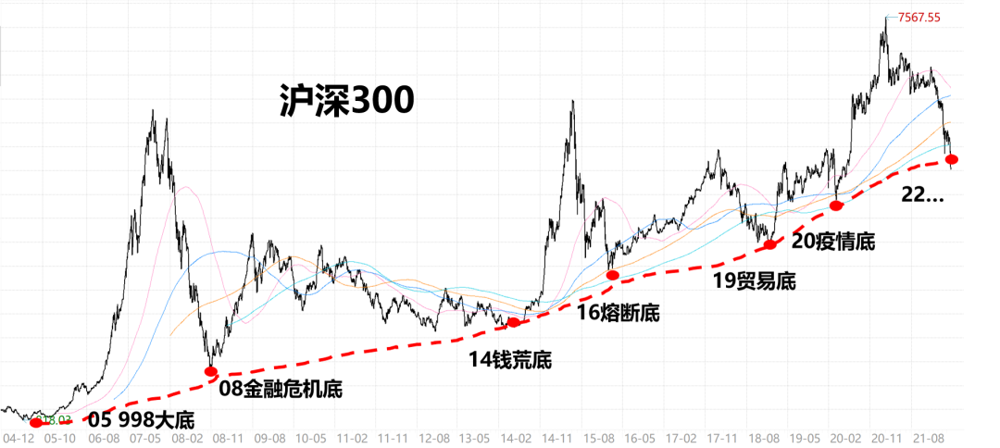
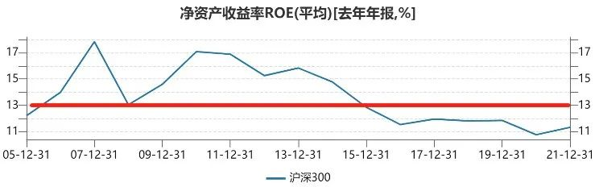
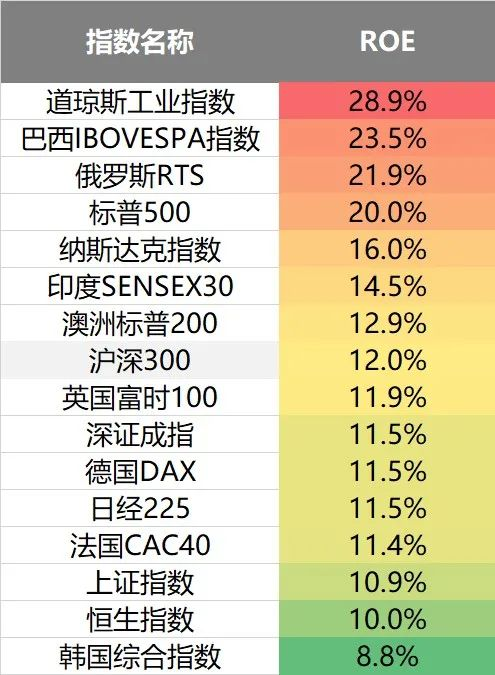
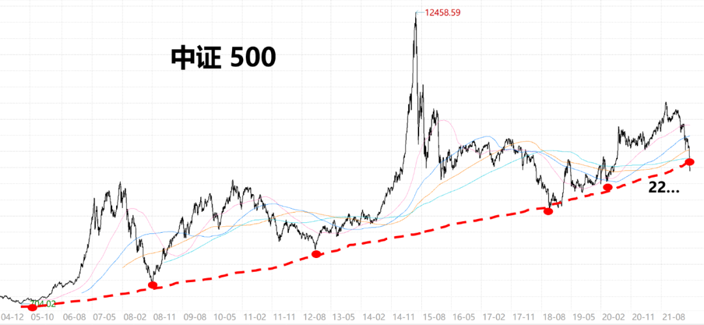
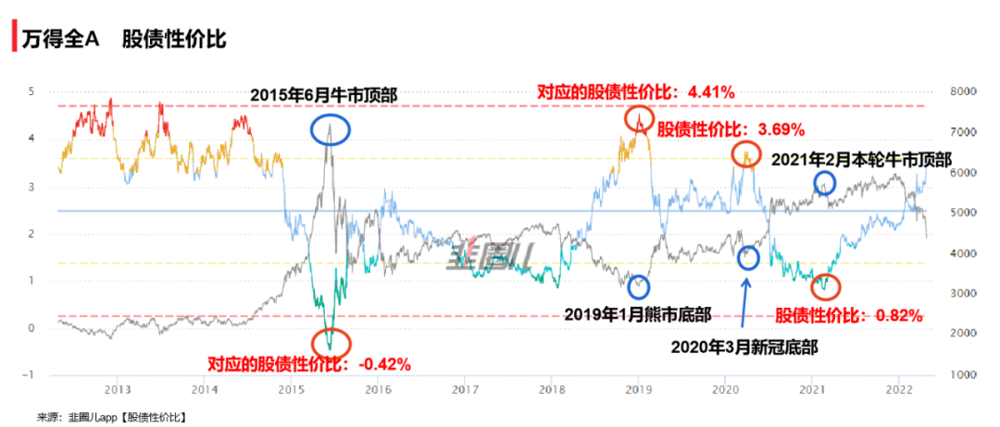

最近有点不讲理下跌节奏了，看数据发现还是自己人干的好事。

因为北向外资今天是正流入 15 亿的，昨天也没跑多少，那跑的就是咱们自己了...

从年初最高位到现在，宽基方面领跌的还是创业板。

创业板指从最高位已经跌 40%，宽基都跌成这样，毫无疑问已进入大熊市（科创 50 腰斩更不用多说）…

不过因为创业板前期涨的多，所以距离 20 年 3 月的疫情底还有 10% 左右涨幅。

同理，上证指数、沪深 300 这些宽基，基本都比 20 年的疫情底稍微要高一点。

但注意，咱千万别固执认为，每一次熊市都会跌破上一次的底。

反之，拉长看，因为企业利润在增长，A 股历史上每一次新的大底，基本都会逐级抬升。

咱以沪深 300 全收益指数为例吧。

20 年疫情底是 4505 点
19 年毛衣底是 3699 点
16 年熔断底是 3367 点
14 年钱荒底是 2339 点
08 年金融危机底是 1686 点
05 年 998 大底是 818 点

如果把这几个数据连成一条线，大致就是一个年复合增长 12.5%，y=1.125^x 的指数函数曲线（ps:目前最新是 5020 点）

这个数据也恰好和过去十几年沪深 300 的 ROE，13% 左右基本一致~

什么是 ROE 呢？

通俗的说，就是“赚钱效率”。

比如我一家店投入 10 万，每年给我赚 1 万，就是 ROE 为 10%，每年把赚到的 1 万再拿来不断投新店，那么假设估值不变，企业长期就会以 10% 的市值增长了。

参照沪深 300，近十五年的平均 ROE 净资产回报率是 13% 左右，刚好和 12.5% 非常接近。

所以时间拉的足够长来看，股市的回报率就约等于其长期 roe 平均值~

20 年疫情底是 3530 点，距现在已经过去了两年。

如果按照 12.5% 的增速计算。

目前沪深 300 全收益指数的新底，理应为：4505×1.125^2=5700 点

可实际上，沪深 300 已经跌到 5020 点了。

也就是低于了理论值的 12% 左右。

当然，这两年因为疫情的缘故，实际企业的利润增长放缓了不少。

但即便我们保守用 5% 的增长来计算，4505×1.05^2=4966 点。

也只和目前的沪深 300 相差不到 1%。

也就是说，就算按照保守增长预期，沪深 300 也是已达到底部区间的~

可能有人说，因为人口老龄化这些问题，以后沪深 300ROE 还会不断下滑到很低的值。

那沪深 300 未来能不能保持不错的 ROE 呢？

我看了全球不少指数，目前的 ROE 基本都是保持在 12% 左右，沪深 300 恰好处在中间的水平。

即便很多国家经济增长已然不行了，同样深陷老龄化危机，但实际上大多个股的 ROE，还是可以稳定在一个不低的位置。

而相比全球很多动辄 12% 以上的股指，显然我们的经济增长更有韧性。

最重要的是，这里面的非 A 股指数，虽然大多 ROE 不错，但估值都比较高，存在杀估值的风险。

而 A 股的估值却已经基本到底了~

其实用同样算法去推导，目前的上证指数 2886 点，还是中证 500 的 5234 点，都基本处于底部。

比如中证 500 目前所处的情况，也已击穿了既有斜率的增长曲线的底部…

不过还是要提示，短期波动无法预估，毕竟底部虽然可以连成一条线，但继续往下摆一段位置也是完全有可能。

但毫无疑问，现在的点位，拉长看就是宽基的大坑~

还是希望大家伙们，每一轮大底，都有无数理由看空，千万不要在最艰难的时刻放弃 A 股。

你真受不了它的高波动，等下波周期高位告别也行，但别选现在，否则等到数年后，很可能要追悔莫及...

…...

此外大家都知道，市场的顶部和底部是难以预测，但是咱们可以通过观察一些客观数据来告诉我们市场处在什么样的位置，该如何操作。

分享判断市场中长期性价比的靠谱指标 --- 股债性价比。

我们的投资大部分就是两种底层资产：股票和债券。

大部分基金经理也是观察这两种资产的性价比去做资产配置。

这个指标很好理解，就是根据估值比较两种资产之间的预期收益水平差距，这个值越大说明股票资产的吸引力越大，预期未来的收益率越高，对应我们的操作就是应该提高股票类仓位，反之值越小越应该降低股票类仓位。

以万得全 A 指数为例看股债性价比，历史数据告诉我们，股债性价比的这个数值大小，对市场阶段性顶部和底部都有不错的指导性。

大家有兴趣的可以扫下面二维码或阅读原文去围观一下更多的历史数据。

扫码查股债性价比，感兴趣的小伙伴可以点击阅读原文下载 app 体验。
