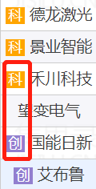

首先，大家要知道。

打新股本身是有门槛的。

只有买入一定市值的股票，且持有超过 20 天，才有资格打新。

买入的股票越多，可以抽的签就越多。

（等于中签机会大一些）

目前 A 股有 2 个市场，分别是沪市和深市。

打新是分开计算的。

也就是说，要想打沪市新股。

需要买入沪市股票 1 万元以上且持有 20 天以上，才能参与沪市打新。

深市同理。

不清楚有多少额度的小伙伴，

可以查下券商 APP 或问券商客服。

现在有条件打新股了，那如何避开破发的新股呢？

我统计了近期上市的新股情况。

从 1 月开始，截至目前一共破发了 27 只新股。

其中最多的一只亏 2 万，最少的也亏了 600 块。

观察破发新股的情况，发现了几个特点。

我们一个个来说。

## 第一个特点：破发均为科创板和创业板的新股。

目前没有主板（沪市深市）的新股破发。

第二个特点：发行 PE 远高于行业 PE。

这 27 只，除了 7 只无发行 PE 数据外。

19 只发行 PE 明显高于行业 PE。

由此可见，

发行 PE 明显高于行业 PE 时，破发风险较高。

有小伙伴疑惑：有 1 只是低于行业 PE 的。

万一打中了怎么办？

这一只低于行业 PE 的新股有些特殊。

大概率是自身成长性不佳导致的。

其中牵扯的股票知识有些多。

可以从 20、30 页的招股说明书中，发现公司成长性的问题。

但花了个把小时看招股说明书，最后得出的结论：

不能打……

咱们只是打个新股，没有必要研究这么细。

有这个时间，看看书、打打游戏不好嘛？

而且根据第一个特点，也是可以排除的。

第三个特点：发行价格较高。

把 27 只新股发行价格由高到低排序可以发现：

有 16 只超过 50 元，占比 59%。

而低于 30 元的股票仅 2 只。

由此发现，发行价格越高，破发风险越高。

## 总结一下

1、科创板和创业板破发较多，而主板目前还未出现。

优先考虑主板新股。

2、发行 PE 高于行业 PE 破发风险较高。

优先考虑发行 PE 小于行业 PE 的新股。

3、发行价格越高，破发风险越高。

优先考虑发行价低于 50 的新股。

这几个指标结合起来，打新前筛一遍大概率能避免破发。

倘若对某只新股感兴趣或者不小心中签了。

可以去看招股说明书。

了解下公司发行 PE 是怎么定出来的，

公司所属行业、同行情况，以及 21 年业绩同比 20 年是什么情况等信息。

啥，你说不想翻几百页 PDF，根本看不懂、看不下去？

那更简单，要么全都不打，要么就打打主板新股嘛。

有时候，运气真的能让我们避免亏钱。

毕竟这新股也不是想中就能中的。

说完了 3 个小技巧，那怎么查呢？

接下来手把手演示一下。

## 如何查询数据

首先有请我们的老朋友——集思录。

欸，这不是查可转债的网站吗？

连新股都能查？

难道你没听过有首歌是这么唱的：

多的是你不知道的事~

第一步：首先百度【集思录】。

第二步：点击【实时数据】-【新股】，这样就能看到近期新股情况了。

第三步：看名称前面标注。

标有“科”“创”字样就代表是科创板、创业板新股。

没有标记的就是主板（沪市或深市）新股。

第四步：查看发行价以及发行 PE。

以 4 月 26 日申购的铭科精技为例。

首先看前缀，没有任何前缀，说明是主板新股。

发行价为 14.8，比起动辄 50+ 的发行价格，是比较低的。

接着看发行 PE 为 22.9，行业 PE 为 26.5。

虽然相差不大，但发行 PE 是低于行业 PE。

（以上数据来源集思录，仅作为展示，不构成任何投资建议）

综上，这只新股破发概率较小。
