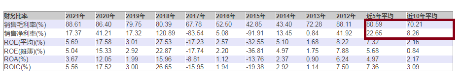
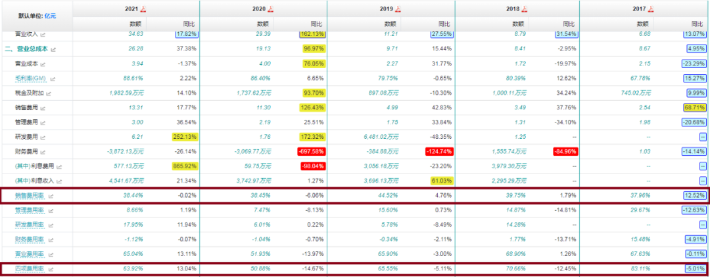
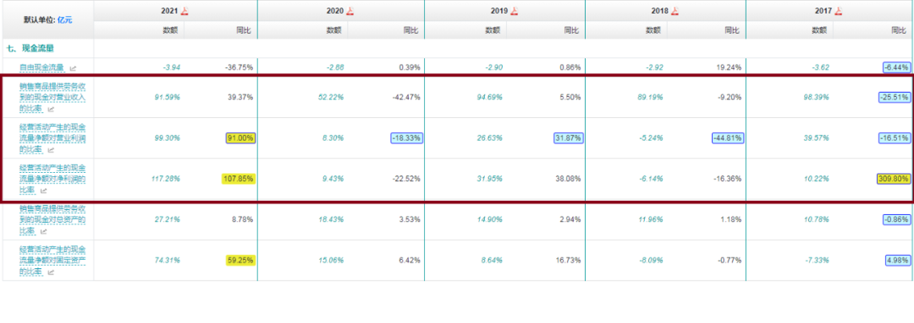
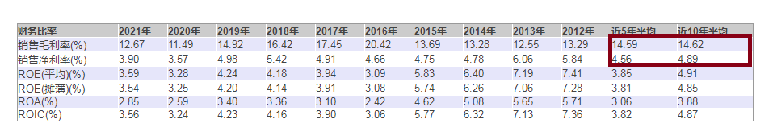
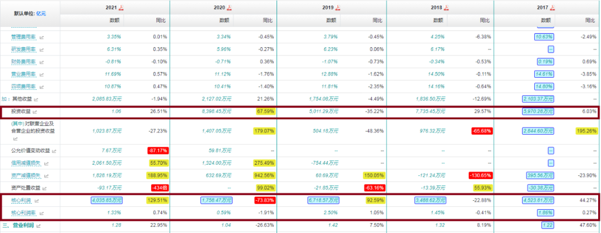
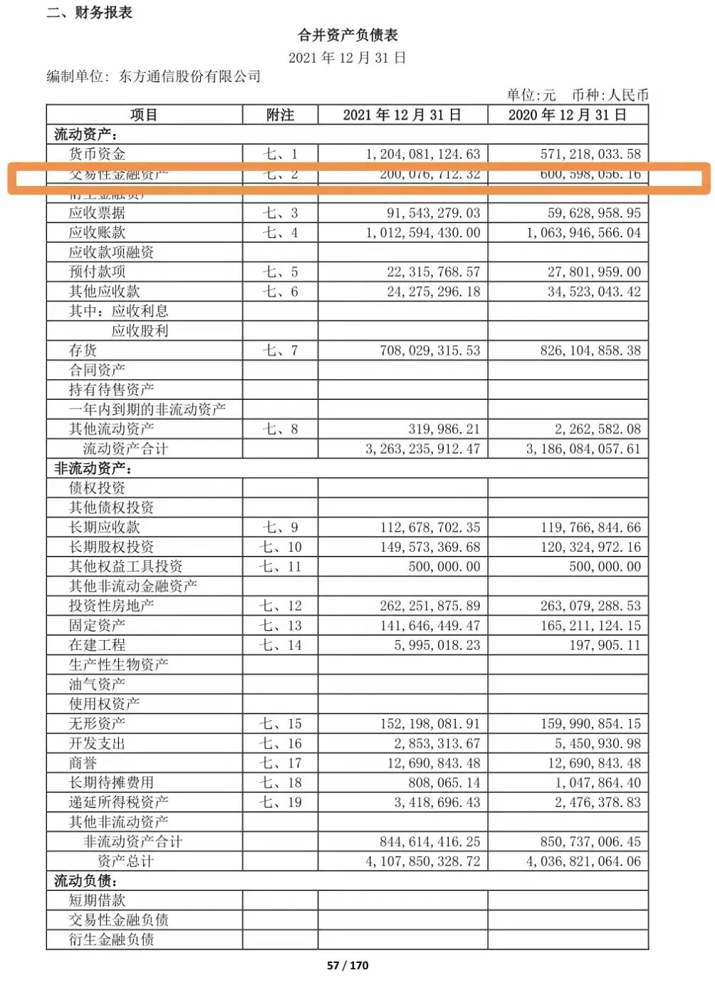
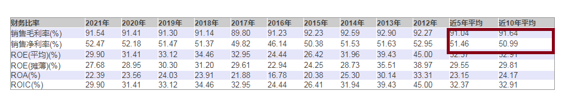
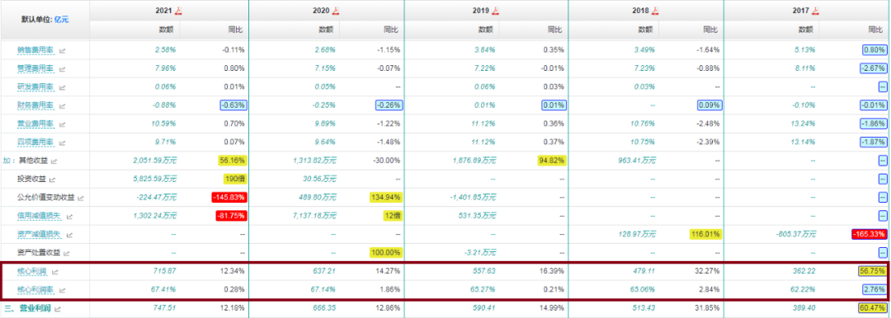
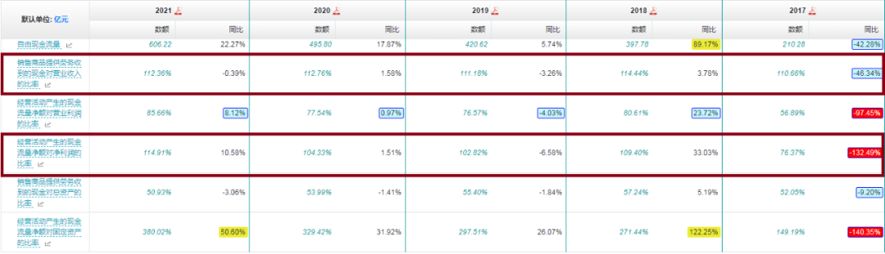

看企业财报，一个最重要的财务指标，叫 ROE，即净资产收益率。

但 ROE 又跟三个指标有关系，利润率、周转率、杠杆率，都能决定着 ROE 的起伏高低。

所以通过拆解 ROE，我们又可以把企业分为效益型（利润率高）、效率型（周转率高）和杠杆型（杠杆率高）三类。

价值投资者最喜欢的是效益型企业。

因为利润率高，说明产品有垄断性，掌握定价权，商业模式可能有着某种天生的特别的优势。

基于这些逻辑和认识，投资者在择股时，对企业毛利率这个指票，就格外的关注。

久而久之，只要毛利率好就是企业好，成了某些人的执念和共识。

重视毛利率是对的，但只重视毛利率，是会陷入误区的。

举两种常见的情形，跟这种执念唱唱反调。

第一种情形：毛利率高，不一定净利率也高。

典型代表，沃森生物。

（沃森生物利润率数据统计）

沃森生物 2021 年，毛利率高达 89%，但净利率只有 17%。

最近 10 年平均毛利率高达 70%，但平均净利率只有 8%。

毛利率高得可以比肩茅台，但净利率却泯然众人矣。

何也？

我们分析分析它的利润表结构，答案就一目了然了。

（沃森生物利润结构）

产品毛利率是高，但销售费用也高。

最近五年，沃森生物的销售费率始终在 40% 上下徘徊。

也即营收中的 40%，是用来推销产品的。

这样的商业模式，焉能不侵害毛利率。

所以它的超高毛利率，是伪超高，不是真正的超高。

销售回款再不好，那企业经营就会非常困难了。

（沃森生物经营现金流比率）

大家可以扒拉扒拉数据。

沃森生物的回款就不是太好。

销售侵蚀，再加回款欠缺。

仅凭此两点，我们基本上就可以否定沃森生物这只股票。

管它生产什么的呢？

管它多少估值呢？

企业品质不行，敬而远之！

你看，毛利率高，不一定是好企业吧。

第二种情形：毛利率不高，不一定净利率不高。

典型代表，东方通信。

一般而言，制造业，毛利率低于 30% 就很危险。

低于 30%，减去成本减去研发减去三费，基本上就很难再有利润了或者利润很微薄了。

（东方通信利润率数据统计）

东方通信 2021 年毛利率不足 13%，净利率大约 4%。

最近 10 年平均毛利率不到 15%，而平均净利率约近 5%。

沃森生物 10 年平均毛利率可是 70%，而平均净利率才 8%。

这样一对比，就可以知道东方通信以不足 15% 的毛利率取得将近 5% 的净利率，是多么不容易。

那么东方通信是怎么做到这一点的呢？

（东方通信利润结构）

大家看，东方通信这些年核心利润一直非常低，营业利润的绝大部分，主要来自于投资收益。

以 2021 年为例，东方通信通过主营业务获得的核心利润（即营收减掉成本，减掉三费，再减掉研发，所得到的利润额）只有 4000 万元，而投资收益则高达 1.06 亿。

为了搞懂东方通信的投资收益来源，我又顺线检索了东方通信的资产负债表。

（东方通信 2021 财报截图）

东方通信资产端，货币资金高达 12 亿，然后各类投资性金融资产高逾 6 亿（交易性金融资产 2 亿 + 长期股权投资 1.5 亿 + 投资性房地产 2.6 亿）。

投资性资产中，相比 2020 年，只有交易性金融资产有异动。

2020 年，交易性金融资产 6 亿，2021 年只有 2 亿。

卖掉的这 4 亿，大概率就是 2021 年这 1.04 亿投资收益的主要来源。

同时 2021 年的货币资金比 2020 年多出了 7 亿，其中 4 亿应该也是交易性金融资产的贡献。

我没有细看附则，分析这块资产变化，主要是银行理财产品的进出演绎。

东方通信账上有这么多现金，未来如果没有更好的投资，估计还会继续进行银行理财的买卖。

这样一番分析下来，我们可以给东方通信的经营大致画像：

1、主业不振；

2、投资来凑；

3、最终的经营成果是，ROE 勉强为正。

写这篇文章的时候，我发现东方通信最近一个交易日的股价居然是涨停了。

我不知道因为什么原因，但无论因为什么原因，我都不会心动。

这样的企业赚钱太难了，无法吸引我。

就这么简单。

通过上述两种情形分析，我们可以得出的结论是：

1）毛利率高的不一定好，但毛利率差的一定不好；

2）净利率高的不一定好，但净利率差的一定不好。

听起来有些拗口，可以综合归纳一下：企业利润率高的不一定好，因为你还得分析它的利润结构、利润来源；但长期利润率低的企业，一定不好，要记得躲开。

通过毛利率、净利率择股，最优解是什么呢？

当然是毛利率、净利率双高的企业。

典型代表，贵州茅台。

（贵州茅台利润率数据统计）

茅台的毛利率长期维持在 90% 以上，而净利率则长期维持在 50% 以上。

优秀的企业，就是这么任性，就是这么牛掰。

我们再来看看茅台的利源分析——

（贵州茅台利润结构）

贵州茅台的核心利润率长期维持在 60% 以上。

2021 年，茅台营业利润共 747 亿，而核心利润就达 715 亿。

核心利润对营业利润的占比高达 95.7%。

主营业务呱呱叫。

再来看看它的利润质量——

（茅台经营现金流比率）

卖多少货，回多少款。

活脱脱的现金奶牛画像。

这就是茅台。

好了，今天围绕着毛利率、净利率话题，聊了这么多，我们从中可以得到哪些启示呢？

第一，任何一个财务指标，都不能单独使用。

任何一个指标，意思就是所有的指标。

我的意思是，所有的财务指标都不能单独使用，单独使用都会有可能掉坑。

再好的指标，只有与其他指标一块使用，使之成为一个综合考评体系，才能最大化地发挥作用。

不仅毛利率、净利率，那些迷信 ROE 的同志们，也应该对此有所警示。

第二，利润表，比大家想像得还要重要。

这些年，一些讲财报的书，可能是为了突显资产负债表和现金流量表的重要性，不断地给我们灌输这样一种观念：菜鸟关注利润表，老手关注负债表，高手关注流量表。

久而久之，给大家一种印象，好像利润表不是那么重要似的。

通过今天的分析我们可以看到：通过利润表，我们可以还原利润生成的全过程。

在毛利率和净利率之间，连接着一个动态的利润结构图。

通过这个动态的利润结构图，我们可以相对准确、全面地给企业的整体经营画像。

负债表、利润表、现金流，就像机械制图中的三视图，它们本身就是一个有机的整体。

是从不同的视角、不同的侧面来记录和表述企业。

只有把它们合在一起，才是事物的全貌。

所以它们本来就是有机统一、缺一不可的关系。

投资者在阅读财报时，绝对不要厚此薄彼。

第三，市场上真正优秀的公司，很少。

财务分析搞得越久，对投资标的的选择就会越少。

因为市场上绝大多数的企业，是经不起全方位推敲的。

考虑进市场因素（估值），可选标的会更少。

我讲这段话有两层意思。

一层意思是说，那些追热门板块进行炒作的，本身就很蠢。

不可能一个板块里全是优秀的好企业。

另一层意思是说，那些买来卖去的人，更蠢。

因为全市场之中，真正的好企业就那么几只。

你瞅准好企业（品质），找个合适的时间点（估值），买进去，躺着就行了。

买来卖去的操作，就是典型的零和游戏。

整体上不会赚到什么钱。

好企业也会有波动。

并且向下波动的时间可能还会很久。

但最终会向上波动，并不断地创下新高。

放长周期看，还是好企业带给大家的投资回报更大。

因为好企业会赚钱，赚的钱会越来越多。

业绩会推动着股价不断向上。

## 原文

- [重磅！分析毛利率净利率，寻找好股票！](https://mp.weixin.qq.com/s/0h4I1q-LU1mIfXmI53O_TQ)
