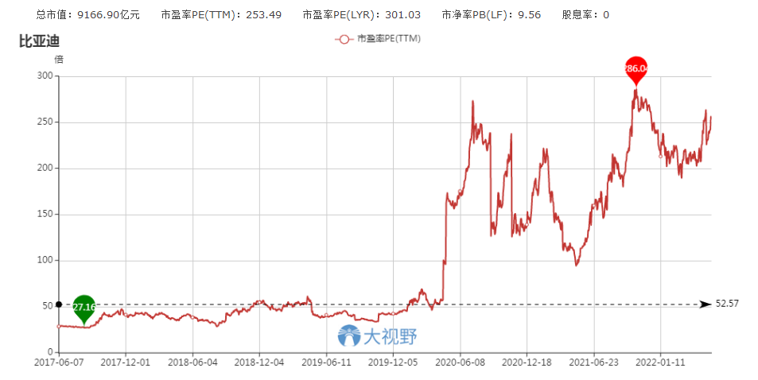

这是一个网友给我发的信息：比亚迪涨疯了，我想买点，可以吗？

下面是我的回复：

第一，明知它已经涨疯了，你才想起来买，是不是晚了点呢？

第二，我 40 元买过比亚迪，60 元时就卖掉了，而它现在 300 多元，我完整踏空了比亚迪——你向一个完整踏空了比亚迪的人请教这样的问题，合适吗？

不过，和网友的这番交流，也有好处。

最大的收获就是我知道今天文章的题目和所要聊的话题是什么了。

实事求是地说，这个时候聊比亚迪，得冒很大的风险。

因为它正热门，一切和它唱反调的人，都有被骂、被围攻的极大可能。

更重要的是，从我的角度看问题，比亚迪又是一个非常复杂的所在。

可以确定的是，它是一个社会价值极大的企业。

电动车，刀片电池，民族工业。

身前身后，贯穿着长长的一大串产业链。

作为行业龙头，它甚至肩负着我们国家在电动车领域弯道超车的历史重任。

我家里去年底买了一辆电动车，使用感受极好。

电动车确实是一个可以改变社会生活图景的新赛道。

但是，站在二级市场小股东的立场，我又知道它的商业模式有着天生的缺陷和不足。

不是一家特别好赚钱的企业。

也就是说，社会价值极大，而商业价值不足。

至少，不是长线价值投资的好标的。

（营收、成本及毛利率）

你看，它的毛利率一直不算高。

长期维持在 20% 以下。

制造业，毛利率低于 30%，净利润就不会太好看。

因为成本之外，还有四费及税金支出。

（四项费率）

不到 20% 的毛利率，再减去税金及超过 10% 的四项费率，可想而知，剩下的利润空间还有多少呢？

（核心利润与核心利润率）

减七减八，比亚迪由经营活动取得的核心利润就变得非常微薄了。

核心利润率长年勉强为正。

只有可怜的 2%－5%。

（净利润与净利润率）

自然，净利润和净利润率也高不到哪里去。

再往下延伸，ROE 数据也不会多看好——

（ＲＯＥ）

长期看，投资者的收益率，近乎于企业的 ROE。

如果比亚迪始终保持这样的 ROE 水平，请问你会满意吗？

（现金流比率）

汽车行业是典型的重资产行业。

资本开支高，而自由现金流差。

这两年，比亚迪的自由现金流得到了很大的改善。

可能意味着前几年那样的凶猛扩张暂告段落。

回款看净现比，可以高达十几倍。

但它的净利率实在是太低了，所以这样的净现比是严重失真的。

这种情况下，看收现比（经营性现金流净额/营业收入）更能反映真实回款情况。

侬，大家看到了，比亚迪的收现比，很少有超过 100% 的时候。

不算太差，但绝对称不上特别地好。

（PE 估值走势）

比亚迪目前最大的槽点，就是估值太高。

二三百倍的估值，得多大的成长性才能匹配呢？

上汽集团一年 250 亿的利润，支撑着 2000 亿的市值。

比亚迪现在是三四十亿的利润，支撑着上万亿的市值。

2021 年，中国整个汽车产业大约实现营收 4 万亿。

按 5% 的净利润率计算，全国所有的重点车企加一块，顶多获得 2000 亿的净利润。

假设未来 10 年，电动车对旧能车实现 100% 替代，全国其他所有的车企都倒闭，只留下一家比亚迪，而比亚迪也能实现一年 4 万亿营收、2000 亿利润——成熟型企业，给 10 倍估值是合理的吧？

那么 10 年后比亚迪的市值也就 2 万亿上下。

若此，现价买入比亚迪，还有多大收益空间呢？

况且，一统江湖并不代表全国唯一。

10 年后它的归母净利润可能连 1000 亿也达不到呢？

## 原文

- [这股涨疯了！还能买包？](https://mp.weixin.qq.com/s/RGqfeHS0xEMrpwTzGtu0Wg)
