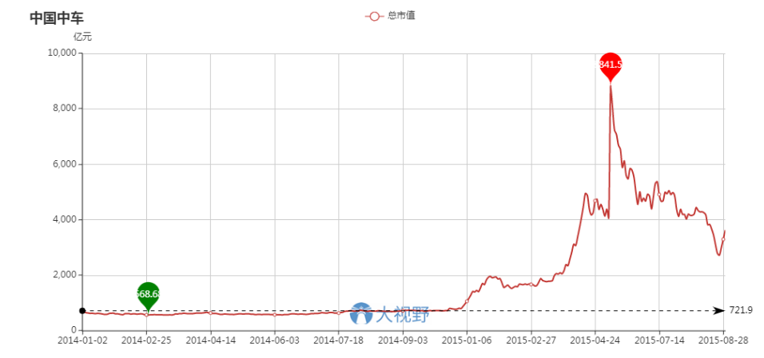
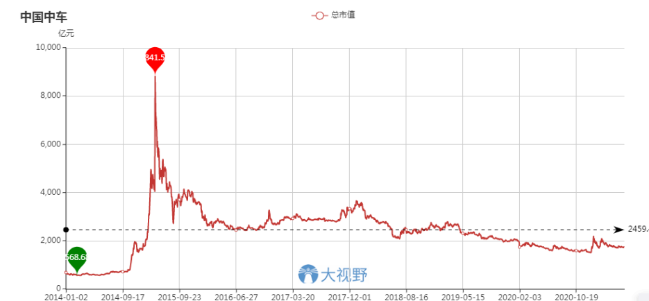
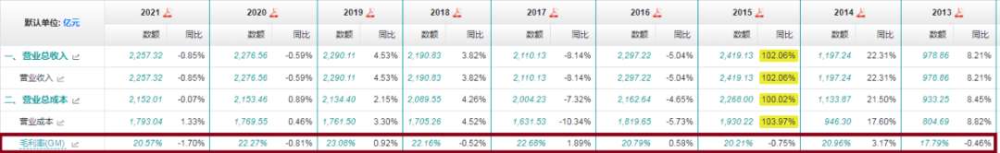
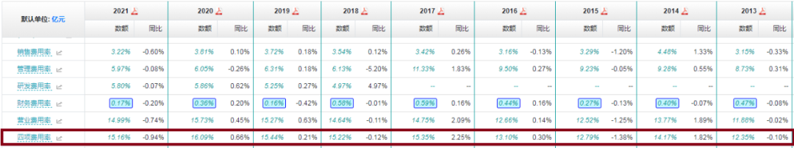
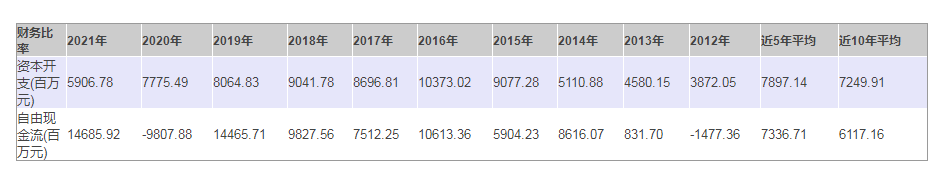
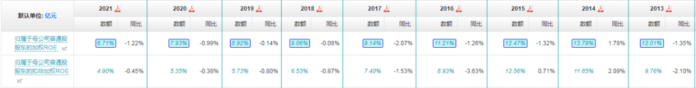
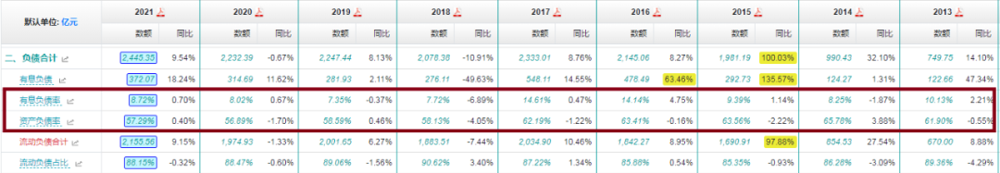
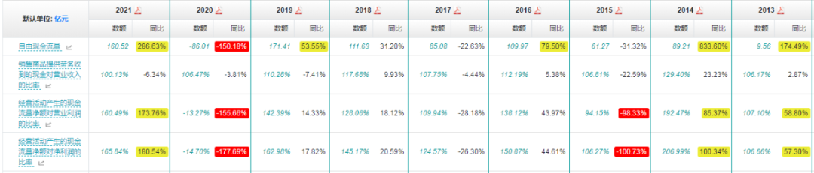

前事不忘，后事之师。
最近研究赛道股，突然想起 2015 年那一轮水牛行情中的一只超级明星大牛股——中国中车。

当时中国中车有多牛呢？

2014 年初，股价还没启动的时候，中国中车的前身中国南车，市值不过六七百亿。
当年 10 年月股价开始启动，在短短半年多的时间内，股价爆涨了 12 倍。
市值从六百多亿上升到了 8800 多亿。
不到一年，一只 10 倍大牛股，横空出世。

它当时为什么这么牛呢？
因为它占据的热点多，用今天的话说，就是赛道好。

第一，国企改革。
南车北车合并，从传闻到否认到再传闻到再否认到再再传闻到突然被官方消息证实最后到各种合并进展消息刺激，国企改革的概念，那可是被资本市场玩得溜溜的。

第二，一带一路。
当时一带一路宏伟概念刚一提出，市场就开始畅想：国家大战略最受益股，非高铁而谁？
光一个中国就这么大市场，再加上全世界，那还了得？

第三，高科技。
高铁在七年前，那就是可以改变世界的高科技。
中国拥有完全自主知识产权。
而且，还是全产业链。

第四，高成长。
2014 年，增长率高逾 30%。
2015 年，因为两车合并 + 内生性增长，增长率高逾 150%。
这成长性，放在哪里，都是呱呱叫吧。

那时候，中国中车就是天之骄子。
谁要是说中国中车不好、可能会套人无数，那是一定会挨骂的。
嘿嘿，腾腾爸当时就是说中国中车不好、是个大泡沫的为数不多的少数派。
所以当时也跟今天一样，挨了不少骂。

那时候我最看好低估值高股息的“大烂臭”，并在亲力亲为地大买特买茅台、五粮液、美的、格力、上汽、福耀、平安、兴业等一众市场大衰股。
所以我经常听到的嘲笑是：你的大烂臭再好，一买就亏，而中车再差，买它的人都赚了。

嘿嘿，跟今天的情形，是不是特别相似？

后来呢？
一通炒作之后，中国中车的市值走势，是这样的——

中车的总市值，从最高点时的 8800 多亿，降到了今天的大约 1400 来亿。

可能有朋友会说：哪怕降到今天，也有 1400 多亿啊，比股价启动前的六七百亿，也翻了大约一倍！
呵呵，启动前的六七百亿，只是中国南车的市值。
而现在的 1400 多亿，是当时南车北车合并之后的市值。
也就是说，考虑到合并因素，中车的市值，基本上是从哪里来的，又回到了哪里去。

绝大多数投机者，都是看到股价涨了，才赶过来追买。
所以在中车身上真正赚到钱的，少之又少。
包括很多机构投资者，因为追高而死套、最后不得不割肉离场的，也多不胜数。
“从哪里来又到哪里去”的泡沫故事里，总是缺少真正的赢家。

中车确实是一家高科技企业，它生产的主要产品，至今行销世界，并且在全世界鲜少敌手。
一带一路现在也确实发展得很好，但中车的出海之路，似乎并没有当初预想得那样美。
以至于现在国外业务，仅占总业务量的 9% 左右。
高铁这些年在中国也确实突飞猛进式地发展，也确实改变了中国人的社会生活图景，给全社会创造了巨大的价值。
所以这家企业的社会价值，极其巨大。
不愧当初管理层的苦心栽培、全力支持。
我记得当时国家总理出访他国时，还不忘推销中国高铁。
彼时，中国高铁被奉为中国名片，国家总理也被市场恭称为“史上最牛推销员”——你们看今天的这些赛道股，虽备受管理层呵护，但哪个享受过国家总理亲自当推销员的待遇？

这么牛，这么厉害，用今天的话讲，这么好的赛道——中车后来为什么股价一落千丈、市值一蹶不振呢？
我给出的答案是：它社会价值虽巨，但商业价值欠缺。
再直白点：产品很重要，但是企业天生不太好赚钱。

（毛利率）

无论合并前还是合并后，毛利率都处在 20% 上下。
作为制造业，这是非常低的毛利率水平了。

（四项费用）

而费用率又高。
两相抵减，核心利润率和净利润率，都非常之低。

（核心利润率与净利润率）

都长期处在 5% 上下。

（资本开支与自幅由现金）

总体上，高铁制造业还是典型的重资产行业。
资本开支高，自由现金流差。

这样的企业，是不太好给股东们创造真正的价值的。
所以我们盘点它的 ROE 就会发现——

（ＲＯＥ）

长期 ROE，也就百分之六七的样子。
这样的 ROE，是无法给二级市场的中小投资者创造长期投资价值的。

所以，在我眼里，中国中车“从哪里来又回到哪里去”再正常不过。
它压根就是不太好赚钱的主儿。
怎么可能给我们带来长期投资价值呢？

写到这里，我又想起一段往事。
当年写《生活中的投资学》时，我曾举例，说中车股价疯狂时，我不看好它的投资价值，现在股价低迷了，我反而认为它现在的投资价值更好一些了。
有朋友看到这段话，认为我是看好甚至是在推荐中国中车。

这实在是一个天大的误会。

我只是说股价低迷之后，不会害人了，相对投资价值优于股价疯狂时。
并没有真的看好它的长期绝对投资价值。
更没有荐股的意思。
腾腾爸就一普通投资者，我著书立说、撰文阐理，只为宣扬一种我推崇的投资理论、投资体系。
我会发现对某只股票的看法，但我绝对不会向任何人推荐任何股票。
我所有的观点，都只是我个人的观点。
仅供参考。

比如今天，我在详解中国中车为什么赚钱困难时，只是为了解释它为什么长期股价不振，为什么无法维持泡沫期的盛景，并没有完全否定它。
更不是为了贬它而贬它。

首先我肯定了它无与伦比的社会价值。
其次我也可以相当有信心地告诉大家，中国中车虽然不好赚钱，但财务相当稳健。

（负债率）

它的总负债和有息负债都不高。
说明企业并不多差钱。

（现金流比率）

而它的经营回款状况并不差。
虽然利润少，但回款情况并不差。
这就可以保证它的长期生存。

所以，不要二极管，不要非此即彼。
我们在研究分析一只股票时，即要看到它好的一面，又要看到它不好的一面。
两相权衡才能得出最客观的结论。

很显然，今天我们讲的是中车，实际上探讨的内容却远远地超过了中车。
通过中车，我们可以得到哪些有益的启示呢？

第一，政策对行业的发展、企业的崛起，有着绝对的助力作用，但政策再有用，它也无法改变行业与企业天生的商业模式。
有些行业、企业，天生的价会价值极大而商业价值不足。
它的商业模式决定了，不好赚钱就是不好赚钱。
政策加持也无法改变这一点。

讲到这里，我们还要老生常谈地强调一下：管理层和二级市场小股东看待企业好坏的方向和评价优劣的标准是不一样的。
管理层追求的是社会价值，二级市场中小股东追求的是商业价值。
这一点，我们一定要清楚，不要犯糊涂。

第二，人们在政策加持、热点护身、股价迭涨时，是很容易迷失理性判断的，狂热因此而生。
近因效应又让投资者相信，这样的热度会一直维持下去。
这种心理状态，会让我们迷信热点，迷信赛道，迷信炒作。
但最终能在二级市场给股东们创造长期投资价值的，还是那些能从现实的商业世界源源不断赚取真金白银现金流的企业们。
能真正穿越漫长时空、穿越市场周期转换的，还是得靠企业的商业价值。

第三，时间是我们最好的朋友。
眼前事，迷障太多，看不清。
尤其真真假假的资本市场，更是幻影重重不好分辨。
但把时间放长，尘归尘、土归土，价值才是市场运转的真正核心。

今天的赛道股疯狂在腾腾爸眼里，并不是什么新鲜东西。
历史的经验告诉我们：飞机不是吹的，火车不是推的。
任他什么来头的行业、公司，只有赚钱，赚真钱，才行！

## 原文

- [悲催了！这只 10 倍大牛股，怎么了？](https://mp.weixin.qq.com/s/da26zO8xd59oQzaglz8v6Q)
