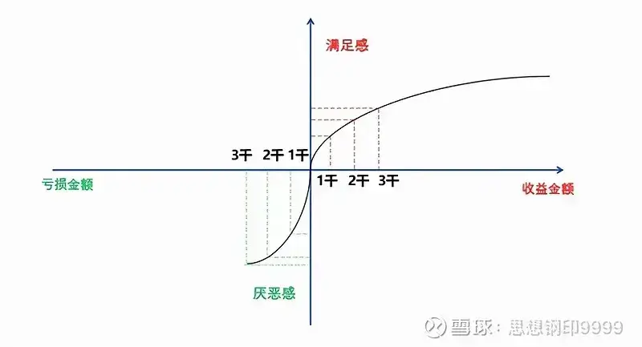

## 忘掉成本, 哪有那么容易

"刚大, XX 股票巨亏, 怎么办?"

"刚大, XX 股票赚了不少, 要不要先卖掉一点?"

亏了或赚了之后怎么办, 这一类的问题是我遇到最多的.

理论上说, 投资时刻都在进行风险收益比的判断, 这个判断总是基于基本面和市场风格偏好, 而与你之前是巨亏还是大赚没有任何关系, 跟你的成本没有关系.

但我们是人, 是人就有情绪, 有记忆, 没有人能完全摆脱过去的盈利和亏损对自己判断的影响, 与其空喊"忘掉成本"的口号, 不如从行为金融学的角度, 知道自己为什么会一步步走向巨额亏损, 或者为什么盈利一大就拿不住, 才能有相应的对策.

今天拿来的"理论武器"是获得 2002 年度诺贝尔经济学奖的"前景理论".

## 盈利后的风险厌恶

行为经济学是一个描述性的学科, 它用做实验的形式, 描述人们行为上的某些规律性的特点, 以下四个实验全部来自卡尼曼和特维斯基的论文------《前景理论: 一种风险条件下的决策分析》.

实验一:

你觉得哪一个选项更有利?

(a)20%  的概率得到 4000  元

(b)25%  的概率得到  3000  元

很明显, 选项 a 的预期收益为 4000\*20%=800, 选项 b 的预期收益为 3000\*25%=750, a 的预期收益高于 b.

实验的结果也表明, 65%  的人选择了 a, 35%的人选择了 b, 大部分人都能在这种情况下做出理性的选择.

再来看实验二:

(a)80%  的概率得到  4000  元

(b)100%  得到  3000  元

a 的预期收益是 4000\*80%=3200, 高于选项 b, 但实验结果, 有  80%  的人选择了 b, 直接拿走 3000 元, 只有 20%  的人选择了 a.

看上去是数学学得不好, 实际上却是真正的人性, 就是俗话说的"二鸟在林, 不如一鸟在手".

实验一和实验二的区别何在呢?

只有实验二中有一个 100%确定的选项, 因为大部分人对概率缺乏直觉, 所以, 只要出现确定性的选项, 就会把这个选项当成参照系, 去比较其他的选择.

人们会把这 100%得到的 3000 元看成自己口袋里的钱, 去评估选项 a, 所以实验二的选项 a 在我们大脑中实际呈现的, 不是"20%的概率收益为 0"(看到 b 选项之前的参照系), 而是"20%的概率损失 3000 元"(看到 b 选项之后的参照系).

这就是前景理论的第一个结论的前半段: 当我们的可选项中有"确定性的收益"时, 我们会成为一个"风险厌恶者", 无法再接受预期收益更高但有一定不确定性的选项.

当然, 这只是一个调查出来的实验结果, 而不是一个推理出来的绝对结论, 不同的人有不同的选择, 比如有人可以放弃保送复旦的机会, 去考清华, 但如果保送的机会是更普通的 985, 就可以理解了.

这个理论在投资上有何意义呢?

我们可把实验 2 转换成投资的情境:

当你买入一支股票, 浮盈 3000 元后, 你面对着两个选择:

选项 a: 卖出, 确定获利 3000 元

选项 b, 继续持有, 有 80%的可能获利 4000 元, 也有 20%的可能回到买入价

按理前景理论的实验结果, 80%的投资者都会选择落袋为安, 只有 20%的投资者选择继续持有.

这个结论在现实中也确实有数据支持, 我在《股东数变化暗藏玄机, 散户的四个致命操作习惯》一文中发现: 股价的上涨过程中, 大部分情况下, 都会出现股东户数的下降, 代表大部分散户在上涨过程中更倾向于卖出.

很多人认为, 这根本不是什么"损失厌恶", 这是价值投资, 涨了之后, 风险收益比降低了, 当然要卖.

这显然是把价值投资的理念凌驾于投资的基本常识之上.

当我们卖出一支股票, 考虑的并不是这只股票本身有没有价值, 而是它与现金或其他股票的比较, 实际上, 理性的决策是再现实验一的情景:

选项 A: 换成 A 股, 20%  的概率赚  4000  元, 80%的概率持平

选项 B: 持有 B 股, 25%  的概率赚  3000  元, 75%的概率持平

发现换成 A 的预期收益更高, 所以卖出 B, 换成 A.

甚至, 如果你是一个价值投资者, 你需要把 K 线图隐藏, 完全依靠基本面和估值, 选出更有风险收益比的公司.

说完了浮盈时的心态, 再来看一看前景理论描述的, 投资人面对浮亏时的心态.

## 浮亏时的风险偏好

实验三:

(a)20%  的概率损失  4000  元(即预期损失 800 元)

(b)25%  的概率损失  3000  元(预期损失 750 元)

结果符合理性计算的结果, 42%  的人选 a, 58%的人选择了 b.

实验四:

(a)80%  的概率损失  4000 元(即预期损失 3200 元)

(b)100%的概率损失  3000 元

这一回, 大部分人的数学又不灵了, 92%  的人选择了预期损失更大的 a, 仅有  8%  的人选择预期损失小一点的 b.

原因同样是参照系, 只有实验四中有一个 100%确定的选项, 亏损 3000 元. 这个选项会让你面对无法承受的亏损, 从这个参照点出发, 你自然认为选项 a 还有机会------虽然这是一个预期损失更大的选项.

这就是前景理论的第一个结论的后半段: 当我们的可选项中有"确定性的损失"时, 我们就会变成一个"风险偏好者", 宁可冒着更大损失的风险, 也要摆脱这个确定的损失------并且这个偏好达到 92%, 比前半段面对收益时的"风险厌恶偏好"的 80%, 更强烈.

这种心态最极端的例子是赌徒: 一开始比较能控制风险, 但输到一定程度后, 就"输红了眼", 拼命放大风险偏好, 想要把输掉的钱扳回来.

转换成投资中的情况, 实验 4 就是散户被套:

当你在一支股票上被套 3000 元时, 你面对着两个选项:

A: 等待, 有 80%的概率加大亏损至 4000 元, 20%的概率回本

B: 割肉, 确定亏损 3000 元

实验结果也说明, 大部分人亏损到一定程度就不愿割肉了.

有人可能会说, 这个实验中, a 选项的预期损失大于 b, 但在炒股被套后, 却不一定如此, 毕竟股票下跌后更有性价比.

确实有这个可能, 那我们可以想一想, 如果你现在没有被套, 你愿不愿意买这个股票呢? 如果你不愿意, 说明你的理性判断下, 买入(即套牢状态下的持有)的预期收益更低.

此时, 你不割肉的决策并非是在于价值投资, 而是前景理论描述的, 为了回避确定性亏损(割肉)而宁愿放大"风险偏好", 持有你内心深处已经不再认可的股票.

小结一下

### 前景理论在股市投资中的结论:

当你处于盈利中时, 你是一个风险厌恶者, 处于亏损中时, 你又变成了一个风险偏好者. 这个心态导致我们无法在长牛股上持续获得长期盈利, 可一旦买入经营反转向下的公司, 却可能承受巨大亏损.

行为金融对人的影响是潜移默化的, 很多投资者在分析公司时, 处于实验一、三的纯理性状态, 但在实际操作中, 却不知不觉地进入实验二、四的非理性状态.

想要避免这个转化, 我们就需要知道自己为什么进入实验二、四的状态?

## 浮盈到何时发生风险厌恶

之前分析实验二时, 我说了一个特点: 获得 3000 元是一个 100%确定的选项, 你就会把这 3000 元的浮盈看成自己口袋里的钱, 去评估另一个选项, 从而发生"风险厌恶".

但投资中的心态是复杂的, 在浮盈 3000 元之前, 你一定经历了浮盈 2000、浮盈 1000 的状态, 那时为什么你没有发生"风险厌恶"呢?

实际上从你赚钱开始, 你就发生了"风险厌恶", 意识中想要落袋为安, 于是大脑中就一直进行风险收益的判断, 但一开始你遇到了前景理论中描述的另一种效应.

原因其实可以用经济学的边际效用递减的原则, 下图的横坐标代表你的实际盈亏, 纵坐标代表这些盈亏带给你的满足感和厌恶感.

"边际效用递减"描述的是右上角的一段凸曲线, 你赚的第一个 1000 元, 给你带来的满足感是非常高的, 让你对下面继续赚钱的概率判断很高(即该点的导数), 足以弥补 1000 元的"风险厌恶". 但到了第二个 1000 元浮盈, 给你带来的效用就开始降低了, 而你面对的是 2000 元的"风险厌恶", 这个此消彼涨的过程, 一直延续到你无法承受为止.

### 这就是前景理论的第二个结论:

人们在做投资决策时, 更在乎边际变化, 而非绝对值, 前面一段赚钱的经历会提升你对赚钱概率的判断, 但效用会边际递减.

所以, 当你兑现浮盈的冲动强烈到抵消了赚钱的幸福感时, 就是"风险厌恶"逆转时. 此时, 你需要忘掉 K 线图, 让自己回到实验一的理性状态, 回到公司的基本面进行重新判断, 但此之前, 你需要把软件里的成本改到现在的价格, 并且反复说服自己一个观点:

你的上一段投资已经结束了, 现在你投入的每一分钱都是属于你的资本金, 没有一分钱是浮盈, 你需要在零起点上将公司与其他公司进行中立的比较.

人在赚钱时急于兑现, 但人在面对浮亏时, 心态恰恰相反------不愿面对.

## 心态止损法

前面分析过, 实验四中出现了确定的选项"100%亏损 3000 元", 让你面对无法承受亏损的恐惧与割肉屈辱, 从而接受更差的风险收益比.

所以这里同样有一个问题, 浮亏 3000 元之前, 一定经历过浮亏 1000 元的阶段, 你的风险偏好是何时开始增加的呢?

上面那张图的左侧描述的是面对亏损时的效用曲线, 是一段凹曲线, 就是说, 刚刚开始损失带来的厌恶感是最强烈的, 按照前面的说法, 这一段亏损的经历会提升你对未来亏钱的判断, 增加你的风险厌恶感, 让你早早卖出.

事实上也是如此, 所以有人统计, 在投资中亏损在 5~10%以内的割肉, 是相对容易的阶段, 一旦超过 10%, 就很难下决心------表面上, 你还是在客观地研究公司的基本面, 实际上, 你的心态已经发生了巨变.

更糟糕的是, 亏损的边际效用也是递减的, 在第一段浮亏之后, 每增加一段新的浮亏, 其增加的痛苦感就少了一份------亏损是一个渐渐麻木的过程.

但同时, 你却清楚地记得自己的成本, 只是不敢想已经亏了多少, 以"安慰"自己这只是暂时的浮亏------实际上是你的风险偏好在不断上升.

所以有人提出用止损来保护自己, 但长线价值投资者在买入后出现 10%以上的浮亏是非常常见的, 止损并不可行.

我的建议不是基于价格的止损, 而是自己在亏损后发生"风险偏好增加"的临界点时的"心态止损":

当你觉得自己渐渐从亏损的痛苦"走出来", 恢复"平静", 这其实就是陷入了麻木状态, 是一个极度危险的信号. 任何巨亏发生之前, 都有这样一个临界点, 这是你拯救自己的最后机会.

"心态止损"就是先将持股卖出几天, 让这笔亏损既成事实. 几天后, 当你的心态恢复到不存在这笔亏损时, 你再重新跟其他的公司一起评估起风险收益, 如果你仍然觉得合理, 再慢慢重新买入, 以期获得一个新的心理成本.

## 你的风险偏好正常吗

行为金融的结论, 不是推理, 而是对现状的统计与描述, 结论总是一部分人选择 A, 一部分人选择 B, 理论总是关心大部分人的结论, 但选择相反的小部分人同样有意义.

很多人在看这篇文章时, 心里会有这个想法, 我根本不是这样想的, 道理很简单, 你就是少数人. 而且股票投资者中, 高风险偏好的投资者占比, 必然超过正常人.

所以, 你还应该知道你的风险偏好处于哪一个水平, 有一个简单的测试:

你觉得, 当初是哪一个人更能吸引你进入股市:

同事 A: 这些年总体收益不错, 比买理财产品强

同事 B: 贷款炒股, 暴赚十倍, 一举财务自由

如果是 A 的话, 你就是一个风险偏好正常的人, 本文的大部分结论适合你, 如果是 B, 那么, 你很可能是一个风险偏好异常的人, 本文说的很多股民的心态, 你可能没有.

比如说: 你更擅长追涨杀跌, 套牢股割肉毫无心理负担; 或者, 你可以不受浮盈的影响, 像巴菲特一样长线持有你认可的公司.

还有, 如果你家境殷实, 本文的结论并不冲突, 但你可能在某一个财富区间内, 风险偏好高于常人.

当然, 风险偏好异于常人, 没有常人的弱点, 也不代表你是一个好投资者, 你可能对风险收益的变化过于敏感, 反而陷入盲目操作, 或者相反, 对长期逆转的"灰犀牛"风险过于迟钝.

所以, 投资不存在绝对的对错, 不同的人对待风险收益有着不同的效用曲线, 最重要的是, 在这条曲线上找到你能稳定盈利的点和最容易出现的非理性盲区.

## 本文的几个重要结论:

当你处于盈利中时, 你是一个风险厌恶者, 处于亏损中时, 你又变成了一个风险偏好者. 这个心态导致我们无法在长牛股上持续获得长期盈利, 可一旦买入经营反转向下的公司, 却可能承受巨大亏损.

当你兑现浮盈的冲动强烈到抵消了赚钱的幸福感时, 就是"风险厌恶"逆转时. 此时, 你需要忘掉 K 线图, 回到公司的基本面进行重新判断.

亏损是一个渐渐麻木的过程: 每增加一段新的浮亏, 其增加的痛苦感就少了一份.'

"心态止损"就是先将持股卖出几天, 让这笔亏损既成事实. 几天后, 当你的心态恢复到不存在这笔亏损时, 你再重新跟其他的公司一起评估起风险收益.

风险提示: 本文所提到的观点仅代表个人的意见, 所涉及标的不作推荐, 据此买卖, 风险自负.

## 原文

- [股票深度套牢怎么办？](https://mp.weixin.qq.com/s/lZuowZ0sQ6YJEJxmVSyduw)
