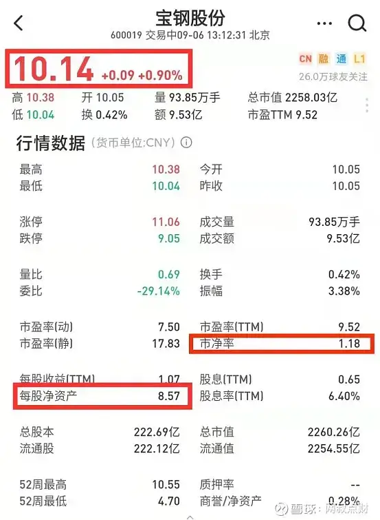
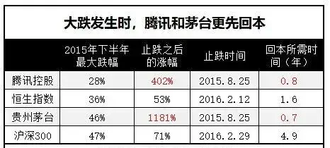

这是一篇节省你大量时间的干货文章. 文中, 有主流估值方法的起源,

有主流估值方法的适用范围, 并且也把估值方法的局限性也讲清楚了.

## 一、常见的估值方法

说实话, 估值并不难. 常见的估值方法也就那么几种:

简单一些的, 算算市盈率(PE)、市净率(PB)、市销率(PS).

PE =  市值  /  净利润  =  股价  /  每股收益

市盈率高低意味着回本时间的长短, 掏 100 亿买下这家一年赚 10 个亿的企业, 10 年才能收回 100 亿的投入成本.

PB =  市值  /  净资产  =  股价  /  每股净资产

PB 的意义是, 企业账面价值 1 块钱的资产在资本市场上被估值多少. 比如, PB 是 0.8, 那意思是用 0.8 元就可以买到账面价值 1 元的资产.

PS =  市值  /  营收  =  股价  /  每股营收

市销率通常用来评估一些高成长、还没有盈利、或者盈利很少的轻资产优质企业.

这几种估值方式所用到的数据都是现成的数字, 简单的算一下就知道结果了.

高级一点的, 算算 PEG.

PEG = PE /  净利润增速

PEG 既考虑了企业现在的估值, 也考虑了未来的业绩增速, 通常用于成长股估值.

再高级一些的, 用现金流折现法估算企业内在价值.

现金流折现法其实就是将债券估值模型套用到股票估值上.

举个例子:

在市场无风险利率为 3%的背景下, 一张 1 年期、面值 100 元、5%票面利率的债券值多少钱呢?

答案是 101.94 元.

计算方法也很简单, 1 年到期后, 这张债券能收到 100 元本金和 5 元利息, 一共是 105 元.

另一个人没买到这种债券, 只能赚钱 3%的无风险收益, 那他 1 年后想要有 105 元, 现在就要投入 101.94 元本金(101.94\*(1+3%)=105 元).

这是最简单的债券估值模型.

把这个模型中的债券利息换成股票股息或者企业自由现金流就能估算股票的内在价值了.

## 二、估值的本质

知其然还要知其所以然. 深度讲解这些估值方法之前, 网叔先说下估值的本质.

经济学上有句话: 价格围绕价值波动.

既然有波动, 就有高估和低估的时候.

价格高于价值, 就是高估. 价格低于价值, 就是低估.

高估的时候买, 就可能要承担价格向下波动的风险. 也就是通常所说的"买贵了".

道理就是这么简单, 谁都懂. 但实践起来, 尤其是到了股票和基金市场, 不少人就只看见价格, 看不见价值了.

为什么看不见? 不知道怎么如何判断市场的真实价值罢了.

怎么判断市场的真实价值?

用估值.

估值, 是一种研究方法. 借用"估值"工具来判断市场价格是高于内在价值, 还是低于内在价值.

在市场价格低于内在价值的时候, 买入. 在市场价格高于内在价值的时候, 卖出.

当然, 估值只是一种方法, 是为了研究投资标的的内在价值而诞生的, 实际应用中, 切不可为了估值而估值. 这点一定要牢记.

另外, 这个世上没有十全十美的东西, 估值方法也有局限性, 不可能适用于所有场景. 不过幸运的是, 有无数的前人绞尽脑汁设计新的估值方法, 久而久之, 就有许许多多的估值方法了.

接下来, 网叔带大家盘点下市场上主流的估值方法和它们的局限性.

## 三、常见的估值方法详解

### 1、市盈率(PE)

市盈率的概念可以追溯到巴菲特的老师格雷厄姆. 他在 1934 年出版的《证券分析》一书中写到: 一只普通股的价值是其当期收益的一定倍数, 这个倍数一部分决定于当时的人气, 另一部分决定于企业的性质与记录.

这个一定倍数就是我们所说的市盈率(PE).

PE =  市值  /  净利润  =  股价  /  每股收益

简单点理解, 市盈率(PE)就是企业市值除以企业净利润.

比如, 一家企业一年赚 10 个亿, 市值是 100 亿, 那市盈率(PE)就是 10 倍.

市盈率高低意味着回本时间的长短, 掏 100 亿买下这家一年赚 10 个亿的企业, 10 年才能收回 100 亿的投入成本.

通常来说, 市盈率越低, 回本时间越短, 对投资者越有利.

根据净利润选取时间的不同, 市盈率分为静态市盈率、动态市盈率、TTM 市盈率.

静态市盈率  =  市值  /  上一年度净利润  =  股价  /  上一年度每股收益

比如, 现在的静态市盈率是"市值  / 2020 年净利润".

动态市盈率  =  市值  /  下一年度净利润  =  股价  /  下一年度每股收益

比如, 现在的动态市盈率是"市值  / 2021 年净利润".

TTM 市盈率  =  市值  /  过去四个季度净利润  =  股价  /  过去四个季度每股收益

比如, 现在的 TTM 市盈率是"市值  / 2020 年二季度至 2021 年一季度的净利润".

不过市盈率也不是万能的:

首先, 不同行业的市盈率是不同的, 对比性不强. 比如, 过去 10 年, 中证白酒的平均市盈率是 85.57 倍, 中证银行的平均市盈率只有 27.10 倍, 白酒比银行的市盈率高多了, 但不能据此说白酒的估值远远高于银行.

其次, 即使同一行业内, 企业成长性、基本面不同, 市盈率也会有较大差别. 比如, 同样是银行, 招行的市盈率是 92.89 倍, 宇宙行(工商银行)的市盈率只有 9.93 倍, 但是大家还是喜欢买招商银行, 而不是 PE 更低的工商银行.

最后, 亏损的企业没有办法计算市盈率. 业绩波动较大的周期企业/行业, 市盈率也不能准确反映真实估值情况.(具体分析, 下文展开)

### 2、市净率(PB)

实际使用中, 市净率通常用来弥补市盈率的不足.

比如亏损的企业, 或业绩波动较大周期性企业, 用市盈率很难反映出企业真实估值情况, 这时就要用到市净率了.

以宝钢为例:

这是宝钢股份净资产和净利润的走势对比: 业绩(净利润)上蹿下跳, 净资产却稳步增长.

市净率显然更适合宝钢这种周期性企业的估值.

PB =  市值  /  净资产  =  股价  /  每股净资产

比如, 宝钢股份, 股价是 10.14 元, 每股净资产是 8.57 元, 市净率(PB)就是 1.18.

PB 的意义是, 企业账面价值 1 块钱的资产在资本市场上被估值多少. 比如宝钢 PB 是 1.18, 意思就是宝钢账面 1 块钱的资产, 在资本市场上要用 1.18 元才可以买到.

通常来说, PB 越低, 公司估值越低.

值得注意的是, PB 就是 PB, 没有什么静态 PB、动态 PB、PBTTM 的说法.

原因也很简单, 净资产是个时点数, 最新一期的净资产就是公司的全部净资产.

净利润是个区间值. 只有年度利润或连续 4 个季度的净利润才能反映公司一年的经营成果.

另外, 市净率通常用来评估重资产公司, 对于互联网等轻资产公司意义不大.

### 小结一下:

市盈率和市净率主要适用于成熟行业/公司, 能快速判断出企业估值高低.

但对于一些高成长的行业/公司, 市盈率和市净率并不适合. 这时就要用到市销率(PS)和 PEG 了.

### 3、市销率(PS)

市销率是由菲利普-费雪(成长股价值投资策略之父, 著有传世名作《怎样选择成长股》)的儿子肯尼斯-费雪提出来的. 他在《超级强势股》一书中写道: 价格营业额比率之所以有价值, 是因为这个比率中的营业额部分通常比企业的其他大部分变量稳定. 超级公司盈利大幅下滑的现象很常见, 但是营业额大幅下滑的现象却很少见.

PS =  市值  /  营收  =  股价  /  每股营收

比如, 一家企业市值是 100 亿, 营收是 20 亿, 那市销率就是 5 倍.

一般来说, 市销率越低, 代表企业估值越低.

另外, 要注意的是: 市销率通常用来评估一些高成长、还没有盈利、或者盈利很少的优质轻资产企业. 比如美团、拼多多、哔哩哔哩......

对于一些业绩稳定, 增长也有限的大蓝筹, 老老实实用市盈率或者市净率就好了.

### 4、PEG 估值法

PEG 指标, 是成长股投资大师吉姆-斯莱特在 1960 年代提出的, 后经传奇基金经理彼得-林奇发扬光大.

PEG 估值是在市盈率(PE)估值的基础上发展起来的, 它弥补了 PE 对企业动态成长性估计的不足. PEG 告诉投资者, 同行业的公司中, 在市盈率一样的情况下优先选择那些增长速度高的公司, 或者在增长速度一样的情况下选择市盈率较低的公司.

PEG = PE /  净利润增速

注意! 实际应用中, 通常用现在的市盈率除以企业未来几年的净利润复合增速, 而不是过去一年或几年的净利润复合增速.

比如, 企业当前市盈率是 20 倍, 未来几年净利润复合增速是 20%, 那 PEG 就是 1, 企业估值合理.

当 PEG 大于 2 时, 公司业绩增速跟不上估值预期, 可能严重高估.

同理, 当 PEG 小于 0.5 时, 公司业绩增速远高于估值预期, 可能严重低估.

最后, 不要滥用 PEG 指标.

首先, PEG 指标同样适用于基本面好、业绩增速快的成长股. 对垃圾股、周期股等用 PEG 指标就有点缘木求鱼了.

其次, 在彼得林奇的体系中, 20 倍 PE 基本是就是他给一个企业的最高估值了. 他认为长期复合增长 20%的股票已经算是超级成长股了, 超出这个范围的增速大多不可持续, 安全边际不够.

### 5、现金流贴现法(DCF)

现金流贴现法最早可追溯到经济学家约翰-布尔-威廉姆斯. 1937 年, 他在哈佛商学院博士论文(1938 年出版为《投资估值理论》)中提出股息贴现模型(DDM). 他的解释是: 像牛奶之于奶牛, 鸡蛋之于母鸡, 股票价值体现在股息分红上.

他认为, 将企业未来的股息分红按照一定的贴现率贴现到现在就能计算出企业的真实价值.

在他的基础上, 纽约大学斯特恩商学院金融学教授埃斯瓦斯-达莫达兰将股息替换成企业自由现金流, 正式提出现金流贴现模型(DCF).

他在经典教科书《估值》中写道: 企业估值是指对企业内生价值的估计, 企业内生价值即为企业资产使用期限内所产生的预期现金流量的现值. 企业内生价值的大小, 取决于企业资产预期能够产生现金流金的大小、持续时间长短及其可预见性.

补充个概念: 现金流量又称自由现金流, 就是企业产生的、在满足了再投资需要之后剩余的现金流. 实际应用中, 自由现金流计算公式如下:

FCF(自由现金流) = EBIT(息税前利润) - Taxation(税款) + Depreciation & Amortization(折旧和摊销) - Changes in Working Capital(营运资本变动) - Capital expenditure(资本支出)

现金流贴现法(DCF)计算公式如下:

V0 : 企业内在价值

t : 企业能够产生自由现金流的年数

CFt : 第 t 年自由现金流

r : 折现率(通常用无风险利率(国债利率)加一定风险溢价来表示)

将企业未来 t 年的现金流按照一定的折现率(r)折现到现在, 就能计算企业的内在价值了.

巴菲特对这个模型极为推崇. 在 1992 年的《致股东信》中, 他写道: 在写于 50 年前的《投资估值理论》中, 约翰-布尔-威廉姆斯提出了价值计算的数学公式, 这里我们将其精练为: 今天任何股票、债券或公司的价值, 取决于在资产的整个剩余使用寿命期间预期能够产生的、以适当的利率贴现的现金流入和流出.

不过, 推崇归推崇, 由于假设条件过多, 巴菲特还真不怎么用现金流贴现法计算企业真实价值.

查理-芒格曾说过:"巴菲特有时会提到'折现现金流', 但是我从来没见过他算这个."

对此, 巴菲特的回答是:"没错, 如果还要算才能得出的价值那就太不足恃了."

是的, 通过自由现金流折现模型确实能够计算出企业的真实价值. 但这个计算建立在一系列的假设条件之上:

① 你要估算企业能生存多久;

② 还要估算企业自由现金流增速;

③ 还要给一个合适的折现率.

差之毫厘, 谬以千里. 一个参数估算错误, 结果可能就南辕北辙了. 想计算出企业真实价值, 真没那么容易. 巴菲特不怎么用现金流贴现法计算企业内在价值也在情理之中.

## 四、如何用估值判断基金买入点和卖出点?

掌握了估值方法, 大家肯定迫不及待的想用这些估值方法来指导自己的投资吧!

别急, 估值只是工具. 使用估值工具前, 一定要对投资有个系统的理解. 网叔先说说估值在投资中的意义.

首先, 投资讲究"好行业、好公司、好估值".

好行业、好公司是好估值的前提.

离开了好行业、好公司, 只谈估值那是耍流氓.

网叔这里所说的用估值判断买入点和卖出点, 针对的都是好行业、好公司.

另外, A 股牛熊转换是常态, 估值波动也比较剧烈.

这是 1999 年"519 行情"以来, A 股走过的 5 轮完整的牛熊周期.

牛市期间, 市场估值都会大幅提升.

2005-2007 年的大牛市, 上证指数估值从 16.5 倍提升到 56.2 倍, 提升了 240.6%.

2013-2015 年的大牛市, 上证指数估值从 8.9 倍提升到 23 倍, 提升了 158.2%.

...

熊市期间, 市场估值也会大幅下挫.

2007-2008 年的大熊市, 上证指数估值从 55 倍降到 12.9 倍, 下降了 76.5%.

2015-2016 年的大熊市, 上证指数估值从 23 倍降到 12.9 倍, 下降了 43.9%.

牛市顶部区域和熊市底部区域, 市场估值能相差一倍甚至更多. 估值的意义就在于指导我们做大周期的择时.

但是, 也不要理解偏了! 择时, 不是去猜市场每次的顶部和底部.

股市是人性的博弈. 而人性是这个世界上最复杂、最难猜测的东西. 准确预测市场的顶部和底部, 不存在的.

即使有人偶尔猜中顶部和底部, 那也是瞎猫碰上死耗子, 运气而已.

择时, 是模糊的判断市场高低. 在市场处于底部区域, 估值低时买入, 在市场处于顶部, 估值高时卖出.

接下来, 具体说说不同的品种如何根据估值判断买卖点:

### 1、如何判断买入点?

(1)指数基金

指数基金主要是宽基和行业指数基金.

宽基, 就是横跨多个行业的指数基金. 如沪深 300 指数基金、中证 500 指数基金...

行业指数基金, 就是投资某一行业的指数基金. 如消费指数基金、医药指数基金...

不管是宽基还是行业指数基金, 他们都有对应的指数. 判断买点看对应指数是否低估就行了.

判断估值高低, 看 2 个指标:

① 绝对估值(PE)

② 估值百分位(PE 百分位)

通过 PE 和 PE 百分位判断买点, 最好的情况是 PE 和 PE 百分位都处于低位.

比如 2014 年 5 月份的沪深 300 指数. PE 是 8.1 倍, 已经处于很低的水平, PE 百分位 3.47%, 估值仅比过去 10 年中 3.47%的时间高, 估值低到令人发指.

之后, 市场就迎来了 2014 年下半年到 2015 年上半年的大牛市.

当然, 也有不好判断的时候.

比如现在的沪深 300 指数, PE 是 13.03 倍, 比着历史平均估值(12 倍)也就高那么一丢丢.

但 PE 百分位已经达到 66.26%, 估值比过去 10 年中 66.26%的时间都高, 即将达到 PE 危险值(13.339 倍).

为什么会出现这种背离呢?

主要还是沪深 300 指数估值波动区间不大(这个后文详细展开).

怎么应对这种情况呢?

PE 百分位较高, 主要是指数短期涨幅较大. 去年 3 月份以来, 沪深 300 指数涨了 31.78%, 平均每年涨 21.51%, 近 2 倍于沪深 300 指数历史平均 12%的涨幅.

短期涨幅较大, 就很可能出现回调.

但是, 沪深 300 指数的绝对 PE 只有 13.03, 整体估值并没有像 2007、2015 年那么夸张, 即使有回调, 回调烈度也大概率比不上 2007 年和 2015 年.

对于保守的投资者来说, 可以等一等, 等估值回落后再买. 但这样做面临一个风险, 如果指数就此反弹, 那就买不进了.

对于激进一些的投资者来说, 如果做好了被套的心理准备, 那买就是了.

(2)主题和类主题主动基金

主题类主动基金, 主要是消费、医药、科技、互联网等主题类基金.

这类基金虽然也是基金经理主动管理, 但选股局限在某一领域. 判断买点时, 看对应指数的估值就可以了.

类主题主动基金, 主要是重仓某一行业的主动基金.

比如, 张坤管理的易方达中小盘. 重仓消费股, 特别是白酒股.

判断易方达中小盘的买点, 就可以看中证消费、中证白酒指数的估值.

重点提醒下:

判断基金是不是重仓某个行业, 一定要翻翻基金前几年的十大重仓股. 只有长期重仓某个行业的基金才可以看做类主题基金.

(3)非主题类主动基金

非主题类主动基金一般持有多个行业的股票, 不存在明显重仓某个行业的情况.

这类基金择时要结合具体的市场行情来判断.

① 普涨行情

普涨行情, 就是大部分股票都上涨的行情. 典型的就是 2007、2015 年的大牛市行情.

普涨行情出现时, 市场上的基金基本都能涨. 判断买点就要看全市场的估值情况. 也就是看全 A 等权市盈率.

全 A 等权市盈率的查询网址在这里:

网页链接

这是 2005 年以来, 全 A 等权市盈率变化情况.

2005 年、2008 年、2013 年、2019 年, 全 A 等权市盈率都曾经跌到 40 倍左右, 之后市场触底反弹.

重点提醒下, 这只是过去的历史情况, 并不代表将来全 A 等权市盈率跌到 40 倍后会立马反弹. 只是说, 根据历史经验, 全 A 等权市盈率跌到 40 倍时, 市场整体估值不高.

② 结构性行情

结构性行情, 主要是某一类股票在涨.

如 2014 年之前的创业板牛市和 2020 年的抱团股行情.

在结构性行情中, 只有压中市场风格的基金才能大涨.

这时, 基金能不能买, 就要看驱动行情上涨相关板块的估值了.

驱动行情上涨相关板块的估值已经很高, 不要买.

驱动行情上涨相关板块的估值并不高, 结构性行情还处于发酵初期, 可以买. 不过, 这时的难点就在于判断行情能不能发酵起来, 这是另一个话题, 不展开讨论.

最后, 还是要强调下: 这里所说的择时, 都是大周期范围的择时.

简单点说, 就是全 A 等权市盈率从 40 倍提升到 80 倍的择时.

市场上涨并不是一帆风顺的. 全 A 等权市盈率从 40 倍到 80 倍的过程中, 必然有无数的起起伏伏. 底部买入后, 一定不要轻易下车.

### 2、如何判断卖出点?

(1)指数基金

指数基金卖出时, 同样看这两个指标:

① 绝对估值(PE)

② 估值百分位(PE 百分位)

最好的情况, 当然是 PE 和 PE 百分位都处于高位, 这样卖出毫无压力.

比如全指医药. 去年上半年, 在疫情的助推下, 全指医药一路上涨, 估值离 2015 年的最高点一步之遥, PE 百分位也接近 100%. 此时卖出, 毫无压力.

当然, 事后来看, 这个位置不卖问题也不大. 因为医药股业绩快速增长, 消化了大部分估值, 全指医药的 PE 从 72 倍降到了 45 倍, PE 百分位也降低到了 81%.

看到这里, 明白网叔为什么说"离开了好行业、好公司, 只谈估值那是耍流氓"了吧. 选择好的行业、好的公司, 即使短期高估, 也能通过业绩增长消化估值. 坏行业、坏公司是绝对做不到这一点的.

(2)主题和类主题主动基金

判断主题类主动基金的卖点, 同样是看对应指数的估值.

还以张坤管理的易方达中小盘为例. 基金重仓白酒和消费, 判断卖点, 就看白酒和消费估值是不是偏高就可以了.

(3)非主题类主动基金

非主题类主动基金的卖点要结合具体的市场行情来判断.

① 普涨行情

普涨行情出现时, 判断卖点就要看全市场的估值情况. 也就是看全 A 等权市盈率.

这是 2005 年以来, 全 A 等权市盈率变化情况.

2007 年、2015 年, 全 A 等权市盈率突破 80 倍, 之后市场触顶回落. 2010 年, 全 A 等权市盈率接近 80 倍时, 也出现过触顶回落.

全 A 等权市盈率超过 80 就可以认为市场估值偏高, 进入危险区域了.

② 结构性行情

结构性行情中, 基金要不要卖, 同样是看驱动行情上涨的相关板块估值.

驱动行情上涨的相关板块估值已经很高, 果断卖.

驱动行情上涨的相关板块估值并不高, 继续持有.

当然, 除了看估值, 也可以通过感知市场情绪、事先确定目标收益率和严格控制收益回撤等方式确定卖出时机.

网叔把相关内容补充如下, 已经了解的朋友可以跳过.

(1)情绪止盈法

情绪止盈法, 就是通过市场情绪判断牛市和熊市.

牛市中, 散户跑步入场. 股票开户数、市场成交量屡创新高. 基民也踊跃认购基金公司发行的新基金, "日光基"、"半日光基"频现江湖.

熊市则不同, 老散户逐步离场, 市场成交日益寡淡. 新散户也以观望为主, 股票开户数持续低迷. 基民更是对新基金嗤之以鼻, 避之唯恐不及.

一边是火焰, 一边是海水. 利用市场情绪判断牛市和熊市是可行的.

巴菲特还为此说过一句名言"别人恐惧的时候我贪婪, 别人贪婪的时候我恐惧".

国内市场也流传着"老和尚炒股"、"扫地大妈通过券商营业部炒股人数多少判断市场高低"的传奇故事.

当然, 这些可能真的就是故事而已.

情绪止盈法很难量化. 甚至可以说, 没有人能准确量化市场情绪.

举两个例子吧!

2015 年牛市中, 流传最广的一个说法是"4000 点才是牛市起点". 当时市场情绪足够火热了吧. 但之后呢? 上证指数最高涨到 5178, 如果在 4000 点止盈, 会错失将近一半的利润.

同样, 2020 年 7、8 月份, 日光基就出现了. 如果当时止盈, 也将错失不少利润.

总的来说, 情绪止盈法"事后诸葛亮"的成分较重, 很容易卖出在牛市中途, 吃不完市场最肥美的鱼身.

(2)目标收益止盈法

目标收益止盈法就是在买入之前先设一个目标收益率, 在目标收益率没有实现之前, 不管赚钱还是亏钱, 都不要卖掉. 实现了, 就要毫不犹豫的卖.

比如, 买之前, 你设定了一个 10%的目标收益率. 在没实现 10%收益之前, 就不要卖出. 实现了, 就要毫不犹豫的卖.

A 股波动非常剧烈, 目标收益法从来不缺赚钱的机会.

以沪深 300 指数为例:

2005 年成立以来, 沪深 300 指数的振幅(最低点到最高点的涨幅)最低也有 24%, 波动非常大.

在一个比较低的位置买, 不断高抛低吸, 轻轻松松就能实现每年 10%的收益目标.

不过目标收益法很难赚大钱. 大牛市来临时, 轻轻松松就能涨 10%. 如果此时卖出, 那后面百分之几十, 甚至百分之几百的行情都和你没关系了.

(3)回撤止盈法

回撤止盈法, 就是基金净值从高点回撤一定幅度后卖出.

比如, 设置一个 20%的最大回撤. 当基金净值从高点回撤 20%后, 果断卖出.

前面已经说过了, 基金经理不择时, 碰到大熊市腰斩是家常便饭.

回撤止盈法在熊市初期就果断卖出, 是大熊市中保卫胜利果实的不二之选.

不过, 回撤止盈法也并不是完美无缺的.

前面已经说过, 市场波动非常大, 沪深 300 指数年最低振幅也有 24%. 回撤目标设置小了, 很容易卖在底部区域.

回撤目标设置大了, 又很难起到在大熊市中保卫胜利果实的作用.

几种卖出方法各有优劣, 如何选择呢?

网叔选择"以估值止盈法为内核, 兼顾参考目标止盈法和回撤止盈法".

和其他几种方法相比, 估值止盈法以价值投资为基础, 有科学依据, 能实现熊市底部买, 牛市顶部卖.

但估值止盈法也不是万能的.

2020 年 8 月, 中证消费的估值百分位就达到了 99%, 估值比过去 10 年中 99%的时间都高, 按照估值止盈法可以卖出了.

但此时卖出, 就吃不到后面的涨幅了.

为了弥补估值止盈法的不足, 网叔又引入了目标止盈法和回撤止盈法.

简单点来说, 熊市底部买入后, 把仓位分为 3 部分, 分别用目标止盈法、估值止盈法、回撤止盈法卖出.

第一部分, 用目标止盈法卖出. 比如设置一个 50%的目标收益率, 当盈利达到 50%时, 果断卖出.

第二部分, 用估值止盈法卖出. 当市场估值偏高, 比如估值百分位超过 80%、90%时卖出.

第三部分, 用回撤止盈法卖出. 比如设置一个 20%回撤卖出目标, 当基金净值高位回撤 20%后卖出.

### 3、优质资产可以淡化估值, 长期持有

可能有朋友有疑问了, 不是说"优质资产可以长期持有吗?"高估就一定要卖出吗?

是的. 优质资产是可以长期持有的.

千亿基金经理张坤甚至为此说过一句话"不想持有十年以上, 就不要持有一分钟".

为什么优质资产可以长期持有?

(1)好资产总是很快出坑

胜于雄辩. 看 2 个例子吧.

这是腾讯的股价走势.

2015 年下半年, 腾讯股价大跌, 最多跌了 28%.

但腾讯早在 2015 年 8 月 25 日, 市场第一波杀跌结束后, 就企稳反弹了.

恒生指数则要到半年后的 2016 年 2 月 12 日才企稳反弹.

对比更鲜明的是, 企稳反弹后, 腾讯回本用了 0.8 年, 恒生指数则用了 1.6 年.

茅台更是强悍. 这是茅台的股价走势.

2015 年下半年, 茅台跌了 46%, 和沪深 300 指数差不多(跌了 47%).

但茅台回到前期高点只用了 0.7 年, 沪深 300 指数则用了 4.9 年. 且止跌反弹后, 茅台又涨了 11.8 倍, 吊打沪深 300 指数(涨了 71%).

为了方便对比, 网叔把数据汇总在这里.

和全市场相比, 腾讯和茅台跌幅更小、更早止跌、更快回本、止跌后反弹得更高.

无独有偶. 明星基金经理也能比市场更早回本.

谢治宇, 回本用了 0.4 年

张坤, 回本用了 1.7 年

董承非和周蔚文, 回本也就用了 2.4 年

朱少醒表现差一些, 回本用了 4.5 年, 但也比市场平均水平(沪深 300 指数)强.

优质股票和明星基金经理都是优秀资产. 即使面对大跌, 依然能很快回本, 且反弹到更高的位置.

(2)卖出后, 不一定能在更低位置接回来

网叔多次强调过, 短期市场不可预测. 没有谁有把握卖出后, 一定能在更低的位置接回来.

在这方面, 最典型的例子是但斌.

早在 2006 年, 但斌就买了腾讯, 买入价是 12 元.

之后, 腾讯股价扶摇直上, 5 年涨了 15 倍, 平均每年涨 70%+.

但斌坐不住了. 股价大涨让他彻夜难眠, 最终在 2011 年, 但斌以 190 块的高价卖了腾讯.

卖了之后没多久, 腾讯股价就跌了, 最多跌 39%.

但斌开心的笑了, "老子果然牛逼".

但之后发生的事情, 让但斌彻底傻眼. 腾讯股价很快就触底回升, 并超过了 190 块.

这下但斌又坐立难安了. 痛定思痛后, 狠心在 220 元的高价又把腾讯买回来了.

吃一堑长一智. 这次教训之后, 但斌再也没卖出过腾讯. 持有到现在又赚了 13 倍(2014 年, 腾讯进行了拆股, 1 股拆 5 股, 当时的 220 元/股相当于现在的 44 元/股).

无独有偶, 2009 年以来, 纳斯达克指数也走出了一波长牛行情.

但回顾这十余年的长牛行情. 每隔一段时间, 就大跌一次, 小跌更是不计其数.

即使偶尔一两次你能高位卖出, 然后低位接回来.

但有了但斌的前车之鉴, 你能确保次次都是"高位卖出, 低位接回来"吗?

股民的常规心理是, 10 块钱卖出的股票, 一定要在 10 块钱以下买. 10 块钱以上买, 就是亏了, 还是再等等.

这一等就是遥遥无期... 只能眼看长牛行情呼啸而去, 自己最终沦为看客.

(3)好资产是有限的, 卖出后没有更好的选择

先看 2 个数据.

这是上市满 10 年, 过去 10 年涨幅超过 1000%的个股.

一共 34 个, 贵州茅台、东方财富、比亚迪、爱尔眼科......

都是各行各业的龙头企业, 大名鼎鼎.

这是从业 10 年以上, 年化收益率超过 15%的公募基金经理.

一共 14 个, 朱少醒、董承非、曹名长、傅鹏博...

如果你关注基金的话, 一定听过他们的名字.

A 股有 4000 多只股票, 但 10 年涨 10 倍的只有 34 只.

基金公司有 1700 多位权益类基金经理, 但从业满 10 年、年化收益率超过 15%的只有 14 位.

好股票和好基金经理都是凤毛麟角, 卖出后还能买谁呢?

注意! 网叔这里说优质资产可以淡化估值, 长期持有, 并不是说买入的时候可以不看估值.

再牛逼的优质资产, 如果不在市场底部买, 收益都会大打折扣.

以网叔曾经买过的一只基金富国天惠为例

这只基金可不是普通的基金, 顶级基金经理朱少醒管理, 16 年涨了 20 倍, 年化收益率 21.26%. 平均收益比巴菲特的 20.3%还高.

假设网叔在两个不同时间分别买入这个基金------

首先是市场顶部买入: 2017 年 12 月市场阶段性触顶, 买入价 2.1, 持有到现在的收益是 83.56%.

接着是市场底部买入: 2018 年 11 月市场出现历史大底, 买入价是 1.6, 持有到现在收益率是 133.55%.

83.56% VS 133.55%

投入 100 万, 收益差了 50 万, 整整少赚 2 辆特斯拉!

还是那句话, 再牛逼的优质资产, 如果不在市场底部买, 收益都会大打折扣. 可以淡化估值, 但不能不估值.

## 五、常见的估值误区

估值这么牛, 那是不是万能的呢?

当然不是, 文章开头网叔就说了"切不可为了估值而估值".

网叔再来盘盘常见的估值误区.

### 1、只看短期估值百分位

以创业板指为例:

如果只看近 1 年的估值, 创业板的 PE 是 56.30, PE 百分位是 9.5%. 估值仅比过去 1 年中 9.5%的时间高, 似乎是个不错的买点.

如果把时间拉长到近 10 年. PE 还是 56.30, PE 百分位就变成了了 63.32%, 估值比过去 10 年中 63.32%的时间都高, 就不是个很好的买点了.

估值百分位是将过去一段时间内的估值按照从小到大的顺序排列, 看看现在的估值处于什么位置.

说到底, 估值百分位是个统计学概念. 肯定数据越多, 结果可靠性越高.

所以, 网叔估值百分位一般看 10 年左右的. 如果时间不够 5 年左右的也可以参考. 但 3 年以内的估值百分位真没啥参考意义.

### 2、一次性巨额亏损/盈利造成的估值失真

这方面的典型例子就是快手巨额亏损造成中概互联估值飙升.

今年 2 月份, 快手被纳入中国互联网 50 指数. 因为亏损 1166 亿, 直接导致中概互联 PE 从 56 倍飙升至 78 倍.

快手为什么会亏 1166 亿呢?

上市后, 可转换可赎回优先股公允价值变动, 导致公司损失了 1068 亿元.

所谓可转换可赎回优先股, 就是持有人有权按一定的比例将持有的优先股转换为普通股. 快手上市了, 估值大幅提高, 优先股持有人自然选择将优先股转为普通股, 赚差价.

这个差价谁承担呢? 快手! 这才有了 1068 亿元的巨额亏损.

当然, 这种亏损也是一次性的.

但是指数不管你是不是一次性, 巨额亏损了, PE 肯定上去, 这才有了中概互联 PE 的瞬间飙升.

怎么处理这种情况呢?

把这种一次性巨额亏损忽略掉呗.

如果忽略快手 1068 亿的巨额亏损, 中概互联 50 十大重仓股的平均市盈率大概是 34.4 倍, 较实际的 46.8 倍低不少.

(在最新统计中, 中概互联 50 已将"快手-W"移出十大权重股名单)

### 3、波动不大带来的估值幻觉

先问个问题: 沪深 300 指数估值到底高不高?

从 PE 上看, 沪深 300 指数 PE 是 13.24, 比中证 500 和标普 500 都低的多, 估值真心不高.

但从 PE 百分位上看, 沪深 300 指数 PE 百分位已经达到 69.49%, 估值比过去 10 年中 69.48%的时间都高, 估值偏高.

PE 估值和 PE 百分位估值的数据自相矛盾.

为什么会出现这种情况? 原因是沪深 300 指数估值波动范围太小.

这是过去 10 年沪深 300 指数走势情况.

① 沪深 300 指数 PE 平均值和中位数都是 12 倍

② 沪深 300 指数大部分时间都在 10-14 倍 PE 之间震荡, 上下震荡 17%, 估值波动真心不大.

估值波动范围不大, 涨得稍微多一些, 估值百分位就上去了, 跌的稍微多一些, 估值百分位就下去了.

## 六、估值的局限性

先举个例子:

2012 年 7 月 26 日, 沪深 300 指数 PE 是 10.16, 不高吧.

PE 百分位更低, 只有 1.79%, 估值仅比过去 10 年中 1.79%的时间高.

这么低的估值, 是不是忍不住要抄底了?

那你知道之后发生了什么吗?

沪深 300 指数在 1 年内又跌了 14%. 2013 年 6 月 25 日, 沪深 300 指数最低跌到 2023, 是那一轮熊市的最低点.

就这还没完. 之后, 沪深 300 指数又低位震荡了足足 1 年, 到 2014 年下半年才开始反攻.

低估到令人发指后, 还能再阴跌一年、再低位震荡一年.

这就是市场的残酷之处, 没有谁能准确预测未来的走势.

也是估值的局限性.

不管是看过去 3 年、5 年、10 年、甚至更久时间的估值, 看的都是过去的估值数据. 说到底还是"通过后视镜看未来", 虽然能模糊的判断市场估值的高低, 但无法准确预测市场未来一两年, 甚至更久时间内的走势.

最后, 记住网叔的忠告, 估值是工具, 人要学会利用工具, 而不是被工具所利用.

估值虽好, 但不要迷信、更不要盲从.

风险提示: 本文所提到的观点仅代表个人的意见, 所涉及标的不作推荐, 据此买卖, 风险自负.

## 原文

- [万字干货！一篇文章帮你搞明白估值，解读市盈率、市净率、市销率...](https://mp.weixin.qq.com/s/Re7whN_T3tOuF05vtSzSJw)
