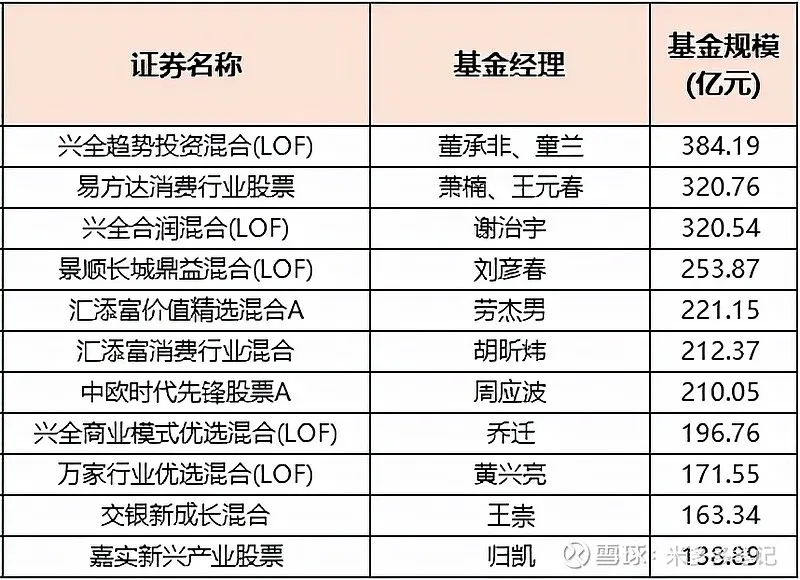

在基金界, 晨星、金牛算是两个比较权威的基金奖项, 其中有着基金业"奥斯卡"之称的金牛奖不久前刚刚放榜.

今年的金牛奖共有  25  家基金公司, 42  只主动权益基金上榜.

这  42  只基金成立时间都在四年以上, 像景顺长城鼎益、万家行业优选、兴全趋势投资更是在  2005  年成立, 至今已经有  16  年了.

从单只基金规模上, 超过百亿的达到  11  只.

这些都是我们耳熟能详的明星基金产品, 董承非、萧楠、谢治宇、刘彦春、劳杰男、胡昕炜、周应波、乔迁、黄兴亮、王崇、归凯, 这些基金经理大家伙儿也都知道.

规模在 30 亿~100 亿的有 17 支. 其中曲扬、杨浩、邬传雁、何帅也比较熟悉.

另外有 4 只规模低于 10 亿, 别看规模小, 但人家业绩却不差, 安信新回报今年还有 20%的收益.

基金经理陈鹏是一位经验丰富的公募老将, 曾任联合证券行业研究员, 2006 年 5 月加入鹏华基金, 做过权益投资二部副总经理、基金管理部副总经理、投资决策委员会成员; 2018 年 3 月加入安信基金, 现任研究部总经理.

他是一位在价值投资理念之下, 追求稳健成长风格的基金经理.

再看整体基金的业绩, 只有富国绝对收益多策略定期开放混合发起式 A、南方安泰混合 A 年化回报低于 10%.

并不说两只基金业绩不行, 产品本身有特殊性.

富国绝对收益多策略定期开放混合发起式 A, 通过股指期货, 对冲市场风险, 2016 年-2020 年连续五年正回报.

南方安泰, 债为主, 股为辅.

今年以来, 涨跌各半, 且业绩两极化.

综合看今年这 42 只金牛奖主动权益基金,

1、有大量市场成名多时的各家公司的明星产品;

2、风格重合度高, 如汇添富消费行业混合、易方达消费行业股票、景顺长城鼎益混合、广发消费品精选、华安生态优选混合、南方新兴消费增长, 都是一个大消费主题基金.

那么问题来了, 获奖的金牛基金可以买吗?

首先, 从含金量上来看, 金牛奖最大的特点是基于基金的历史长期绩效评选, 综合考量基金的收益风险指标、选股能力的稳定性和超额收益的稳定性. 每一届金牛奖的评选对获奖数量都实行精简原则, "优中选优", 选出来的基金含金量确实高.

另外, 南方基金将历年获奖基金做成一个指数, 并与沪深 300 进行对比测试.

从历史数据可以看出, 无论是在整体走势还是在历史最大回撤方面, 金牛基金的表现均明显胜于沪深 300 的表现. 可见, 金牛基金具有较好的市场潜力和抗跌能力.

另外, 从胜率以及平均收益率来看, 1 年期金牛奖胜率高于沪深 300 四到 7 个点. 5 年期金牛胜率 100%, 代表任意时间买入一支基金只要持有 5 年都能够赚钱.

从平均收益率来看, 1 年期金牛基金平均收益率高于沪深 300 六个点; 3 年期超额收益 12 个点; 5 年期扩大到 30 个点; 7 年期更是多出 70 个点的收益.

综上, 对我们投资者来说, 主要有两点意义:

一是基金要坚持长期投资, 持有越久收益越好.

二是专业的事交给专业的人来做, 相信专业的力量, 获奖基金超额收益明显.

## 原文

- [闭眼买获奖基金，竟然可以多赚70%！](https://mp.weixin.qq.com/s/cGaUsKrwCVKamnmYsxxgFg)
- [拿下今年金牛奖的42只基金咋样，能跟着买吗？](https://mp.weixin.qq.com/s/nehPzRsU4I8QGKqUoXWi2w)
