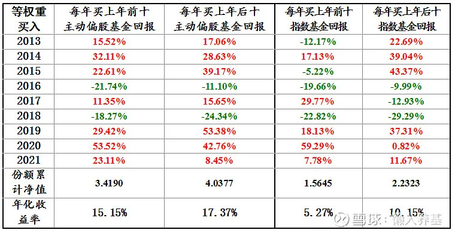
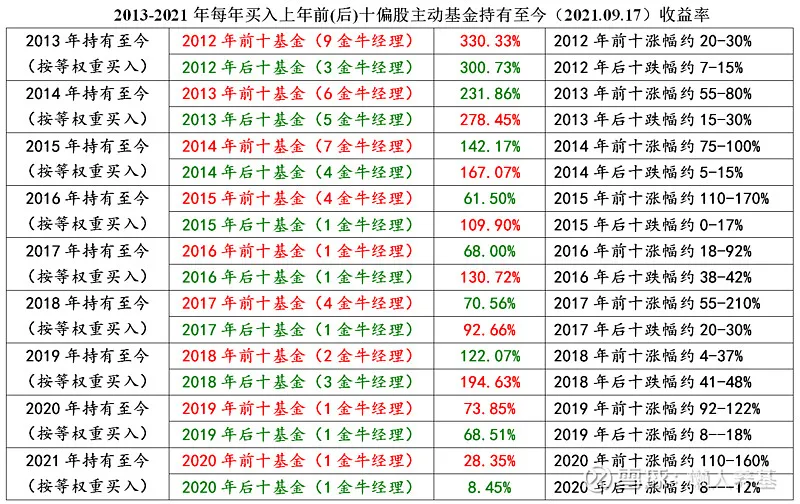
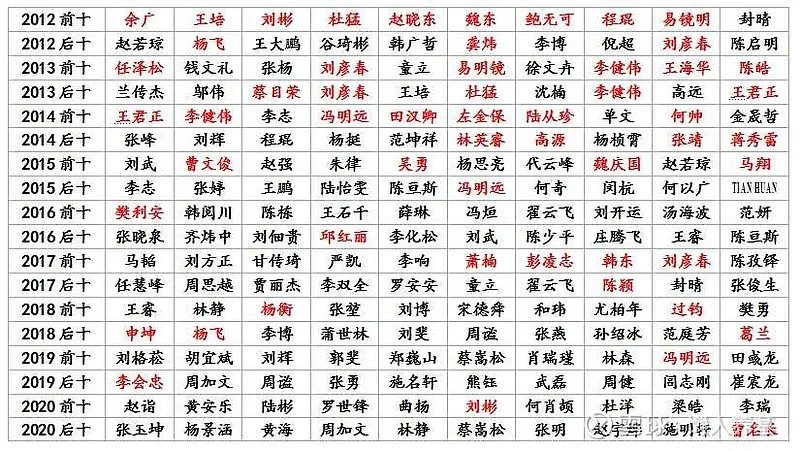

## 每年按上年排名更换新基金买入

如果每年分别等权重购买排名最前或最后十只基金, 从第二年起每年初卖出原来持有基金并重新买入上一年排名最前或最后十只主动偏股型基金或指数基金, 结果会怎么样呢? 我将 2013 年以来的基金数据作了回测, 结果见下表(2021 年回报数据截至 9 月 17 日).

需要特别说明的是: 每年排名前十或后十的主动偏股基金, 以大部分时段股票仓位超过 50%为标准, 不包括 QDII 基金, 同一位基金经理的基金只选排名最靠前(最好或最差)的一只; 指数基金则包括了所有宽基和行业主题指数基金, 跟踪同一指数的基金只要管理人不同不作剔除, 也不包括 QDII 基金.

结果显示:

1、从主动偏股型基金来看, 每年购买排名最后十只基金当年回报在 9 个统计年度(8.71 年)中有 6 个年度超过了购买最前十只基金, 也就是超过三分之二的年度购买排名最后十只主动偏股基金的收益率更高.

如果将初始净值设定为 1, 则每年购买后十偏股基金 8.71 年累计净值为 4.0377, 年化收益率 17.37%; 每年购买前十的累计净值为 3.4190, 年化收益率为 15.15%. 每年购买后十的累计回报显著超越前十, 年化收益率每年跑赢 2.22 个百分点.

2、每年购买排名最后十只指数基金当年回报在 9 个统计年度(8.71 年)中也有 6 个年度超过了排名最前十只基金, 也就是超过三分之二的年度购买排名最后十只基金的收益率更高.

如果将初始净值设定为 1, 则购买后十指数基金 8.71 年累计净值为 2.2323, 年化收益率 10.15%; 购买前十的累计净值为 1.5645, 年化收益率为 5.27%. 后十的累计回报碾压式超越前十, 年化收益率每年跑赢 4.88 个百分点, 几乎是前十年化回报的两倍.

3、无论购买前十还是后十, 主动偏股基金的回报碾压式超越指数基金.

## 每年买入上年排名基金组别后一直持有

如果每年初买入上年排名前十或后十主动偏股基金并一直持有不动, 情况又会怎么样呢? 回测结果如下.

1、从最远的 2013 年到最近的 2021 年年初买入并一直持有的回测数据看, 9 个年度中有 6 个年度买入排名最后十只主动偏股基金的收益率显著高于买入排名最前的十只主动偏股基金, 其中 2014 年-2019 年初买入前者累计收益率分别是买入后者的 1.20 倍、1.18 倍、1.79 倍、1.92 倍、1.31 倍和 1.59 倍, 平均为 1.5 倍.

2、3 个年度买入前十后一直持有的收益率高于买入后十, 分别是最远的 2013 年和最近的 2020 年和 2021 年, 而且超过的幅度在 2013 年和 2020 年都不大, 买入前十分别是买入后十的 1.10 倍和 1.08 倍, 与其它六年中买入后十平均回报是买入前十的 1.50 倍相比, 幅度要小得多.

而今年比较特殊, 买入前十的回报是买入后十的 3.36 倍, 一方面是今年以来的行情分化较为极致, 另一方面今年时间才 8 个半月并不是一个完整年度也有一定关系.

3、回测结果表明, 三分之二以上年度买入排名后十的主动偏股基金一直持有的收益率显著高于买入排名前十的主动偏股基金.

我还将所有回测年度中金牛基金经理管理基金的情况作了个统计, 试图找出主动偏股基金组合长短期业绩与金牛基金经理管理基金所占比例的关系; 在 2018 年以前, 上一年度排名最前的基金, 金牛基金经理管理占比明显高于排名最后的基金; 但金牛基金经理管理占比高的基金组合在此后若干年的业绩并没有显示出任何优势. 这一事实说明, 获评金牛基金经理相当程度上是因为之前业绩优秀, 而这种优秀的业绩已经在一定程度上透支了他们未来的"表现".

而如果将表二的所有回测往前推一年, 也就是说把决定它们前十和后十当年的业绩差算上, 那么表二的结果几乎都会被改写, 一直持有当年表现前十的基金组合几乎都会超过后十组合的累计业绩. 但这并没有任何实操价值, 因为在当年年初我们并不知道谁会胜出、谁又会输掉, 我们选择基金作组合并进行对比就失去了基础依据.

## 小结

1、此次回测选择的基金是前后各十只, 比单用一只冠军基或一只最差的基金更有代表性; 回测时间段则覆盖了一轮完整的牛熊, 时间跨度近 9 年, 避免了单一牛市或熊市可能容易得出的偏颇结论.

2、无论是每年换基还是买入后一直持有, 买入每年最靠后的十只基金在三分之二以上的时间里收益率都显著优于买入排名最靠前的十只基金, 说明即使放在以年为维度的时间长河中, 追涨都不是好主意, 基金短期的大幅上涨都很有可能透支了未来的业绩, 再优秀的基金经理管理的基金也不例外.

3、无论主动基金还是指数基金, 在它持续表现不佳、持有人骂得最凶、最令人绝望的时段是介入的相对较好的时机. 如果是长期投资者, 在每年度排名最靠后的基金中"淘金"应该是不错的投资思路.

【补充一张图片: 历年排名前十(后十)现任基金经理, 红色为金牛基金经理】

风险提示: 本文所提到的观点仅代表个人的意见, 所涉及标的不作推荐, 据此买卖, 风险自负.

## 原文

- [每年购买排名最前或最后十只基金，哪个回报可能更好？](https://mp.weixin.qq.com/s/QdL8yl_lfXrzjUom4P6u_A)
