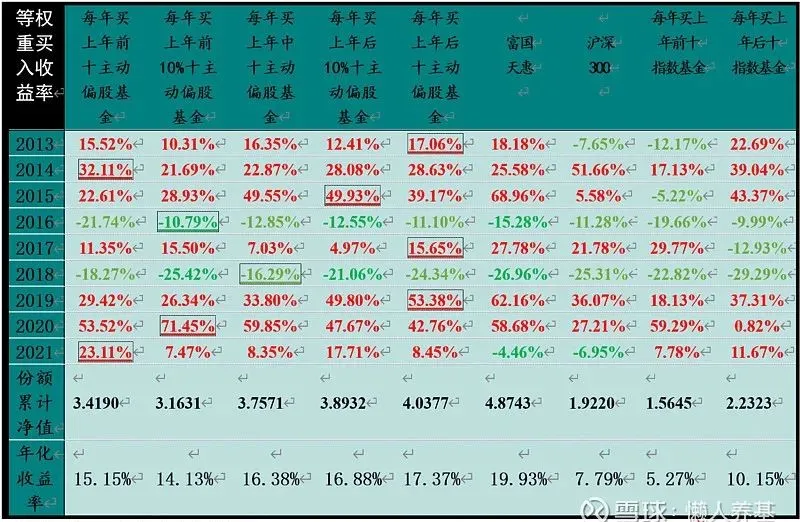
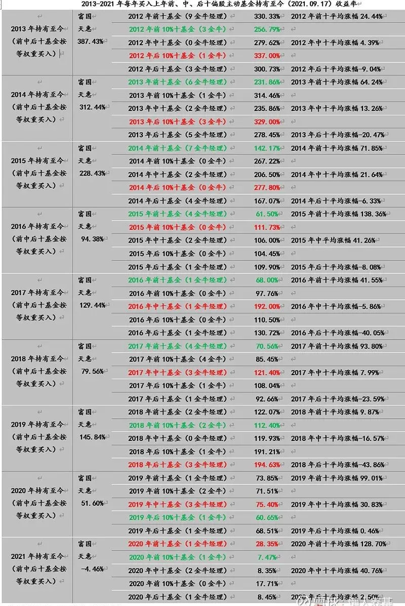
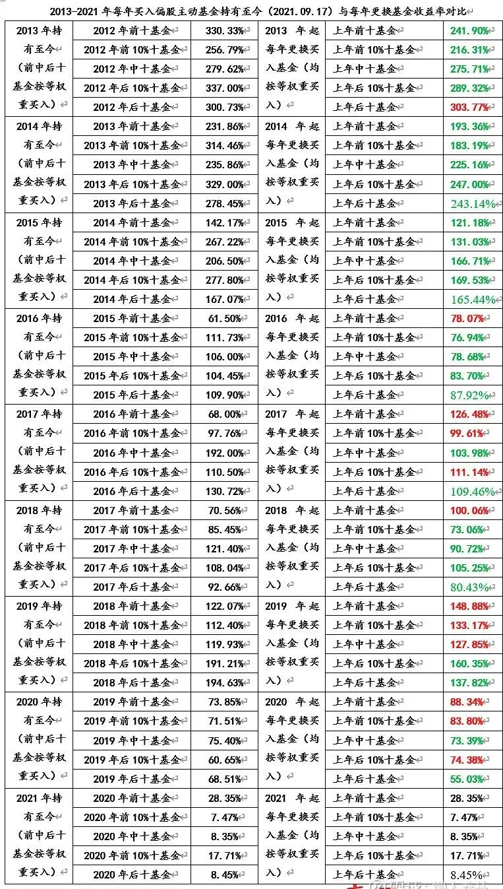
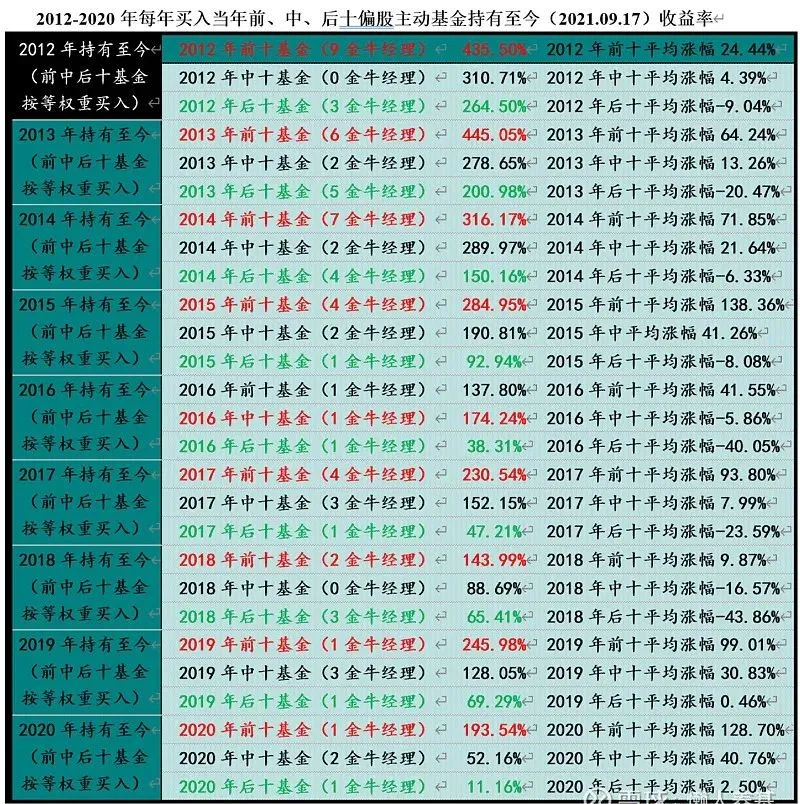
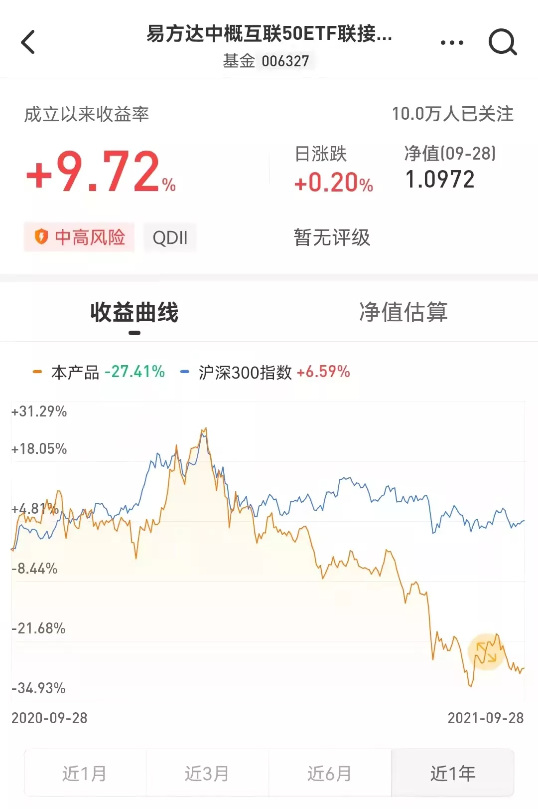

我在[上篇](/pages/d85647/)对2012年以来每年排名最靠前和最靠后的各十只主动偏股基金按买入后一直持有和每年更换基金两种情形做了回测，得出了买入最靠后的十只基金明显优于最靠前十只基金的初步结论。

之后我又很好奇，买入居中的十只基金又会怎样呢？买入处于前10%位置、后10%位置的各十只基金呢？如果再加入沪深300和一只顶尖的优秀主动基金作对比会有什么样的结论？业绩回报领先或落后背后的逻辑是什么？这些结论对我的基金投资决策将会产生什么样的影响？

坐着想，不如起来行。于是我把2012年以来每年业绩排名处于10%、50%、90%位置各十只主动偏股基金，加上原本已回测过的排名最靠前或最靠后的各十只基金，一起做了回测。

原始数据来源于天天基金自定义排行，选样方法是：从参与排名基金数量计算出10%、50%和90%起始位置，从该位置依次往后选取十只基金，剔除股票持仓占比不足50%的基金，剔除QDII基金，同一位基金经理管理的基金在每十只入选基金中只能出现一次。

## 每年按上年排名更换新基金买入

回测结果详见表一

1、截至今年9月17日回测数据显示，每年按上年排名更换新基金买入，基本遵循买入上年业绩越靠后的十只基金累计回报越高的规律，后十（4.0377）>后10%（3.8932）>居中（3.7571）>前10%（3.1631）和前十（3.4190）。每年买入上年排名最后十只主动偏股基金年化回报17.37%，比最低的买入前10%十只基金年化回报多了3个多百分点，这个差额差不多是纯债基金的年化回报了。

2、从单一年度回报指标看，买入后十在2013、2017和2019年领先，买入后10%十只基金在2015年领先，买入居中十只基金在2018年领先，买入前10%十只在2016和2020年领先，而买入前十在2014和2021年领先。后、中、前领先年度比例为4：1：4。

垫底指标中买入前十占了2个年度，分别是2015年和2016年；买入前10%十只基金独占5个年度，分别是2013、2014、2018、2019和2021年；买入后十和后10%各占一个年度，分别是2017和2020年。前、后垫底年度比例是7：2，也就是说，买入前十和前10%十只基金在78%的年度业绩垫底。

3、买入后十和后10%对买入居中十只基金有一定的相对优势，但优势并不显著；买前十与前10%，买后十与后10%，业绩回报在9个统计年度中互有超越，差距也并不明显。

4、富国天惠累计总回报明显优于所有主动偏股基金回测组别，这既体现了优选基金的价值，同时也有富国天惠一只基金是一直处于"持有"状态、未频繁换基的因素。单个年度看，富国天惠在2013、2015、2017和2019年领先所有回测基金组别，同时在2018和2021年在所有回测主动基金组别中垫底。

5、每年买入后十指数基金累计回报显著高于沪深300，而买入前十指数基金累计回报明显不如沪深300。每年买入后十指数基金的累计回报碾压式战胜每年买入前十指数基金，年化回报几乎是后者的两倍。

6、所有主动基金回测组的累计回报碾压式战胜指数基金回测组和沪深300指数。

## 每年买入上年排名基金组别后一直持有

回测结果详见表二。

1、截至今年9月17日回测数据显示，每年按上年排名买入基金组后一直持有，将各组别所有年度累计回报进行简单算术平均，也基本遵循买入上年业绩越靠后的十只基金累计回报越高的规律，与每年更换新基金买入的排名仅一处不同，即买入持有后10%十只基金的平均累计回报高于买入后十基金，具体顺序是：后10%（139.82%）>后十（132.38%）>居中（127.84%）>前十（124.60%）>前10%（111.62%）。

2、从单个统计年度看，9个统计年度中，买入持有后10%十只基金累计回报有3个年度领先，后十1个年度领先，居中为3个年度领先，前十和前10%各有1个统计年度领先，后、中、前领先统计年度总占比为4：3：2。

垫底统计年度指标中，买入持有前十独占5席，买入持有前10%十只基金占3席，买入持有后10%十只基金占1席。也就最说，在所有9个统计年度中，买入并持有前十和前10%十只基金在8个年度中垫底，垫底年度比例接近90%。

3、买入持有后十和后10%十只基金相较买入持有居中十只基金总体仍然具有一定优势，但后者仍然有亮点：9个统计年度买入持有居中十只基金领先3个年度，而垫底年度中买入持有居中十只基金一个年度都没有出现过。说明不一定要刻意追求上年业绩落后指标，优选基金也许更为重要。

4、富国天惠在2013年买入并持有的收益率以绝对优势超越各回测主动基金组，但此后8个统计年度中均有主动基金组累计收益率超过富国天惠，具体看买入并持有后10%十只基金有7个年度超过富国天惠，买入并持有后十基金有6个年度超过富国天惠；买入并持有中十、前10%十基金和前十基金分别有5个、6个和2个统计年度超过富国天惠。说明买入并一直持有回测主动偏股基金组合相较每年更换基金与富国天惠在累计回报上的差距是缩小了的。

## 买入后持有不动与每年更换基金的回报差距如何

每年更换基金相当于每年多了一次全额赎回和全额申购。主动偏股基金超过1年不足两年的赎回费率一般是0.25%，申购费率1.2-1.5%按互联网平台打一折算是0.12-0.15%，这样9个年度的申赎费率会增加3-4个百分点。我们在做每年换基回报测算的时候是没有考虑这一因素的，但在分析持有不动与每年更换基金回报的时候这个因素应该考虑进去。

我们先看不考虑申购赎回费用情形下两种投资方式回报对比，详见表三。

买入持有不动与每年更换基金在2021年这一统计年度中不存在差异，在余下8个统计年度中，前十、前10%、居中、后10%和后十5种情形买入持有不动与每年更换基金各有40个回报数据，在两组40个数据对比中，买入持有不动有29个回报率明显超过每年更换基金，比例为72.50%，如果算上每年更换基金3-4%的摩擦成本，则有31个持有不动的回报率超过每年更换基金，比例达到77.5%。

将持有不动和每年更换基金各40个回报数据作简单算术平均，前者平均回报率为165.39%，后者平均回报率为141.53%，如果按3.5%计算每年更换基金的摩擦成本，则后者调整后的平均回报率为138.03%。按调整后收益率计算，持有不动与每年更换基金回报率绝对差为27.36%，相对差为19.82%，这一幅度还是相当可观的。

以上分析说明每年买入各回测基金组合持有不动显著优于每年更换基金。

## 买入业绩排名靠后基金回报显著优于买入排名靠前者背后原因分析

我们凭直观感觉想到的原因来自于常理，买入业绩排名靠前的基金是一种追涨行为、导致持仓成本较高，而买入业绩靠后的基金则是逢低介入、建仓成本较低。我们把业绩排名靠前、居中和靠后三种情况放在一起分析，买入之前业绩排名的前、中、后正好对应着买入后业绩回报的差、中、好，证明追涨不如逢低介入，这个道理说得通，这种解释也合乎逻辑。

具体到主动偏股基金这一特殊"商品"，对上年度业绩排名靠前的基金，它们的基金经理为什么不能通过主动管理来消除后期表现落后这一现象呢？毕竟每一个年度买入上年度表现不同的各种基金，它们"比赛"的时间起点都是一样的啊。

如果把它们的买入时间提前一年，也就是在确定业绩排名靠前靠后当年初就买入，结果会怎么样呢？尽管实际操作中办不到，因为年初谁排名靠前谁又排名靠后根本无法提前预知；但我们在理论上作这样一个假设并进行业绩回溯是有利于我们进行深度分析的。

回测结果见表四。

画风突变有没有？！

在9个统计年度中，业绩排名前十基金在8个年度对居中和后十基金实现了碾压式超越！不！是按在地上摩擦、蹂躏式的那种超越！前十回报基本上是后十回报的2倍以上！

为什么仅仅相差一个年度，统计结果就大相径庭呢？是计算错了吗？当然不是！前十和后十当年业绩回报大部分年度相差达到80%以上，而且大部分年度一个是正回报另一个是负回报，按复利计算的结果当然就带来了业绩回报的巨大差距。

分析深层次的原因，每一位主动基金经理的能力圈是相对稳定的，他（她）最熟悉和深入研究的行业或个股基本上也是相对固定的，他们中的绝大部分人并不具备行业或风格轮动能力。业绩排名当年最靠前的，主因是基金持仓与当年市场风格恰好契合度极高，因此也极大地透支了未来几年的业绩；而业绩靠后的，主因也是基金持仓与当年市场风格极度不契合，而所谓"峰回路转"，未来几年市场风格大概率对它们有利，市场会对它们当年业绩极端落后进行一定程度的补偿。

可见，无论基金经理水平高低，只要基金经理的投资风格是相对稳定的，主动基金在大幅飙涨的时候一定不是好的介入时机；而业绩大幅落后，尤其年度（不一定是自然年）业绩大幅落后的时候，大概率是好的买入时点。

## 回测结果对我们进行基金投资决策的参考价值

1、作为一名还算资深的基金投资者，对我自己来说，追涨已经可以绝对避免，但对逢低介入的认知仍然不够，我对自己优选的主动基金出现持续下跌时有时还是不免持有负面评价，以至会犹豫要不要加仓，或者甚至考虑要不要换仓。

此次深度回测让我对主动基金业绩的周期性有了进一步的认识，涨得太好或跌得太多在不远的将来都会走向反面。这对完善和稳定我的基金投资决策体系会有重大而深远的影响。

2、虽然逢低介入业绩靠后的基金（组合）优于追涨业绩靠前者，但不必刻意而简单地追求业绩靠后指标，如果已经持有优选的基金组合并且不是追涨买入的，从业绩排名靠后的基金中选基换仓并不是一个好主意。

3、好公司不等于好股票，同理，好基金一定要有一个好价格，而业绩持续不佳，大部分人"恨铁不成钢"的时候，好基金的好价格才会出现。进攻属性越强的主动偏股基金，这种等待"好价格"的策略越有价值。

4、如果持有一个由偏股主动基金构建的投资组合，每一到两年进行一次动态再平衡是有价值的，恢复各基金原始比例就是被动实现低买高卖的过程。

5、站在大众的对立面，"基金反着买，别墅靠大海"具有实操价值，并不是一句过头的玩笑话。

风险提示：本文所提到的观点仅代表个人的意见，所涉及标的不作推荐，据此买卖，风险自负。

* * * * *

基金反着买，别墅靠大海，概帮人深表认同。

这走势是不是有点惨？今年肯定倒数了。

## 原文

- [用数据告诉你，买基金赚钱的终极正确方式](https://mp.weixin.qq.com/s/tw_f5_ywOtZJD2OvmLWV9g)
