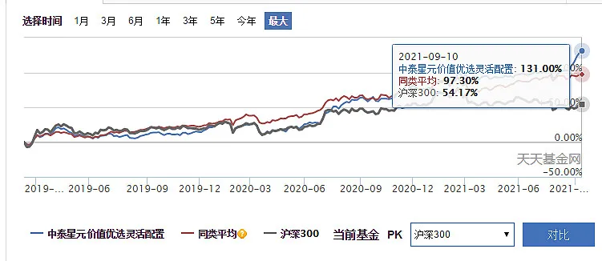
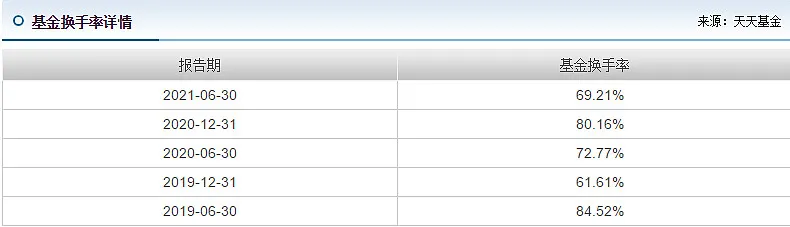
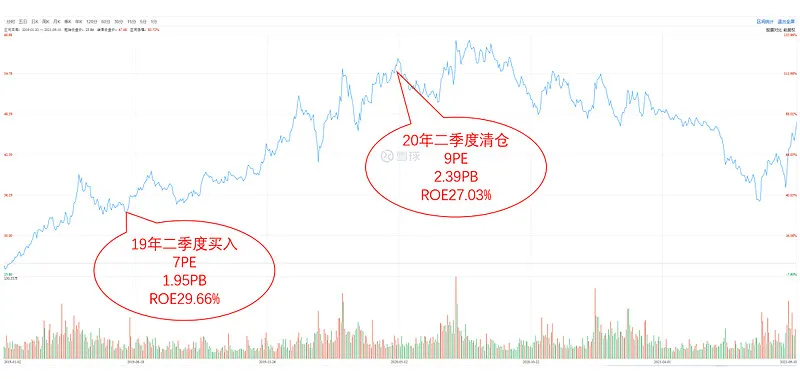
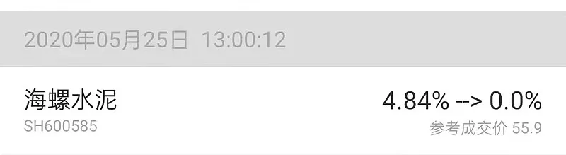
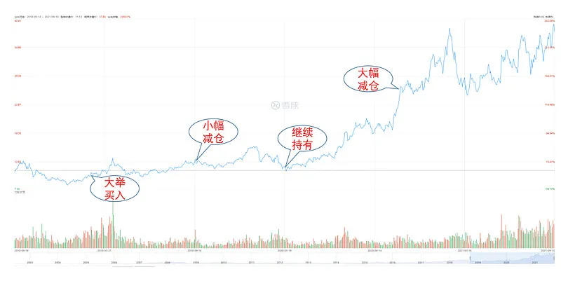
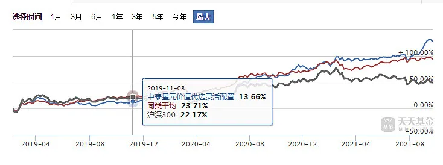

## 中泰星元价值优选

小牛慢跑在最近的一次调仓里把卖出的基金切换到中泰星元上, 同时在新一轮的定投里, 也加大了中泰星元的配置.

关于中泰星元以及姜诚这个基金经理, 应该算是我最近半年里了解最多的一个, 而且跟其他基金经理相比, 中泰算是在投资理念上跟我最契合的一个.

在开始详细分析前, 我们不妨先看看中泰星元价值优选的业绩回顾.

首先, 中泰星元这基金大致从 18 年 12 月开始运营, 时间点上可以说选择非常不错, 3 年不够的时间下收益是 131%, 当然值得注意的是这个时间段必然也受到市场走牛的趋势影响, 毕竟沪深 300 也有 54%的收益.

然后我们进一步看看换手率.

最近五个季度的换手率基本保持在 80%以下, 大家看绝对值好像不低, 但实际上同口径对比下其他的基金经理, 姜诚的换手率可以说是非常低的.

比如同样注重估值且偏左侧的某价值型基金经理最近 5 个季度的换手率在 90%-120%附近, 要陪企业走到老的坤坤换手率也有 70%-100%, 所以姜诚的换手率可以说比坤坤还低.

低换手率意味着姜诚的总体风格并不会是追逐热点, 且稳定性强. 接下来我们再从定性的角度去分析下姜诚的体系.

## 姜诚的投资风格

首先, 要定性判断一个基金经理, 我们最基本的还是从他的基金报告里了解.

先看看上年年报的一些体现理念的关键语句.

市场可以被描述, 但不能被预测.

这反映了基金经理对于市场的态度——不预测, 同时也意味着基金经理不会考虑短期的博弈机会.

当前的高度分化, 并不意味着市场风格分化立刻会发生收敛, 但长期潜在回报率的差异却可以评估.

这段是投资理念的体现, 可以看出姜诚对待标的的评估是企业的长期价值以及根据估值匹配下的长期潜在回报率.

这其实就是我经常跟大家说的, 我们投资要基于长期价值和估值的匹配程度上.

以极低的价格买入可能的"衰退"行业龙头, 也不失为高胜率的投资, 前提是估值水平要足够低, 且要回避价值陷阱.

这理念的最集中反映, 就是他的基金板块的持仓, 这点相信大家都比较好理解, 同样也是我非常认同的地方之一.

关于价值陷阱的回避部分, 我们可以从姜诚最新的中报里面提取一些关键信息.

总览我们的组合, 持仓品种具有以下两个特征:

第一, 是所在行业的领先者.

第二, 估值水平处在低位.

也就是说, 姜诚所挖掘的品种是一些不那么热门的行业(因此有低估值)里面的一些竞争力强的龙头(规避价值陷阱).

此外, 跟其他基金经理不同的是, 姜诚的对外交流不少, 除了基金报告之外, 姜诚也在雪球上谈了不少自己投资理念和自己作为基金经理日常工作相关的东西, 这里就不摘录, 直接给大家做个简单总结.

首先, 姜诚对企业的判断注重的是长期逻辑以及企业的长期价值兑现, 而对于短期的负面因素影响, 他不会太在意, 并且在企业价格上的高要求, 基本反映甚至过度反映了负面逻辑.

其次, 规避参与"高赔率(成长)"但"定价同样过高"的机会, 这本质上要求企业要有非常高的成长性去弥补, 背后隐含的风险比较大.

当然, 我们判断基金经理最重要的是知行合一, 所以我们必须要通过研究他的持仓情况来判断究竟是否跟理念贴合.

## 投资案例分析

首先说的第一个品种是大家比较熟悉的海螺水泥(以下内容是我基于基金定期报告的分析, 而非基金经理点评, 但不代表我对个股的评价).

19 年年中的基金定期报告中, 海螺水泥已经是重仓股, 但 20 年年中的报告中, 已经找不到这个标的. 大家可以看到, 买入的节点是非常左侧的位置, 而卖出的时候总体估值已经来到今年的高位, 且 ROE 是有了下降的.

大家再看回 20 年的海螺水泥, 也正是业绩逐渐衰退的一年, 而估值却明显提升, 这意味着海螺水泥的潜在回报率显著下降.

关于海螺水泥, 我的白马组合也在建立初期配置过, 然后卖出的时间也恰好是 20 年年中.

20 年年中的时候水泥行业已经基本完成供给侧改革, 因此集中率提升逻辑基本到头, 而行业的成长性也在 16-19 年的持续涨价后逐渐到顶.

而相对应的海螺的估值却达到历史高位.

再来看看近期的一些案例, 比如华鲁恒升.

从基金定期报告来看, 姜诚的仓位调整是一个递进式操作, 华鲁恒升基本是姜诚刚成立基金的时候就重仓配置且拿了很长时间的一个品种, 即便现在也还在前十权重股里, 只不过仓位相比开始时候已经大幅减少.

结合定期报告披露的重仓股, 我们可以得出一个基本靠谱的结论, 姜诚的仓位调整是一个递进式操作, 比如华鲁恒升从 9 块多涨到 12 块的时候他大概减了 15%左右的仓位.

值得注意的是, 19 年年中到 20 年年初的时候其实姜诚是坐了一波挺大的电梯, 最大回撤是达到 30%左右.

但这个阶段他的仓位也还是拿得非常稳.

直到后续华鲁恒生进一步爆发, 我们可以从事后的基金定期报告中看到, 他做了大幅减仓.

通过这个案例, 大家不妨回顾下前面他的一段话.

长期潜在回报率的差异却可以评估.

结合这句话来看, 姜诚的卖出操作我们大致可以判断出是基于"长期回报率下降后"而进行仓位减持.

这个思路跟我减持基金指数的思路也是很类似的, 股价短期的爆发必然会透支未来的成长性和潜在回报, 这时候就需要降低仓位了, 因为品种的期望回报有所下降.

本质上这种仓位的调整是基于企业的长期价值和潜在回报评估, 而非单纯的股价波动.

最后简单给大家总结下.

首先, 姜诚的投资逻辑本质上是基于企业的长期价值和估值的匹配程度, 来衡量标的潜在回报的大小.

基于这个逻辑下, 如果标的性价比下降或者基本面变差, 那么都有可能导致他进行仓位的调整, 而在估值稳定且基本面稳定的情况下, 他能够吃到企业的经营回报所带来的利润.

对于近两年的业绩爆发, 我认为这背后既包含体系因素也包含一些运气因素.

体系因素体现在他的业绩是通过非常分散的持仓来实现的, 而运气因素则体现在诸如近期中国化学的上涨更多是基于概念炒作.

所以, 对于当前的业绩, 大家不应该盲目线性外推来作为后续的业绩基准.

结合我所了解的情况, 姜诚对于标的潜在回报的预期大概在 10%-15%, 这个应该是大家长期持有下的合理预期.

由于是自下而上的分散+ 性价比持股体系, 这意味着姜诚基本回避了各个阶段的热门. 所以指望他能像其他基金经理那样拼边际变化找短期预期差, 那估计是不可能的.

此外, 跟其他基金经理一样, 阶段性的困境也必然会有, 比如整个 19 年下来姜诚并没有跑赢沪深 300 多少, 甚至中途跑输 8 个点.

姜诚本质上是在左侧分散布局品种, 然后耐心吃企业的经营回报以及估值回归收益的基金经理, 而最近一年的爆发性业绩, 是包含了一定的运气成分(也就是市场的化工周期风格).

长期来看, 大家配置这个基金的合理预期, 应该在 10%-15%左右, 这也是现阶段小牛慢跑进行配置的预期.

总体而言, 姜诚的基金适合喜欢长期稳健且偏左侧价值的朋友配置.

风险提示: 本文所提到的观点仅代表个人的意见, 所涉及标的不作推荐, 据此买卖, 风险自负.

## 原文

- [深度剖析一个宝藏基金经理](https://mp.weixin.qq.com/s/hhJL7FrjUkIIr8u_3w4dPQ)
