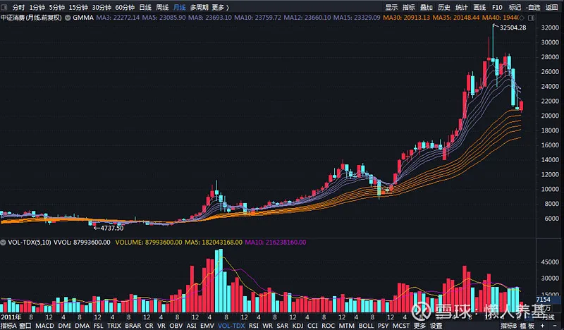
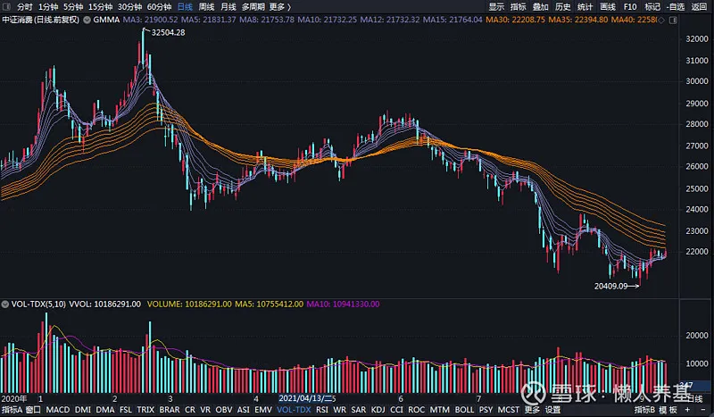
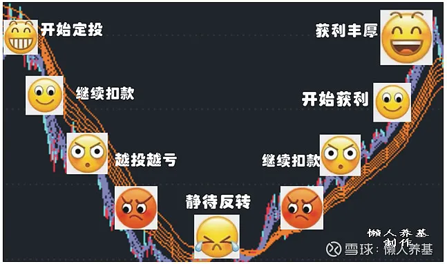

在股市里"泡"久了的投资者都知道, 消费、投资和出口是拉动经济的三驾"马车", 消费、医药和科技是具有长期投资价值的行业; 而在消费行业中, 满足人们日常生活必需的消费或称主要消费, 又是需求最为稳定、几乎具有永续特征的细分行业, 因而也是最具长期投资价值的细分行业之一.

中证主要消费指数(000932)就是由中证 800 指数样本股中的主要消费行业股票组成、以反映该行业公司股票的整体表现的一个指数. 目前成份股包含 53 只股票, 单一股票最大权重为 10%.

成份股都是我们耳熟能详的著名企业, 包括伊利股份、贵州茅台、五粮液、山西汾酒、泸州老窖、牧原股份、海天味业、洋河股份、温氏股份、酒鬼酒、涪陵榨菜等等. 从进一步细分的子行业来看, 白酒、葡萄酒、啤酒占比 50%, 肉类与食品加工占比 36.30%, 权重占比超过 1%的还有农产品、个人用品和商场超市.

截至 9 月 10 日, 该指数自 2004 年 12 月 31 日发布以来涨幅 2101.82%, 年化回报高达 20.35%, 近三年、近五年的年化回报分别达到 26.81%和 16.19%, 远超各大主要宽基指数. 我们来看该指数近十年走势图, 从月线级别看几乎是一直在上涨, 几乎很少跌破长期均线组.

该指数自今年 2 月 18 日创出新高 32504.28 点后逐波回落, 至 9 月 10 日跌幅超过 32%, 期间最大跌幅达 37.21%. 该指数的滚动市盈率也由最高超过 42 倍回落到了目前的 28.33 倍(中证指数官网数据). 以下是今年以来日线图.

虽然该指数当前仍处于正常偏高的估值水平, 但鉴于以下原因, 我认为已有望逐步迎来布局时机:

(1)该指数受关注程度较高, 不太容易出现低估机会, 即使出现低估机会时间也可能较短, 不利于从容布局;

(2)未来十数年权益投资可能是回报最好的投资渐成共识, 大量资本虎视眈眈正在寻找机会入场, 7 月 21 日以来两市成交额连续 38 个交易日破万亿就是一个明显迹象;

(3)我对行业 ETF 左侧布局习惯从高点回落 30%开始, 而该指数最大回落已近 40%.

跟踪中证主要消费指数的 ETF 基金目前有两个, 一个是汇添富中证主要消费 ETF, 另一个是嘉实中证主要消费 ETF. 另外, 华夏消费 ETF 跟踪的是上证主要消费指数, 招商上证消费 80ETF 跟踪的是上证消费 80 指数. 总体来看, 中证主要消费指数是全市场选股, 其代表性更好.

汇添富中证主要消费 ETF(159928)由于成立时间长、规模最大, 一直在我基金池内. 该基金成立于 2013 年 8 月 23 日, 截至今年二季末规模为 84.89 亿元; 今年以来单日成交额几乎都是亿元级别的, 流动性非常充沛; 该基金的管理费和托管费率分别为 0.50%和 0.10%, 为 ETF 中等水平. 综合考虑规模、流动性、跟踪误差、基金公司等因素, 我选择它作为我投资中证主要消费指数的标的基金.

左侧布局是一种主动买套、逆势投资的方式, 我习惯将拟投入资金分成 12-24 份, 以月定投的方式计划在 12-24 个月周期内投入完毕. 如果碰到低估机会, 我会在定投时加倍投入, 适当缩短定投周期.

对单一行业主题基金的投资我一般会将投资额控制在总投资额的 10%左右, 最大不超过 20%. 当然对于主要消费这种几乎是永续性的优秀行业主题基金, 我会适当增加投入金额, 拉长投入周期, 直至投出微笑曲线. 达到年化收益率 20%目标后, 我通常会将利润部分止盈出来投入其它被市场低估的投资标的, 而投入消费 ETF 的本金不动, 我会选择一直持有以获取长期收益. 把盈利转出、留下本金这种做法的最大好处是, 账面成本瞬间降低不少, 有了丰厚的心理"安全垫"后, 非常有利于长期持有.

需要特别说明的是, 左侧布局再好的投资标的, 越跌越买、越买越亏这样的"折磨"是必修课. 尽管我前面有对消费 ETF 可能跌不太深、跌不太久的预期, 但"筑顶一天、筑底一年"这样的股谚可不是唬人的, 一定要有打持久战的心理准备和资金准备.

我在多个场合、多篇文章中提醒定投者不可"抢跑"(三下五除二打光子弹)和"乱来"(重仓甚至全仓单一行业主题), 这里再重申一下, 宁可没投完就涨起来、没重仓在涨越来后有遗憾; 毕竟市场上永远不缺机会, 缺的是钱. 好多初入市的投资者就是这两个问题没解决好, 在越投越跌的过程中承受不了心理压力中途放弃、低位割肉, 把好好的一盘棋下得稀巴烂.

风险提示: 本文所提到的观点仅代表个人的意见, 所涉及标的不作推荐, 据此买卖, 风险自负.

## 原文

- [年内大跌20%，消费主题基金可以布局了吗？](https://mp.weixin.qq.com/s/ievcJ_dTe3CWkkPHytUR_Q)
