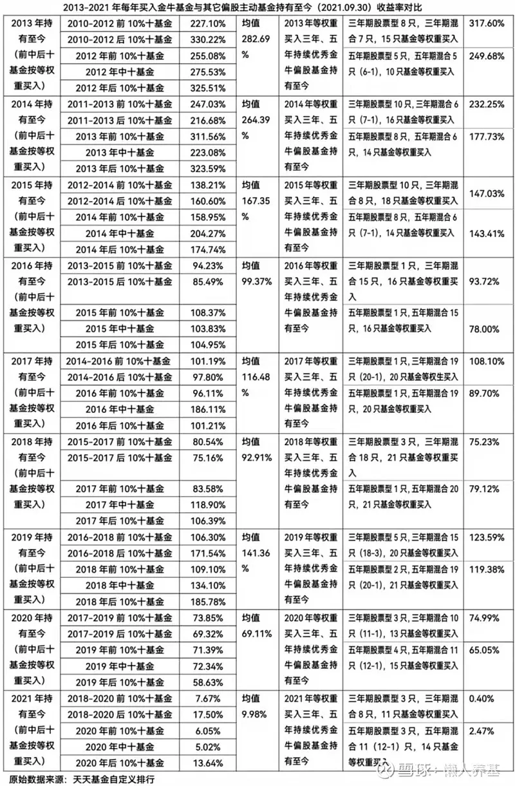
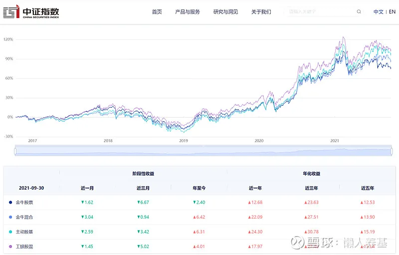
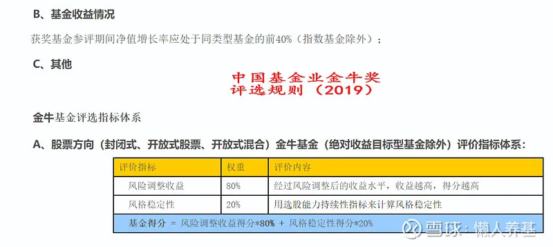

## 历年金牛基金深度回测

从人性趋利避害的角度, 我们都觉得涨得好的基金才是好基金, 跌得多的基金自然是坏基金, 因此买"好基金"大体上就等同于买涨得好的基金, 并自然而然地把它当成了一种买基赚钱逻辑.

可"真相"并非如此, 我最近通过一系列基金回测, 用详实的数据得出了每年买上年业绩排名最后 10%和最后十只偏股主动基金, 其回报显著优于买排名最前 10%和最前十只主动偏股基金的结论.

最近有"基坛奥斯卡"之称的"金牛奖"再度开奖, 金牛基金应该是国内对"好基金"最权威的认定啊, 那么跟买历年金牛基金结果又会怎么样呢?

我将 2013 年以来每年获奖的三年期、五年期"开放式股票型持续优胜金牛基金"和三年期、五年期"开放式混合型持续优胜金牛基金"自获奖以来的业绩表现作了详细回测(剔除混合基金中的平衡基金、偏债基金和绝收益基金, 余下所有股票基金和混合基金总体作为"偏股主动基金"每年等比例买入后一直持有).

各年度买入三年期和五年期持续优胜金牛基金持有至 2021 年 9 月 30 日收益率见下表.

为便于比较, 我将"三年期"对应每三年排名前 10%和后 10%位置的各十只主动偏股基金买入后一直持有截至今年 9 月 30 日的业绩同时作了回测.

加上之前已经做过回测的"上年"前 10%、中 50%、后 10%基金, 我将数据更新到了 9 月 30 日.

数据显示:

1、参与回测 9 个年度的五年期持续优秀金牛偏股基金后续表现有 7 个年度落后于三年期持续优秀金牛偏股基金. 这在一定程度上说明, "花无百日红", 时间越长金牛基金"持续优秀"的边际效应越弱.

2、一直持有三年期优胜金牛基金, 相对于持有三年前 10%、三年后 10%、上年前 10%、上年 50%和上年后 10%各十只基金, 在 9 个年度(8.75 年)的胜率分别是 5:4、5:4、4:5、3:6 和 2:7, 总胜率是 19:26. 如果将后五项持有收益率作简单算术平均, 则三年期金牛基金相对后五项均值的胜率仅为 2:7, 也就是说 9 个年度中有 7 个年度金牛基金收益率是不及后五项均值的.

3、一直持有五年期优胜金牛基金, 相对于持有三年前 10%、三年后 10%、上年前 10%、上年 50%和上年后 10%各十只基金, 在 9 个年度(8.75 年)的胜率分别是 3:6、1:8、1:8、0:9 和 1:8, 总胜率是 6:39. 如果将后五项持有收益率作简单算术平均, 则五年期金牛基金相对后五项均值的胜率为 0, 也就是说全部 9 个年度的五年期金牛基金收益率不及后五项均值.

比较结果说明, 三年期金牛基金获奖后的回报表现相对于"乱选"十只基金并没有显示出什么优势, 反倒是略微不及平均水平的; 五年期金牛基金获奖后的回报表现则明显不及平均水平.

当然这一结果仅针对金牛基金中的三年期和五年期"持续优胜金牛基金"; "年度金牛基金"近两届就没有评选了, 近两届新增加了"七年期持续优胜金牛基金", 这两项的数据不完整不太好做回测比较.

但中证指数有限公司相关基金指数近五年走势数据同样印证了金牛基金并不占优、反而略微落后于平均水平的结论.

以下是中证金牛股票基金指数(最新样本基金 11 只, 选取的都是主动基金并不包括指数基金)、中证金牛混合基金指数(最新样本基金 44 只)、中证主动股票基金指数(最新样本基金 606 只)和中证工银股混基金指数(最新样本基金 24 只)对比图, 来自于中证指数官网, 数据截至 2021 年 9 月 30 日.

数据表明, 金牛股票基金指数和金牛混合基金指数近一年、近三年和近五年的年化收益率均明显不如主动股票基金指数; 金牛股票基金指数近一年、近三年和近五年的年化收益率均不及工银股混基金指数; 金牛混合基金指数近五年的年化收益率不及工银股混基金指数. 金牛股票基金指数和金牛混合基金指数近 5 年年化收益率均比中证主动股票基金指数和中证工银股混基金指数低将近 2 个百分点.

## 是金牛基金的"含金量"不够吗?

当然不是! 正因为金牛基金参评期间的含金量足够高, 才能获此殊荣.

我们来看来自于中证网的《中国基金业金牛奖评选规则(2019)》, 其中"股票方向"金牛基金评选指标是这样表述的:1、"获奖基金参评期间净值增长率应处于同类型基金前 40%"; 2、风险调整后收益占评价指标体系权重为 80%, 投资风格稳定性占权重 20%.

风险调整后收益除了净值增长率外还要考虑净值波动和回撤控制指标, 但净值增长率显然是首要考虑因素.

这就意味着, 获评金牛奖的基金最最主要的硬指标是此前参评年度的收益率. 虽然说收益率水平要求处于同类型基金前 40%, 但实际获评金牛奖的基金平均收益率水平肯定不只前 40%, 也许前 25%或者 20%, 也许前 10%也未可知. 从这个角度来看, 买当年获奖的金牛基金是一种典型的追高行为.

我在前两篇基金回测文章中, 得出了"基本遵循买入上年业绩越靠后的十只基金累计回报越高规律"的结论, 并明确指出:"业绩排名最靠前的, 主因是基金持仓与当年市场风格恰好契合度极高, 因此也极大地透支了未来几年的业绩; 而业绩靠后的, 主因也是基金持仓与当年市场风格极度不契合, 而所谓'峰回路转', 未来几年市场风格大概率对它们有利, 市场会对它们当年业绩极端落后进行一定程度的补偿."

"无论基金经理水平高低, 只要基金经理的投资风格是相对稳定的, 主动基金在大幅飙涨的时候一定不是好的介入时机; 而业绩大幅落后, 尤其年度(不一定是自然年)业绩大幅落后的时候, 大概率是好的买入时点."

而金牛基金另一个硬的评价指标便是"风格的稳定性", 也就是说, 金牛基金的投资风格是相对稳定的. 风格稳定的金牛基金在后续年度的收益表现稍微落后也就不难理解了.

金牛奖更多的是对获奖之前相关基金整体杰出表现的肯定, 而能够获奖也意味着此前卓越的回报极大地透支了未来几年的业绩, 而这种透支靠基金经理的主动管理能力还不足以在回测期间完全弥补.

## 对买主动基金赚钱的延伸思考

1、金牛基金获奖之后一段时间的回报表现略低于市场平均水平, 是因为相关基金参评期间(获奖之前)的杰出回报透支了未来几年的业绩, 而买入获奖金牛基金是一种典型的追高行为; 如果算上参评期间业绩, 金牛基金仍然是整条街上最靓的那个仔, 基金群体中最亮的那颗星.

2、都说投资是一门艺术, 是因为投资中的变化和不确定无处不在; 基金经理管理基金同样面临着自己无法掌控的变化和不确定. 有的基金经理以"弱者思维"管理基金, 以自己投资风格的不变应对市场万变; 有的基金经理以行业景气、中观视角管理基金, 试图抓住每一次大的市场机会; 有的基金经理擅于分析经济周期和宏观环境, 在经济波动起伏中长袖善舞……但无论如何, 古今中外, 没有一位权益类基金经理能够做到契合所有市场风格从而稳定获利.

从这个角度看, 基金经理一定程度上是"靠天吃饭"的职业.

3、我之前拍脑袋对主动基金的中长期业绩进行归因分析, 认为 40%靠基金经理的能力, 60%靠运气; 最近看到有"段子手基金经理"之称的主动量化基金经理盛丰衍这样评价自己:30%靠能力, 70%靠运气. 盛总的自我评价可能有自谦的成份, 但无论如何, 运气或者说"风水轮流转今年到谁家"这一因素与基金经理的能力可能同等重要甚至更为重要.

4、基金业绩之前太好是因为基金经理投资风格与市场风格高度契合, 同时也就意味着起重要作用的"运气"在一定的时间段里用一点就会少一点.

5、相对于业绩指标, 我更看重金牛奖重要的评选指标"风格的稳定性", 如果一位基金经理、一只金牛基金的投资风格是相对稳定的, 他(它)在显著落后的时候, 未来"时来运转"又是大概率可以预期的, 因而也是可以大胆抄底介入的.

6、没有能够稳定获利的"理想"基金经理, 但可以基于投资风格的分散打造属于自己的、相对理想的基金经理"团队", 并用他们的代表性产品构建自己的投资组合; 而组合中每只基金的买入时机一定是业绩显著落后时.

(风险提示: 本文所提到的观点仅代表个人的意见, 所涉及标的不作推荐, 据此买卖, 风险自负.)

## 原文

- [获奖之后表现如何？历年金牛基金深度回测](https://mp.weixin.qq.com/s/rCFvx1cmQyWL2ekVWIASkw)
