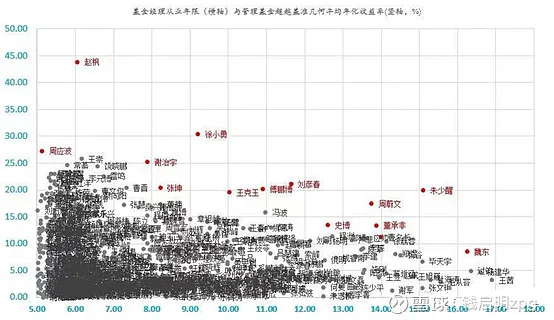

A 股所有偏股混合公募基金经理收益和年限

看一个基金经理的长期业绩, 我建议至少 3 年以上, 5 年更好, 能穿越牛熊的基金经理还是值得信任的, 败绩太多的基金经理则不行, 以及基金曲线是否长期跑赢对应的指数, 比如大盘股的跟沪深 300 比, 中小盘跟中证 500 比, 行业跟具体的行业指数比.

看尽量长时间的夏普比率(越高越好)和最大回撤 (越低越好).

以及机构持有比例(我购买的基金一般情况下机构持有比例不会低于五分之一, 机构选基金大概率还是比散户准)Fof 或 mom 基金的共同重仓是一个选基金的好办法.

基金经理一致, 新老基金如果定位一致, 可以买费率更低的新基金(申购时).

基金经理和员工自购产品比基金公司自购产品更有参考价值.

有业绩爆发力的主动股基一般规模在 50 亿以下.

老牌公募(大型私募)基金公司更容易诞生长跑型优秀选手.

即使长期投资也不可忽视进场时点的选择, 短期投资买 c, 长期投资买 a 份额.

交易越频繁, 基金收益越差, 好的收益是等出来的(换手率可以作为筛选重要参考指标).

如果心态不够强大, 主题基金的配置要少, 不然总有一段时间你很难熬. 医药, 科技主动基金, 公司商业模式比较复杂的赛道, 买主动比买被动好.

投沪港深或者 qdii 要注意含"港"量, 包括主题基金也有风格漂移.

选债基, 银行系, 机构占比最好超过百分之 50%, 规模最好超过 10 亿. 债基不买回撤大的, 中长期纯债回撤一般建议不超过百分之 2, 一级债基不超过百分之 3, 二级债基不超过百分之 4, 银行系背景一般债基做的好一点.

买固收+, 组合比单基金有优势, 组合有其他玩法, 比如海外高收益债、可转债、打新. 但是单基金主要是二级债基, 股+债. 固收+产品不适合定投, 一次性买入比较好.

选打新基金, 规模 5-8 亿, 股票仓位 20-30 中签率高.

买货币基金可以追涨, 看七日年化, 排名靠前的货基大概率总能靠前. 周五买债基可享周末收益, 而货基不行, 货币基金要在周四下午三点前买入.

基金季报看四块

基金份额总额、基金净值表现、投资组合报告和管理人报告.

不要相信 2005 年 6 月, 2014 年 5 月开始测算的高收益数据, 如果看基金业绩, 需要更关注实盘业绩而不是回测业绩.

选基金还可以看一下这个良心表现, 高规模限购, 高点分红.

集中度高, 换手率低的操作风格更容易跑出好业绩.

## 原文

- [基金从业人员选基金的方法](https://mp.weixin.qq.com/s/YvwK4DjysmfYAN_VEBdv2A)
