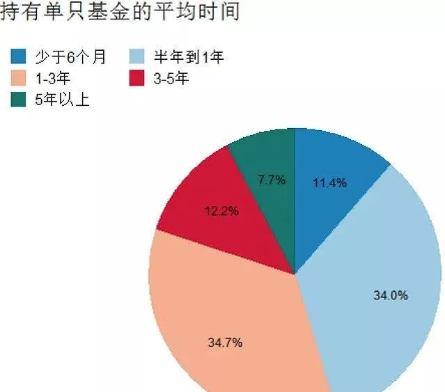
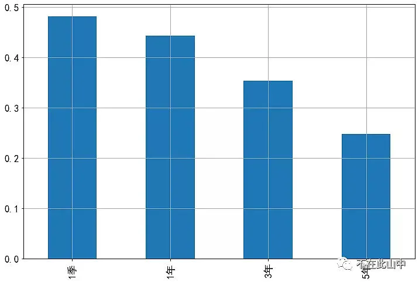
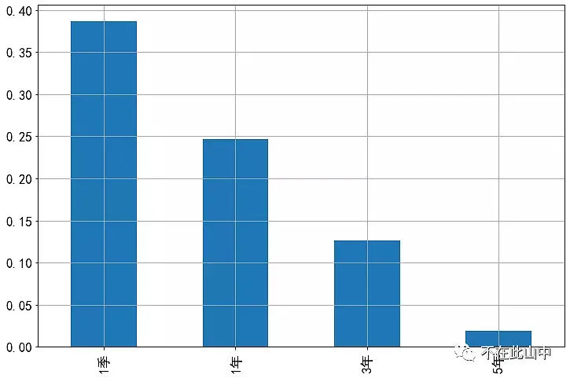
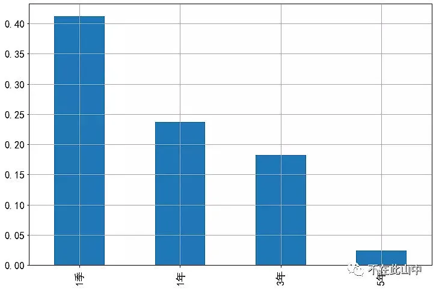
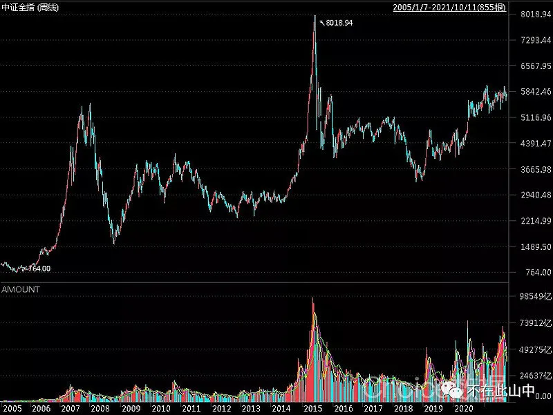
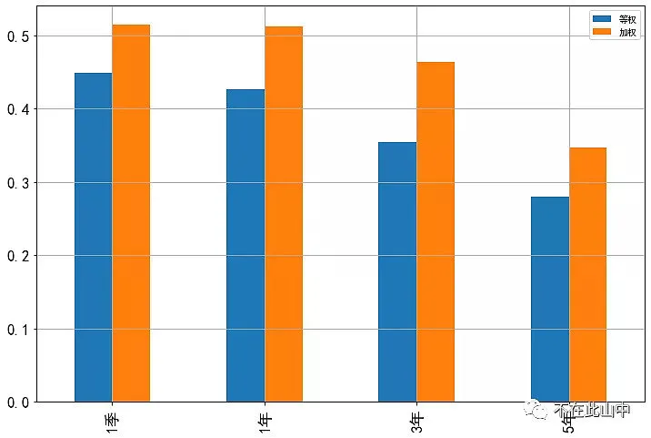
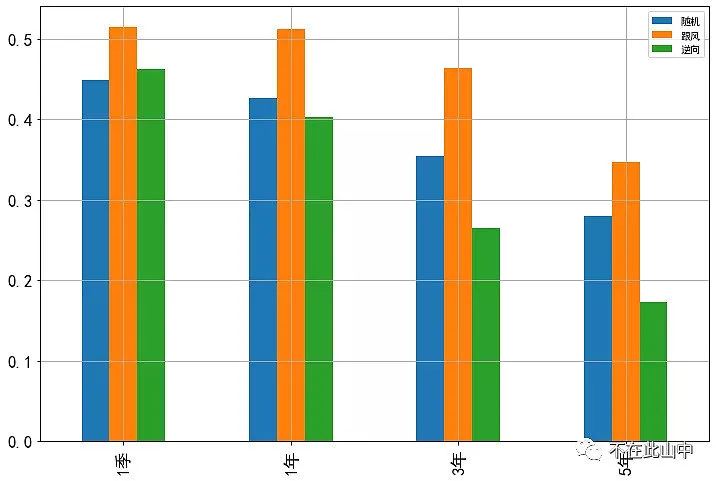
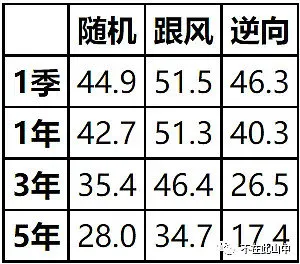
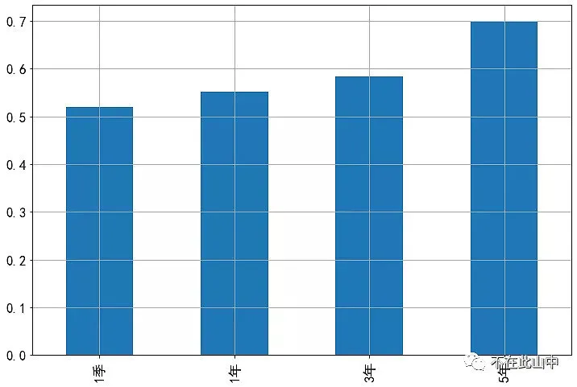

这几年全职做投资, 经常会被问到各种问题, 其中常见的一个问题是: 我要求不高, 底线是只要不亏钱就可以, 该怎么买基金?

这个问题看似很简单, 不亏钱的基金, 那不就是货币基金吗, 余额宝就行了.

但实际上, 如果只是想拿年化 2%左右的收益, 那他肯定直接投各类宝宝了, 根本不会想着来投资基金.

因此, 这问题的真正意思是: 如何通过投资基金, 赚取较高收益且不亏钱?

什么是不亏钱? 可以有这么三层意思:

1、 每天净值正增长

这问题无解, 连货币基金都不敢保证每天都是正收益.

2、 账户一直处于盈利状态

这意味着你的买入点是投资标的买入持有期间的最低点, 金融市场波动很大, 充满随机性, 刚好买在最低的概率微乎其微.

3、 卖出时账户盈利

不论买入后经历了多少波动, 卖出获得的资金大于买入的资金就算赚钱. 如果说前两点是不可能任务, 这一点却是我们经过努力可以得到的.

下面, 就来说说如何在基金投资中避免亏损.

## 拿住了!

想要获得较高收益, 必然要投资股票占比高的基金, 这种基金的波动较大. 很容易引发人们时不时来个波段操作的冲动, 很多人也是这么做的, 然而, 结果往往并不理想.

根据基金业协会《2019 年全国公募基金投资者情况调查报告》, 基金持有时间低于 1 年的占 45.4%:

实际上, 根据统计, 越是短线, 亏钱的概率就越高, 反之, 越是能拿, 盈利的可能就越大.

为找出持有时长和亏损之间的关系, 我做了个统计:

时间:2008 年 1 月 1 日至 2021 年 9 月 30 日

操作: 每个交易日都买入沪深 300, 持有不同期限后卖出.

下图横轴表示不同持有期限, 包括 1 个季度、1 年、3 年和 5 年, 纵轴表示各期限的亏损概率(不计交易成本), 如下所示:

持有一个季度亏损概率 48%, 持有 5 年亏损概率 24%, 很明显, 持有时间长短和赚钱概率成正比.

这里还未计入交易费用, 由于短期频繁交易会产生大量费用, 真实的亏损概率会更高.

沪深 300 如此, 基金是否也是这样呢? 下面看几个基金的例子.

同样的区间内, 每个交易日买入富国天惠持有不同期限, 如下图:

持有一个季度亏损概率 38%, 持有 5 年亏损概率不到 2%.

亏损概率同样随着持仓期限变长而下降.

兴全趋势, 同样, 亏损概率随着持有期限增加而下降, 从持有 1 个季度的 41%, 下降到持有 5 年的 2%:

## 拿住就够了吗?

以上是任意交易日买入亏损的概率, 隐含的假设是每一天买入的可能性都相等, 反映的是一种纯随机的买入.

但实际中, 很多人会觉得, 为啥我总是亏钱呢?

是错觉吗? 不是. 有研究表明, 投资权益类基金的基民整体而言是基本不赚钱的, 究其原因: 多数人的买入并不是随机的分散到任意交易日, 而是集中在少数时间.

在危机重重的远古时代, 从众是一种有效的策略, 落单意味着死亡, 跟风获得更高的生存机会, 经过百万年的进化, 这种倾向已经牢牢刻在人类的基因里, 面对高度不确定的金融市场时, 跟风是人本能的反应.

真实的市场中, 多数人会在市场火热时买入, 而在市场冷清时不买, 因此, 假定每一天买入可能性相等并不符合实际情况, 由此得出的亏损概率也不是现实的概率.

成交额是投资者买出来的, 成交额高, 意味着更多的人、更多的资金买入, 相比于成交清淡的日子, 你更可能在成交火热的时候买入, 因此成交额可以反映买入的概率的大小.

下图是中证全指走势和对应的成交额, 成交额的高点大都对应行情高点, 而这暴涨的成交额便是千千万万个跟风者跑步买出来的.

为了更现实地反映不同持仓期限的亏损概率, 下面就用市场成交额代表市场热度, 假设市场成交额越高买入的可能性越大, 成交额越低买入可能性越小.

下图中橙色柱体表示考虑市场热度之后的亏损概率, 而蓝柱是前面不考虑市场热度的亏损概率, 投资标的还是沪深 300:

不论是哪个期限, 橙色都高于蓝色, 这表示如果在市场热度高时多买, 则亏损概率比随机买入高, 其中持有一个季度和一年, 考虑市场热度后的亏损概率都超过了 50%, 这就比较符合我们的直觉了.

既然追随市场热度买入会增高亏损概率, 那么可不可以反其道而行之, 市场火热时我少买, 市场冷清时我多买?

就像芒格说的: 反过来想, 总是反过来想.

我也统计了这种逆市场热度买入法的亏损概率, 如下图中的绿柱所示(投资标的沪深 300):

当持有时间超过 1 年时, 逆市场热度的买入法明显降低了亏损概率.

下表列出了不同期限下, 随机买、跟随市场热度买和逆市场热度买的亏损概率, 在市场冷清时买的亏损概率明显要低于随机买, 而跟随市场热度买的亏损概率要大于随机买:

市场热度的参考指标不仅仅局限于成交额, 波动率、估值、近期涨幅等指标都可以参考, 逆向投资难的不是指标, 而是逆人性, 没有对投资原理的深刻认识, 没有经过长期的训练, 实际很难做到.

对于普通投资者而言, 简单的基金定投是个不错方法, 长期坚持, 不为市场冷热所动, 就可以获得不错的结果.

这个结果远超那些动不动就想做个波段, 时不时追个热点的投资者.

综上, 不论考不考虑市场热度, 随着持有期限变长, 亏损概率总是下降的, 因此, 长期持有是减少亏损的有效方法.

## 买入不跟风、长期拿得住, 就够了吗?

那么, 是不是所有的基金持有时间越长亏损概率都越低呢? 不是!

要有一个前提, 投资的基金是长期上涨的. 如果一个基金长期趋势向下, 长期持有的结果只会使得亏损更加确定;

比如, 不幸买到了 2008 到 2021 年 9 月 30 日表现最差的某基金, 期间回报-22%, 那么, 越是长期持有, 亏损的概率越高, 持有一个季度亏损概率 52%, 而持有 5 年亏损概率达到 70%:

因此, 要避免亏钱, 很重要的一点是避免买到太差的基金.

如何才能不差, 我们可以根据其基本面的情况、历史走势等综合判断, 长期业绩优秀的基金, 从月线上来看, 一般是重心不断上移, 走势一路朝着东北方.

过程或许曲折, 但是, 只要业绩没有发生永久性下跌, 最终都会爬出坑, 走向另一个新高.

## 分散! 分散!

要预测基金未来的收益太难, 有什么办法能保证自己不会买到未来长期表现太差的基金? 除了追溯历史. 还有一种将买到差基金的影响降到很低的方法, 那就是分散.

以 2016 年初至 2020 年初的股票型基金为例. 这四年间, 市场总体较差, 全市场股票型基金续存 517 只, 其中 208 只下跌, 占比 40%. 股票型基金平均涨幅 9.3%, 最强的上涨 187%, 最弱的跌了 57%.

你如果随便投其中一个基金, 亏损的概率为 40%, 这个比例还是比较高的.

下面我随机抽取不同数目的基金做组合, 看分散持有的效果如何.

如果每次随机投 5 个基金, 做 10000 次模拟, 其中 2638 次亏损, 相当于 10000 个人各自随机买 5 个基金持有, 其中 2632 人亏损, 亏损概率约 26%.

如果分散投 10 个基金, 随机抽取 10000 次, 有 1741 次亏损, 亏损概率约 17%.

如果分散投 20 个基金, 随机抽取 10000 次, 只有 940 次亏损, 亏损概率 9.4%.

值得注意的是, 不管怎么分散, 期望收益都并未改变, 但收益的波动范围和亏损概率却迅速下降, 收益变得越来越确定.

分散是降低亏损风险的有效方法, 但需要注意的是, 并非多买几个基金就一定能达到分散的效果, 还要关注基金间的相关性, 相关性越小、分散效果越好.

如果你买的多个基金风格相似、走势高度相关, 分散的效果就很差, 还不如随机抽取.

比如, 同时持有张坤和刘彦春的基金, 就不如同时持有张坤和朱少醒的基金来的分散.

如果能用好分散这个神器, 就无需担心自己运气不好买到很差的基金, 只要国家经济持续发展, 市场长期向上, 分散的基金组合长期总能带来正收益.

对于普通投资者来说, 避免基金投资亏损的方法, 总结起来就是两个词: 分散、长持.

分散投资标的: 持有 10 只以上相关性不高的基金.

分散买入时点: 可用基金定投的方式避免买在高位.

长持: 用闲钱投资, 权益类基金至少以 3—5 年为时间跨度.

分散与长持说起来很简单, 但投资过程中总会遇到各种情形, 诱惑你去做波段、赌风格、压赛道, 最终能坚持的寥寥无几.

人性永不变、周期永轮回, 投资也是磨练心性、自我提升的过程, 与君共勉!

这问题思考了很久, 花了不少时间成文, 若有读者因此而减少了亏损, 我将深感欣慰.

(风险提示: 本文所提到的观点仅代表个人的意见, 所涉及标的不作推荐, 据此买卖, 风险自负.)

## 原文

- [拿什么拯救你，我亏损的基金？](https://mp.weixin.qq.com/s/X51xCK0tXxBck6LYqXxjLA)
