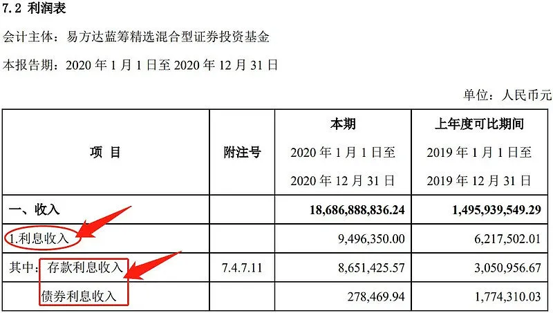
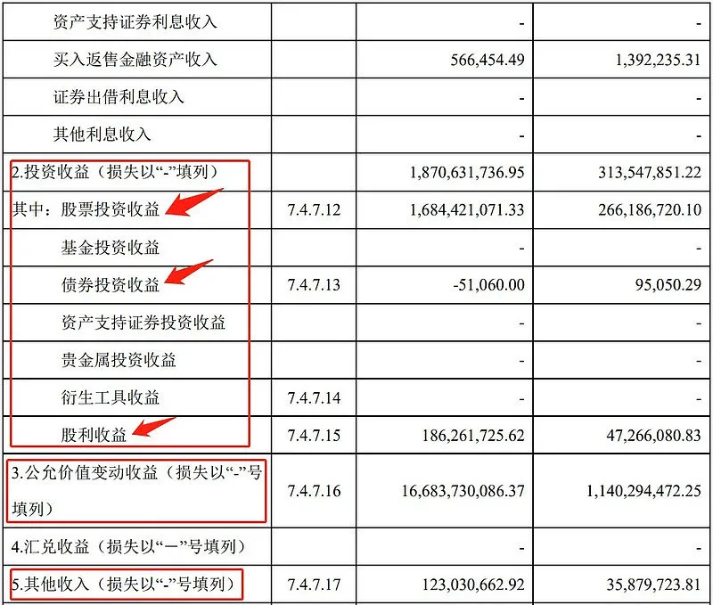
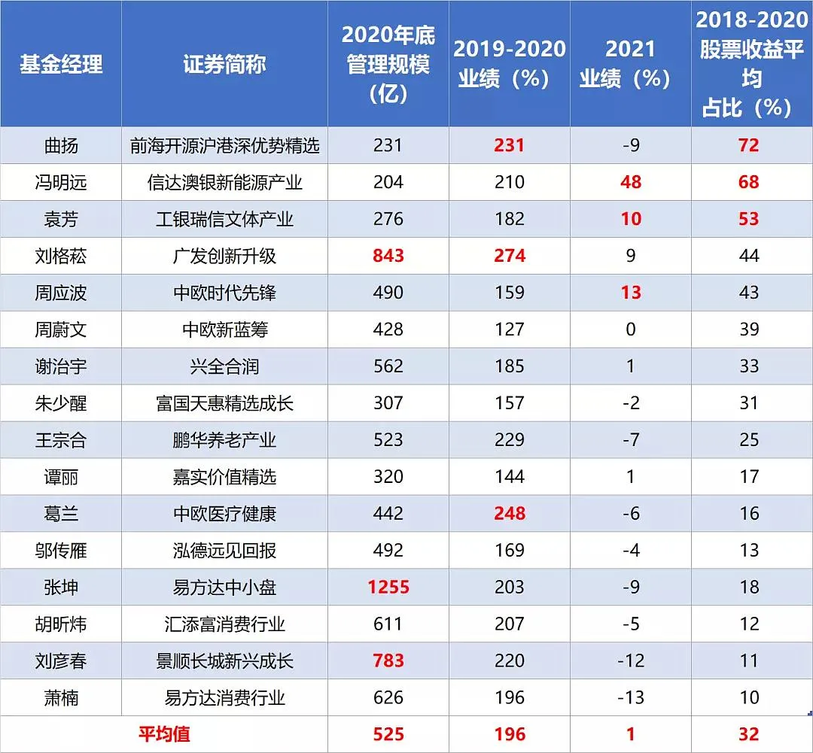
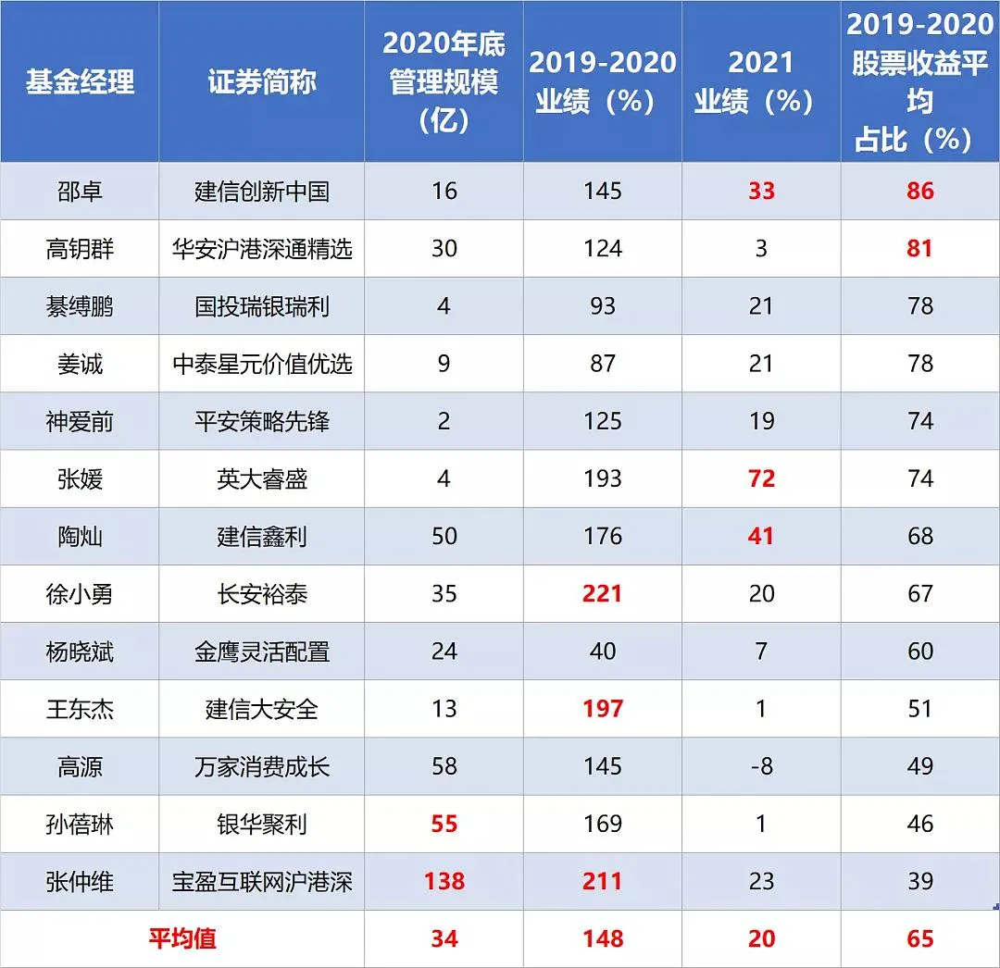

今天突然想分析一个话题, 基金赚的有哪些钱... 这个问题乍看一眼很无聊, 其实背后挺多学问的. 我来简单分析一下:

## 基金赚的钱分几个部分:

### 第一, 赚交易对手的钱.

这个逻辑非常的简单, 比如我花 100 万买下一间包子铺, 按 200 万元卖给老李, 期初现金 100 万, 现在变 200 万, 这个是交易来的钱, 已经落袋为安了~

### 第二, 赚分红的钱.

买下包子铺后, 包子铺每年给我现金分红 5 万元, 这个实打实是企业价值创造出来的部分, 稳健型投资者最爱.

### 第三, 赚估值提升的钱

比如我包子铺不卖了, 我拿着, 但老李放话说 200 万我随时来收, 所以我可以理解成已经赚了 100 万, 这个叫账面浮盈.

### 第四, 赚利息的钱

比如买完包子铺还剩 50 万, 把它借给老李, 老李算我 5%的利息, 每年给 2.5 万的利息.

这四大部分, 就构成了基金的几项核心收益.

有的基金经理喜欢赚交易对手的钱, 典型的比如像中欧袁维德, 年换手率 500%以上, 股票一般不会拿很久, 赚了很快出手.

也有的基金经理喜欢赚分红的钱, 比如工银的杨鑫鑫, 大成徐彦等, 持仓股息大多 4%以上.

最后一类基金经理, 喜欢赚价值投资的钱, 这类公司以长期持有为主, 等待企业利润增长, 但很少交易或者调仓, 比如张坤、刘彦春.

## 那如何区分这一类基金经理呢?

其实基金利润的四块来源, 在它的财报中都有明确说明.

想知道你买的基金在哪方面更突出, 直接基金 App 打开它的报告看利润表即可.

以张坤的易方达蓝筹精选为例, 2020 年年报利润表数据如下:

在财报的收入栏中, 一只基金的收益主要来自上图利息收入、投资收益、公允价值变动收益、汇兑收益和其他收入五大块.

利息收入部分, 就是债券和存款的利息.

投资收益, 就是股票、债券的交易实现收益, 再加上派发股息之和(但股息一般占比很少).

那些高换手、擅长轮动风格的基金经理, 基金的利润基本全靠它.

还是拿前面袁维德举例, 他的中欧价值智选, 投资收益在 2020 年占总收益的 76%.

接着是公允价值变动收益, 人话说就是账面浮盈, 可以简单理解为持仓股票/债券等资产随市值变动的收益.

它也是基金的重要收入来源, 与投资收益的分量差不多, 谁多谁少则和基金经理投资风格有关.

就比如张坤, 选股能力强+低换手, 不喜欢交易, 比如茅台拿了 n 年也没卖过, 所以他主要靠持股的市值提升来赚钱.

在财报这一栏, 它的公允价值变动收益占总利润的比例就很高, 2020 年占比 89%, 而投资收益占比只有 10%.

第四个汇兑收益, 主要针对涉及港股或全球投资时, 汇率变化的收益.

最后是其他收入, 包括手续费返还、ETF 替代损益、归入基金资产部分的赎回费收入等, 也没多少, 不展开细说.

这么看下来, 一只基金的主要收益来源一般核心是两个, 投资收益和公允价值变动收益.

## 投资收益和公允价值变动收益

那问题来了, 投资收益占比高的基金好, 还是公允价值变动收益占比高的基金更好?

主要还是看基金经理的投资风格, 张坤业绩也很好, 袁维德, 唐晓斌这种业绩也不差.

那这两种风格的基金经理业绩差别大吗?

我统计了市场所有主动偏股基金, 以 2018-2020 年年报股票投资收益占比的平均值为参考.

结果发现, 股票投资收益占比【50-100%】和【0-50%】的基金, 期间(2018-2020)平均业绩差距并不大, 基本是五五开.

说明喜欢操作和持股不动的基金经理实际业绩没有明显差别.

接着我又把基金分成股票投资占比【0-33%】、【33-66%】和【66-100%】三部分做对比.

不同的是, 业绩呈现出两头低中间高的结果(66:74:65), 两边距中间相差 9%左右.

说明风格太极端不是啥好事, 但太佛系业绩也不好. 总结就是有交易能力最好, 但不能交易过于频繁.

说到这就不得不提规模因素对基金经理操作风格的影响了.

典型的比如曲扬, 他的前海开源沪港深优势精选在 2018-2020 股票投资占比依次是:94%→88%→33%, 对应基金规模依次是:5.6→3.4→74 亿.

很明显, 2020 年规模骤增对他的操作风格影响很大, 从更多的投资收益, 切换成更多的公允价值变动收益.

这也说明管理规模较大的基金经理很难再通过交易价差赚钱.

我下图列举了几个明星基金经理, 可以参考一下, 对于股票收益占比太高, 但管理规模又很大的基金经理, 大家要注意下了.

这类老司机必须放弃部分原有的交易能力, 从而转向自己可能不擅长的长线价投能力.

(2021 业绩区间:2021.1.1-11.9)

可以看到, 他们近三年的交易收益平均占比只有 32%, 更多还是持股的浮盈.

受规模的限制, 他们也只能靠选股+持仓市值上升赚钱, 但今年他们的收益显然普遍是不太行的.

受影响最大的, 我觉得主要是刘格菘, 他看好高端制造板块, 今年新能源、军工、芯片表现都不错, 按理业绩不至于这么差.

再看下牛基 20:

(2021 业绩区间:2021.1.1-11.9)

(Ps: 取基金经理旗下代表基金, 部分基金无 2018 年数据, 统一改为 2019-2020)

牛基 20 的股票收益平均占比为 66%, 属于中等偏上水平, 操作更加灵活.

风格上也不是很极端, 能通过主动操作获得一定交易收益, 也比较符合今年这种市场环境.

最后做个总结:

股票基金的收益来源核心是两个: 投资收益和公允价值收益, 也即交易的钱和市值增长的钱.

长期来看, 这俩结果表现相差并不大, 但风格过于极端就不好了, 有适当交易能力的基金经理更香.

不过基金规模是一个不可抗因素, 对基金经理的交易风格有较大影响. 因此, 在选择基金经理时, 可以先看他过去主要靠啥盈利, 最后再根据规模匹配当前风格是否适合.

## 原文

- [买基金, 到底赚的是哪些钱](https://mp.weixin.qq.com/s/PG5V0L2pstZgDrUkTICMyA)
