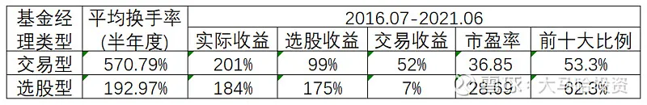

此前我对最近几年获得五年期和七年期金牛奖基金经理的各自特点进行了分析, 从中挖掘出了一批潜力型基金经理. 本文将结合这些基金经理的特点对其进行分类, 并进一步做对比分析. 为了排除业绩基准的干扰, 在剔除了萧楠和胡炘伟两位消费行业的基金经理, 剩余 28 位基金经理.

## 交易型 VS 选股型

在我统计的 28 位金牛基金经理中, 根据他们各自的投资特点, 可以将他们分为两种类型:

第一类为选股型选手: 选股型选手投资收益的主要来源为长期持有优质公司, 个股买卖时点对基金投资收益影响较小, 换手率整体偏低. 这类基金经理比较典型的像张坤和刘彦春, 他们通过长期持有消费及医药等优质公司获得了非常不错的投资回报, 换手率极低; 当然还有些基金经理相对更为注重投资性价比, 会在各优质公司之间进行切换, 换手率要稍高一些, 比如像谢治宇.

第二类为交易型选手: 交易型选手的换手率较高, 很少会长期重仓持有单只股票, 个股买卖时点会对基金的投资收益造成较大程度的影响, 其投资决策偏向于自上而下, 主要依赖于对宏观经济环境及行业景气度的判断. 这类基金比较典型的像崔莹、李晓星以及周应波等.

从上述两类基金经理的统计中, 不难发现: 交易型基金经理由于更为关注短期市场热点, 换手率较高, 交易收益贡献了投资回报的很大一部分. 由于短期市场表现与公司估值相关性不大, 这也使得他们的估值容忍度总体偏高; 选股能力的相对偏弱也使得他们有意降低前十大重仓股权重占比.

选股型基金经理则更强调以不变应万变, 长期持有优质上市公司. 这类基金经理半年度平均换手率为 192.97%, 远低于交易型基金经理的 570.79%. 从投资收益的构成来看, 他们 2016 年 7 月至今年 6 月底的选股收益平均为 175%, 要显著高于交易型基金经理 99%; 平均交易收益为 7%, 要显著低于交易型基金经理的 52%. 由于基金经理的选股收益我们很容易通过前十大重仓股得以观察, 定期报告期间通过交易带来的收益则很难为大家所察觉, 因此如果个股投资者希望抄基金经理的作业, 应该主要瞄准换手率低的选股型基金经理.

## 选股型基金经理的再分类

在选股型基金经理中, 根据他们的特点差异, 我认为还可以粗略分为两大类:

第一类基金经理在投资时不太注重个股持仓的分散度, 对于看好的个股或者行业更为倾向于重仓持有, 对估值的容忍度相对较高. 这类基金经理最为典型的就是张坤和刘彦春, 他们在白酒板块上的持仓占比一度高达 50%以上, 非常高的行业集中度使得他们 2016 年以来的投资回报一骑绝尘. 除了张坤和刘彦春外, 这类基金经理还有邬传雁、罗世峰、雷鸣、骆帅、杨浩和王宗合等, 这些基金经理的管理规模均远比张坤和刘彦春来得小, 这些基金经理均是替代顶流的潜在可选项.

在这里我特别推荐大家关注邬传雁和罗世峰两位, 他们在个股的成功投资经历上可圈可点, 行业覆盖面较宽, 是张坤和刘彦春的很好替代. 邬传雁在任职泓德远见回报期间投资过的前几大重仓股如恒瑞医药、汇川技术、视源股份、海天味业、隆基股份和法拉电子上均取得了不错的投资回报. 罗世峰在隆基股份、通威股份、欧普康视、恒顺醋业、海大集团和贵州茅台等重仓个股上同样取得了不错的投资回报.

投资这类基金经理需要特别注意的是, 不要对他们的业绩进行简单的线性外推, 具体而言:

1、不要期待这些基金经理未来的投资回报还像过去一样突出. 这是因为上述基金经理过往投资的消费、医药和科技板块的优质公司大多经历了业绩快速增长及估值抬升的戴维斯双击过程, 且估值上升对股价的贡献程度要大于业绩. 然而, 目前很多优质公司的估值都处于合理或者高估状态, 未来很难有进一步提升空间, 那么显然持有这些优质公司的基金经理们业绩也不太可能像过去那样突出.

2、张坤和刘彦春过去的业绩最好不代表他们未来的业绩也会一样领先. 这是因为最近几年各个板块拔估值的幅度及业绩的具体增幅是很难提前预知的, 我认为对于绝大多数基金经理而言, 他们并不具备精确比较优质公司群体中各公司业绩成长性及估值提升空间的能力, 换言之他们优秀业绩的取得固然是实力使然, 但也存在着不少的运气因素.

第二类基金经理在投资时相对注重投资组合的分散性, 既包括行业的分散也包括风格的分散, 这一类基金经理通常被我们称之为平衡型基金经理. 对于平衡型基金经理我们又可以根据估值容忍度的不同分为两小类, 分别为:

1、均衡偏价值: 这类基金经理在保持投资组合均衡配置的同时, 对估值的容忍度相对较低, 董承非是这类基金经理的典型代表. 除了董承非外, 还有像赵晓东、陈一峰、邹新进、王延飞和郝旭东等, 均可以归属于这种类型. 这些基金经理基本都长期保持了对于银行、地产及保险等低估值板块的一定比例配置, 比如像赵晓东, 通过投资一些质地较佳的银行股获取了非常好的投资回报.

在这里我推荐大家关注的为赵晓东、陈一峰和王延飞三位, 董承非离职, 他们三位可以作为董承非的很好替代. 这三位基金经理估值容忍度偏低, 近五年的选股收益还要高于董承非, 而且有管理规模优势, 其中陈一峰的管理规模不足 100 亿, 赵晓东和王延飞的管理规模则在 200-300 亿之间.

3、均衡偏成长: 这类基金经理在保持投资组合均衡配置的同时, 对估值的容忍度相对偏高, 谢治宇是这类基金经理的典型代表. 此外, 劳杰男、周蔚文和王崇也可归属于该类型, 其中劳杰男的风格则经历了由均衡偏价值到偏成长的转变.

如果大家认为谢治宇的管理规模较大, 也许周蔚文和王崇两位是一个不错的替代.

除了上述两类风格的基金经理外, 还有一类深度价值风格的基金经理, 他们对估值容忍度非常低, 投资范围基本都偏向于静态估值偏低的传统行业. 不过因为近几年深度价值风格表现不佳, 因此暂无登上 5-7 年期金牛榜单的基金经理.

## 交易型经理开始强调提升选股能力

在上述 28 位金牛基金经理中, 有 10 位被定义为交易型基金经理. 这些基金经理的换手率高, 交易灵活, 通过把握市场中短期投资回报获得了不菲的超额收益, 如果大家根据他们披露的半年报和年报持仓进行"抄作业", 可能要损失掉相当大一部分投资回报. 周应波、李晓星和崔莹是这类基金经理中的典型代表, 他们的管理规模较大, 投资回报中有比较大的一部分是由交易收益所贡献.

交易型基金经理相对于选股型基金经理的优势是显而易见的, 那就是灵活. 面对今年风格快速切换的市场, 交易型基金经理普遍取得了不错的投资回报, 数据统计显示, 今年年初至今:

10 位交易型基金经理平均获得了 11.43%的正回报;

18 位选股型基金经理平均获得了-4.19%的负回报.

随着近几年绩优基金经理管理规模普遍出现了暴涨, 交易型基金经理的投资开始遇到了挑战, 因为规模是高换手的天敌. 在这样的背景下, 不少交易型基金经理开始谋求转型, 着重提升自己的选股能力. 这里面最为典型的就是民生加银的孙伟, 2019 年以来他有不少成功的个股投资案例, 比如中国中免、宝信软件、顺丰控股、立讯精密和歌尔股份等.

如果大家对于管理规模较大的交易型基金经理感到担忧, 推荐大家关注何以广、孙伟、杜洋和杨栋几位.

## 总结

至此我已经对这近 30 位金牛基金经理各自的投资特点进行了详细分析及对比. 金牛奖作为基金界的"奥斯卡", 其权威性是毋庸置疑的, 能够获得五年期甚至七年期金牛奖的基金经理, 这本身就很好的反映出他们自身过硬的投资能力. 我之前在金牛选基策略的细节问题及后续改进一文中做过测算, 获得过五年期金牛奖的基金经理在长期能够显著的跑赢市场.

因此如果我们希望通过选基去战胜市场, 那么完全可以直接可以在 5-7 年期金牛奖遴选的近 30 位基金经理中进行进一步筛选, 这样可以起到事半功倍的效果.

## 原文

- [选股和交易各有哪些值得关注的基金经理？](https://mp.weixin.qq.com/s/0oZKDDlONLzvIpU8z3HYLQ)
