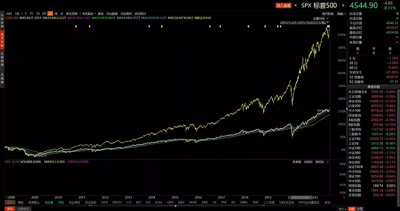
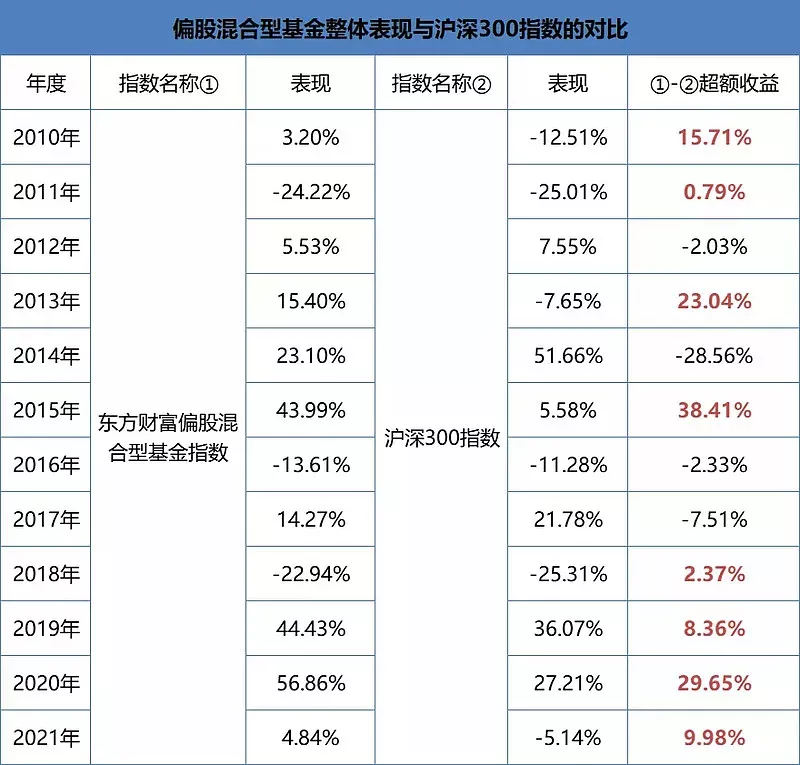
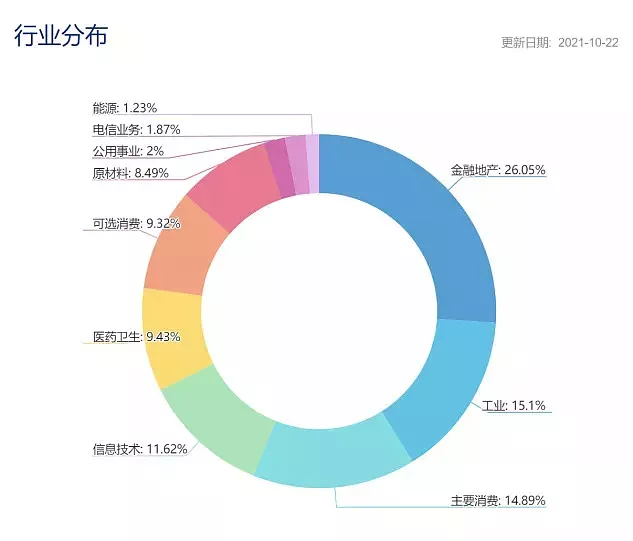
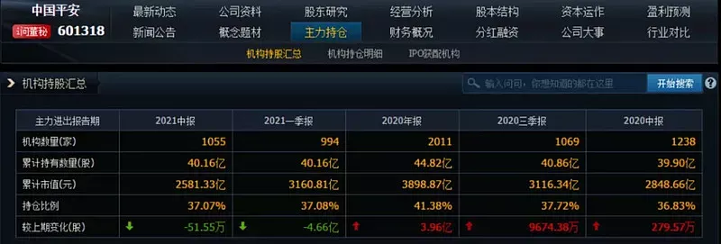

巴菲特的"十年赌约"是大家耳熟能详的投资典故. 在"十年赌约"当中, 巴菲特押注的标普 500ETF 在 2008 年之后的 10 年时间里, 显著跑赢了精挑细选的对冲基金的组合.

这一典故被国内很多的指数基金投资者所传扬. 但普通宽基指数一定强于主动投资并非是放之四海在任意时段之内皆准的.

任何真理都有自己的适用范围. 主动权益投资与指数投资在不同的资本市场中优势不同. 对于市场有效性强、机构占比较高的发达资本市场来说, 指数基金投资因低成本而具有广泛的优势. 但是在散户效应十分明显, 有效性较弱的市场, 主动权益投资仍会在一定的时间里拥有显著的优势.

图 1:2008 年至今, 纳斯达克 100 显著战胜了标普 500 指数

即便在指数投资效率高、有效性强的发达资本市场, 选择何种指数进行投资仍然是很大的学问. 对于投资而言, 深度研究与专业知识仍然会持续创造价值.

以美国为例, 虽然与巴菲特对赌的基金经理精挑细选的对冲基金组合没能跑赢标普 500ETF, 但是近 10 年来, 纳斯达克 100 指数却显著战胜了标普 500 指数.

## 统计数据, 主动权益胜

在 A 股市场中, 到底是主动权益投资更有优势, 还是指数投资更有优势呢? 以不同的时间范围和不同的投资标的比较, 我们也会得出不同的结论.

比如, 2016 年以来, 消费板块整体表现强势, 没有多少主动权益基金能跑赢主要消费指数或中证白酒指数的. 而 2019 年以来, 代表创新与未来发展方向的新经济板块表现较好, 电子信息、新能源、高端制造、生物医药等领域表现强势, 能连续跑赢创业板的主动权益基金也没有想象中多.

但是, 如果我们把比较的对象, 换作大家最耳熟能详的沪深 300 指数.

从最近十多年的比较看, 主动权益基金整体上还是战胜沪深 300 指数的, 尤其是在近年的结构性牛市中, 主动权益基金整体的超额收益更为显著.

图 2:2010 年以来, 偏股混合型基金整体战胜沪深 300 指数

从图表统计来看, 2014 与 2017 年是主动权益基金整体跑输沪深 300 指数相对较多的年份. 其原因主要在于这两年的金融地产行业整体强势, 而金融地产行业在沪深 300 指数里的权重占比较大. 主动权益基金在行业布局上如果低配了金融地产板块, 在金融地产相对强势的年份较难跑赢沪深 300 指数也是正常的现象.

图 3: 沪深 300 指数的行业构成

主动权益投资整体上有超额收益, 但也并非是年年一定有超额收益. 放眼到单只基金来看, 相比较沪深 300 指数持续多年都有超额收益的基金会大幅减少, 指数性普涨行情里想战胜沪深 300 未必简单, 熊市在下跌的控制上, 偏科技成长风格的基金想回撤比沪深 300 指数小也未必简单.

但这些因素并不会成为主动权益基金长期、整体战胜沪深 300 指数的障碍, 再怎么有效的投资方法论也不能年年有效, 非时时有效正是长期有效的保障.

## 主动权益基金取胜的三板斧

主动权益基金战胜沪深 300 指数有三板斧: 投资空间、选股优势以及动态管理.

尽管这三板斧不可能年年有效, 但在结构性的市场行情里, 在可预见的时间范围内, 主动权益基金相比较沪深 300 指数的优势仍大概率继续维持.

### 1、投资空间

从投资空间来看, 沪深 300 指数在样本股的选择上具有明显的局限性. 最直接的一条是创业板股票入选沪深 300 指数要上市满 3 年. 这导致了部分创业板优质公司, 在前期高速发展的黄金时期与沪深 300 指数无缘. 而主动权益基金通过研究, 可以找到并提前介入这些创业板优质公司, 从而贡献超额收益.

最典型的是新能源龙头宁德时代与医疗器械龙头迈瑞医疗. 从市值规模来看, 这两只股票早就够了入围沪深 300 成分股的标准了. 但因为这两家公司在创业板上市, 不符合上市满三年的标准而无法纳入沪深 300 指数.

待到沪深 300 指数能纳入宁德时代与迈瑞医疗时, 这两家公司已经从百亿市值成长到了千亿乃至万亿市值. 主动权益基金在这个过程中分享了上市公司的发展红利, 沪深 300 指数基金则完全享受不到.

### 2、选股优势

从选股优势来看, 主动权益基金依托精干的投研团队, 在行业或板块的选股中也具有长期优势. 以金融行业的投资为例, 我们可以观察到, 在银行股的配置上, 主动权益基金青睐的招商银行、宁波银行、平安银行等公司, 相较其他的银行股价表现更好, 在证券板块的配置上, 重仓的东方财富, 也比其他券商股有更优的表现.

诚然, 在消费等少数行业上, 主动权益基金因为不能超配个股突破 10%的限制, 相较相关的指数超额收益不明显, 但在大多数的行业和板块上, 主动权益基金的投研优势依旧明显.

主动基金通过精选个股从而创造超额收益, 这个是公认且经历过时间检验的.

### 3、动态管理

在动态管理上, 基金经理的局部调仓管理仍可以长期积累超额收益. 比如, 阅读今年的基金二季报, 不少基金经理在市场回调之际, 通过产业调研等方式, 增配新能源、半导体个股, 起到了不错的投资效果. 在中国平安的投资案例上, 今年一季度, 公募基金对中国平安有集中的减持, 从而有效规避了今年二、三季度之后, 中国平安更大的下跌.

图 4: 机构投资者自今年二季度起, 显著减持中国平安

与沪深 300 指数相比, 主动权益基金在结构性而非指数性普涨的市场行情中优势更为明显. 在 A 股市场中, 以沪深 300 为代表的宽基指数普涨, 所占的时段相对较短, 在 A 股市场中存在大量沪深 300 指数震荡徘徊但主动权益基金内部异彩纷呈的投资时刻. 在结构性的市场行情里, 主动权益基金, 精选个股、超配优势行业与优质个股都可能成为超越沪深 300 指数表现的归因.

## 久久为功方可善作善成

在一定的条件下, 选择比努力更重要. 认识主动权益基金的投资优势, 用好主动权益投资工具, 对于投资者的进阶成长来说非常重要.

基金投资者最终所能获取的投资回报会受到投资基金本身的影响, 但是真正积淀价值的因素恰恰是很容易被大家忽视的时间.

主动权益基金不会时时刻刻都有效, 不太可能每个季度都做出超额收益, 更不可能每个季度都保持市场领先. 能把主动权益基金当做是优质资产去长期配置, 愿意耐心积攒基金份额并通过时间来积淀价值的投资者, 最终才能享受到主动权益投资的超额收益.

所以, 在做出了选择之后, 用努力坚持把选择给做好、做对就尤为重要了. 久久为功方可善作善成.

## 原文

- [主动权益基金战胜沪深300指数的“三板斧”](https://mp.weixin.qq.com/s/RTswpbcCKT0jy8wV5KZqsg)
