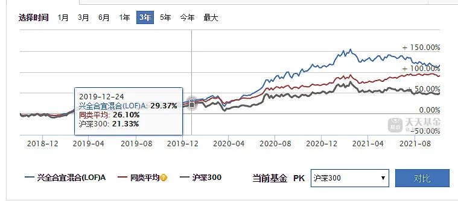
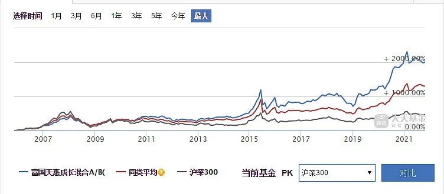
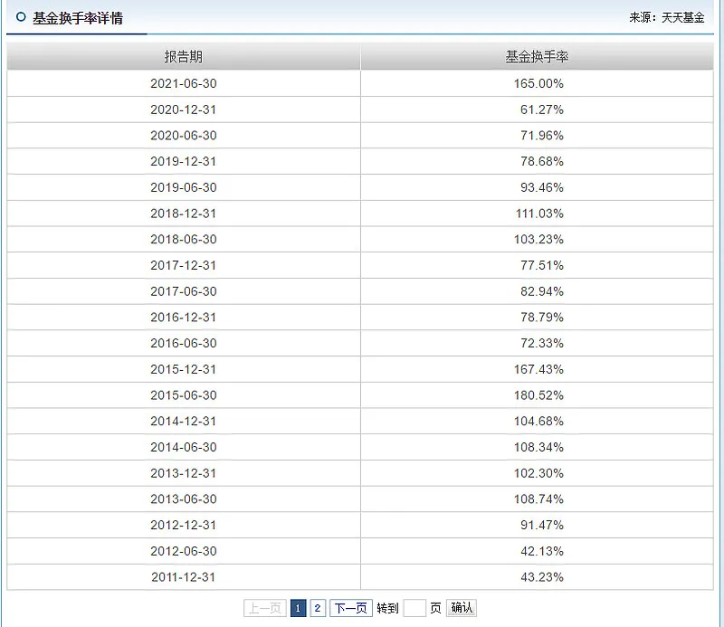
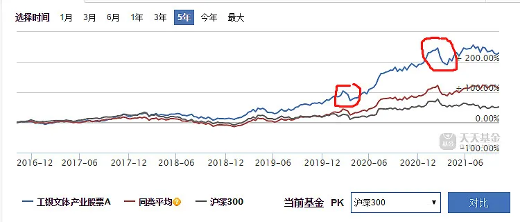
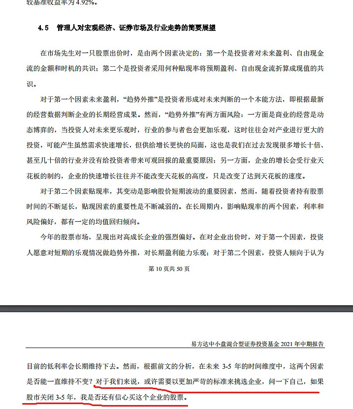
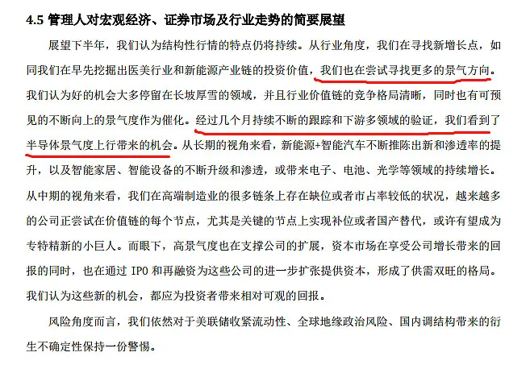
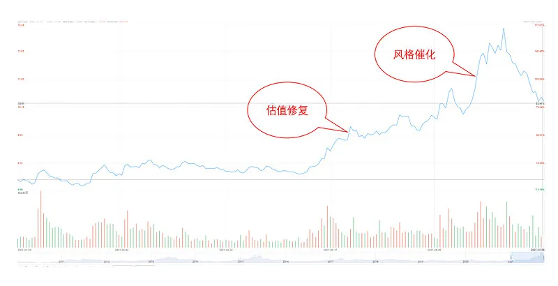

今天的这篇文章我最主要是想给大家解决下面几个问题.

第一, 如何评估你的投资思路?

第二, 主动基金的基本数据该看哪些?

第三, 如何深度挖掘和评估基金经理?

第四, 构建主动基金组合的基本思路.

今天的文章特别长, 但我认为如果你耐心看完的话应该会有挺多收获, 至少可以确认自己究竟是否适合投资主动基金.

## 价值观

首先是投资思路的评估, 本质上也就是你的投资价值观选择, 这是选择主动基金最基础但也是最关键的一步.

之前我反复给大家提到过, 你的投资就是你的价值观, 不同的投资价值观会从根本上决定你的选择.

先从几个简单的例子说起.

在 19 年年中到年底的时候, 谢治宇是被吐槽得最狠的主动基金经理, 因为新发售的兴全合宜拉胯得不行.

虽然 19 年是跑赢了沪深 300 一些, 但那一年已经有不少主动基金经理大幅跑赢指数 20%以上了, 比如后期火的不行的坤坤, 还有同样老牌的朱少醒.

结果老谢 20 年的表现非常亮眼, 一举追上众多老牌基金经理.

曹名长在前年和去年是被吐槽最多的基金经理之一, 丘栋荣在前年一起被吐槽. 曹名长今年年初最惨的时候, 中欧恒利规模一度从 30 多亿缩水到 4 亿.

结果这两哥们一个上年收回失地, 一个今年开始反杀.

如果你在某些阶段强烈吐槽过某些基金经理结果后续被基金经理的业绩疯狂打脸, 那么这大概说明你缺乏基本的投资价值取向.

导致的直接结果, 就是买基金如同股票散户一样, 追涨杀跌.

如果以主动基金业内的特征来划分, 当前的流派大致划分两类.

一类是热衷于挖掘短期预期差和热门的景气度打法, 这是核心主流, 目测占据了 90%以上.

一类是专注企业长期价值的夹头, 当然他们内部对于企业的价值判断也会有明显的分化, 但这是后话了.

景气度这一个流派本质上拼的是短期信息的获取, 在节奏踩对的时候, 会非常猛, 但是这个流派最难判断的地方, 就在于你不知道会在什么时候失灵, 所以会出现因为失灵而大幅回撤, 而且回撤之后可能很长时间内都很难回去.

相比之下, 我个人更喜欢选择投资体系保守且稳定的传统夹头流派.

在明确了自己的投资价值观之后, 我们就可以逐步构建分析基金的框架了.

对于基金的分析, 大致有两个层面, 基本信息的评估, 以及深度信息的研判.

## 基本信息

基本信息的评估其实就是大家都比较熟悉的那些基础指标, 包括但不限于,

1、3 年期、5 年期乃至更长时间维度的长期业绩.

2、基金换手率.

3、回撤表现.

4、基本风格(如大盘价值、中盘价值、大盘成长等).

还有其他一些如夏普比率之类的.

对于基本信息的判断, 我个人的看法是, 这些信息是用来排除, 而非用作决策.

简单点说, 就是如果基本信息的表现特别拉胯, 那么这个基金可以直接排除, 但如果这些信息不错, 也还不能作为你买入的标准, 因为我们需要挖掘深度信息后进行业绩归因.

首先是最重要的长期业绩, 现在大部分人都会看长期业绩了, 这里就简单补充一些细节.

首先, 最有分量的长期业绩, 必然是经历两轮牛熊以上的业绩, 也就是最好在 2012 年之前就开始的业绩.

比如耕耘多年的老朱, 体系完整, 即便在各轮熊市初期的回撤也不少, 又或者每一轮牛市都不是最厉害的那个, 但总体在不同阶段和风格的行情里, 都保持相对不错的业绩.

其次, 一些冷门的新崛起基金经理可能缺乏足够长的业绩支撑, 这类基金经理需要比较深度的业绩归因来评估, 比如之前给大家说过的姜诚.

最后, 即便是有足够长期的业绩支撑, 也可能包含比较大的运气成分, 同时规模的扩张确实有可能导致后续业绩难以持续, 所以预期要下降.

基金换手率是我比较看重的另一个数据, 这个数据的高低能一定反映出基金经理的流派, 一般而言高换手率(持续超过 200%甚至 250%)的基金经理大致可以归为追逐热度和边际变化的那一批, 至少不太可能是传统夹头.

反过来说, 低换手率的基金经理, 投资体系大概率是偏向看重企业长期价值, 因为长期价值的实现基本建立在长期持股上.

比如坤坤的换手率长期在 100%以内.

回撤表现方面可能有很多人注重, 但我个人并不会特别看重, 因为在回撤表现很多时候反映的是一种市场偏恶或者比较极端的系统性风险呈现的阶段, 这对于偏向长期价值的基金经理来讲并不是很好预估或者操作调整.

另外, 过往回撤控制得好的基金经理不代表将来也控制得好, 两者是没有必然的关联.

比如袁芳, 今年吃下的回撤就比上一次要大得多, 朱少醒 18 年吃下的回撤也非常巨大.

如果是极端一些的行业类基金, 那么就更不能过于看重回撤了, 比如葛兰.

最后是关于基金的一些基本风格, 这个指标有很多科普都喜欢关注, 但我认为对于大部分体系完整的基金经理而言, 其实他们在选股的时候并不会特意考虑"我要选大盘价值还是中盘价值".

基金呈现出来的风格往往是基金经理选股体系下极端性呈现的结果, 而非他们的评估标准.

还是以张坤为例, 他追求的是企业内在价值的确定性, 深厚的护城河, 而这些企业往往具备经营持久、利润增长稳定、规模庞大的特征, 于是最后你发现张坤有相当多的品种都是大盘成长股.

而不是, 张坤自己觉得"我要找盘子够大且有不错成长性的品种, 所以买了一堆大盘成长股".

之前有人问姜诚是不是对大盘价值情有独钟, 姜诚的回答就是只要符合他体系的公司都会被纳入, 无关是否大盘还是小盘.

所以, 执着于大盘成长还是大盘价值抑或是小盘成长, 意义并不大, 除非你有能力赌市场风格.

## 深度信息

在对基本信息进行了一些评估之后, 我们就要做更加深度的分析, 这也是分析主动基金最难的地方.

挖掘深度信息的目的是深度剖析基金经理的投资体系, 分拆下来大致有下面三部分.

第一是基金经理是否知行合一.

第二是进行业绩归因.

第三是全面评估基金经理的投资体系.

针对这几个层面, 我们切入角度主要从基金财报的基金经理展望部分、权重股分析、买卖操作及反映的估值标准等多方面来进行评估.

详细操作大家不妨回顾一下我之前对姜诚的分析——[《深度剖析下这个宝藏基金经理》](/pages/5ffc3a/).

接着再以大家熟悉的基金经理来做极简版例子.

首先, 我强烈建议大家要看看基金经理在每季度报告里的表述, 这如同巴菲特的致股东信一样, 是基金经理的直接描述, 比你看各种间接的采访都来得直接.

比如张坤最后这句话, 就很能反映出他的投资价值取向是基于对企业的长期价值进行判断, 这意味着如果你是想追逐短期边际热点的话, 张坤大概率不能满足你需求.

另外摘录下某喜欢追求景气度的基金经理的表述, 这风格可以说跟坤坤完全不一样.

需要注意的是, 如果你不具备一个基本的投资价值观, 你是很难通过基金经理的这些表述来进行体系评估.

或者换个说法, 你会觉得每个基金经理都说得有道理. 然后回头就追涨杀跌去了.

所以投资价值观的确立是非常重要的, 只有这样你才能挑选出真正看得懂且适合自己的基金经理.

投资价值观的确立其实不难, 因为无论是价值投资还是景气度打法, 底层的原理都比较容易理解, 但你必须要在这里面挑选一个适合自己的体系, 不然你的投资很容易陷入混乱.

在通过季度报告初步了解基金经理之后, 我们就可以分析基金经理的历史持仓情况来做进一步的判断.

我知道大部分人都不具备个股分析的能力, 所以对于基金经理的持仓评估, 相信大家也很难去做深度的个股研究, 哪怕我自己也不可能对基金经理的每个公司都有深入了解.

不过, 还是有一些比较简单的评估思路来验证基金经理的体系特点, 比如跟踪下过去持仓时间特别长的品种, 以及评估下基金经理对这个品种的买卖节点和对应估值.

这些信息基本可以反映出一个基金经理的选股和估值体系.

像坤坤和葛兰这种, 拿着茅台和爱尔眼科拿到天荒地老死活不卖的, 意味着对于企业的长期价值和定性判断看得很重, 同时估值体系容忍度高的有点离谱.

即便同样偏向企业的价值发现, 不同的估值体系所反映的风险控制思维是不一样的.

估值容忍度高的体系, 意味着对企业的长期判断力要求高, 容错率低, 估值容忍度低的体系, 对企业的长期判断力要求较低, 容错率高.

前者在市场风格的加持下, 业绩爆发力可能非常夸张, 但看错的时候代价也非常严重, 今年大家调侃坤坤被定向狙击, 本质就是他的估值体系所要付出的代价.

所以即便同样是夹头, 这里的分歧可能非常巨大.

至于景气度打法的那一批, 估值体系的容忍度就更夸张了, 反正我唯一看懂的部分是——趁着景气度下滑前就跑路中间估值涨成什么样都没关系.

估值评估的重要性也是业绩归因的核心一环, 我们要搞清楚这个基金经理过往的业绩有多少是运气成分多少是体系, 最重要的其实就是看相当长的时间里(比如 3-5 年), 他的业绩增长有多少来自估值的修复乃至泡沫化, 有多少是企业实打实的业绩.

有时候即便是 5 年业绩不错, 背后也很可能是因为估值持续提升的原因, 比如白酒.

这里面又要做一个细致的区分, 估值从低估修复到中枢的部分, 可以排除运气, 但估值从合理达到泡沫化的阶段, 则包含相当程度的运气了.

比如姜诚的爱股中国化学, 今年的涨幅是比较凶残的, 但在我看来, 前面这段(大概 10PE 内)的上涨, 可以看成是估值修复的部分, 而后面进一步的暴涨, 则更多是受益于风格推动下的运气成分.

两者的区别是, 估值修复虽然也要靠运气, 但长期来看大概率是你能完整吃到的, 而泡沫化则更多是阶段性的市场情绪导致, 在情绪回落后大概率是要还债的.

当然这里面会涉及一些个股的价值判断, 大家可能不太好评估, 不过如果结合基金经理的买卖操作, 那么对于估值容忍度较低的基金经理, 如果他的业绩爆发很强, 那么大概率是包含相当程度的运气成分, 至少大家对于这部分的业绩预期, 未来不能打太高, 甚至要计提.

所以, 如果基金经理的权重股里有你熟悉的品种, 你自然能够很好的评估基金经理的体系.

这也是投资主动基金的区分点

## 组合构建以及基金组合评估

最后聊下基金组合的构建和基金组合的评估吧.

对于基金组合的构建, 我的建议是, 基于你自身所选择的投资体系, 挑选出体系接近但覆盖领域有所区别的基金经理.

比如小牛慢跑选了曹名长和姜诚, 之后可能还会纳入老朱和老谢, 他们的持仓领域区别还是蛮大, 但是体系大方向都接近, 这样可以尽可能摆脱市场风格的影响.

然后对于当前各类 FOF(基金组合)的评估, 其实本质上就跟你评估基金经理体系一样, 你得了解组合管理人的投资体系和投资理念, 然后评估下自己是否认可, 在这基础上才要考虑是否要配置.

不然, 你是拿不住组合的, 隔壁药师经常给我吐槽很多新粉看到组合回撤 10%就开骂了, 然后卖掉之后就踏空又追高杀回来.

今天的文章比较长, 不过我认为应该能帮助大家比较好认识到投资主动基金的难点, 以及不要轻言长期持有 XX 基金经理.

因为如果你没体系而谈长期持有, 我认为十有八九是做不到的, 还不如老实买指数基金或者定投沪深 300.

一顿操作猛如虎, 有时候选择指数还是比较省心.

## 原文

- [最全面深入的主动基金投资教学](https://mp.weixin.qq.com/s/8a6Jp1jWyxkJ9Jy-tVtI7g)
