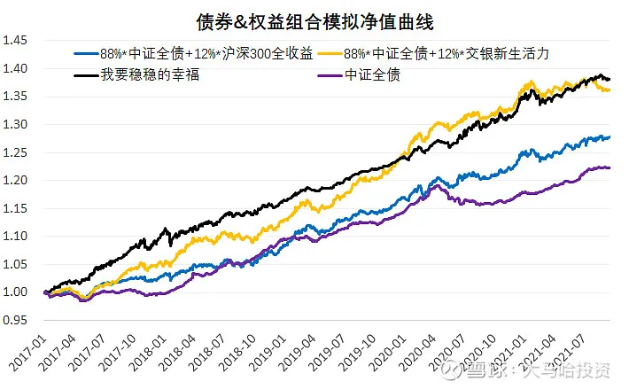
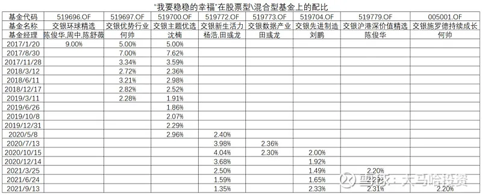
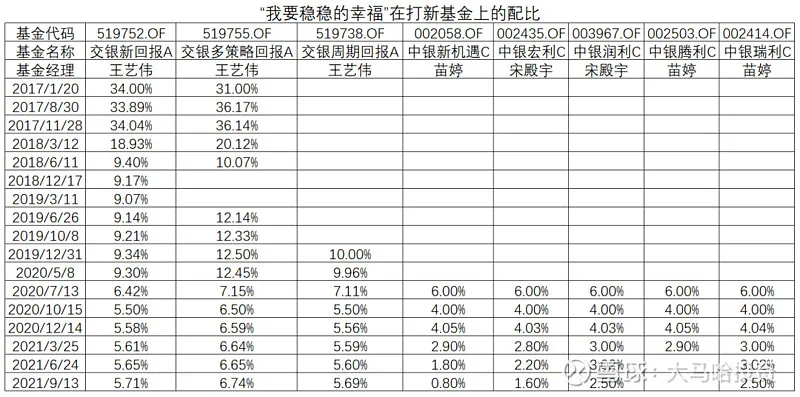
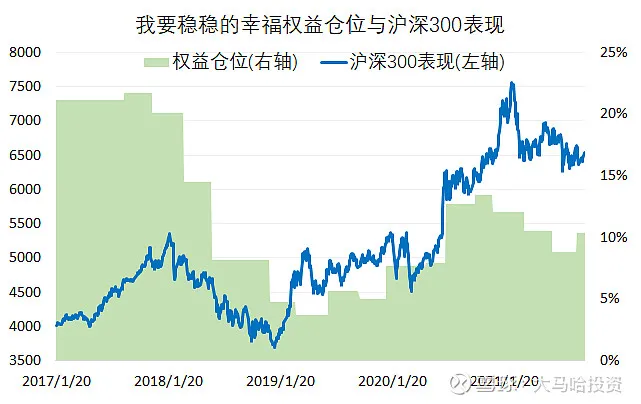
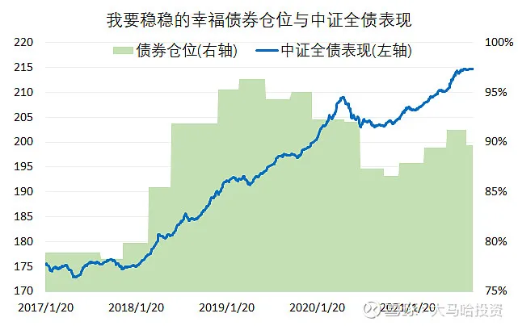
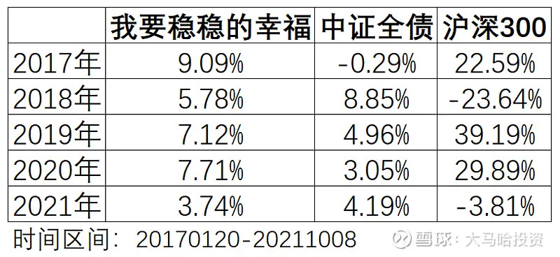
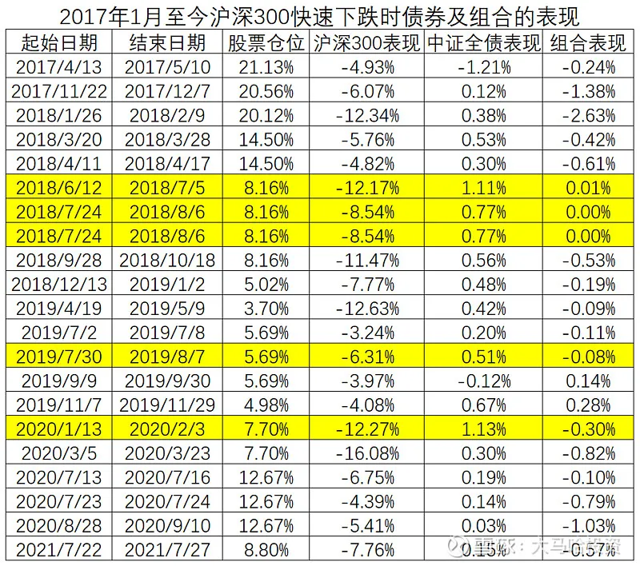
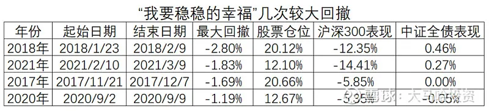

随着基金数量变得越来越多, 为帮助大家选基金, 基金公司和自媒体均推出了各式各样的基金组合.

为满足大家的投资需要, 基金组合主要分为两大类, 第一类为旨在获取高收益的权益基金组合; 第二类为旨在获取稳定回报的"固收+"组合.

说到"固收+"组合, 大家最容易想到的就是交银管理的"我要稳稳的幸福", 其得到了非常多的投资者的关注, 该组合在回撤与债券类指数相差无几的情况下, 相对于债券指数获得了近 3%的年化超额回报, 堪称"固收+"基金组合中的现象级产品.

"我要稳稳的幸福"于 2017 年 1 月 20 日开始正式公开运作, 截至今年 10 月 8 日, 该组合的最新净值为 1.3812, 折合 7.07%的年化回报, 期间最大回撤为-2.8%(20180124-20180209). 若假定同期持有中证全债指数, 那么该组合的最新净值为 1.2230, 折合 4.35%的年化回报, 期间最大回撤为-2.89%(20200506-20200907).

那么该组合是通过怎样的基金资产配置实现如此稳定的收益的呢?

## 增加权益类底仓, 提升组合的投资回报

众所周知, 长期来看权益类资产的投资回报要高于债券类资产."我要稳稳的幸福"通过适当配置权益类资产以力求获得更高的收益水平, 将该组合持有的基金按照各自的股票仓位进行穿透, 可发现该产品自成立至今平均权益类仓位约 11.64%, 接近 12%.

通过在组合中增加权益类资产, 能显著提升组合的投资回报.

下图列出了中证全债、88%\*中证全债+12%\*沪深 300 全收益、88%\*中证全债+12%\*交银新生活力和"我要稳稳的幸福"四个组合的净值表现. 可发现: 中证全债与沪深 300 全收益按照 88%和 12%的比例叠加, 投资组合的净值出现一定幅度提升; 再考虑到近几年权益类基金普遍表现不错, 将沪深 300 全收益替换为杨浩所管理的交银新生活力, 2017 年至今该模拟组合的净值与"我要稳稳的幸福"基本相当.

在"我要稳稳的幸福"组合中, 权益类资产是以两类形式存在.

第一类形式为普通的股票型或者混合型基金. 这些基金均是交银管理的, 组合买过的基金经理有何帅、沈楠、杨浩、田彧龙、刘鹏和陈俊华.

第二类形式则为打新基金, 这类打新基金的权益仓位通常在 20%以内, 通过把权益做底仓, 辅以打新获得更好的风险收益特征. 该组合除了配置交银王艺伟管理的几只打新基金外, 在 2020 年年中又引入了中银的几只打新基金. 这类打新基金由于有打新收益贡献, 其表现要显著好于规模较大的股票基金与债券基金的简单组合.

## 风险平价思维, 重应对, 轻预测

尽管"我要稳稳的幸福"权益类仓位平均在 12%左右, 但在组合运作期间权益类仓位浮动幅度较大, 无疑, 组合的权益类仓位变化是非常值得关注的.

在组合对于权益仓位的控制上, 其遵循是应对而非预测市场的原则. 下述两图分别列出了"我要稳稳的幸福"组合债券仓位和权益仓位与沪深 300 指数及中证全债指数的对照.

在图中, 可发现权益仓位基本与市场的变化同步, 在市场处于高位时, 权益仓位亦处于高位, 在市场处于低位时, 权益仓位亦处于低位.

2018 年随着市场的下跌, 组合不断调降权益的仓位, 在 2019 年年初权益仓位保持在 5%以下的水平. 在今年 2 月份权益 20%级别的回调中, 组合在回调前降低仓位的幅度并不大, 减仓操作基本都是事后完成的. 债券在 2020 年 5 月份出现一轮近 3%级别的调整, "我要稳稳的幸福"同样是在事后而非事前降低了组合的债券仓位.

回顾组合在权益资产和债券资产配置比例上的调整操作, 总体上应该是遵循了风险平价的原则, 当某一类资产对组合波动的贡献较大时, 这类资产的配置比例就会被压低, 否则就会被抬高. 尽管看起来这样的操作显得比较滞后, 但正因为这样, 使得组合未来控制住回撤的可预期性得以增强, 毕竟预测市场走势是一件非常难得事情.

## 利用股债弱相关降低回撤, 提升收益稳定性

通过上部分很容易发现, 通过将债券基金与权益类基金进行适当搭配, 可以获得与"我要稳稳的幸福"相近的投资回报. 与此同时, "我要稳稳的幸福"组合收益较为稳定, 回撤较低, 这主要还是得益于股债之间存在的低相关性, 把相关性较低甚至负相关的资产组合在一起, 可以显著降低组合的波动及回撤水平.

### (1)分年度来看, 股票跷跷板效应明显

2017 年是债券的熊市, 中证全债录得负收益, 然而沪深 300 则表现不错."我要稳稳的幸福"得益于较高的权益配置比例(20%)以及丰厚的打新收益, 2017 年录得了 9%以上的投资回报.

2018 年股票大熊债券大牛, 期间沪深 300 全收益下跌 23.64%, 中证全债则上涨 8.85%. 受益于债券的良好的表现以及交银系权益基金的相对抗跌, 组合取得了 5%以上的正回报.

2019-2020 年为权益大年, 债券亦表现尚可, 但因权益仓位不高, 组合获得了 7%+的收益, 但并不够突出.

2021 年受累于权益较高的仓位, 组合整体表现一般, 前三季度收益不足 4%.

### (2)股票快速下跌时债券往往表现较好

下表列出了 2017 年以来沪深 300 出现快速下跌时债券和"我要稳稳的幸福"组合的表现.

在股票指数出现快速下跌时, 债券在大多数时候均有不错表现, 像 2018 年下半年和 2020 年春节后的几次权益快速调整中, 期间债券均录得了 0.7%以上的正回报, 从而使得组合回撤幅度较小.

此外, 在债券表现不佳时股票往往有着较为不错的表现, 2017 年以来中证全债指数调整幅度最大的一次发生在 2020 年的 5 月 6 日至 7 月 13 日, 期间中证全债下跌 2.85%, 然而同期沪深 300 上涨了 24.03%, 股债的跷跷板效应同样可以避免组合在这一期间出现较大幅度的调整.

一旦出现股票急跌但同时债券表现一般时, 组合往往容易出现回撤, 下表列出了"我要稳稳的幸福"几次较大的回撤.

## 总结

通过如上分析我们可以看出, "我要稳稳的幸福"组合通过适当配置权益类资产(股票型基金和打新基金)以及利用股和债的低相关性甚至负相关性以获取到稳定的投资回报, 这一优秀业绩的取得反映了背后主理人的投资管理能力.

目前该组合每年的投资收益率是 5-7%, 最大回撤不超过 3%, 如果需要收益更高的组合且能够容忍更大的回撤, 我们可以借鉴"我要稳稳的幸福"组合的投资思路, 加大权益类资产的配置比例即可实现.

需要注意的是, 即使是这样优秀的低风险组合, 未来也不能保证每年 5%以上的收益, 最大回撤一直控制在 3%以内.

这主要是因为过去几年均存在着较为不错的投资机会, 在股票不佳时债券表现突出, 在债券表现不佳时权益市场或者打新收益有明显的亮点. 未来一旦出现某一年股债表现均表现一般的情况(比如今年), 那么"我要稳稳的幸福"年度的投资回报可能无法保持在 5%以上. 如果在某个较短的时间区间出现股债双杀的情况, 最大回撤也可能会超过历史最大值.

"我要稳稳的幸福"除了投资了中银的几个打新基金外, 其他均是交银管理的基金产品, 该组合作为交银展示公司整体投研实力的窗口, 这么做是自然而然的, 这也是很多基金公司管理组合都要面临的情况.

作为个人投资者而言, 我们的投资范围要远比基金公司管理组合投资范围来得宽. 基于此我认为是有可能在借鉴"我要稳稳的幸福"组合投资思路的基础上构建风险收益比更优的组合的, 因为我们大概率可以从全市场中找到比该组合成分基金中更好的债基、更好的股基以及更好的打新基金.

风险提示: 本文所提到的观点仅代表个人的意见, 所涉及标的不作推荐, 据此买卖, 风险自负.

## 原文

- [想要收益稳定? 不妨参考下明星组合的配置思路](https://mp.weixin.qq.com/s/GEqtqYZqpl1H06v-wbrL5A)
