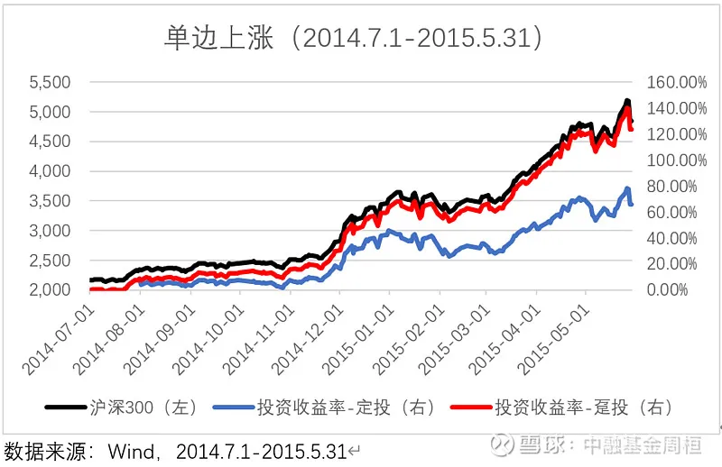
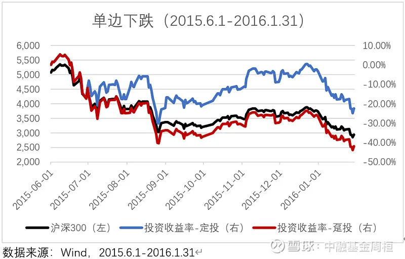
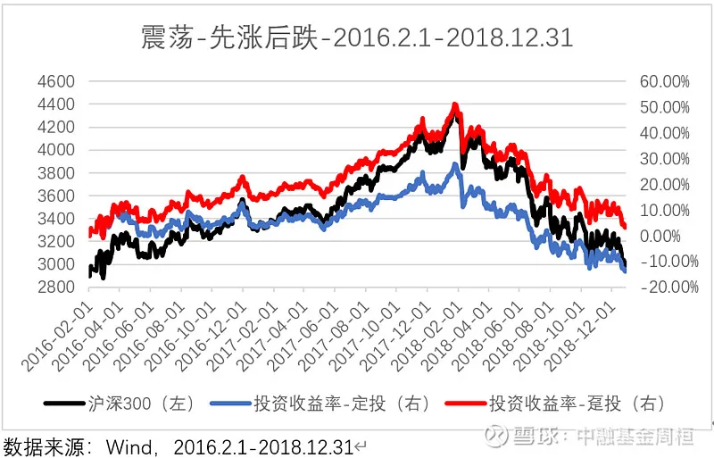
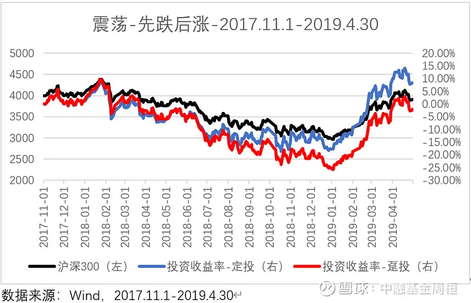
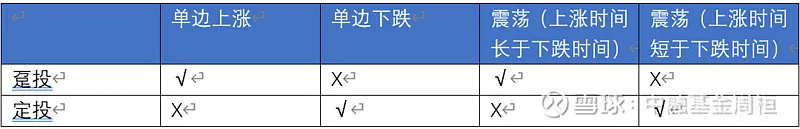
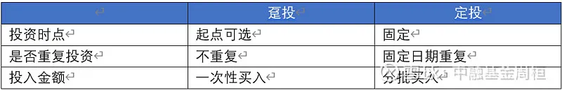
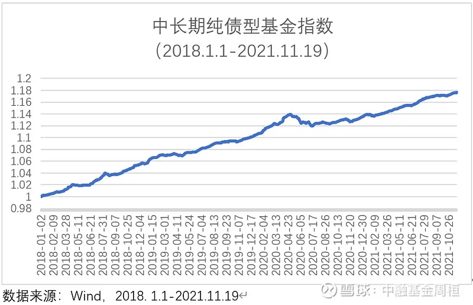
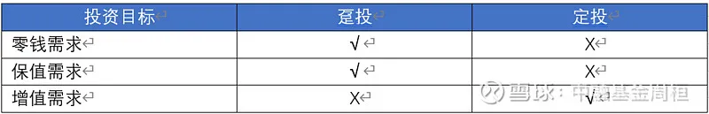

很多投资者常会困惑于投资基金是应该趸投还是定投, 定投是不考虑市场状态的情况下, 在固定甚至不固定的周期进行固定投资的操作, 比如每月申购某一只甚至一篮子基金, 趸投就是投资者根据投资目标将可投资资金一次性买入.

在投资标的相同的情况下, 两者差异主要来自于投资方式, 即投资时点、投资重复性、投资比例的差异, 评价投资方式的好坏第一直觉是去看两种方式所带来的投资结果.

## 投资结果

### 1、测算假设

在测算前, 我们需要约定前提假设, 标准是排除其他因素, 仅看投资方式差异所带来的结果差异.

定投日期: 每月第一个交易日

定投金额: 每次 10000 元

模拟标的: 沪深 300 指数

前提假设: 不考虑任何成本

趸投日期: 第一笔定投日

趸投金额: 测试区间定投投入的总金额

### 2、投资结果

为了较好的模拟两种投资方式, 我们需要考虑不同的市场情况, 按照涨跌与否, 我们可以将市场分为单边上涨、单边下跌、震荡, 其中震荡又可分为先跌后涨与先涨后跌.

(1)单边上涨:2014 年 7 月 1 日至 2015 年 5 月 31 日

在 11 个月间, 根据上文约定的测算方法, 趸投的复合收益率为 123.64%((期末总资产-期初投入本金)/期初投入本金), 定投的复合收益率为 66.07%((期末总资产-投入总本金)/投入总本金). 因为在单边上涨的市场中, 趸投在投资初期就买入了标的, 而定投是在上涨过程中不断买入, 11 次中有 10 次买入的成本高于趸投, 导致定投收益率低于趸投.

(2)单边下跌:2015 年 6 月 1 日至 2016 年 1 月 31 日

在 8 个月间, 根据上文约定的测算方法, 趸投的复合收益率为-41.96%((期末总资产-期初投入本金)/期初投入本金), 定投的复合收益率为-22.35%((期末总资产-投入总本金)/投入总本金). 与单边上涨相反, 在单边下跌的市场中, 通过越跌越买, 定投的初始成本与趸投一致但后续的持续买入使得其成本不断降低, 尽管两者都亏损, 但定投会亏得少一些.

3)先涨后跌的震荡行情(2016.2.1-2018.12.31)

在 35 个月的震荡行情中, 根据上文约定的测算方法, 趸投的复合收益率为 3.78%((期末总资产-期初投入本金)/期初投入本金), 定投的复合收益率为-13.36%((期末总资产-投入总本金)/投入总本金). 尽管区间首尾指数涨幅不大, 但由于期间有近 24 个月(2016.2.1 至 2018.1.31)指数上涨, 导致 35 次定投中有 24 次的持仓成本高于趸投, 最终使得定投收益率低于趸投.

(4)先跌后涨的震荡行情(2017.11.1-2019.4.30)

在 18 个月中, 根据上文约定的测算方法, 趸投的复合收益率为-2.09%((期末总资产-期初投入本金)/期初投入本金), 定投的复合收益率为 8.45%((期末总资产-投入总本金)/投入总本金). 与前面的情况相似, 这期间指数的跌幅不大, 但由于其中有 14 个月(2017.11.1-2018.12.31)指数下跌而只有 4 个月的上涨, 导致 18 次定投中有 14 次的持仓成本低于趸投, 使得定投收益率高于趸投.

通过四种市场状态的比较, 我们发现所选标的未来涨跌、上涨时间与下跌时间的长短决定了投资结果.

对于所有投资者来说, 未来是无法预测的, 基于无法预测的未来选择投资方式也是不现实的. 那么投资者要基于什么因素选择投资方式? 我们先从投资目标说起.

## 影响因素

### 1、投资目标

在讨论投资目标前我们先比较一下两种投资方法的差异:

从两者差异看, 核心是投资时点、投资重复性及投资比例. 如前面分析, 如果市场单边下跌, 趸投相对不利. 定投通过不断重复买入, 不断降低持仓成本, 改善投资结果.

这种重复买入可以看作是一种面对不确定市场走势的保护纠错机制. 由于趸投缺少这种机制, 投资者就需要具有清晰的投资目标, 对市场状态具有一定的理解和判断, 通常来说这种理解和判断需要投资者长期精力的投入, 所以成功的趸投需要投资者具有清晰的投资目标和较高的投资能力, 但定投具有纠错机制, 投资者考虑因素相对更少, 这也是为什么定投被叫做懒人投资的原因.

在《投资理财的三个钱包——聊一聊投资目标》中, 我们讨论了投资理财的三个目标, 即增值需求、保值需求和零钱需求, 为了实现这三个需求, 投资者需要在投资期限、权益基金比例上进行动态决策.

零钱需求与保值需求的投资期限相对较短、权益基金占比较低, 投资者可承受风险较低, 预期收益率相对稳定且适中. 对于这种需求, 找到合适标的并尽早投资是较好的选择.

如下图以中长期纯债型基金指数为例, 2018 年 1 月 1 日至 2021 年 11 月 19 日之间最大回撤 1.75%, 年化回报率 4.29%, 净值比较平稳, 一次投资犯错对投资结果的冲击较小, 比较符合投资者的保值需求或阶段性满足零钱需求, 如果找到类似这种的组合并判断管理人的投资方法合理、业绩大概率可持续, 那么最佳选择是趸投, 尽快投资、尽早受益.

增值需求对收益率要求较高, 投资期限较长、权益占比较高, 一次投资犯错的概率较高, 要么投资者具有较好的判断力, 要么需要投资者在投资方式上包含纠错机制. 由于绝大多数的投资者没有足够的时间与精力专研投资, 纠错机制的设立就是一种简单可行的思路, 从这个角度看, 定投更加适合增值需求.

投资方式的选择是一种行为方式, 行为方式的选择往往可以从心理学寻找参考答案.

### 2、人心

卡尼曼和特沃斯基在《不确定状况下的判断: 启发式和偏差》(Judgment under Uncertainty: Heuristics and Biases, 1982 年)讲到了许多行为金融学的词语: 锚定、框架、心理账户、过度自信与过度偏见, 其中最重要的个体行为是损失趋避的概念.

大致的意思是人们在做决定时会规避风险, 卡尼曼和特沃斯基用数据证明个体对损失的内疚超过获得等量财富时的喜悦——差不多是 2-2.5 倍的差距. 也就是说当人们在进行投资方式的选择时, 天然会有想赢怕输的心理活动, 对于投资者来说, 赚钱固然开心, 但如果亏钱会让大家感到更加难过.

对于其他条件(包括投资标的、投资期限、投资金额)都相同的情况下, 投资者更愿意选择投资方法相对温和的定投, 以便具有纠错机制能够应对未来的不确定性, 因为一旦选择趸投就会面临可能产生无法应对的潜在损失, 相比盈利投资者在事前更不愿意面对的是损失.

理查德 ∙ 泰勒是行为经济学和行为金融学领域的代表人物, 并在 2017 年获得诺贝尔经济学奖, 他的很多研究可以从他的畅销书《赢者的诅咒: 经济生活中的悖论与反常现象》(The Winner's Curse: Paradoxes and Anomalies of Economic Life, 1992)中获知. 他被投资者所知也是因为一篇他与什洛莫 ∙ 贝纳茨(Shlomo Benartzi)合写, 发表于 1995 年的文章"用短视性风险规避模型解释股票溢价之谜".

在这篇文章中, 泰勒和贝纳茨将损失趋避与股市联系起来. 回顾股票市场, 从超长的投资周期看, 股票相对债券可以获得较好的回报, 但为什么很多人无法通过长期投资获取收益呢? 他们认为, 答案就是卡尼曼和特沃斯基提出的两个中心概念. 第一个是损失趋避; 第二个是一个行为学概念——心理账户.

按照泰勒的说法, 心理账户是人们用来计算投资产出的方法. 为了将这些观点联系起来, 泰勒首先回顾了由保罗萨缪尔森提出的一个老问题.1963 年, 萨缪尔森问一位同事选择哪个对赌:50%的机会赢 200 美元, 或 50%的机会亏 100 美元. 这位同事首先礼貌的调低了对赌的金额, 然后说他希望玩 100 次这个游戏, 这样他就不用在意每一次对赌的结果了.

萨缪尔森的同事要接受对赌得先满足两个条件: 增加游戏时间的长度和减少他关注结果的频次. 让我们转向投资领域, 泰勒和贝纳茨推导出: 投资者持有一项资产的时间越长, 这项资产的吸引力就越大, 前提是不要总是去看回报. 只要不是每天看投资组合, 你就免于被每天的价格波动煎熬; 持有的时间越长, 你面对波动的时间就越短, 因此你的选择看上去就更具吸引力. 换句话说, 使得投资者不愿意承受持有股票风险的两个因素是: 损失趋避和频繁查看价格. 借用近视这个医学词汇, 泰勒和贝纳茨创造了短视性损失趋避这个词汇, 用于指代损失趋避和衡量投资的频率.

对于定投与趸投两种投资方法, 上面的例子极为适用. 在投资者面对未知市场变化时, 趸投金额较高且投资者具有损失趋避的心理倾向, 很容易频繁查看投资组合, 这会影响投资心态并可能导致无法承受短期较高波动损失而在组合反弹前卖出. 但是定投具有单次投资金额低且事先约定的特点, 投资者不需要频繁查看组合, 相比趸投来说, 短视性损失趋避的影响更低一点.

但是当代投资者因为移动互联网的普及, 只需要轻轻敲击手机就可以获得各种信息和自己组合的每日盈亏状态, 这不但加剧了短视性损失趋避还可能会让我们觉得自己对某种预期或评估正确性的自信心增加, 这种信息过载会导致知识幻觉.

由于定投和趸投投资方式的差异, 需要投资者具有不同的风险承受能力, 相比来说, 由于缺少纠错机制, 趸投需要投资者具有更高的风险承受能力. 风险承受能力除了与年龄和性别有关外, 还与人的性格有关, 较为重要的两个因素是个人控制力和成就动机, 第一个因素是指一个人控制周围环境和决定人生的能力.

那些认为自己拥有控制力的人被称为"坚定者". 相反, "飘荡者"认为他们的控制力很弱, 认为自己就像浮萍一样飘荡. 承担高风险的人很多可以被划为坚定者. 成就动机描述的是人们目标明确的程度, 愿意承担风险的人往往也是目标明确的人, 尽管孤注一掷可能会带来很大的失望. 而了解自己的风险可适度比单纯地测量个人控制力和成就动机要复杂很多. 想要解密个人性格与风险承受力之间的关系, 你需要了解你是如何看待风险环境的.

你认为股市是(1)一个只凭运气定输赢的游戏, 还是(2)一项基于精确的信息和理性的选择而获得成功的事业. 心理学研究清楚的说明"一个人认为他的决策结果是由能力或他们的选择的风险来决定的". 大体上, 当人们认识到所获得的回馈取决于个人技能的时候, 他们会逐渐转向选择承担高风险. 如果人们认为个人能力对结果的控制来讲很弱, 他们会做出更加保守的选择. 也就是说, 如果投资者认为通过自己投资决策能力可以获取收益时, 他们会倾向于选择高风险的投资方式——趸投.

趸投与定投只是投资方式的不同, 从结果看, 方式本身并没有绝对的优劣. 选择何种投资方式取决于投资者的投资目标以及自身情况, 前者需要投资者理解自己投资的诉求, 后者需要投资者了解自己的性格, 对于很多的投资者来说, 因为短视性损失趋避的影响, 定投可能是更好的选择, 而对于具有一定投资经验和投资能力的投资者, 趸投才是他们内心中愿意选择的方式.

在选择方式前, 投资者不妨反问自己, 我到底为什么投资? 我自己又是哪种性格的投资者? 客观地看, 我自己到底是不是一个具有投资决策能力的人? 我的风险承受能力如何? 回答了这些关于自己的问题再去选择可能会得到更好的效果. 那么, 趸投还是定投? 您的选择是什么呢?

## 原文

- [基金应该一次性买入还是定投?](https://mp.weixin.qq.com/s/ztJxRKTstSvPUvAvo-DJIg)
