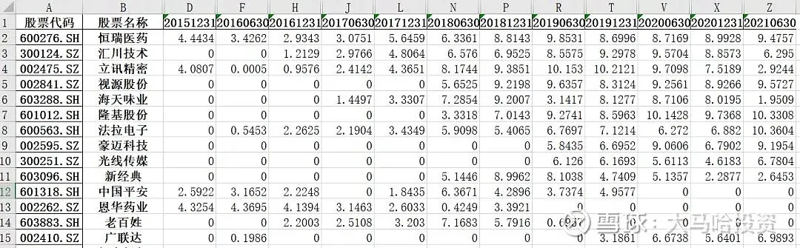
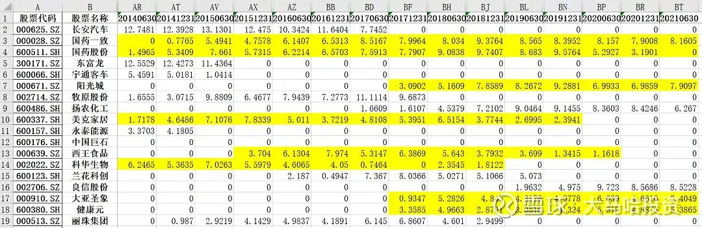
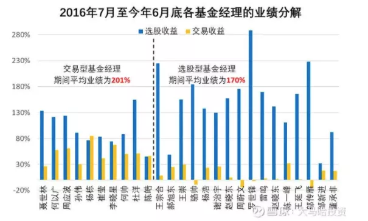

## 定期报告披露了哪些交易信息?

基金经理的投资操作信息来源于定期报告, 报告披露的信息主要包括以下几个方面:

(1)半年度末和年度末的全部持仓及权重. 在半年报和年报中, 基金会披露产品的全部持仓及权重. 据此我们可了解基金经理的整体持仓偏好、行业分布及估值容忍度等情况.

(2)每个季度末的前十大重仓股及权重. 除了可获得 6 月底和 12 月底的全部持仓外, 还可获得基金经理在 3 月底和 9 月底的前十大持仓情况, 借此我们可进一步获知基金经理在重仓股上的更准确的建仓及调仓时间.

(3)每个季度末的证监会行业分布. 证监会行业分布的设计总体没有申万行业分类科学, 不过该行业清楚列明了金融及地产板块的权重占比情况, 我们可据此再结合个股持仓披露信息对基金经理在金融地产板块上的确切持仓变化进行进一步分析.

(4)每半年度的买入交易金额和卖出交易金额. 据此可推知基金经理的换手率情况, 从而对基金经理的投资风格有所了解.

(5)每个季度末的股票持仓占基金资产净值比率. 据此可了解基金经理是否偏爱择时以及择时的正确率.

定期报告除披露了上述主要信息外, 也会披露基金报告期间(每半年)在具体个股上的交易情况(买入和卖出金额比较大的个股)等.

## 关注基金经理是否存在风格漂移

在分析基金经理的投资策略之前, 首先要关注基金经理是否存在风格漂移, 这对于行业\主题型基金而言, 尤其重要.

比如你在一堆消费主题中进行业绩比较发现, 在今年消费板块表现普遍低迷的情形下, 某基金业绩出挑. 这时候你第一时间不是要去充分肯定基金经理的投资能力, 而是根据基金经理持仓去看他\她是不是风格漂移去买了新能源等跟消费不相关的热门板块.

又比如我在火热的军工板块, 如何借"基"参与? 一文中所介绍的, 不少带"军民"及"国家安全"字眼的主动基金风格漂移严重. 如果你在找军工主动基金时碰到这样的情况, 不管业绩好与坏, 继续去分析这些基金经理在军工板块上的投资能力就必要性不大了.

因此看基金经理是否风格漂移是在分析基金经理时我们最先要做的

这有助于大家理解基金经理与同行业绩差异是否受到风格漂移这一最为重大的因素影响, 否则接下来的分析就无从谈起.

## 关注基金经理换手率

换手率是一个非常重要的基金经理分类指标. 对于换手率低的基金经理, 他们大概率秉承长期持有优质公司的价值投资思路, 主要赚的是优质公司成长性或者估值回归的钱, 我们可以将他们称之为选股型基金经理; 对于换手率高的基金经理, 他们大概率是在各个行业\主题间进行切换, 仓位也会出现一定浮动, 对于这类基金经理, 我们可以将其称之为交易型基金经理.

那么如何计算基金经理的换手率? 需要明确的是我们不能计算出基金经理的真实换手率, 但可以获取基金换手率的范围:

基金换手率的上限: 按照基金在报告期间的买入金额和卖出金额, 再结合期初和期末的基金规模进行估算, 该算法是基金换手率的上限, 因为没有剔除掉基金日常申赎带来的附加交易. 该算法也是评估基金经理换手率的主要参考依据.

基金换手率的下限: 根据每半年度基金披露的全部持仓, 计算前后两期持仓权重差异绝对值之和以计算换手率. 该算法是基金换手率的下限, 是因为基金经理在定期报告期间或多或少会存在一些隐性交易, 比如买了某个股票结果因为看错了或者赚钱了而立马卖掉, 这在交易型基金经理中非常普遍.

对于换手率低的选股型基金经理和换手率高的交易型基金经理, 评估其投资能力的关注点是非常不一样的.

## 关注选股型基金经理的选股能力

对于换手率低的选股型基金经理, 评估他们的选股能力就是重中之重. 具体可参考以下几个方面:

(1)看基金经理的选股收益如何. 具体即假定我们在半年度和年度末可以及时拿到基金的完整持仓然后去投资, 看这样的选股收益如何. 这就相当于基本规避了基金经理交易时点带来的收益差异, 这一投资回报非常考验基金经理的选股能力.

(2)观察基金经理的重仓个股的投资成功率. 选股型基金经理在任职生涯中往往会有不少重仓个股, 我会把这些重仓个股整理出来, 然后看看基金经理是在什么时候投资这些个股的, 投资期间公司的利润增长如何, 具体投资收益如何. 如果该基金经理在重仓股上大都赚到了大钱, 公司基本面表现强劲, 这大概率说明基金经理选股能力很强. 如果该基金长期持有过的重仓股大多表现不佳, 期间公司利润增长不明显, 那么这大概率说明基金经理的选股能力较弱. 我认为观察基金经理重仓过的股票及其表现很容易了解其真实的投资能力.

比如像邬传雁任职的泓德远见回报, 其重仓个股如恒瑞医药、汇川技术、立讯精密、视源股份、海天味业、隆基股份和法拉电子均是大牛股, 选股正确率相当之高, 这很好的体现了基金经理的选股能力.

再举一个反面例子, 比如某基金经理在任职期间长期重仓的不少股票如国药一致、国药股份、阳光城、美克家居及西王食品等表现糟糕. 如果一个重仓股持有高达六七年时间还没表现, 基金经理的选股能力大概率是值得商榷的.

(3)看基金经理如何面对市场波动. 对个股研究越深入的基金经理, 其往往越倾向利用市场(高位减仓低位加仓); 对个股研究越浅的基金经理, 其往往越倾向追随市场(高位加仓低位减仓).

持有白酒股的基金经理很多, 不过有些基金经理是在白酒股价表现低迷时候介入的, 有些基金经理是在白酒股价表现亢奋时介入的, 这两种行为模式对基金经理能力要求有着天壤之别.

另外基金经理在面对重仓股暂时调整时, 有些选择加仓, 有些选择减仓, 这同样对基金经理能力要求有着天壤之别.

我们在对基金经理的持仓变化进行事后分析时, 很容易看到各基金经理各种各样的行为模式.

综合上述三个方面, 能够对基金经理的选股能力有一个比较全面的了解. 如果大家看单个基金经理没什么太大感觉, 可以把多个选股型基金经理放在一起进行对比.

## 关注选股型经理的估值和行业偏好

在选股和交易各有哪些值得关注的基金经理? 一文中, 我将选股型基金经理大致分为了四类, 分别为成长型、均衡偏成长型、均衡偏价值型及价值型. 成长型基金经理不太关注持有公司当前的静态市盈率水平, 更多关注的是公司未来的成长性; 价值型基金经理对公司未来的成长性相对而言更显得悲观主义, 更多关注的公司的静态估值水平; 均衡型基金经理则要居于成长和价值之间, 注重组合的均衡配置, 以力求在各类市场风格下均有较为稳定的表现.

从基金经理持仓的整体估值水平来看, 成长型基金经理持仓估值整体要显著高于价值型基金经理, 对于这两类基金经理, 我个人不持有任何偏见, 认为两者都秉承了比较纯正的价值投资思维, 只不过他们各自关注的点不太一样.

我们可以通过基金持仓估值、行业偏好情况、重仓股介入时点的估值水平等多方面指标对基金经理的风格进行综合界定. 尽管长期来看成长型、均衡型和价值型均能获得不错的投资回报, 但他们各自业绩表现得路径存在很大差别. 在实际构建基金组合时, 大家可以根据自己需要选择适合自己偏爱的基金经理. 如果希望获得低回撤, 我觉得价值型基金经理是一个不错的选择; 如果希望获得比较稳定的投资回报, 那么可能均衡型基金经理要更为不错; 如果希望业绩具有较好的弹性, 那么成长型基金经理可能很不错.

## 关注交易型基金经理的交易能力

相对交易型基金经理而言我个人更青睐选股型基金经理.

个人认为基金经理的选股能力是一件具有很强复利效应的事情, 因为选股涉及到对于上市公司经营、商业模式等方面的分析, 这些分析能力在很长的时间内都不会过时, 而且随着经验积累得越来越多, 选股能力会越来越强.

相对于而言, 交易型基金经理则需要他们有比较强的市场敏锐度, 而这种能力很可能随着市场结构发生变化而失效, 能力积累的复利效应较弱. 而且交易型基金经理换手率较高, 规模是换手率的天敌, 随着规模到了一定天花板, 交易型基金经理也面临着转型的问题.

对于优秀的交易型基金经理而言, 他们除了换手率高还有个共性就是交易收益的贡献比例很大, 甚至与选股收益的贡献相当. 所谓选股收益, 即假定我们在半年度和年度末可以及时拿到基金的完整持仓然后去投资, 该模拟组合得到的收益可以简单理解为基金经理的选股收益.

交易收益, 则是基金经理的实际收益扣除掉上述选股收益后的剩余收益, 这部分回报是基金经理在每个半年度期间通过对个股买卖时点的把握或者对短期特定个股或板块交易性机会的把握得来的. 当然, 该分类方法未必准确, 但可以大致反映基金经理的长期个股配置能力及短期交易能力.

我之前对获得五年期以上金牛奖的基金经理进行了划分, 可发现尽管交易型基金经理与选股型基金经理的平均投资回报基本相当甚至前者略高, 但两者的投资回报的构成存在显著的差异.

对于交易型基金经理的评价我比较直接, 更多的是还是在于其业绩稳定性, 希望他们在每一年都能够获取到相对理想的业绩, 至少不要太落后. 对此我的理解是交易型基金经理之所以愿意频繁去交易, 就是希望能够在任何时候都跟上市场节奏, 获取到不错的投资回报, 对此兴全精选的陈宇将其形容为"做有效率的投资".

对于交易型基金经理来说, 如果业绩相差不大, 那么我会更倾向于换手率更低以及管理规模更小的基金经理. 因为这意味着每一次交易能带来更大的超额收益. 管理规模更小意味着基金经理未来获得不错交易收益的可能性越大. 对于一些交易型基金经理, 交易频率很高, 但并未带来明显的交易收益, 我认为需要予以排除.

## 原文

- [如何挖掘基金经理的持仓信息?](https://mp.weixin.qq.com/s/IIyeM5Iu4sxrz-SOvYJEgw)
