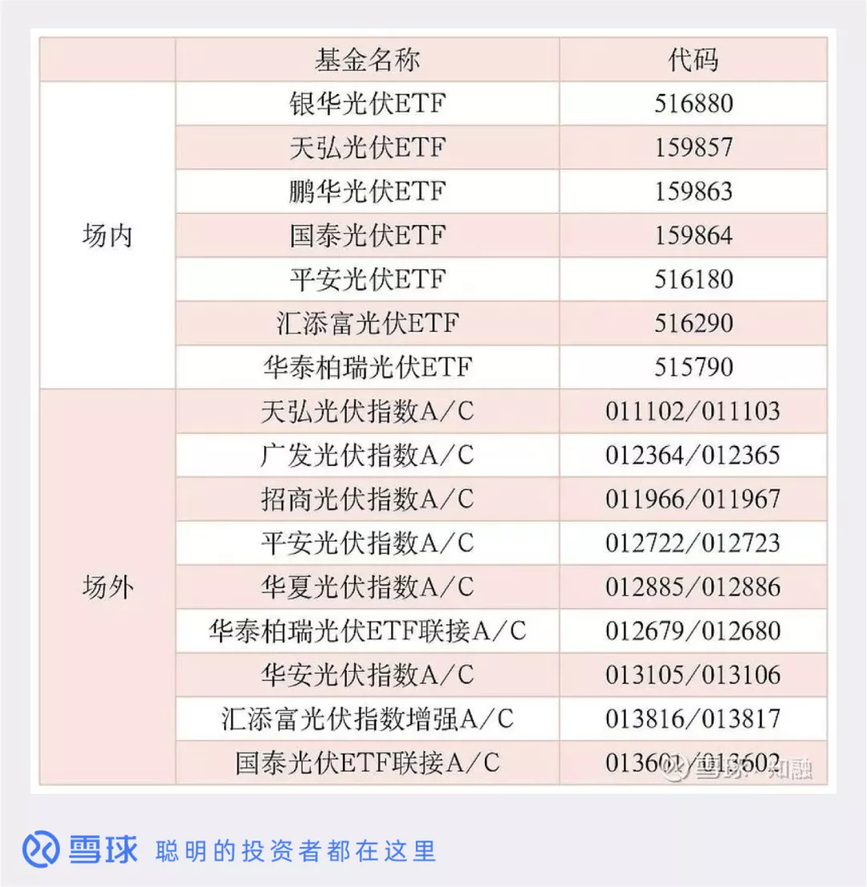
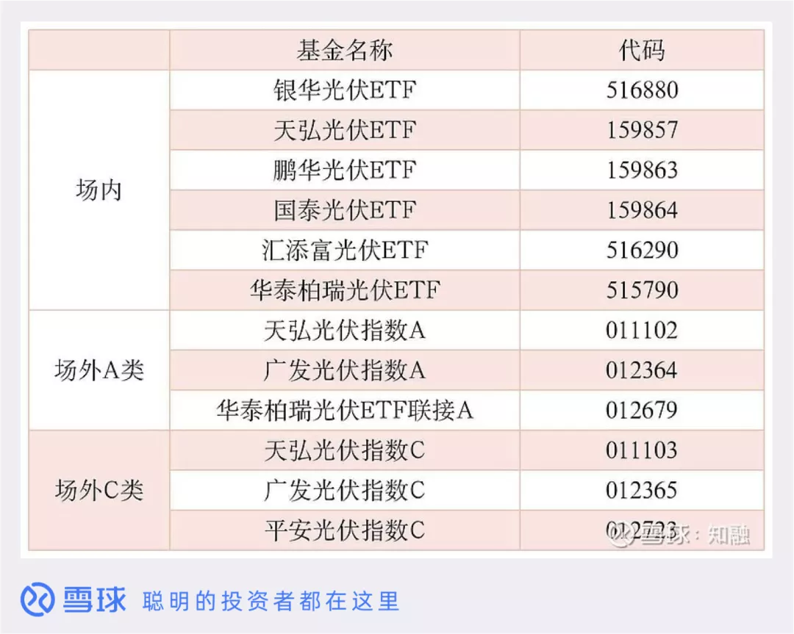

光伏是最近两年比较火的板块, 中证光伏产业指数从 2019 年 11 月 25 日的 1559 点, 涨到今天的 5416 点, 两年时间涨幅近 2.5 倍.

去年 9 月份, 在第七十五届联合大会上, 我国表示在 2060 年前实现碳中和, 接下来的几十年, 我们会迎来一场能源革命, 由传统能源向新能源转变.

光伏作为新能源的一大板块, 接下来也有望迎来巨大的发展, 我们要布局光伏行业, 选择什么基金呢?

我们在基金平台上搜索「光伏」可以搜到以下 25 只光伏基金, 其中, 场内 ETF 基金 7 只, 场外基金 18 只:

这 25 只基金都是追踪中证光伏产业指数的基金, 由于追踪的是同一指数, 所以就省了分析指数这一步.

有的同类行业或主题基金, 追踪的不适同一只指数, 那么我们就需要先分析指数的编制规则, 选出比较好的指数.

比如「碳中和」相关基金, 追踪的指数就有 3 个: 内地低碳, 中证环保和环保 50.

不用分析指数, 我们就直接进入筛选基金这一步:

## 选择规模大于 2 个亿的基金

规模小于 2 个亿的基金, 会有清盘的风险, 另外光伏行业属于非常细分的一个行业, 当市场下行的时候, 可能基金会面临大规模赎回, 所以我们可以把规模标准提高一些, 比如只选择规模大于 5 个亿的基金.

今天, 我们以规模大于 2 个亿的条件筛选. 通过这一步, 我们就把小于 2 个亿的 13 只基金淘汰掉了, 剩下 12 只基金, 6 只场内 ETF 基金, 6 只场外基金.

## 场内基金要看流动性

场内基金筛选的时候, 我们需要多一个指标, 就是流动性, 通常单日交易量大于 1000 万的基金, 就算是流动性比较好的基金了.

如果我们资金量比较大, 可以选择单日成交量上亿的基金. 这 6 只 ETF 单日成交量均在 1000 万以上.

## 看管理费和基金公司规模

管理费越低, 基金越做的成本也就越低, 所以在其他方面基本相同的情况下, 管理费越低越好.

选基金还有一个条件, 就是我们尽量选择大基金公司发行的基金, 这 12 只基金对应的基金公司管理规模都在 2000 万以上, 都属于比较大的基金公司.

通过这三个步骤, 我们基本就能选出自己想要的基金了.

喜欢场内投资的伙伴, 6 只 ETF 基金:

(1)从规模和流动性来看, 华泰柏瑞光伏 ETF 规模最大(150 亿), 流动性最好

(2)从打新收益考虑, 可以选择规模在 2-6 亿的鹏华, 国泰, 汇添富三家基金公司的 ETF.

如果综合考虑打新收益和规模, 可以选择银华和天弘两家基金公司的光伏 ETF.

(3)从管理费角度, 可以选择最低的汇添富光伏 ETF, 管理费为 0.15%每年, 其他 ETF 管理费均为 0.5%每年.

喜欢买场外基金的伙伴, 6 只场外基金:

(1)先确定好买 A 类基金还是 C 类基金, 长期持有选 A, 短期持有选 C.

这两者的区别在于收费模式不同:

A 类基金收取的是申购费, 一次性收取, 适合长期持有的策略;

C 类基金不收申购费, 收取销售服务费, 按天收取, 比较适合短期持有, 比如两三个月的投资长度.

场外基金要注意的一点是, 不适合超短期投资, 因为持有时间越短, 赎回费越高, 持有少于 7 天的话, 会收取高达 1.5%的赎回费.

(2)从规模角度考虑, 天弘基金的两只规模最大, 都是几十亿的规模

(3)从打新收益角度考虑, 可以选择规模在 2-7 亿的广发, 平安, 华泰柏瑞这 4 只.

追踪同一只指数的基金, 收益都差不多的, 我们关键还是要看光伏行业的长期投资价值, 以及现在的估值.

想要布局光伏行业的一定是看好光伏的长期投资逻辑, 不过现在的估值明显偏高, 并不是好的入场时机.

好了, 关于「25 只光伏基金该怎么选」就聊这么多了.

## 原文

- [手把手教你选基金:25 只光伏基金, 该怎么选?](https://mp.weixin.qq.com/s/7zIGLcgzytSOlQUkbzo53Q)
