我之前在不同文章里介绍了我自己买入基金的一些方法, 行业主题指数基金最高点下跌 30%以上开始分批布局, 布局周期 12-24 个月; 主动基金 1)在同类业绩排名 50%以后、2)没跑赢业绩比较基准和 3)达到近 2-3 年最大回撤, 三个条件满足一个开始分批布局, 布局周期 6-12 个月.

很多网友问我, 行业指数基金布局周期 12-24 个月、主动基金布局周期 6-12 个月这个时间是怎么确定的? 其实很简单, 我通过分析行业主题指数基金月线, 发现下跌周期一般就是 1 至 2 年, 基本不会超过两年; 我关注的优秀主动基金下跌周期更短一些, 差不多是行业主题指数基金的一半, 也就是半年到一年.

我平时买入基金的频率基本上是一个月一次, 因而也习惯于在行情软件里看基金的月线图. 月线图最大的好处是过滤掉了日线的频繁波动、能够让我们看清楚大的方向和趋势, 因而更容易让人心安. 权益投资要有长期视角, 这句话不只是心灵鸡汤, 的确能让我们感受到实实在在的好处.

## 顾比均线

看基金月线图时, 我喜欢用的主图指标是 GMMA(Guppy Multiple Moving Average)——顾比复合移动平均线, 简称顾比均线. 这样的月线图看多了以后, 发现利用顾比均线确定基金的买入时机是一个有效而简便易行的方法.

我们先以 2005 年以来偏股混合基金指数月线图来科普一下顾比均线. 顾比均线由两组均线构成, 分别是长期组(黄线部分)和短期组(蓝线部分). 其中, 短期组 6 根均线, 分别是 3、5、8、10、12 和 15 日(周、月)平均线; 长期组也是 6 根均线, 分别是 30、35、40、45、50 和 60 日(周、月)平均线. 这两组指标分别反映了短线交易者和中长期投资者的行为, 当这两组指标相互靠近的时候, 说明投资者和投机者对于证券的价值有了共识, 而当两组相互远离的时候, 就说明对价值产生了分歧.

从偏股混合基金指数 2005 年以来的月线图来看, 在顾比均线短期组完全上穿长期组时买入, 胜率达到了 100%.

我们不是趋势交易者, 是结合市场情绪判定买入机会的长期投资者. 而如果利用顾比均线短期组完全上穿长期组确定买入时机, 往往只有 1 个月时间, 按我的理解一个月买入差不多相当于一把梭, 即使历史上的胜率很高, 我们一般人是缺乏这个胆量的, 也不符合长期价值投资稳健审慎的原则. 我们需要确定分批买入机会, 而顾比均线可以协助我们来做这个决策.

## 行业主题指数基金

我们先来讨论行业主题指数基金的买入方法. 以下是近几年涨得比较好的半导体、消费、医药指数月线图.

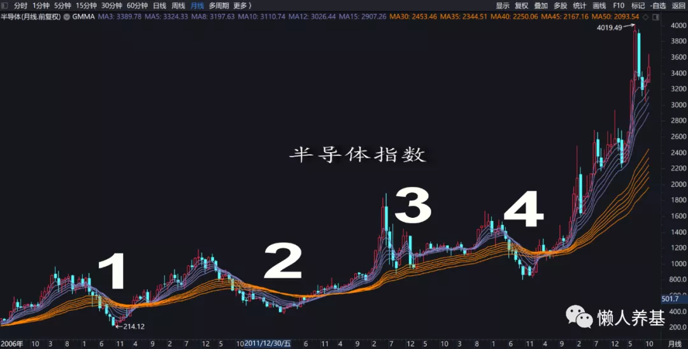

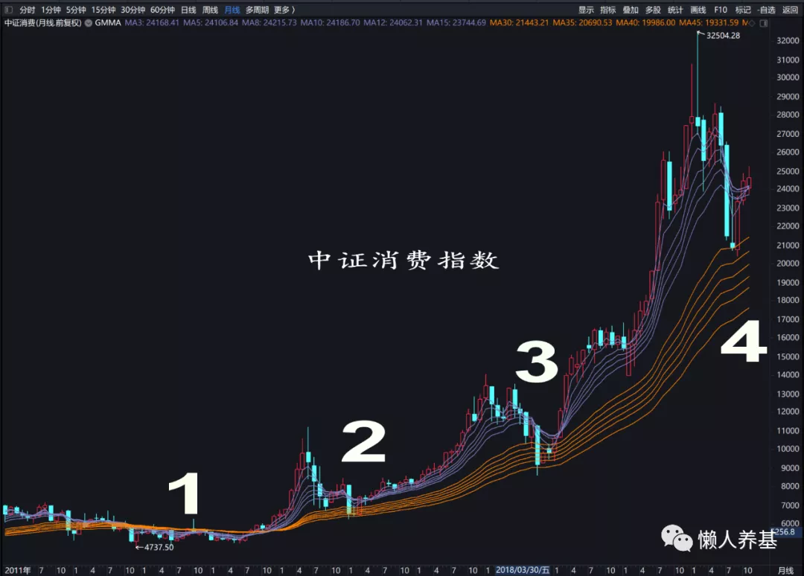

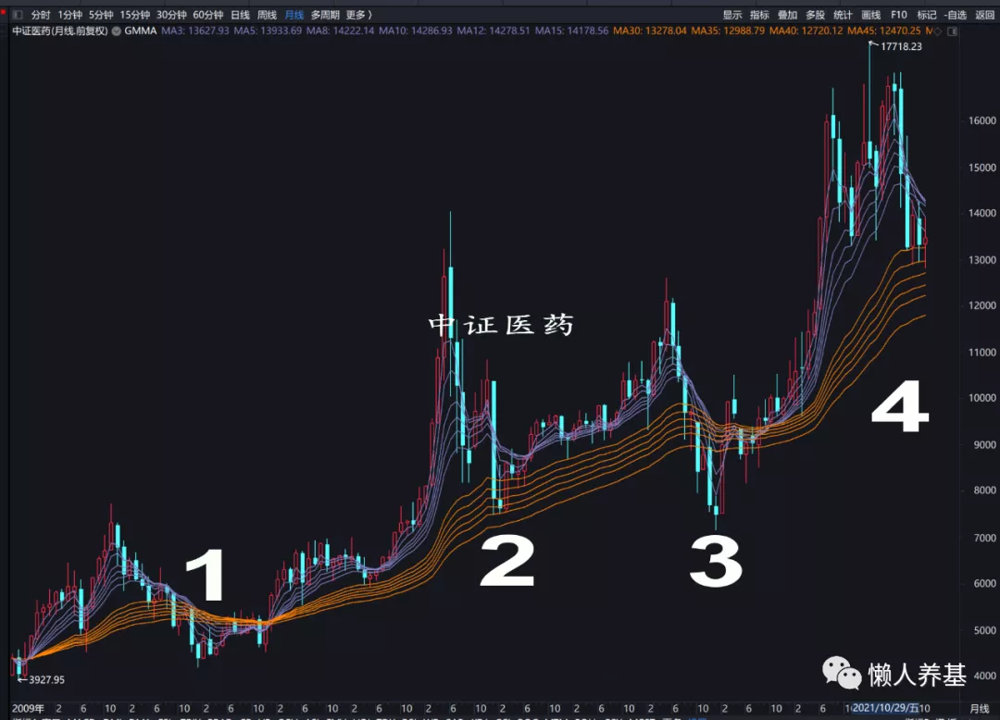

当价格跌进长期均线组(标示数字的位置), 将准备投入的资金分成 12 份, 在价格处于长期均线组范围或以下每月买入一份, 高于长期均线组不买. 从三个指数看, 这种方法都可以买在底部, 均值比短期均线组上穿长期均线组时更低.

再看近几年表现不佳或近期跌幅较大的几个行业主题指数, 保险主题、中证银行指数和中概互联三个行业主题指数(基金).

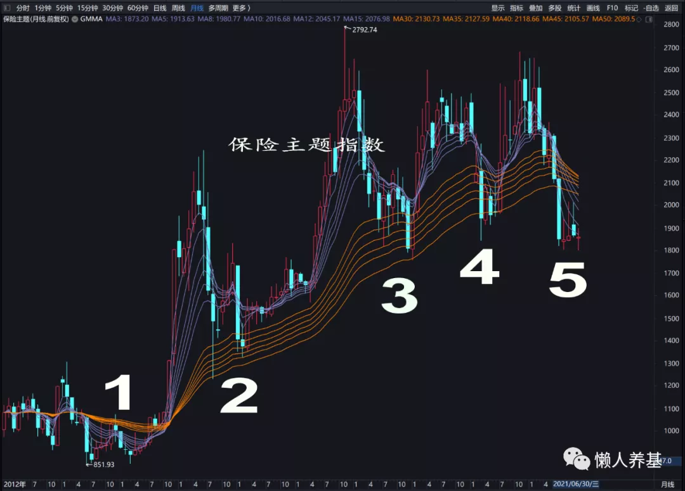

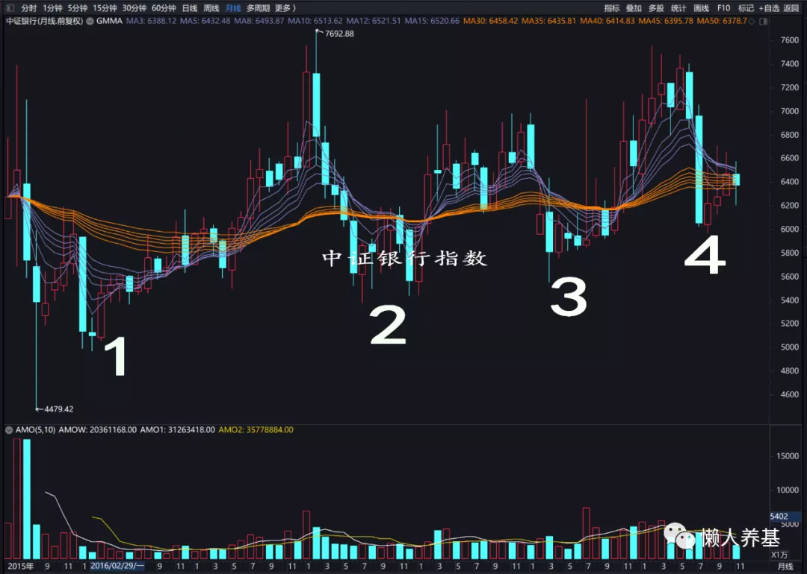

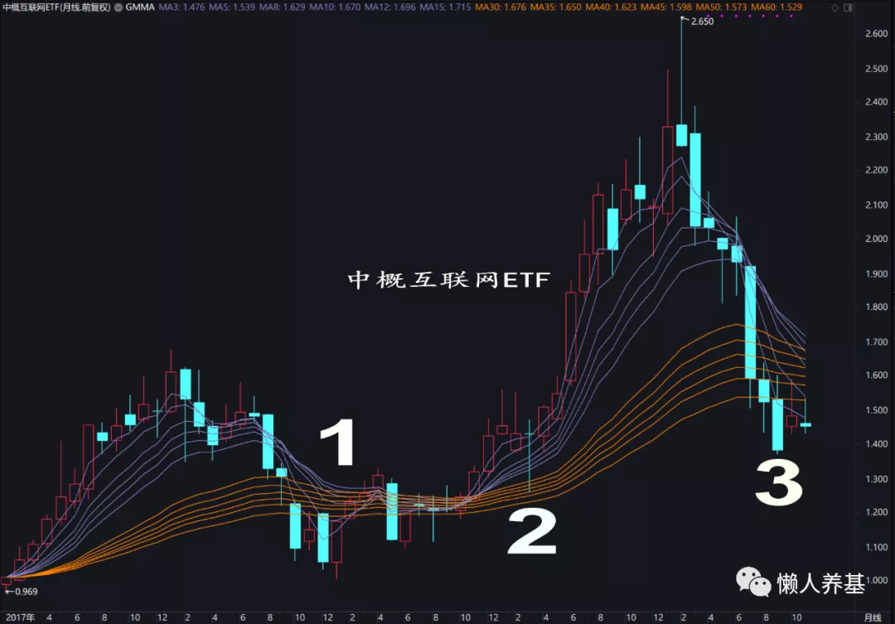

跌入月线长期均线组把资金分成 12 份每月买入一份的策略依然可行.

对以上 6 个行业主题指数, 用这种方法都可以买在底部区域, 而且比最高点下跌 30%开始分批买入结果更优: 对于最高点下跌达到 30%以上的指数, 这种方法买入的位置更低; 对于弹性不够大、最大跌幅达不到 30%的指数(比如银行), 这种方法也提供了可以操作的有效策略.

## 主动基金

主动基金用这种方法行不行呢? 我通过对我持仓或曾经持仓的几只基金工银文体产业、华安逆向、兴全合润、兴全趋势、大成新锐产业混合、交银优势、国富弹性市值和富国天惠用月线进行回测, 发现买入机会太少, 交银优势自 2015 年来就没出现过买入机会. 原因是优秀主动基金波动和回撤比行业主题指数小得多, 走熊的时间也短得多.

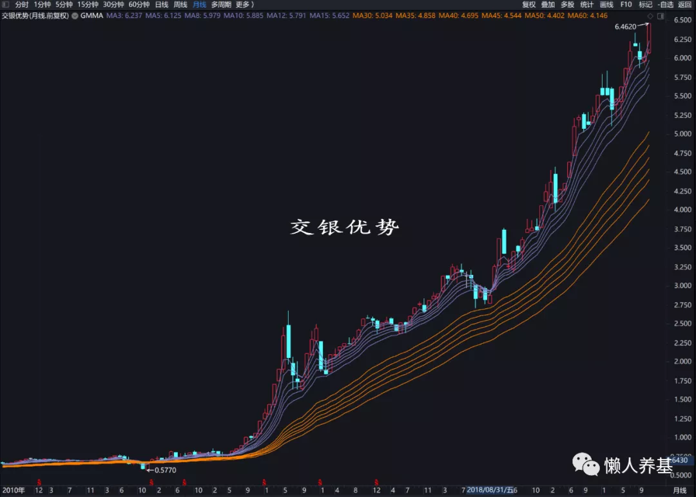

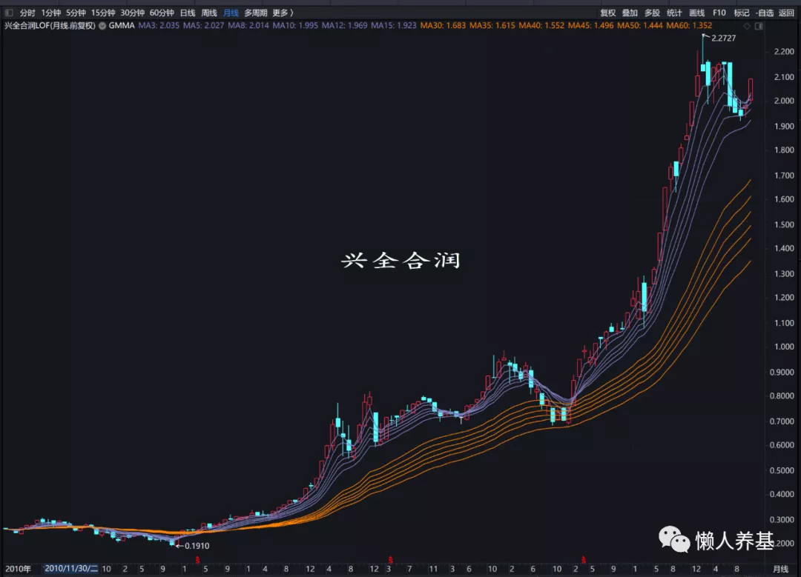

我尝试用周线进行回测, 发现买入机会增加了不少(数字标示部分), 当单位净值跌进周线长期均线组时开始买入的策略依然有效. 主动基金的买入周期调整为 6 个月, 较行业主题指数基金买入周期缩短一半. 也就是将准备投入的资金分成 6 份, 当单位净值跌入长期均线组范围或以下时每月买入一份, 单位净值上涨位于长期均线组上方时当月停止买入.

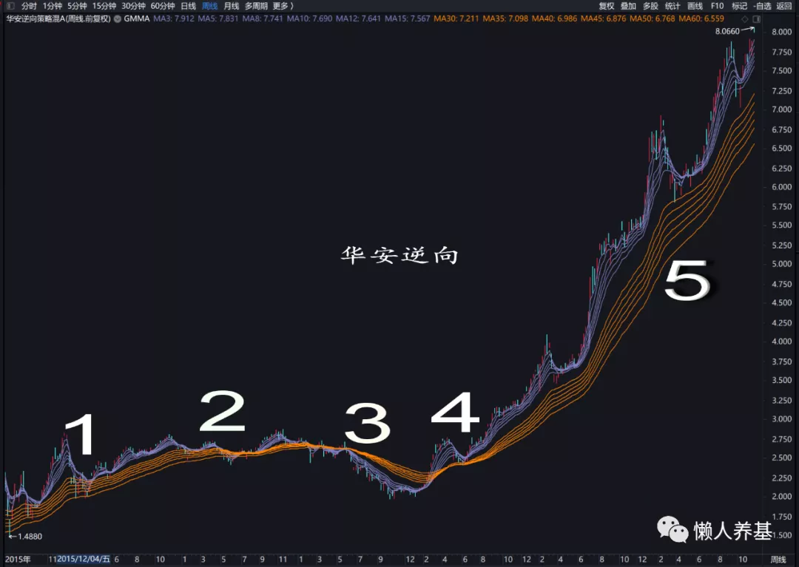

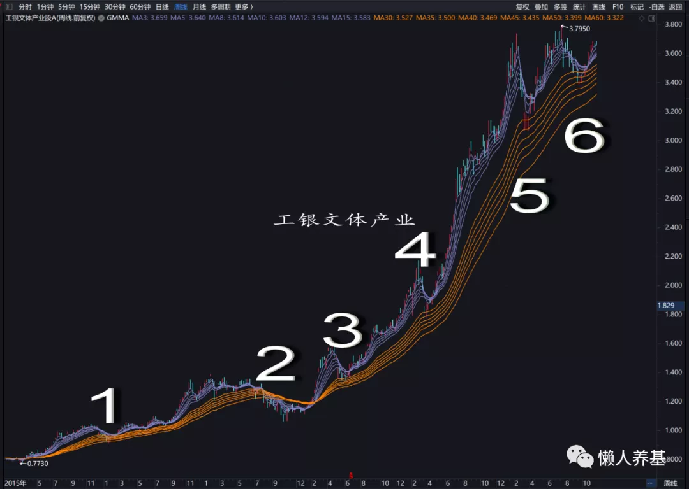

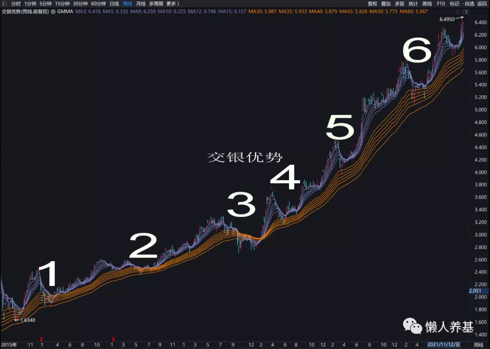

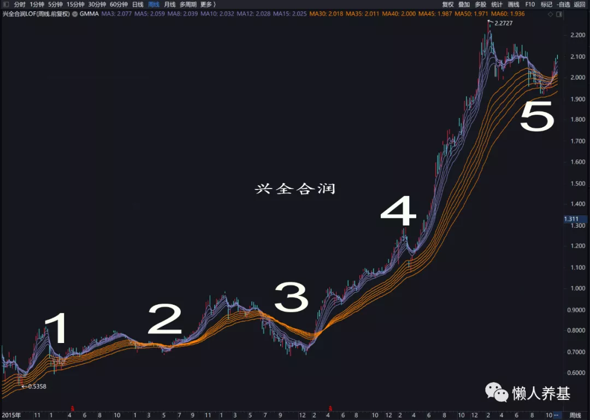

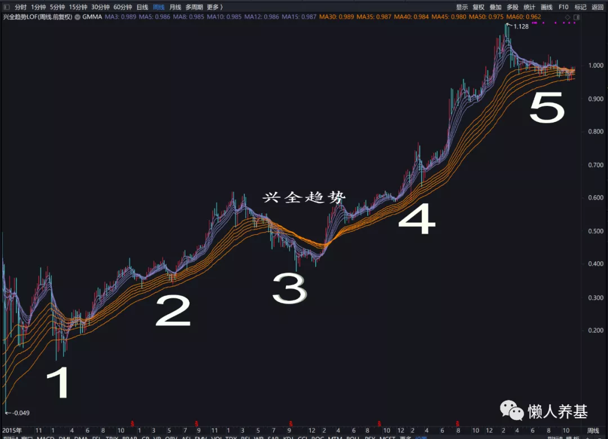

## 可转债基金和激进型二级债基

可转债基金和激进型二级债基也适用净值跌进周线长期均线组买入方法, 例如兴全可转债和博时信用债. 如下图所示.

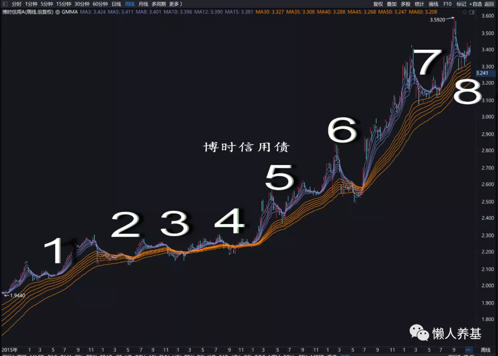

## 保守型二级债基和纯债基金

保守型二级债基和纯债基金则可以采用日线级别单位净值跌进长期均线组分批买入的办法, 买入周期调整为 3 个月. 例如工银瑞信双利债、易方达增强回报债等等.

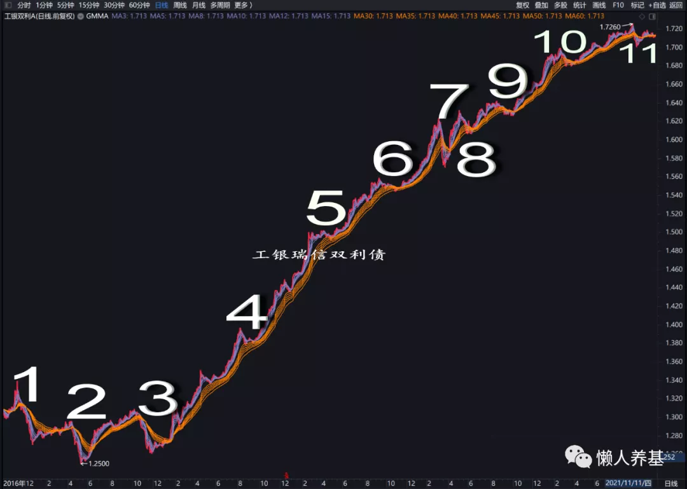

## 总结

综上所述, 选取顾比均线作为主图指标, 行业主题指数一般适用于价格跌进月线长期均线组买入策略, 买入周期 12 个月; 主动基金适用于单位净值跌进周线长期均线组买入策略, 买入周期 6 个月; 而保守型二级债基和纯债基金适用于单位净值跌进日线长期均线组买入策略, 买入周期 3 个月.

但这也不是绝对的, 波动和回撤从大到小依次适用月线、周线和日线策略, 所以部分科技主题主动基金或风格过于激进的其它类别主动基金也可能适用月线策略; 风格过于激进的高收益纯债基金也可能适用周线甚至月线策略.

某只具体基金到底适用哪种组别的策略也容易判定, 在月线、周线和日线之间切换, 看哪种组别的顾比均线更具有操作价值, 就可以确定采用这一组别的策略.

可能大家已经发现了, 如果将准备投入的资金分成 3-6-12 份, 按照我们的策略每月买入一份, 大部分时候是买不完就涨破长期均线组了, 而个别时候也存在 3-6-12 份买完后价格还在长期均线组范围甚至之下的情形.

这种情况怎么办呢? 我觉得买不完更主动, 毕竟安心赚到钱比投入完了迟迟不上涨可能导致心态崩溃更划算; 而且买不完的钱放在货币基金里一样赚钱. 另外还有一个解决办法, 自己做一个备用基金池, 将自己看好的基金都放在里面, 如果计划投入标的基金的钱还没有投完该基金就涨上去了, 余下的钱可以投资基金池中达到条件的其他基金, 方法也是把剩余资金再分成 3-6-12 份, 分 3-6-12 个月买完.

如果不是采用存量资金投资, 而是每月用节余资金投入, 这个问题更好办, 做一个自选基金池, 每个月投资达到条件的基金, 如果当时达到条件的基金不只一只则将可以把当月资金分成几份、等量投入; 如果没有达到条件的基金, 则停止买入, 安心等待买入时机.

这种策略从过往回测看胜率是非常高的, 而 2015 年以后的胜率更是接近 100%. 但资本市场最大的确定性就是未来充满不确定, 所以这种方法应该结合其他分析方法一起使用, 尤其要结合基本面分析, 如果一个行业是一个趋势性衰退行业, 价格跌进长期均线组可能只是下跌噩梦的开始, 相对于基本面分析, 技术分析终究只能作为辅助决策手段.

而无论如何, 我认为这种分析方法还是具备实操价值的.

采用这种策略买入基金, 我仍然建议每只基金从投入第一笔计算时间, 按累计收益除以累计本金计算收益率, 达到年化收益率 20%止盈. 达到止盈条件时如果市场情绪不疯狂或者估值不算太高, 可以只止盈利润部分; 如果市场情绪疯狂或者存在巨大泡沫, 则果断执行清仓止盈.

## [如何设置顾比均线](/pages/8bb6f2/)

## 原文

- [一个简便易行的基金买入策略](https://mp.weixin.qq.com/s/coBeSmKhUt1MGl2PTeZEiA)
