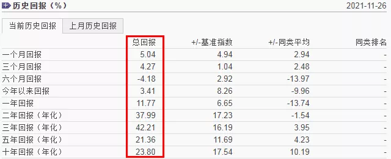
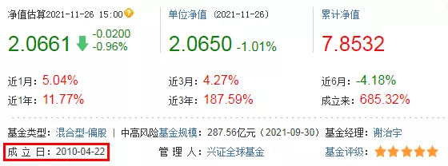
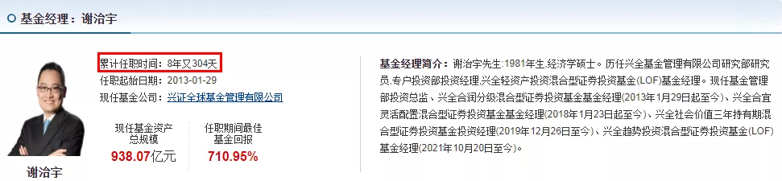
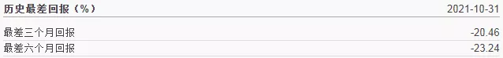
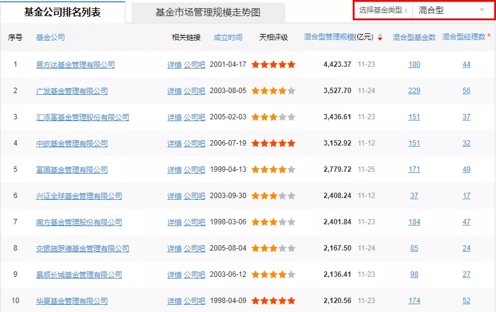

一直有人问我, 怎么选到优秀的好基金, 选好基金的标准又有哪些.

去年强势的基金是好基金吗? 为什么今年走势又不好了? 那今年走势好的基金会是好基金吗?

我相信大部分基民都会有这些疑问, 现在基金界的现象也确实如此, 基金赚钱而基民不赚钱.

究其原因, 只有一个, 那就是大多数基民都是看到哪只基金涨起来后, 就以为会一直涨, 就大笔买入在高点. 等到基金下跌时, 又感觉基金会一直往下跌, 直接赎回在底部.

股市里有股民追涨杀跌, 基市里也有基民毫不示弱.

继续往下看, 我相信一定能解除你的疑惑, 帮你找到适合你的好基金.

## 什么样的基金才是好基金?

我们要选到好基金, 那肯定得先有个好基金的标准.

我心目中的好基金就必须要满足以下的 4 个条件:

(1)历史收益率足够优秀, 年化收益率能到 20%以上最好.

(2)基金成立时间够长, 最少成立于 2015 年之前.

(3)基金经理从业年限够长, 最少从业开始时间在 2015 年之前.

(4)好基金一定要是拿得住的基金, 拿不住的基金, 再好也与你无关(重点).

有了这四个必要条件, 要想选到好基金, 那就非常简单, 只需如下几步:

## 基金的历史收益率

最最重要的肯定是参考历史收益率, 虽然历史收益率不代表未来, 但历史表现都不优秀的基金, 我凭什么相信你未来会变得优秀. 一个成绩好的学生, 往后继续保持成绩好的可能性肯定高于一个差生.

我们既然要选优秀的好基金, 那历史收益率一定要定得比市场平均水平高, 这样我们才能获得超越市场平均的超额收益率.

我们选好基金的第一个条件, 就是要求过去 5 年的年化收益率大于 15%, 要求高的可以提高到 20%, 过去 10 年的年化收益率也要达到 15%.

## 基金的成立年限

买基金一定要买老基金, 切勿追新. 基金的成立年限设定在 2015 年之前, 是因为 2015 年是疯牛转熊的一年. 在 2015 年之前成立的基金, 能活到今天并取得年化收益率大于 15%, 那大概率会是一只不错的基金.

但一定得注意查看基金中途是否更换过基金经理, 如果更换过, 那基金经理管理该基金是否是从 2015 年之前开始, 如果不是, 那就不符合这个要求.

## 基金经理的工作年限(担任基金经理的年限)

市场上一直有句话, 买主动基金就是买基金经理, 这个我举双手赞成. 买主动基金, 就相当于我们雇了一位基金经理帮我们管钱, 这种事情, 你放心让初出茅庐的小伙子帮你管钱吗?

基金经理的从业年限一定要在 2015 年之前, 只有基金经理经历过一年牛熊的洗礼, 见过 15 年的疯牛, 也见过 15 年的千股跌停, 还毅然站立在基金经理的岗位上, 那最少说明这位基金经理对投资一定是真爱, 一定有一颗千锤百炼的心.

经历过牛熊洗礼的基金经理, 对风险把控会更加严格, 控制回撤能力也会非常强悍, 持有这种基金经理的基金, 你会非常安心, 也更容易坚持下来, 长期持有.

例如: 董承非, 谢治宇就都是这种类型的基金经理, 熊市里比别人少跌点, 牛市里不落后于其它基金太多, 长期的复利收益就能战胜 99%的基金.

## 一定要看基金的最大回撤率

如果基金的回撤率太大, 也就是波动太大, 持有体验太差, 就算长期能取得不错的回报, 但这种高波动的基金, 很少人能长期拿得住. 如果基金拿不住, 那其他所有的优点都是白搭.

## 看基金的管理规模

一般不要买 2 亿以下的基金(指数增强型基金例外), 也尽量不要买百亿以上的基金.

规模太小, 容易清盘, 波动也会非常大, 如果遇到大客户赎回, 基金可能就直接清盘了. 太大, 调仓困难, 想要获得市场的超额收益会更难.

但优秀基金经理可以适当放宽考虑, 优秀基金经理管理的基金单只可能都是 2、3 百亿, 也可以买. 只要基金经理能证明自己的管理能力, 管理 2、3 百亿的基金对长期业绩并没有多少影响就行. 但如果证明不了, 那就得避开.

这种 2、3 百亿的基金, 想要获得市场波动的超额收益率会比较难, 主要的超额收益都是依靠基金经理的长期选股能力, 对基金经理的能力要求更高.

## 选优秀基金经理的老基金(最出名的那只)

优秀基金经理如果管理多只基金, 那首选管理时间最长的那只老基金, 名牌基金. 因为基金经理乃至基金公司, 都会尽全力去维护优秀的老基金, 这是基金经理和基金公司的招牌, 无论如何都会倾注更多的心思在这种老基金上.

## 看基金公司(次要参考)

现在市场上的基金很多, 股票也很多, 单靠基金经理一个人很难单打独斗. 大的基金公司投研实力更强, 优秀人才更多, 为基金经理提供的资源也更多.

基金公司排名一般是按管理的权益类基金规模排名, 可以通过切换右上角的基金类型查看其它类型的排名, 基金公司现在也呈现明显的头部效应.

只要你按照上面的要求选下来, 我相信你一定能选到拿得住的长期最优秀的好基金.

## 原文

- [怎么选到胜率 99%的好基金?](https://mp.weixin.qq.com/s/gkbOuC3iWk9QkbQ4d1E0aQ)
