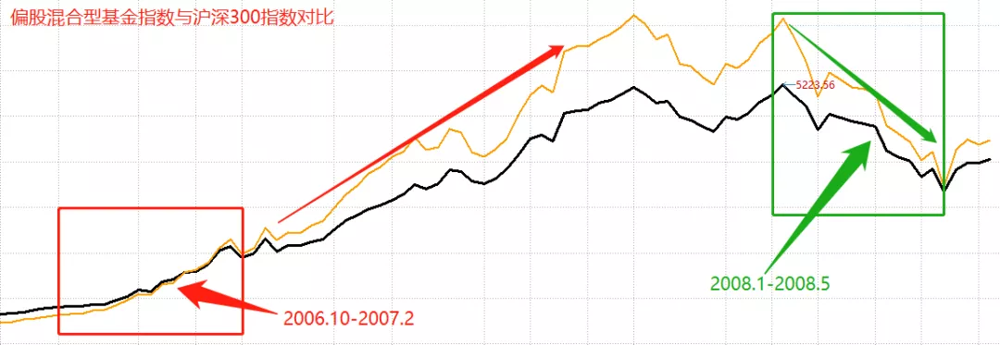

前两天汇总了一篇各大公募对 2022 的观点, 发现机构的观点, 还挺客观~

普遍预估 2022 年的市场收益在 0-10%之间, 没有那种盲目自信吧, 也没有特别悲观

不过这几年主动基金的超额收益确实也显著, 2021 市场震荡, 偏股基金指数继续完胜沪深 300, 已实现连续三年对大盘的超越~

主动基金长期看是不错, 但它也有不行的时候, 那么它有什么潜在的风险呢?

今天思哲就带大家盘点一下, 历史上偏股主动基金指数翻车, 大幅跑输沪深 300 指数 20%以上的几个阶段, 到底发生了什么~

## 第一个区间 2006.10-2008.1:

ps: 偏股基金指数基日是 2007 年底, 这段行情暂用万德偏股混合型基金指数代替.

这波行情发生在 2006 年底到 2008 年初年大牛市, 主要发生在牛市初期.

图中黑线为偏股混合型基金指数, 黄线为沪深 300 指数

不难发现, 2006 年四季度沪深 300 开始超越偏股基金, 随后一路狂飙.

但牛市过后, 两者差距便迅速缩小, 尤其到了 2008 年大熊市, 偏股基金实现反超.

图中黑线为偏股混合型基金指数, 黄线为沪深 300 指数

对比这两种情况, 发现这次行情在单边上涨的牛市中, 指数要比主动基金更强, 但到了熊市, 主动基金更抗跌.

其实具体原因, 是由于那两年是金融股的大牛市, 沪深 300 里也是金融股偏多, 但主动基金大多时候都是低配金融股, 因此大幅跑输.

## 第二个区间 2008.11-2009.8:

这波紧接在 2008 年金融危机后, 政策迎来大放水节奏, 2009 年再来一波牛市.

偏股基金在这 9 个月的牛市里, 也同样是远远跑输同期沪深 300 指数.

我们再看它们的前后走势对比:

图中黑线为偏股基金指数, 黄线为沪深 300 指数

很明显, 结论与前面相似, 在牛市上升期, 指数几乎无敌, 但在随后的 3 年里, 市场先后走出震荡市+熊市, 这时的主动基表现更优.

这期间跑输原因, 同样是金融板块拉动沪深 300, 但主动基金没能跟上节奏.

## 继续看第三个区间, 2014.3-2015.5:

这波发生在 2014-2015 年的杠杆牛, 走势也基本跟以往牛市一样.

2014 年底股市开启单边上涨, 沪深 300 开始突击发力, 直到 2015 年 6 月, 两者优势发生反转.

图中黑线为偏股基金指数, 黄线为沪深 300 指数

同理, 这次还是因为金融板块拉动沪深 300, 因此主动基金大幅跑输.

## 最后, 第四个区间 2016.2-2018.1:

这个区间持续时间最长, 发生在 2015 年股灾之后, 可以说是一波慢牛行情.

偏股基金和沪深 300 的走势对比如下:

图中黑线为偏股基金指数, 黄线为沪深 300 指数

这个时段沪深 300 也跑赢了主动基金, 但跑输的原因, 还是因为金融板块的配置偏少的缘故.

综上可以得出这样一个结论:

## 结论

在金融板块拉动指数上升的行情里, 主动基金最容易跑输大盘指数.

其实沪深 300, 从 2007 年到 2021, 金融行业的持仓权重一直都保持在第一位.

虽然这两年金融行业的权重比例有所下降, 但依旧是最高的, 它的最新金融权重是 23.3%.

而拿 2015 年牛市来说, 在 2014.3-2015.5 区间, 沪深 300 的金融权重基本在 40%左右.

我也查了下当时公募基金的行业配置变化, 从 2014 中报 →2015 中报变化如下:

很明显, 公募基金持仓金融行业的比例偏低, 最高峰时持仓也只有 32%, 而且存在明显的追涨杀跌行为.

早几年的大牛市, 总是不会错过一波金融股的盛宴, 因此主动基金也经常有跑输指数的时候~

但主动基金更喜欢配置科技、消费、医疗三大逆周期成长股板块, 因此大多时候来说, 尤其是市场整体下行时, 主动基金跑赢大盘指数的概率是很高的~

行业配置是一部分, 选股能力也是一部分, 这俩相辅相成, 也让主动基金长期产生了超额收益~

之前三波牛市, 指数涨幅都跑赢了主动基金, 那 2019 年至今也是一波牛市, 为什么大盘指数涨幅远却远小于主动基金?

图中黑线为偏股基金指数, 黄线为沪深 300 指数

2019 年初, 沪深 300 的金融行业权重平均数大概在 30%左右.

而公募基金则大不相同, 从 18 年年报开始, 金融股的权重占比就越来越小, 到现在占比只有 8.7%, 远小于沪深 300 目前 23%的权重.

取而代之的是更多的科技、消费和医疗.

但金融股这两年的表现很拉跨, 而公募基金抱团的科技、消费和医疗则开启了疯牛模式.

另外, 再加上这两年搞基人数的暴增, 公募基金规模从 2018 年的 13 万亿到 2021 破 24 万亿, 3 年增长近一倍, 公募把定价权拿捏的越来越稳了.

所以你看, 并不是前面结论无效, 而是市场结构发生了变化.

随着公募定价权提升, 科技医药消费的估值居高不下, 但金融股的估值却在不断下行.

想要金融股腾飞, 就需要宽松+经济超预期增长的双重保障, 但这一天什么时候到来, 也很难预测~

最后, 做个小结:

A 股目前仍是散户占比较高的市场, 机构创造超额收益的能力更强~

所以中长期来看, 配置优质主动基金组合可能相比指数的效果会更佳.

但机构适当跑输指数也是可能发生的, 毕竟金融股被压制了那么多年, 反弹一下, 就会带领指数跑赢主动基了.

好, 关于指数和主动基金这点事, 就扯到这~

## 原文

- [翻车, 四次...](https://mp.weixin.qq.com/s/Brw7ul6zdLu8IVsnB1pLDw)
